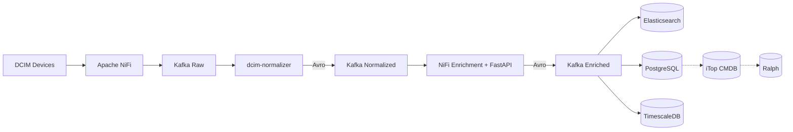

# DCIM Metrics Project

**Version**: v4.4 (Full NiFi Migration, SIEM Consumer, AI Pipeline)  
**Status**: ✅ Production Active  
**Last Updated**: 2026-07-10

## Project Overview

Unified DCIM telemetry and inventory management system using 4-layer decoupled architecture with Apache Kafka as the message broker backbone.

## Architecture



### Monitored Infrastructure
- **Servers**: 5 units (Lenovo ThinkSystem) - Redfish HTTPS
- **UPS**: 1 unit (APC Smart-UPS) - SNMP v3
- **NAS**: 6 units (Synology DS) - SNMP v3
- **Network**: 5 units (MikroTik) - SNMP v2c
- **CCTV/NVR**: 32 units (Hikvision: 31 Cameras + 1 NVR) - ISAPI HTTP

**Total**: 49 devices monitored

## Directory Structure

```
dcim_metrics_project/
├── ai_agent/                   # AI integration & analytics models
├── configs/                    # Configuration files
│   ├── telegraf/               # Telegraf input configs
│   ├── systemd/                # Systemd services and timers
│   ├── docker/                 # Docker compose files
│   └── metric_mapping.json     # Normalization rules
│
├── docs/                       # Documentation
│   ├── architecture/           # Architecture & design docs (v4.4+)
│   │   └── _archived/          # Obsolete architecture docs
│   ├── operations/             # Operational/incident reports
│   └── standar_dcim/           # Compliance and SOP docs
│       └── _archived/          # Obsolete standards
│
├── itop/                       # iTop CMDB integration & auto-registration
├── nifi/                       # Apache NiFi flows & templates
├── schema-registry/            # Confluent Avro schemas
├── scripts/                    # Utility scripts, cron jobs, pollers
│   ├── dcim_dlq_consumer.py    # DLQ / lineage handler
│   ├── dcim_itop_unified_consumer.py # iTop CMDB auto-registration
│   ├── dcim_telegram_alerter.py # Alert notification service
│   ├── manage_partitions.py    # PostgreSQL partition manager
│   └── [other utilities]
│
├── src/                        # 4-Layer Modular Architecture Core
│   ├── schemas/                # Pydantic data models
│   ├── skills/                 # Core processing logic (normalizer, etc.)
│   └── utils/                  # Lineage tracking & Kafka producers
│
├── tests/                      # Unit & integration tests
├── timescaledb/                # TimescaleDB continuous aggregates schemas
├── vault/                      # HashiCorp Vault secrets policies
│
├── logs/                       # Application & service logs
├── kafka/                      # Kafka topic storage directory
└── _archived/                  # Legacy/superseded code implementations
```

## Active Services

### Systemd Services (Pipeline)
- `telegraf.service` - Data collection (Host metrics, some NAS limits)
- `dcim-normalizer.service` - Schema standardization & field computation (Avro output)
- `dcim-enrichment-api.service` - FastAPI enrichment endpoint
- `dcim-itop-redis-sync.service` - CMDB cache sync (60s)
- `dcim-es-consumer.service` - Elasticsearch sink (Python Avro)
- `dcim-sql-consumer.service` - PostgreSQL sink & local SQL enrichment (Python Avro)
- `dcim-itop-unified.service` - iTop CMDB automated registration (Python Avro)
- `dcim-siem-es-consumer.service` - SIEM alerts consumer
- `dcim-dlq-consumer.service` - Dead letter queue handler & Lineage tracking
- `dcim-threshold-alerter.service` - Threshold + stale-device alerting (120s interval)

### Systemd Services (AI Analytics)
- `dcim-analytics-bridge.service` - Analytics Bridge (Kafka Avro → JSON)
- `dcim-analytics-stream-processor.service` - Analytics Stream Processor → TimescaleDB

### Docker Containers
- `kafka1`, `kafka2`, `kafka3` - Message broker 3-node SSL cluster
- `schema-registry` - Confluent Schema Registry
- `vault` - HashiCorp Vault (Secrets Management)
- `dcim-nifi` - Enrichment orchestration & device polling
- `dcim-redis-cache` - Enrichment cache
- `dcim-timescaledb` - Analytics Time-series Database
- `dcim-kafka-ui` - Kafka management UI

### Systemd Timers & Cron Jobs
- `dcim-data-quality-check.timer` - Daily pipeline data quality check (06:00 WIB)
- `dcim-telegram-alerter.timer` - Pipeline health alerts via Telegram (every 5 min)
- `dcim-itop-ralph-sync.timer` - Daily sync to Ralph CMDB (02:00 WIB)
- `0 0 * * *` - Partition management for PostgreSQL `dcim_events`

## Data Flow

### Metrics Pipeline (Real-time)
```
Device → Telegraf/NiFi → Kafka Raw → Normalizer → Kafka Normalized (Avro) → 
NiFi Enrichment → Kafka Enriched (Avro) → Elasticsearch/PostgreSQL → Kibana
```

### AI Analytics Pipeline
```
Kafka Enriched (Avro) → dcim-analytics-bridge → Kafka Analytics (JSON) → 
dcim-analytics-stream-processor → TimescaleDB (hypertable)
```

### Inventory Pipeline (Hybrid)
```
1. Real-time CMDB:
Kafka (dcim.normalized.events) → dcim-itop-unified.service → iTop CMDB (Auto-create CI)

2. Batch Asset Sync (Daily):
Server Redfish → NiFi ExecuteProcess → Kafka Raw Inventory → Normalizer → ... → PostgreSQL
PostgreSQL / iTop → itop_to_ralph_sync.py → Ralph Asset Repository
```

### Commissioning / Decommissioning Automation
- New DC assets auto-register in iTop CMDB via the unified consumer when a serial number appears in Kafka.
- Stale-device detection runs in `dcim-threshold-alerter.service`; alert triggers when a known device has no event for 30 minutes.
- Alerts are indexed to Elasticsearch index `dcim-alerts`.

## Key Technologies

- **Message Broker**: Apache Kafka (3-node cluster, SSL/TLS, Schema Registry)
- **Orchestration & Polling**: Apache NiFi 1.24
- **Cache**: Redis 7
- **Time-series DB (Analytics)**: TimescaleDB (PostgreSQL 15)
- **Time-series DB (Logs & Telemetry)**: Elasticsearch 9.x
- **Relational DB**: PostgreSQL 15
- **CMDB (Primary)**: iTop (10.70.0.56:8080)
- **Asset Repository**: Ralph (10.70.0.56:8082)
- **Visualization**: Kibana 9.x
- **Data Collection**: Telegraf, Python (via NiFi)

## Version History

| Version | Date | Changes | Status |
|---------|------|---------|--------|
| v4.4.0 | 2026-07-10 | Full NiFi Cutover, SIEM Consumer, AI Pipeline (TimescaleDB), Custom Docker NiFi Python3 | **CURRENT** |
| v4.3.0 | 2026-07-01 | Kafka 3-Node SSL Cluster, Schema Registry (Avro), HashiCorp Vault Integration, Granular Routing | Active |
| v4.2.0 | 2026-06-30 | Initial transition to NiFi for data collection, Avro schema integration testing | Active |
| v4.1.0 | 2026-06-15 | Telegram Alerting, JSON Structured Logging, AI Training Data Archive | Active |
| v4.0.0 | 2026-06-12 | L4-L5 Modularization (Normalizer & Enrichment API), L10 DLQ, L8 CMDB Automation | Active |
| v3.5.6 | 2026-05-26 | CCTV Influx JSON format, NVR real SN fallback, CMDB placeholder cleanup, check_cctv_status.py regex fix | Active |
| v3.5.5 | 2026-05-21 | Auto-register missing DC assets, stale-device alerting, Kafka health-check guidance, logging baseline fixes | Active |
| v3.5.4 | 2026-05-20 | Threshold alerter service with 6 rules, alerts indexed to `dcim-alerts` | Active |
| v3.5.3 | 2026-05-20 | Kibana dashboard field mapping fixes for NVR/UPS/NAS and device type cardinality | Active |
| v3.5.2 | 2026-05-20 | Elasticsearch disk recovery and NAS volume collection fix | Active |
| v3.5.1 | 2026-05-19 | Re-register 20 CCTV as Ralph Back Office assets | Active |
| v3.5.0 | 2026-05-18 | Ralph CMDB sync fixes: Last Sync timestamp, JSONB components, Management ethernet protection | Active |
| v3.4.2 | 2026-05-18 | UPS sync fallback to JSONB raw fields and management IP orphan handling | Merged to v3.5.0 |
| v3.4.1 | 2026-05-12 | Unified pipeline restored, server_inventory_to_pg.py | Superseded |
| v4.0.0 | 2026-05-06 | Modular agentic architecture | Superseded |
| v3.4.0 | 2026-05-04 | NAS & Network auto-update | Superseded |
| v3.3.0 | 2026-05-03 | Unified CMDB sync pipeline | Superseded |
| v3.0.0 | 2026-04-28 | Baseline: Unified Kafka Pipeline | Superseded |

## Quick Start

### Check System Status
```bash
# Check core pipeline services
sudo systemctl status telegraf dcim-normalizer dcim-enrichment-api dcim-sql-consumer dcim-itop-unified

# Check infrastructure containers (NiFi, Kafka, DBs)
docker ps | grep -E "dcim|kafka|schema"

# Check active service logs via journalctl
sudo journalctl -u dcim-normalizer -f

# Check specific component log files
tail -f logs/dcim_itop_unified_consumer.log
```


## Documentation

- **Architecture**: See `docs/architecture/v4.4-pipeline-architecture.md`
- **Versioning**: See `docs/architecture/24-versioning-change-management-standard.md`
- **Operations**: See `docs/operations/` for incident reports
- **Development**: See `docs/development/` for guides and metrics

## Compliance

- **FIT041**: Versioning & Change Management Standard
- **FIT157**: System Architecture Design (Kafka Backbone)

## Support

For issues or questions, refer to documentation in `docs/` directory or check logs in `logs/` directory.

---
**Last Updated**: 2026-07-14  
**Maintained By**: Infrastructure Team
