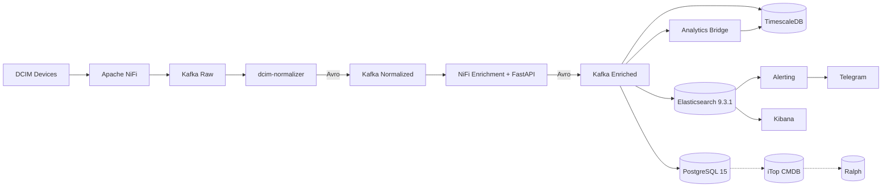

# DCIM Metrics Project

**Version**: v4.5.2 (Full NiFi Ingestion, Prometheus Monitoring, AI Pipeline)  
**Status**: ✅ Production Active  
**Last Updated**: 2026-07-24

## Project Overview

Unified DCIM telemetry and inventory management system using multi-layer decoupled architecture with Apache Kafka as the message broker backbone. All 5 device types use **NiFi ExecuteProcess** for uniform data ingestion.

## Architecture



### Monitored Infrastructure
- **Servers**: 5 units (Lenovo ThinkSystem) - Redfish HTTPS
- **UPS**: 1 unit (APC Smart-UPS) - SNMP v3
- **NAS**: 6 units (Synology DS) - SNMP v3
- **Network**: 5 units (MikroTik) - SNMP v2c
- **CCTV/NVR**: 32 units (Hikvision: 31 Cameras + 1 NVR) - ISAPI HTTP

**Total**: 49 devices monitored

## Directory Structure

```
dcim_metrics_project/
├── configs/                    # Configuration files
│   ├── telegraf/               # Telegraf input configs (legacy, disabled)
│   ├── systemd/                # Systemd services and timers
│   ├── docker/                 # Docker compose files
│   ├── secrets/                # Secret configuration files
│   └── metric_mapping.json     # Normalization rules (25 metric types)
│
├── docs/                       # Documentation
│   ├── architecture/           # Architecture & design docs (v4.5+)
│   │   └── _archived/          # Obsolete architecture docs
│   ├── operations/             # Operational/incident reports
│   ├── standar_dcim/           # Compliance, SOP, and AI team guides
│   └── development/            # Development guides & metrics
│
├── elasticsearch/              # Elasticsearch docker-compose
├── exporters/                  # Prometheus exporters docker-compose
├── itop/                       # iTop CMDB integration & auto-registration
├── kafka/                      # Kafka 3-node cluster docker-compose & certs
├── nifi/                       # Apache NiFi flows & templates
├── observability/              # Prometheus + Grafana configuration
├── schema-registry/            # Confluent Avro schemas
├── vault/                      # HashiCorp Vault secrets policies
│
├── scripts/                    # Utility scripts, cron jobs, pollers
│   ├── redfish_poller.py       # Server Redfish data collector
│   ├── snmp_ups_poller.py      # UPS SNMP data collector
│   ├── nas_poller.py           # NAS SNMP data collector
│   ├── mikrotik_poller.py      # Network SNMP data collector
│   ├── cctv_poller.py          # CCTV/NVR ISAPI data collector
│   ├── dcim_itop_unified_consumer.py # iTop CMDB auto-registration (v8)
│   ├── dcim_telegram_alerter.py      # Alert notification service
│   ├── dcim_threshold_alerter.py     # Threshold & stale device alerter
│   └── [other utilities]
│
├── src/                        # Modular Architecture Core
│   ├── configs/                # Configuration loader (Vault integration)
│   ├── schemas/                # Pydantic & Avro data models
│   ├── skills/                 # Core processing logic
│   │   ├── telemetry/          # Normalizer, ES/SQL consumers, SIEM
│   │   ├── inventory/          # Enrichment API, Redfish scanner
│   │   ├── cmdb/               # Asset enricher
│   │   └── security/           # Hikvision poller
│   ├── utils/                  # Lineage tracking, secrets, Kafka producers
│   ├── observability/          # Logging & metrics
│   └── tools/                  # Integration tools
│
├── sql/                        # SQL schemas & migrations
├── timescaledb/                # TimescaleDB continuous aggregates schemas
│
├── _archived/                  # Legacy/superseded code & old files
├── logs/                       # Application & service logs
└── ai_agent/                   # AI integration & analytics models
```

## Active Services

### NiFi Process Groups (Data Ingestion)
| Process Group | Poller | Schedule | Topic |
|---|---|---|---|
| Server Redfish Ingestion | `redfish_poller.py` | 60s | `dcim.raw.hardware.server` |
| UPS SNMP Ingestion | `snmp_ups_poller.py` | 60s | `dcim.raw.power.ups` |
| NAS Storage Ingestion | `nas_poller.py` | 60s | `dcim.raw.storage.nas` |
| Mikrotik SNMP Ingestion | `mikrotik_poller.py` | 60s | `dcim.raw.network.snmp` |
| Security System Ingestion | `cctv_poller.py` | 120s | `dcim.raw.device.isapi` |
| Server Inventory Poller | `server_inventory_collector.py` | 1 day | `dcim.raw.hardware.server.inventory` |
| Security SIEM Ingestion | ListenSyslog (Wazuh) | event-driven | `dcim.siem.alerts` |

### Systemd Services (Pipeline)
- `dcim-normalizer.service` - Schema standardization & multi-metric normalization (Avro output, 25 metric types)
- `dcim-enrichment-api.service` - FastAPI enrichment endpoint (:8000)
- `dcim-itop-redis-sync.service` - CMDB cache sync (60s)
- `dcim-es-consumer.service` - Elasticsearch sink (Python Avro)
- `dcim-sql-consumer.service` - PostgreSQL sink & local SQL enrichment (Python Avro)
- `dcim-itop-unified.service` - iTop CMDB automated registration v8 (Python Avro)
- `dcim-siem-es-consumer.service` - SIEM alerts consumer
- `dcim-dlq-consumer.service` - Dead letter queue handler & lineage tracking
- `dcim-threshold-alerter.service` - Threshold + stale-device alerting (120s interval)

### Systemd Services (AI Analytics)
- `dcim-analytics-bridge.service` - Analytics Bridge (Kafka Avro → JSON)
- `dcim-analytics-stream-processor.service` - Analytics Stream Processor → TimescaleDB

### Docker Containers (25 active)

| Stack | Containers |
|---|---|
| **Kafka Cluster** | `kafka1`, `kafka2`, `kafka3` (3.7.0, KRaft, SSL) |
| **Schema Registry** | `schema-registry` (Confluent 7.6.0) |
| **Vault** | `vault` (HashiCorp 1.15) |
| **NiFi** | `dcim-nifi` (custom Python3 image) |
| **Redis** | `dcim-redis-cache` (7-alpine) |
| **Elasticsearch + Kibana** | `dcim_elasticsearch`, `dcim_kibana` (9.3.1) |
| **PostgreSQL** | `dcim_sot_postgres` (15-alpine) |
| **TimescaleDB** | `dcim-timescaledb` (PG 15) |
| **iTop** | `itop-web` (3.1.1), `itop-db` (MariaDB 10.11), `itop-cloudbeaver` |
| **Ralph** | `ralph_web`, `ralph_nginx`, `ralph_inkpy`, `docker-db-1`, `docker-redis-1` |
| **Prometheus Exporters** | `dcim_node_exporter`, `dcim_postgres_exporter`, `dcim_redis_exporter`, `dcim_kafka_exporter`, `dcim_elasticsearch_exporter` |
| **Observability** | Prometheus + Grafana (external `10.70.0.25`) |
| **PgAdmin** | `dcim_pgadmin` |

### Systemd Timers & Cron Jobs
- `dcim-itop-ralph-sync.timer` - Daily sync to Ralph CMDB (02:00 WIB)
- `dcim-data-quality-check.timer` - Daily pipeline data quality check (06:00 WIB)
- `0 0 * * *` - Partition management for PostgreSQL `dcim_events`
- `0 * * * *` - Redis cache maintenance
- `*/5 * * * *` - PG → iTop inventory sync

## Data Flow

### Metrics Pipeline (Real-time)
```
Device → NiFi ExecuteProcess → Kafka Raw (JSON) → Normalizer (Multi-Metric) →
Kafka Normalized (Avro) → NiFi Enrichment → Kafka Enriched (Avro) →
Elasticsearch 9.3.1 / PostgreSQL 15 → Kibana
```

### AI Analytics Pipeline
```
Kafka Enriched (Avro) → dcim-analytics-bridge → Kafka Analytics (JSON) →
dcim-analytics-stream-processor → TimescaleDB (hypertable, 25 metric types)
```

### Inventory Pipeline (Hybrid)
```
1. Real-time CMDB:
Kafka (dcim.normalized.events) → dcim-itop-unified.service → iTop CMDB (Auto-create CI)

2. Batch Asset Sync (Daily):
Server Redfish → NiFi ExecuteProcess → Kafka Raw Inventory → Normalizer → ... → PostgreSQL
PostgreSQL / iTop → itop_to_ralph_sync.py → Ralph Asset Repository
```

### Commissioning / Decommissioning Automation
- New DC assets auto-register in iTop CMDB via the unified consumer when a serial number appears in Kafka.
- Stale-device detection runs in `dcim-threshold-alerter.service`; alert triggers when a known device has no event for 30 minutes.
- Alerts are indexed to Elasticsearch index `dcim-alerts`.

## Key Technologies

- **Message Broker**: Apache Kafka (3-node cluster, SSL/TLS, Schema Registry, external `10.70.0.56:9094`)
- **Orchestration & Polling**: Apache NiFi 1.24 (custom Python3 image, 7 process groups)
- **Cache**: Redis 7
- **Time-series DB (Analytics)**: TimescaleDB (PostgreSQL 15, port 5433)
- **Search & Telemetry**: Elasticsearch 9.3.1
- **Relational DB**: PostgreSQL 15
- **Secrets Management**: HashiCorp Vault 1.15 (AppRole auth)
- **CMDB (Primary)**: iTop 3.1.1 (10.70.0.56:8080)
- **Asset Repository**: Ralph (10.70.0.56:8082)
- **Visualization**: Kibana 9.3.1
- **Monitoring**: Prometheus + Grafana + 5 Exporters (Node, PG, Redis, Kafka, ES)
- **Data Collection**: NiFi ExecuteProcess (Python pollers)

## Version History

| Version | Date | Changes | Status |
|---------|------|---------|--------|
| v4.5.2 | 2026-07-24 | Kafka broker listener fix, ES 9.3.1 restore, Prometheus exporters active, project cleanup | **CURRENT** |
| v4.5.1 | 2026-07-21 | CCTV NiFi migration, credential hardening, systemd bridge removal | Superseded |
| v4.5.0 | 2026-07-20 | Multi-metric normalizer (25 types), computed energy metrics, Ralph asset_id | Superseded |
| v4.4.0 | 2026-07-10 | Full NiFi Cutover, SIEM Consumer, AI Pipeline (TimescaleDB), Custom Docker NiFi Python3 | Superseded |
| v4.3.0 | 2026-07-01 | Kafka 3-Node SSL Cluster, Schema Registry (Avro), HashiCorp Vault Integration | Superseded |
| v4.2.0 | 2026-06-30 | Initial transition to NiFi for data collection, Avro schema integration testing | Superseded |
| v4.1.0 | 2026-06-15 | Telegram Alerting, JSON Structured Logging, AI Training Data Archive | Superseded |
| v4.0.0 | 2026-06-12 | L4-L5 Modularization (Normalizer & Enrichment API), L10 DLQ, L8 CMDB Automation | Superseded |
| v3.5.6 | 2026-05-26 | CCTV Influx JSON format, NVR real SN fallback, CMDB placeholder cleanup | Superseded |
| v3.0.0 | 2026-04-28 | Baseline: Unified Kafka Pipeline | Superseded |

## Quick Start

### Check System Status
```bash
# Check core pipeline services
sudo systemctl status dcim-normalizer dcim-enrichment-api dcim-sql-consumer dcim-es-consumer dcim-itop-unified

# Check infrastructure containers
docker ps --format "table {{.Names}}\t{{.Status}}" | grep -E "dcim|kafka|schema|vault|itop|ralph"

# Check NiFi process groups
curl -sk https://localhost:8443/nifi-api/process-groups/root/process-groups | python3 -m json.tool

# Check active service logs via journalctl
sudo journalctl -u dcim-normalizer -f

# Check Prometheus exporters
docker ps | grep exporter
```


## Documentation

- **Architecture**: See `docs/architecture/v4.5-pipeline-architecture.md`
- **Comparison**: See `docs/architecture/v4.5-pipeline-architecture-komparasi.md`
- **Versioning**: See `docs/architecture/24-versioning-change-management-standard.md`
- **Operations**: See `docs/operations/` for incident reports
- **AI Team**: See `docs/standar_dcim/` for AI access guides
- **Development**: See `docs/development/` for guides and metrics

## Compliance

- **FIT041**: Versioning & Change Management Standard
- **FIT157**: System Architecture Design (Kafka Backbone)
- **MT-018**: Credential Hardening (Vault → Docker secret → Env var)

## Support

For issues or questions, refer to documentation in `docs/` directory or check logs in `logs/` directory.

---
**Last Updated**: 2026-07-24  
**Version**: v4.5.2  
**Maintained By**: Infrastructure Team
