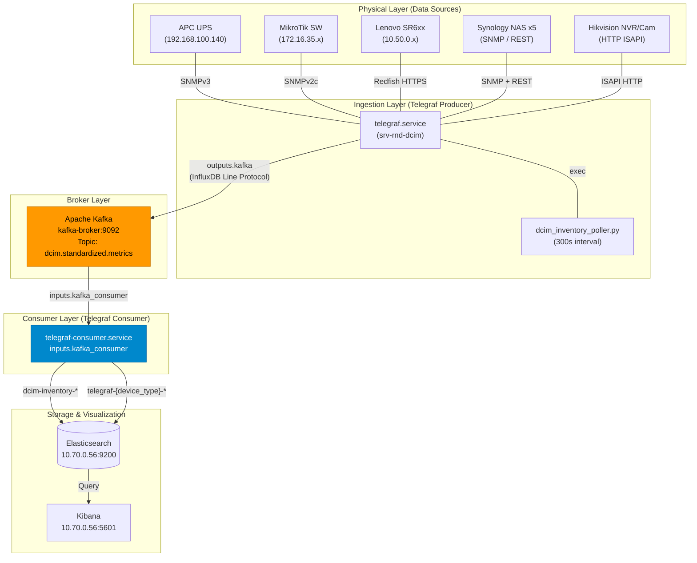

# Data Flow Architecture

**Update Terakhir**: 2026-04-22  
**Status**: ✅ Pipeline aktif via Apache Kafka

## Overview

Dokumen ini menjelaskan bagaimana data metrik dikumpulkan dari perangkat infrastruktur fisik, dialirkan melalui Apache Kafka sebagai message broker, lalu disimpan ke Elasticsearch untuk visualisasi di Kibana.

---

## Infrastructure Summary

| Layer | Components | Count |
|---|---|---|
| **Hardware Sources** | APC UPS, Mikrotik Switches, Lenovo Servers, Synology NAS, Hikvision Security System | 5 device groups |
| **Data Collectors** | Telegraf (SNMP, Redfish), Python Scripts (ISAPI/REST) | 2 collectors |
| **Message Broker** | Apache Kafka (Docker, KRaft mode) | 1 broker |
| **Storage** | Elasticsearch 9.3.1 (Docker) | 1 cluster |
| **Visualization** | Kibana 9.3.1 (Docker) | 1 instance |

---

## System Architecture Diagram

> Paste the block below on [https://mermaid.live](https://mermaid.live) to render it.

---

## Polling Mechanisms

### 1. APC UPS — SNMPv3 via Telegraf

| Property | Value |
|---|---|
| **Protocol** | SNMPv3 (authenticated + encrypted) |
| **Transport** | UDP port 161 |
| **Auth** | SHA / AES — user: `hndept` |
| **Interval** | Every 60 seconds |
| **Config file** | `/etc/telegraf/telegraf.d/ups-apc.conf` |
| **ES Index** | `telegraf-metrics-YYYY.MM.DD` |

Telegraf sends a `GET` request for specific OIDs from the APC PowerNet MIB. The UPS network card verifies the SNMPv3 credentials before returning encrypted metric values.

---

### 2. Mikrotik Switches — SNMPv2c via Telegraf

| Property | Value |
|---|---|
| **Protocol** | SNMPv2c (community-based) |
| **Transport** | UDP port 161 |
| **Community** | `public` |
| **Interval** | Every 10 seconds |
| **Config file** | `/etc/telegraf/telegraf.conf` |
| **ES Index** | `telegraf-metrics-YYYY.MM.DD` |

Telegraf polls 5 devices simultaneously using OIDs from the standard MIB-II and MikroTik Private MIB for per-interface traffic counters and system metrics.

---

### 3. Lenovo Servers — Redfish via Telegraf

| Property | Value |
|---|---|
| **Protocol** | Redfish REST (DMTF Standard) |
| **Transport** | HTTPS port 443 |
| **Auth** | Basic Auth — user: `hndept` |
| **Interval** | Every 60 seconds |
| **Config file** | `/etc/telegraf/telegraf.d/servers-redfish.conf` |
| **ES Index** | `telegraf-metrics-YYYY.MM.DD` |

Telegraf uses its built-in `redfish` plugin to periodically query the BMCs. Due to specific hardware requirements, it explicitly uses `computer_system_id = "1"` to target the primary compute resource. Data includes thermal, power, and chassis health metrics.

---

### 4. Security System — ISAPI HTTP via Python Script

| Property | Value |
|---|---|
| **Protocol** | HTTP REST (Hikvision ISAPI) |
| **Transport** | TCP port 80 |
| **Auth** | HTTP Digest/Basic — user: `admin` |
| **Interval** | Every 60 seconds (via Telegraf) |
| **Script** | `/home/infra/dcim_metrics_project/scripts/hikvision_poller.py` |
| **Config file** | `/etc/telegraf/telegraf.d/hikvision.conf` |
| **ES Index** | `cctv-metrics-YYYY.MM.DD` |

A Python 3 script runs every minute via Telegraf's `inputs.exec` plugin. It authenticates to the NVR and 23 individual cameras. The script uses **Network ICMP Ping** to determine "Online" status, while ISAPI fetches hardware metrics and manages authentication reporting via `isapi_status`.

---

### 5. Unified Asset Inventory — Python Poller via Telegraf

| Property | Value |
|---|---|
| **Collector** | `/usr/local/bin/dcim_inventory_poller.py` |
| **Interval** | Every 5 minutes (300 seconds) |
| **Config file** | `/etc/telegraf/telegraf.d/dcim-unified-inventory.conf` |
| **ES Index** | `dcim-inventory-YYYY.MM.DD` |

This script polls all devices (Servers, UPS, MikroTik, CCTV) and transforms essential identity metrics into a single flat JSON format ensuring all 33 devices exist with a standardized `tag.serial_number` primary key. It automatically enforces the new 8-Point Universal Metrics and parses numbers accurately.

---

## Elasticsearch Indices

Semua index dibuat otomatis oleh **Telegraf Consumer** setelah membaca dari Kafka.

| Index Pattern | Sumber Data | Broker Path |
|---|---|---|
| `telegraf-server-YYYY.MM.DD` | Telegraf → Kafka → Consumer → ES | Via Kafka |
| `telegraf-ups-YYYY.MM.DD` | Telegraf → Kafka → Consumer → ES | Via Kafka |
| `telegraf-mikrotik-YYYY.MM.DD` | Telegraf → Kafka → Consumer → ES | Via Kafka |
| `telegraf-nas-YYYY.MM.DD` | Telegraf → Kafka → Consumer → ES | Via Kafka |
| `telegraf-nvr-YYYY.MM.DD` | Telegraf → Kafka → Consumer → ES | Via Kafka |
| `dcim-inventory-YYYY.MM.DD` | dcim_inventory_poller.py → Kafka → Consumer → ES | Via Kafka |
| `server-ipmi-metrics-YYYY.MM.DD` | Historical Data (Archived) | Static / Archive |
| `metricbeat-YYYY.MM.DD` | Metricbeat (OS system metrics) | Direct |
| `filebeat-YYYY.MM.DD` | Filebeat (UDP syslog :514) | Direct |

---

## Referensi Terkait

- [19-kafka-pipeline-architecture.md](./19-kafka-pipeline-architecture.md) — Detail teknis konfigurasi Kafka & pipeline
- [14-standardization-telemetry-schema.md](./14-standardization-telemetry-schema.md) — Skema standar telemetri
- [12-brokered-metrics-pipeline.md](./12-brokered-metrics-pipeline.md) — Dokumen pipeline broker (diperbarui)
