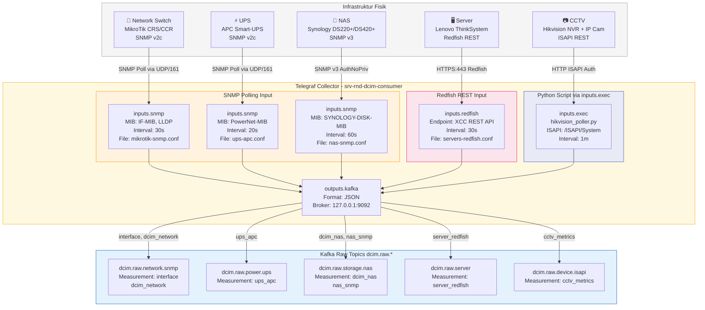

# 13. Identifikasi Sumber Telemetri & Aliran Ingestion

**Versi Dokumen**: 2.0 | **Terakhir Diperbarui**: April 2026  
**Referensi Desain**: IF-System Architecture Design (FIT157), IF-Technical Requirements (FIT041)

---

## 1. Pendahuluan

Dokumen ini menetapkan identifikasi seluruh sumber data telemetri yang diintegrasikan ke dalam sistem Data Center Infrastructure Management (DCIM). Sesuai **Requirement 2.1 (Data Source Connectivity)** dalam Technical Requirements FIT041, sistem wajib mendukung berbagai protokol agar fleksibel ketika ada penambahan sumber data baru.

Lapisan ingestion bertanggung jawab untuk:
- **Akuisisi**: Mengambil metrik, log, dan data konfigurasi secara real-time dari perangkat fisik.
- **Isolasi**: Menjaga data mentah tetap bersih — tidak ada logika bisnis atau pengayaan di lapisan ini.
- **Pengiriman**: Meneruskan data ke Message Broker (Kafka) dalam format JSON terstandar.

---

## 2. Protokol Ingestion yang Diimplementasikan

| Protokol | Komponen | Penggunaan di DCIM |
|:---|:---|:---|
| **SNMP v2c / v3** | Telegraf `inputs.snmp` | MikroTik Switch, APC UPS, Synology NAS |
| **Redfish REST API** | Telegraf `inputs.redfish` | Lenovo XCC Server Management |
| **ISAPI (HTTP REST)** | Script Python + `inputs.exec` | Hikvision NVR & IP Camera |
| **SNMP (Custom MIB)** | Telegraf `inputs.snmp` | Monitoring Suhu & Storage NAS |

---

## 3. Diagram Aliran Ingestion Detail

Diagram berikut menggambarkan aliran data dari setiap perangkat fisik hingga masuk ke topik Kafka mentah (`dcim.raw.*`). Setiap jalur dibedakan berdasarkan protokol komunikasinya.

---

## 4. Inventaris Lengkap Sumber Data Aktif

### 4.1 Network Devices (Perangkat Jaringan)

| Hostname | IP Address | Model | Protokol | Config File | Topik Kafka |
|:---|:---|:---|:---|:---|:---|
| FIT-Core-RTR | 172.16.35.1 | MikroTik CCR2004-16G-2S+ | SNMP v2c | `mikrotik-snmp.conf` | `dcim.raw.network.snmp` |
| FIT-Core-SW | 172.16.35.2 | MikroTik CRS326-24S+2Q+ | SNMP v2c | `mikrotik-snmp.conf` | `dcim.raw.network.snmp` |
| FIT-DIST-SW-SERVER1 | 172.16.35.5 | MikroTik CRS354-48G-4S+2Q+ | SNMP v2c | `mikrotik-snmp.conf` | `dcim.raw.network.snmp` |
| FIT-DIST-SW-SERVER2 | 172.16.35.6 | MikroTik CRS312-4C+8XG | SNMP v2c | `mikrotik-snmp.conf` | `dcim.raw.network.snmp` |
| FIT-DIST-SW-LAN1 | 172.16.35.5 | MikroTik CRS354-48G-4S+2Q+ | SNMP v2c | `mikrotik-snmp.conf` | `dcim.raw.network.snmp` |

### 4.2 Power Systems (UPS)

| Hostname | IP Address | Model | Protokol | Config File | Topik Kafka |
|:---|:---|:---|:---|:---|:---|
| UPS-FIT | 192.168.100.140 | APC SmartUPS 30KH | SNMP v2c | `ups-apc.conf` | `dcim.raw.power.ups` |

### 4.3 Storage (NAS)

| Hostname | IP | Model | Protokol | Config File | Topik Kafka |
|:---|:---|:---|:---|:---|:---|
| NAS-INFRA | 10.50.0.106 | Synology DS220+ | SNMP v3 | `nas-snmp.conf` | `dcim.raw.storage.nas` |
| NAS-FAT | 10.50.0.107 | Synology DS220+ | SNMP v3 | `nas-snmp.conf` | `dcim.raw.storage.nas` |
| NAS-HCI | 10.50.0.108 | Synology DS220+ | SNMP v3 | `nas-snmp.conf` | `dcim.raw.storage.nas` |
| NAS-VM | 10.50.0.109 | Synology DS220+ | SNMP v3 | `nas-snmp.conf` | `dcim.raw.storage.nas` |
| NAS-BKP | 10.50.0.110 | Synology DS220+ | SNMP v3 | `nas-snmp.conf` | `dcim.raw.storage.nas` |

### 4.4 Compute (Servers via Redfish)

| Hostname | IP (XCC) | Model | Protokol | Config File | Topik Kafka |
|:---|:---|:---|:---|:---|:---|
| SRV-HCI-01 | 10.50.0.2 | Lenovo ThinkSystem 7D76 | Redfish HTTPS | `servers-redfish.conf` | `dcim.raw.server` |
| SRV-HCI-02 | 10.50.0.3 | Lenovo ThinkSystem 7D76 | Redfish HTTPS | `servers-redfish.conf` | `dcim.raw.server` |
| SRV-HCI-03 | 10.50.0.5 | Lenovo ThinkSystem 7D76 | Redfish HTTPS | `servers-redfish.conf` | `dcim.raw.server` |
| SRV-Render-01 | 10.50.0.4 | Lenovo ThinkSystem | Redfish HTTPS | `servers-redfish.conf` | `dcim.raw.server` |
| SRV-Render-02 | 10.50.0.6 | Lenovo ThinkSystem | Redfish HTTPS | `servers-redfish.conf` | `dcim.raw.server` |

### 4.5 Security (CCTV via ISAPI)

| Perangkat | IP Range | Protokol | Script | Topik Kafka |
|:---|:---|:---|:---|:---|
| Hikvision NVR + IP Cameras | 192.168.1.x | ISAPI HTTP/HTTPS | `hikvision_poller.py` | `dcim.raw.device.isapi` |

---

## 5. Prinsip Raw Data Purity

Sesuai arsitektur *System Architecture Design* (FIT157), lapisan ingestion harus menjaga **kemurnian data mentah**:

> [!IMPORTANT]
> **Aturan Raw Data**: Tidak boleh ada tag statis terkait lokasi (seperti `site`, `rack`, `category`) di level konfigurasi Telegraf. Tag metadata kontekstual **hanya boleh ditambahkan** oleh lapisan Enrichment (NiFi) setelah validasi dengan CMDB.

Pelanggaran yang telah dikoreksi:
- Tag `category = "storage"` pada `nas-snmp.conf` → **dihapus** (April 2026).
- Tag `datacenter`, `rack`, `room` pada `servers-redfish.conf` → **dihapus** via `tagexclude`.

---

## 6. Interval Polling & Volume Data Aktual

| Sumber | Protokol | Interval | Perkiraan Pesan/Menit |
|:---|:---|:---|:---|
| Network Interfaces (MikroTik) | SNMP | 30 detik | ~600+ |
| UPS Metrics | SNMP | 20 detik | ~90 |
| NAS Disk Metrics | SNMP v3 | 60 detik | ~150 |
| Server Redfish | HTTPS REST | 30 detik | ~120 |
| CCTV ISAPI | HTTP REST | 60 detik | ~30 |
| **TOTAL** | | | **~990+ pesan/menit** |

---

**Referensi Implementasi**: `/etc/telegraf/telegraf.d/*.conf`  
**Referensi Standar**: IF-Technical Requirements FIT041 §2.1, IF-System Architecture Design FIT157
