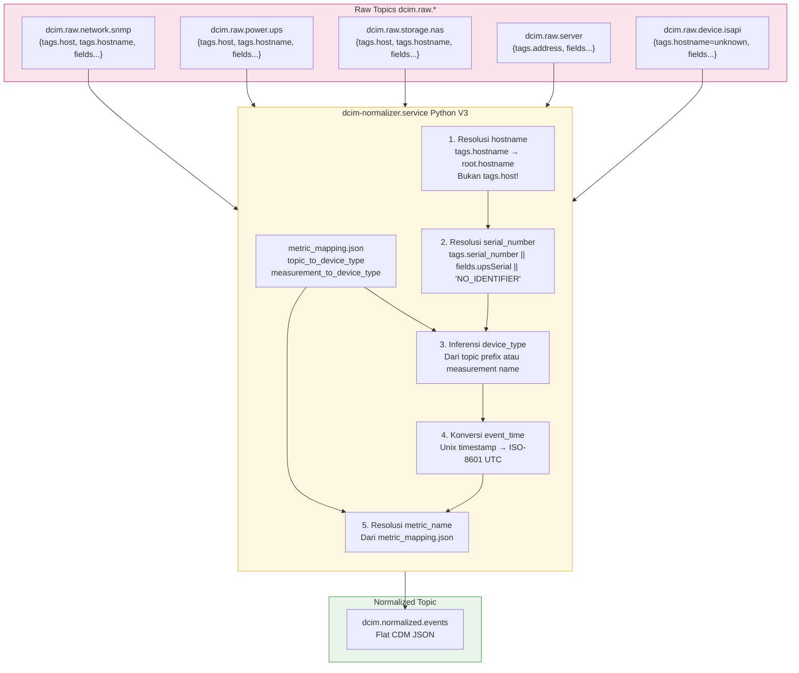

# 14. Standarisasi Skema Telemetri — Common Data Model (CDM)

**Versi Dokumen**: 2.0 | **Terakhir Diperbarui**: April 2026  
**Referensi Desain**: IF-Technical Requirements FIT041 §2.2, IF-Use Case Analysis FIT041 UC-1

---

## 1. Pendahuluan

Sesuai **Requirement 2.2 (Data Transformation & Normalization)** dalam Technical Requirements FIT041, seluruh data telemetri dari berbagai sumber wajib dikonversi ke dalam format **Common Data Model (CDM)** sebelum digunakan oleh sistem downstream (Elasticsearch, CMDB, AI Engine).

CDM memastikan:
- **Konsistensi**: Aplikasi monitoring tidak perlu menangani format berbeda per perangkat.
- **Enrichment-Ready**: Satu kunci tunggal (`serial_number`) cukup untuk memanggil API pengayaan.
- **Auditabilitas**: Setiap pesan dapat ditelusuri kembali ke sumber dan waktu aslinya.

Sesuai **Use Case 1 (Real-time Operational Monitoring)**, data yang dinormalisasi harus tersedia di sistem dalam **waktu < 5 detik** setelah pengumpulan.

---

## 2. Arsitektur Normalisasi

Normalisasi dilakukan oleh layanan Python mandiri (`dcim-normalizer.service`) yang mengonsumsi semua topik raw dan memproduksi event terstandar.



---

## 3. Skema CDM Lengkap

Setiap pesan di topik `dcim.normalized.events` **wajib** memiliki semua field berikut:

```json
{
  "event_id":     "15ae433f-c5dd-44d8-8ba5-cc8fd0878367",
  "event_time":   "2026-04-28T01:42:00+00:00",
  "timestamp":    1777340520,
  "source_topic": "dcim.raw.storage.nas",
  "measurement":  "nas_snmp",
  "device_type":  "nas",
  "hostname":     "NAS-INFRA",
  "ip":           "10.50.0.106",
  "serial_number":"2240RLRRFW9D4",
  "metric_name":  "general_metric",
  "metric_value": null,
  "metric_unit":  null,
  "severity":     "info",
  "raw_fields":   { "system_temp": 29 },
  "raw_tags":     { "firmware": "DSM 7.3-86009", ... }
}
```

---

## 4. Definisi & Aturan Validasi per Field

| Field | Tipe | Wajib | Aturan & Sumber |
|:---|:---|:---|:---|
| `event_id` | `string (UUID v4)` | Ya | Digenerasi oleh normalizer menggunakan `uuid.uuid4()`. |
| `event_time` | `string (ISO-8601)` | Ya | Konversi dari `timestamp` ke UTC. Format: `YYYY-MM-DDTHH:mm:ss+00:00`. |
| `timestamp` | `integer (Unix)` | Ya | Diteruskan langsung dari payload Telegraf. |
| `source_topic` | `string` | Ya | Nama topik Kafka sumber (misal: `dcim.raw.network.snmp`). |
| `measurement` | `string` | Ya | Nama *measurement* dari Telegraf (misal: `interface`, `ups_apc`). |
| `device_type` | `string` | Ya | Lihat §5.2 — logika inferensi. Tidak boleh `null`. |
| `hostname` | `string` | Ya | Lihat §5.1 — resolusi identitas. Harus identitas perangkat fisik. |
| `ip` | `string` | Tidak | Diambil dari `tags.ip` atau `tags.address`. |
| `serial_number` | `string` | Ya | Lihat §5.3 — resolusi SN. Default: `NO_IDENTIFIER`. |
| `metric_name` | `string` | Ya | Dipetakan dari `metric_mapping.json`. Default: `general_metric`. |
| `metric_value` | `number/null` | Tidak | Nilai numerik metrik utama. `null` jika tidak relevan. |
| `metric_unit` | `string/null` | Tidak | Satuan metrik (misal: `celsius`, `percent`, `status_code`). |
| `severity` | `string` | Ya | Salah satu dari: `info`, `warning`, `critical`. Default: `info`. |
| `raw_fields` | `object` | Ya | Semua field metrik asli dari Telegraf, tidak dimodifikasi. |
| `raw_tags` | `object` | Ya | Semua tag asli dari Telegraf. Tag internal (`host`) dihapus. |

---

## 5. Logika Resolusi Identitas

### 5.1 Resolusi Hostname

> [!WARNING]
> Ini adalah bug paling umum. Telegraf menyertakan tag `host` yang berisi **nama server kolektor** (bukan perangkat yang dipantau). Jangan gunakan `tags.host` sebagai identitas perangkat.

```
tags.host      = "srv-rnd-dcim-consumer"  ← SALAH (ini server Telegraf)
tags.hostname  = "FIT-Core-SW"            ← BENAR (ini perangkat target)
```

**Logika normalizer**:
```python
hostname = tags.get("hostname")  # Ambil dari tags.hostname perangkat
clean_tags = {k: v for k, v in tags.items() if k != "host"}  # Buang tags.host
```

### 5.2 Resolusi Device Type

Prioritas inferensi dari tertinggi ke terendah:

```
1. Explicit tag      → tags.device_type (misal: "nas", "ups")
2. Source topic      → dcim.raw.network.* → "network_switch"
3. Measurement name  → "ups_apc" → "ups"
4. Fallback          → "unknown"
```

**Peta inferensi (dari `metric_mapping.json`)**:

| Topic Prefix | → device_type |
|:---|:---|
| `dcim.raw.network` | `network_switch` |
| `dcim.raw.power.ups` | `ups` |
| `dcim.raw.storage.nas` | `nas` |
| `dcim.raw.server` | `server` |
| `dcim.raw.device.isapi` | `cctv` |

| Measurement Name | → device_type |
|:---|:---|
| `interface` | `network_switch` |
| `ups_apc` | `ups` |
| `dcim_nas` | `nas` |
| `server_redfish` | `server` |
| `cctv_metrics` | `cctv` |

### 5.3 Resolusi Serial Number

Serial number adalah **kunci utama** untuk *enrichment*. Normalizer mencoba mengambilnya dari berbagai lokasi:

```python
serial_number = (
    tags.get("serial_number")   or  # 1. Tag standar (paling umum)
    fields.get("upsSerial")     or  # 2. Khusus UPS APC via SNMP MIB
    fields.get("sysSerial")     or  # 3. Khusus Server via Redfish
    "NO_IDENTIFIER"                 # 4. Fallback jika tidak ditemukan
)
```

> [!NOTE]
> Perangkat dengan `serial_number = "NO_IDENTIFIER"` akan mendapatkan `enrichment_status = "NO_IDENTIFIER"` dari Enrichment API, bukan `FULL` atau `PARTIAL`.

---

## 6. Pemetaan Metrik (metric_mapping.json)

Metrik utama per tipe perangkat dipetakan menggunakan file konfigurasi eksternal:

| Measurement | metric_name | metric_field | metric_unit | severity_field |
|:---|:---|:---|:---|:---|
| `dcim_nas` | `disk_temperature` | `diskTemp` | `celsius` | `diskStatus` |
| `ups_apc` | `battery_capacity` | `upsBatteryCapacity` | `percent` | — |
| `interface` | `interface_status` | `ifOperStatus` | `status_code` | — |
| `server_redfish` | `general_metric` | — | — | — |
| *(default)* | `general_metric` | — | — | — |

**Peta Severity NAS**:

| `diskStatus` | → severity |
|:---|:---|
| `1` | `info` |
| `2` | `warning` |
| `3` | `critical` |

---

## 7. Contoh Transformasi: Sebelum & Sesudah

### Input (Raw Payload — dcim.raw.network.snmp):
```json
{
  "name": "interface",
  "tags": {
    "host": "srv-rnd-dcim-consumer",
    "hostname": "FIT-Core-SW",
    "ip": "172.16.35.2",
    "serial_number": "HFH09B9A7A3",
    "model": "RouterOS CRS326-24S+2Q+"
  },
  "fields": { "ifOperStatus": 1, "ifInOctets": 1234567 },
  "timestamp": 1777340520
}
```

### Output (Normalized CDM — dcim.normalized.events):
```json
{
  "event_id":     "15ae433f-c5dd-44d8-8ba5-cc8fd0878367",
  "event_time":   "2026-04-28T01:42:00+00:00",
  "timestamp":    1777340520,
  "source_topic": "dcim.raw.network.snmp",
  "measurement":  "interface",
  "device_type":  "network_switch",
  "hostname":     "FIT-Core-SW",
  "ip":           "172.16.35.2",
  "serial_number":"HFH09B9A7A3",
  "metric_name":  "interface_status",
  "metric_value": 1,
  "metric_unit":  "status_code",
  "severity":     "info",
  "raw_fields":   { "ifOperStatus": 1, "ifInOctets": 1234567 },
  "raw_tags":     { "hostname": "FIT-Core-SW", "ip": "172.16.35.2", ... }
}
```

**Yang berubah**: `device_type` diinferensi dari topik, `host` dibuang, `event_time` ditambahkan, `metric_name` dipetakan dari measurement.

---

## 8. Penanganan Error & Dead Letter Queue (DLQ)

Sesuai Requirement 2.2.2 (Error Handling), kesalahan dalam proses normalisasi ditangani sebagai berikut:

| Kondisi Error | Penanganan |
|:---|:---|
| JSON tidak valid | Pesan dilewati, error di-log ke `journalctl` |
| `serial_number` tidak ditemukan | `serial_number = "NO_IDENTIFIER"` |
| `device_type` tidak dapat diinferensi | `device_type = "unknown"` |
| `timestamp` kosong | `event_time = null` |
| Exception tak terduga | Di-log ke journalctl, pesan dilewati |

---

**Referensi File Implementasi**: `dcim_normalizer.py`, `metric_mapping.json`  
**Referensi Standar**: IF-Technical Requirements FIT041 §2.2, IF-Use Case Analysis FIT041 UC-1
