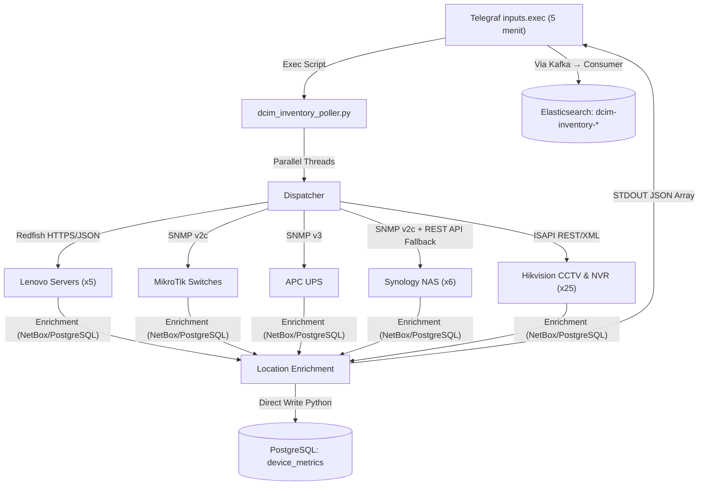

# Unified Inventory Architecture (MT-016)

**Status**: ✅ Aktif  
**Update Terakhir**: 2026-04-24

Dokumen ini menjelaskan arsitektur inventaris terpadu yang mengkonsolidasikan semua perangkat infrastruktur ke dalam satu lapisan observabilitas bersama: Elasticsearch dan PostgreSQL.

---

## 📌 Gambaran Umum

Untuk mengatasi fragmentasi data aset di berbagai sumber, kita mengimplementasikan lapisan **Unified Inventory**. Lapisan ini menggunakan **Serial Number** sebagai "Primary Key" global di semua kategori hardware, dan mengalirkan data ke **dua tujuan penyimpanan** secara bersamaan:

1.  **Elasticsearch** (`dcim-inventory-*`) — Untuk visualisasi di Kibana.
2.  **PostgreSQL** (`dcim_sot` → tabel `device_metrics`) — Untuk *Centralized Telemetry View* di pgAdmin.

### Komponen Kunci

| Komponen | Lokasi | Keterangan |
| :--- | :--- | :--- |
| **Central Poller** | `/usr/local/bin/dcim_inventory_poller.py` | Skrip Python utama yang mengeksekusi semua polling |
| **Telegraf Controller** | `/etc/telegraf/telegraf.d/dcim-unified-inventory.conf` | Menjalankan Poller setiap 5 menit via `inputs.exec` |
| **Elasticsearch Index** | `dcim-inventory-*` | Output untuk Dashboard Kibana |
| **PostgreSQL Tables** | `device_metrics`, `dcim_telemetry_history` | Output untuk Centralized Query pgAdmin |

---

## 🗂️ Skema Data (`dcim_inventory`)

### 🏷️ Tag (Identifier)
| Tag | Deskripsi | Contoh Nilai |
| :--- | :--- | :--- |
| `serial_number` | Serial Number Fisik | `9E2133T16585` |
| `device_type` | Kategori Hardware | `server`, `ups`, `mikrotik`, `nas`, `nvr`, `cctv` |
| `category` | Grup Fungsional Tinggi | `infrastructure`, `storage`, `security` |
| `ip_address` | IP Manajemen | `192.168.100.140` |
| `hostname` | Label Jaringan / Nama Sistem | `UPS-APC-30K`, `NAS-FIT` |
| `rack_name` | Lokasi Kabinet Fisik | `Rack Server 1`, `Ruang server` |
| `site` | Lokasi Gedung | `FIT-Head-Office` |
| `enrichment_status` | Status Pengayaan Data | `FULL`, `PARTIAL` |

### 📊 Field Metrik Inventory
| Field | Deskripsi | Contoh Nilai |
| :--- | :--- | :--- |
| `model` | Model hardware eksak | `DS920+`, `7D76CTO1WW` |
| `manufacturer` | Vendor/Pabrikan | `Lenovo`, `Synology`, `APC` |
| `firmware` / `firmware_version` | Versi OS/BMC/Firmware | `DSM 7.2-72806`, `V6.042/040` |
| `status` | Kesehatan Perangkat | `Online`, `OK` |
| `power_state` | Kondisi Daya | `On`, `Off` |
| `inventory_source` | Metode Pengambilan | `snmp`, `api`, `redfish`, `isapi` |

### 📈 Unified Metrics (Terstandardisasi)
| Field | Makna | Contoh |
| :--- | :--- | :--- |
| `metrics_Utilization` | Beban kerja utama | `23.9% Power Load` / `94.2% Disk Used` / `3% CPU` |
| `metrics_Temperature` | Suhu operasional | `34 C` |
| `metrics_Power_Watts` | Konsumsi daya | `316 W` |
| `metrics_Health_Summary` | Status ringkas | `OK`, `Normal`, `Online` |
| `metrics_Status_Detail` | Detail kondisi | `On (Cap: 1320W)`, `Storage: 7.3/7.7 GB` |

---

## 📡 Logika Pengambilan Data (Collection Flow)



### Pemetaan Protokol per Perangkat
| Perangkat | Protokol | Metode |
| :--- | :--- | :--- |
| **Lenovo Servers (x5)** | Redfish HTTPS | REST API via `requests` |
| **APC UPS** | SNMP v3 | `snmpget` subprocess |
| **MikroTik Switches** | SNMP v2c | `snmpget` subprocess |
| **Synology NAS (x6)** | SNMP v2c (Utama) + REST API (Fallback) | Hybrid: SNMP first, API if empty |
| **Hikvision NVR/CCTV** | ISAPI HTTP/HTTPS | Digest Auth XML |

---

## 🛠️ Panduan Operasional

### Menambah Perangkat Baru
Modifikasi list konfigurasi di bagian atas file `/usr/local/bin/dcim_inventory_poller.py`:
```python
REDFISH_SERVERS    = ["10.50.0.2", ...]  # Server Lenovo baru
UPS_HOSTS          = [{"ip": "...", "name": "..."}]  # UPS baru
MIKROTIK_HOSTS     = [{"ip": "...", "name": "..."}]  # Switch baru
NAS_HOSTS          = [{"ip": "...", "name": "..."}]  # NAS baru
```

### Pengujian Manual
```bash
# Jalankan poller dan lihat output JSON per perangkat
python3 /usr/local/bin/dcim_inventory_poller.py | jq '.'

# Filter output untuk perangkat spesifik
python3 /usr/local/bin/dcim_inventory_poller.py | jq '.[] | select(.hostname == "UPS-APC-30K")'
```

### Melihat Data Centralized di pgAdmin
Koneksi ke `192.168.101.73:5432 / dcim_sot`. Gunakan query:
```sql
SELECT DISTINCT ON (hostname)
    hostname, device_type, rack_name,
    metric_utilization, metric_temperature, metric_health,
    collected_at AS "Last Updated"
FROM device_metrics
ORDER BY hostname, collected_at DESC;
```

### Best Practice Kibana
Gunakan **Index Pattern `dcim-inventory-*`** (bukan gabungan dengan `telegraf-*`) untuk menjamin field `tag.rack_name`, `dcim_inventory.metrics_*`, dan `tag.enrichment_status` selalu tersedia secara konsisten.

---
**Dokumen Terkait**:
- [MT-013: Identifikasi Sumber Telemetri](./13-telemetry-sources-identification.md)
- [MT-014: Standardisasi Skema Telemetri](./14-standardization-telemetry-schema.md)
- [MT-019: Kafka Pipeline Architecture](./19-kafka-pipeline-architecture.md)
