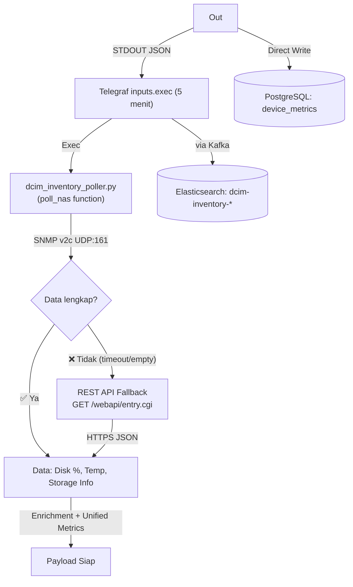

# Metode Pengambilan Data NAS Synology (MT-018)

**Status**: ✅ Aktif  
**Update Terakhir**: 2026-04-24

Dokumen ini menjelaskan mekanisme aktual pengambilan data dari perangkat Synology NAS ke dalam pipeline monitoring DCIM.

---

## 🏗️ Gambaran Arsitektur

Pengambilan data menggunakan pendekatan **Hybrid** untuk menjamin 100% ketersediaan data di semua perangkat NAS. Poller mencoba **SNMP v2c terlebih dahulu**; jika response SNMP tidak menghasilkan data yang memadai (misalnya karena konfigurasi SNMP tidak aktif di NAS), sistem secara otomatis jatuh ke **DSM REST API** sebagai fallback.

Semua logika NAS sekarang **terkonsolidasi sepenuhnya** di dalam satu skrip terpusat: `dcim_inventory_poller.py`.



---

## 🛠️ Detail Teknis

### 1. Skrip Utama
Seluruh logika NAS berada di fungsi `poll_nas()` di dalam file:
```
/usr/local/bin/dcim_inventory_poller.py
```

> [!NOTE]
> Skrip lama `nas_inventory_poller.py` sudah **tidak digunakan** dan telah digantikan oleh poller terpadu ini.

### 2. Daftar NAS yang Dipantau (NAS_HOSTS)

| Hostname | IP | Model | Metode Aktif |
| :--- | :--- | :--- | :--- |
| NAS-CD01 | `10.50.0.105` | DS920+ | SNMP v2c |
| NAS-CD02 | `10.50.0.106` | DS920+ | SNMP v2c |
| NAS-FAT | `10.50.0.107` | DS220+ | SNMP v2c |
| NAS-FIT | `10.50.0.108` | RS2423RP+ | SNMP v2c |
| NAS-INFRA | `10.50.0.109` | DS220+ | REST API (Fallback) |
| NAS-SD01 | `10.50.0.110` | DS920+ | REST API (Fallback) |

### 3. OID SNMP yang Digunakan

| Metrik | OID | Nilai yang Dihasilkan |
| :--- | :--- | :--- |
| **Disk Usage Total (MB)** | `.1.3.6.1.4.1.6574.2.1.1.6.0` | Kapasitas volume (MB) |
| **Disk Usage Used (MB)** | `.1.3.6.1.4.1.6574.2.1.1.7.0` | Pemakaian volume (MB) |
| **Suhu Sistem** | `.1.3.6.1.4.1.6574.1.2.0` | Celcius |
| **Status Disk** | `.1.3.6.1.4.1.6574.2.1.1.5.0` | Integer (1=Normal) |
| **Versi DSM** | `.1.3.6.1.4.1.6574.1.5.3.0` | String (misal: `DSM 7.3-86009`) |

### 4. Unified Metrics Output per NAS

| Kolom | Sumber (SNMP) | Sumber (REST API Fallback) |
| :--- | :--- | :--- |
| `metrics_Utilization` | `96.5% Disk Used` (Dihitung dari OID) | `N/A (API)` |
| `metrics_Temperature` | `30 C` (dari OID suhu) | `0 C` (belum tersedia) |
| `metrics_Power_Watts` | `N/A` | `N/A` |
| `metrics_Health_Summary` | `Normal` / `Warning` | `Online` |
| `metrics_Status_Detail` | `Storage: 3.5/3.7 GB` | `Model: DS920+` |
| `firmware_version` | `DSM 7.3-86009` (dari OID) | `DSM (Detected)` (fallback) |

---

## 🔁 Cara Menambah NAS Baru

1.  Buka file: `/home/infra/dcim_metrics_project/scripts/dcim_inventory_poller.py`
2.  Temukan variabel `NAS_HOSTS` di bagian atas file dan tambahkan entry baru:
    ```python
    NAS_HOSTS = [
        {"ip": "10.50.0.105", "name": "NAS-CD01"},
        # ... entry lainnya ...
        {"ip": "10.50.0.111", "name": "NAS-BARU"},  # ← Tambahkan di sini
    ]
    ```
3.  Pastikan SNMP v2c sudah diaktifkan di DSM NAS baru tersebut (Control Panel → SNMP).
4.  Tambahkan pemetaan lokasi manual di fungsi `build_location_map()` jika NAS baru belum ada di NetBox:
    ```python
    "10.50.0.111": {"site": "FIT-Head-Office", "rack": "Rack Server 2", "category": "Storage"},
    ```
5.  Deploy skrip baru ke produksi:
    ```bash
    sudo cp scripts/dcim_inventory_poller.py /usr/local/bin/dcim_inventory_poller.py
    ```

---
**Dokumen Terkait**:
- [MT-016: Unified Inventory Architecture](./16-unified-inventory-architecture.md)
- [MT-019: Kafka Pipeline Architecture](./19-kafka-pipeline-architecture.md)
