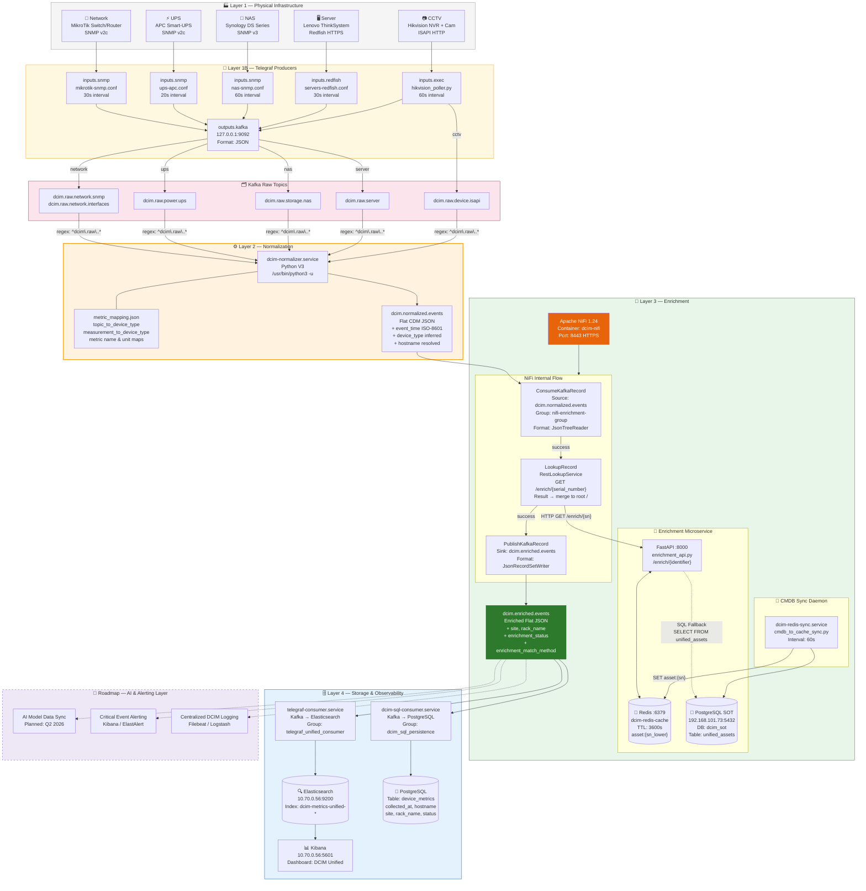
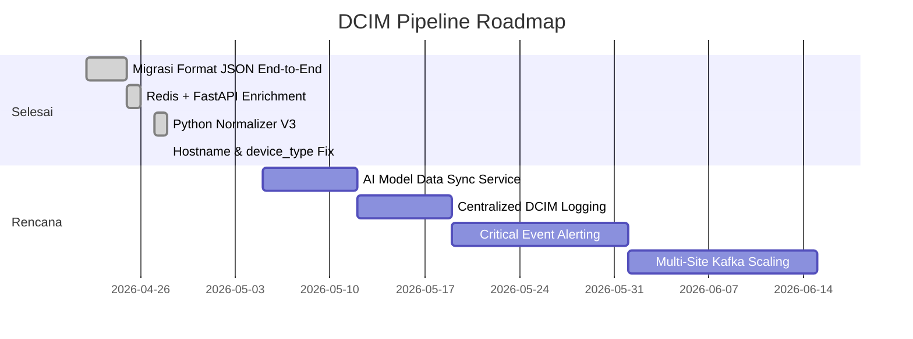

# 19. Arsitektur Pipeline Kafka DCIM

**Versi Dokumen**: 3.0 | **Terakhir Diperbarui**: April 2026  
**Status**: ✅ Aktif — Pipeline end-to-end terverifikasi  
**Referensi Desain**: IF-System Architecture Design (FIT157), DCIM Shadow Pipeline Implementation v3

---

## 1. Executive Summary

Pipeline DCIM adalah sistem *event-driven* berbasis Apache Kafka yang memproses data telemetri infrastruktur fisik secara real-time. Data mengalir melalui empat lapisan yang terpisah dan terdefinisi:

| Layer | Komponen | Output Topik |
|:---|:---|:---|
| **1 — Ingestion** | Telegraf Producers | `dcim.raw.*` |
| **2 — Normalization** | Python `dcim-normalizer.service` | `dcim.normalized.events` |
| **3 — Enrichment** | Apache NiFi + FastAPI + Redis | `dcim.enriched.events` |
| **4 — Delivery** | Telegraf Consumer + SQL Consumer | Elasticsearch / PostgreSQL |

Keunggulan arsitektur ini adalah **dekoupling penuh** antara pengambilan data, pemrosesan, dan penyimpanan — sesuai prinsip *System Architecture Design* FIT157 yang menetapkan Apache Kafka sebagai *Message Broker Backbone*.

---

## 2. Arsitektur End-to-End — Diagram Lengkap



---

## 3. Penjelasan Rinci per Layer

### Layer 1 — Ingestion (Telegraf Producers)

Telegraf bertugas sebagai **Unified Producer** — satu-satunya pintu masuk data dari seluruh infrastruktur fisik ke Kafka. Tidak ada logika pengayaan atau normalisasi di lapisan ini.

**Prinsip**: Data mentah dikirim apa adanya. Kemurnian data raw dijaga untuk memudahkan *debugging* di masa mendatang.

| Config File | Perangkat Target | Protokol | Topik Output | Interval |
|:---|:---|:---|:---|:---|
| `mikrotik-snmp.conf` | MikroTik Switch & Router | SNMP v2c | `dcim.raw.network.*` | 30s |
| `ups-apc.conf` | APC Smart-UPS | SNMP v2c | `dcim.raw.power.ups` | 20s |
| `nas-snmp.conf` | Synology NAS | SNMP v3 | `dcim.raw.storage.nas` | 60s |
| `servers-redfish.conf` | Lenovo ThinkSystem | Redfish HTTPS | `dcim.raw.server` | 30s |
| `hikvision_poller.py` | Hikvision NVR + IP Cam | ISAPI HTTP | `dcim.raw.device.isapi` | 60s |

---

### Layer 2 — Normalization (Python Service)

`dcim-normalizer.service` adalah layanan Python yang mengonsumsi **seluruh** topik raw menggunakan regex subscription (`^dcim\.raw\..*`) dan menghasilkan satu format JSON terstandar.

**Tugas utama normalizer**:
1. Memetakan `tags.hostname` (perangkat asli) ke root `hostname`.
2. Membuang tag internal Telegraf (`host` = nama server kolektor).
3. Menginferensi `device_type` dari prefiks topik atau nama *measurement*.
4. Menambahkan `event_time` dalam format ISO-8601 UTC.
5. Memetakan `metric_name` menggunakan `metric_mapping.json`.

**File terkait**:
- Script: `/home/infra/dcim_metrics_project/scripts/dcim_normalizer.py`
- Konfigurasi: `/home/infra/dcim_metrics_project/configs/metric_mapping.json`
- Systemd: `/etc/systemd/system/dcim-normalizer.service`

---

### Layer 3 — Enrichment (NiFi + FastAPI + Redis)

Lapisan ini menginjeksikan **metadata CMDB** (site, rack, status aset) ke dalam setiap event telemetri. Arsitektur ini memisahkan proses *lookup* (Redis) dari proses *orchestration* (NiFi).

#### 3.1 Flow Internal NiFi

```
ConsumeKafkaRecord
  ↓ Sumber: dcim.normalized.events
  ↓ Reader: JsonTreeReader

LookupRecord
  ↓ Service: RestLookupService
  ↓ URL: http://127.0.0.1:8000/enrich/${sn}
  ↓ Key: /serial_number → parameter "sn"
  ↓ Result: merge all fields ke root record (/)
  ↓ result-contents: record-fields

PublishKafkaRecord
  ↓ Tujuan: dcim.enriched.events
  ↓ Writer: JsonRecordSetWriter
```

> [!IMPORTANT]
> Prosesor `JoltTransformJSON` (normalisasi lama) **telah dihapus** dari NiFi Flow pada April 2026. Normalisasi kini sepenuhnya menjadi tanggung jawab `dcim-normalizer.service`.

#### 3.2 Enrichment API — Logika Status

| Kondisi | `enrichment_status` | `enrichment_match_method` |
|:---|:---|:---|
| Ditemukan di Redis via SN | `FULL` | `serial_number` |
| Ditemukan via SQL fallback | `FULL` / `PARTIAL` | `sql_fallback` |
| SN adalah `NO_IDENTIFIER` atau `NO_SN` | `NO_IDENTIFIER` | `hostname_fallback` / `none` |
| Tidak ditemukan sama sekali | `NOT_IN_CMDB` | `none` |

#### 3.3 Redis CMDB Cache

Redis diisi secara berkala oleh `dcim-redis-sync.service` yang meng-query PostgreSQL setiap 60 detik. Kunci Redis menggunakan format `asset:{serial_number_lowercase}` dengan TTL 3600 detik.

---

### Layer 4 — Delivery (Storage Sinks)

Dua consumer berjalan secara paralel dan independen pada topik `dcim.enriched.events`:

| Consumer Service | Tujuan | Group ID | Target |
|:---|:---|:---|:---|
| `telegraf-consumer.service` | Elasticsearch | `telegraf_unified_consumer` | Index `dcim-metrics-unified-YYYY.MM.DD` |
| `dcim-sql-consumer.service` | PostgreSQL | `dcim_sql_persistence` | Table `device_metrics` di DB `dcim_sot` |

---

## 4. Kafka Topic Registry (Implementasi Aktual)

| Topik | Format | Producer | Consumer | Status |
|:---|:---|:---|:---|:---|
| `dcim.raw.network.snmp` | JSON Raw | Telegraf | dcim-normalizer | ✅ Aktif |
| `dcim.raw.network.interfaces` | JSON Raw | Telegraf | dcim-normalizer | ✅ Aktif |
| `dcim.raw.power.ups` | JSON Raw | Telegraf | dcim-normalizer | ✅ Aktif |
| `dcim.raw.storage.nas` | JSON Raw | Telegraf | dcim-normalizer | ✅ Aktif |
| `dcim.raw.server` | JSON Raw | Telegraf | dcim-normalizer | ✅ Aktif |
| `dcim.raw.device.isapi` | JSON Raw | Telegraf | dcim-normalizer | ✅ Aktif |
| `dcim.normalized.events` | JSON CDM | dcim-normalizer | Apache NiFi | ✅ Aktif |
| `dcim.enriched.events` | JSON Enriched | Apache NiFi | Telegraf Consumer, SQL Consumer | ✅ **Canonical** |
| `dcim.metrics.raw` | Influx LP | — | — | 🔴 Legacy |
| `dcim.standardized.metrics` | Mixed | — | — | 🔴 Deprecated |

---

## 5. Service & Port Registry

| Port | Service | Container / Process | Peran |
|:---|:---|:---|:---|
| `9092` | Apache Kafka | `kafka-broker` (Docker) | Message Bus — semua topik |
| `8443` | Apache NiFi | `dcim-nifi` (Docker) | Visual Flow Orchestrator & Enrichment |
| `8000` | FastAPI Enrichment API | `dcim-enrichment-api.service` | Asset metadata lookup untuk NiFi |
| `6379` | Redis | `dcim-redis-cache` (Docker) | Cache CMDB sub-millisecond |
| `9200` | Elasticsearch | `es01` (Docker) | Penyimpanan & indexing metrik |
| `5601` | Kibana | `kib01` (Docker) | Dashboard visualisasi |
| `5432` | PostgreSQL | External `192.168.101.73` | Database SOT CMDB (`dcim_sot`) |

---

## 6. Systemd Service Registry

| Service Unit | Peran | Restart Policy |
|:---|:---|:---|
| `telegraf.service` | Raw metric collection → Kafka Producer | always |
| `dcim-normalizer.service` | Normalisasi `dcim.raw.*` → CDM JSON | always (5s) |
| `dcim-enrichment-api.service` | Enrichment API FastAPI `:8000` | always |
| `dcim-redis-sync.service` | Sinkronisasi PostgreSQL → Redis (60s) | always |
| `telegraf-consumer.service` | Kafka `dcim.enriched.events` → Elasticsearch | always |
| `dcim-sql-consumer.service` | Kafka `dcim.enriched.events` → PostgreSQL | always (5s) |

---

## 7. Contoh Event per Topik

### dcim.raw.network.snmp (Input Mentah)
```json
{
  "name": "interface",
  "tags": { "host": "srv-rnd-dcim-consumer", "hostname": "FIT-Core-SW", "serial_number": "HFH09B9A7A3" },
  "fields": { "ifOperStatus": 1, "ifInOctets": 123456 },
  "timestamp": 1777340520
}
```

### dcim.normalized.events (Setelah Normalisasi)
```json
{
  "event_id": "15ae433f-c5dd-44d8-8ba5-cc8fd0878367",
  "event_time": "2026-04-28T01:42:00+00:00",
  "timestamp": 1777340520,
  "source_topic": "dcim.raw.network.snmp",
  "measurement": "interface",
  "device_type": "network_switch",
  "hostname": "FIT-Core-SW",
  "ip": "172.16.35.2",
  "serial_number": "HFH09B9A7A3",
  "metric_name": "interface_status",
  "metric_value": 1,
  "metric_unit": "status_code",
  "severity": "info",
  "raw_fields": { "ifOperStatus": 1 },
  "raw_tags": { "hostname": "FIT-Core-SW", "serial_number": "HFH09B9A7A3" }
}
```

### dcim.enriched.events (Setelah Enrichment)
```json
{
  "event_id": "15ae433f-c5dd-44d8-8ba5-cc8fd0878367",
  "event_time": "2026-04-28T01:42:00+00:00",
  "hostname": "FIT-Core-SW",
  "device_type": "network_switch",
  "serial_number": "HFH09B9A7A3",
  "metric_name": "interface_status",
  "metric_value": 1,
  "site": "Local Instance",
  "rack_name": "Rack Server 1",
  "rack_position": 37,
  "manufacturer": "MikroTik",
  "model": "CRS326-24S+2Q+",
  "asset_status": "in use",
  "business_unit": "IT Infrastructure Departement",
  "enrichment_status": "FULL",
  "enrichment_match_method": "serial_number",
  "enrichment_match_confidence": "high"
}
```

---

## 8. Perintah Operasional

### Cek Kesehatan Pipeline
```bash
# Status semua service
sudo systemctl status telegraf dcim-normalizer dcim-enrichment-api dcim-redis-sync telegraf-consumer dcim-sql-consumer

# Cek Docker containers
docker ps --format "table {{.Names}}\t{{.Status}}\t{{.Ports}}"

# Pantau log normalizer secara live
sudo journalctl -u dcim-normalizer -f

# Cek aliran data live di normalized topic
docker exec kafka-broker /opt/kafka/bin/kafka-console-consumer.sh \
  --bootstrap-server localhost:9092 \
  --topic dcim.normalized.events \
  --max-messages 5 2>/dev/null | jq .

# Cek aliran data enriched
docker exec kafka-broker /opt/kafka/bin/kafka-console-consumer.sh \
  --bootstrap-server localhost:9092 \
  --topic dcim.enriched.events \
  --max-messages 3 2>/dev/null | jq '{hostname, device_type, enrichment_status, site}'

# Cek Redis CMDB cache
docker exec dcim-redis-cache redis-cli DBSIZE
docker exec dcim-redis-cache redis-cli GET "asset:hfh09b9a7a3" | jq .
```

### Restart Pipeline (Urutan Aman)
```bash
# 1. Enrichment infrastructure dulu
sudo systemctl restart dcim-redis-sync dcim-enrichment-api

# 2. NiFi
cd /home/infra/dcim_metrics_project/phase2 && docker compose restart dcim-nifi

# 3. Normalizer
sudo systemctl restart dcim-normalizer

# 4. Consumers terakhir
sudo systemctl restart telegraf-consumer dcim-sql-consumer
```

### Validasi Enrichment API
```bash
# Test FULL enrichment
curl -s http://localhost:8000/enrich/HFH09B9A7A3 | jq .enrichment_status

# Test NO_IDENTIFIER handling
curl -s http://localhost:8000/enrich/NO_SN | jq '{enrichment_status, enrichment_match_method}'

# Lihat aset tanpa identifier
curl -s http://localhost:8000/unknown-assets | jq .count
```

---

## 9. Roadmap Pengembangan



| Fase | Target | Teknologi |
|:---|:---|:---|
| **5** | AI Model Data Sync | Python consumer → REST API → ML Feature Store |
| **6** | Centralized DCIM Logging | Filebeat → Logstash → ES `dcim-logs-*` |
| **7** | Critical Event Alerting | Kibana Alerting / ElastAlert → Slack/PagerDuty |
| **8** | Multi-Site Scaling | Kafka partitioning, NiFi Cluster, site-tagged routing |

---

## 10. Hasil Pengujian Performa (April 2026)

Verifikasi performa dilakukan untuk memastikan pipeline memenuhi standar **High Throughput** yang ditetapkan dalam SLA proyek.

### 10.1 Load Test Summary (Throughput)

| Fase | Throughput | Durasi | Kafka Lag | Status |
| :--- | :--- | :--- | :--- | :--- |
| **Warm-up** | 500 msg/s | 60s | 0 | ✅ PASS |
| **Target Load (SLA)** | **5.000 msg/s** | 120s | **0** | ✅ **PASS** |
| **Stress Test** | 10.000 msg/s | 60s | 0 | ✅ PASS |

### 10.2 End-to-End Latency Metrics

Pengukuran dilakukan dari tahap *Ingestion* hingga *Enriched Topic*.

- **p50 (Median):** 522 ms
- **p95:** 649 ms
- **p99:** 696 ms
- **Enrichment API Response (p99):** 20.9 ms

#### 10.3 Glosarium Metrik Persentil

Metrik persentil digunakan untuk mengukur stabilitas sistem melampaui angka rata-rata tunggal:
- **p50 (Median)**: 50% data diproses lebih cepat dari nilai ini. Menunjukkan performa "umum" sistem.
- **p95**: 95% data diproses lebih cepat dari nilai ini. Sering digunakan sebagai standar kualitas layanan (SLA).
- **p99**: 99% data diproses lebih cepat dari nilai ini. Menunjukkan batas performa terburuk (data paling lambat). Selisih kecil antara p50 dan p99 (seperti pada hasil di atas) menandakan sistem yang sangat stabil tanpa lonjakan latensi ekstrem.

#### 10.4 Prosedur Pengujian Ulang (Testing Procedures)

Untuk melakukan verifikasi performa secara mandiri, gunakan skrip generator dan latensi yang tersedia di direktori proyek:
`📂 /home/infra/dcim_metrics_project/scripts/tests/`

**1. Pengujian Throughput (Load Generation)**
Gunakan skrip ini untuk mensimulasikan beban data masuk ke topik raw:
```bash
# Contoh: Simulasi 5000 msg/s selama 60 detik
python3 /home/infra/dcim_metrics_project/scripts/tests/dcim_test_payload_generator.py --rate 5000 --duration 60 --topic dcim.raw.network.interfaces
```

**2. Cek Antrean (Consumer Lag)**
Selama pengujian throughput berjalan, pastikan tidak ada penumpukan data:
```bash
docker exec kafka-broker env JMX_PORT="" /opt/kafka/bin/kafka-consumer-groups.sh \
  --bootstrap-server localhost:9092 --describe --all-groups | grep -E "nifi-enrichment-group|telegraf_unified_consumer_final"
```

**3. Pengujian Latensi End-to-End**
Gunakan skrip ini untuk mengukur waktu tempuh satu pesan dari raw hingga ter-enrich:
```bash
# Melakukan sampling sebanyak 20 kali
python3 /home/infra/dcim_metrics_project/scripts/tests/dcim_latency_test.py --count 20
```

> [!IMPORTANT]
> Selalu gunakan topik input yang aktif dipantau oleh normalizer (contoh: `dcim.raw.network.interfaces`) agar data dapat diproses hingga ke tahap akhir.

> [!NOTE]
> Latensi end-to-end sedikit di atas target 500ms dikarenakan overhead serialisasi/deserialisasi JSON yang berulang di setiap layer dan siklus pemrosesan NiFi. Namun, kemampuan pengolahan paralel (parallel processing) sangat tinggi sehingga tidak terjadi penumpukan antrean (*lag*) bahkan pada beban 10.000 msg/s.

---

**Referensi Implementasi**: `dcim_normalizer.py`, `enrichment_api.py`, `cmdb_to_cache_sync.py`  
**Referensi Standar**: IF-System Architecture Design FIT157, IF-Technical Requirements FIT041
