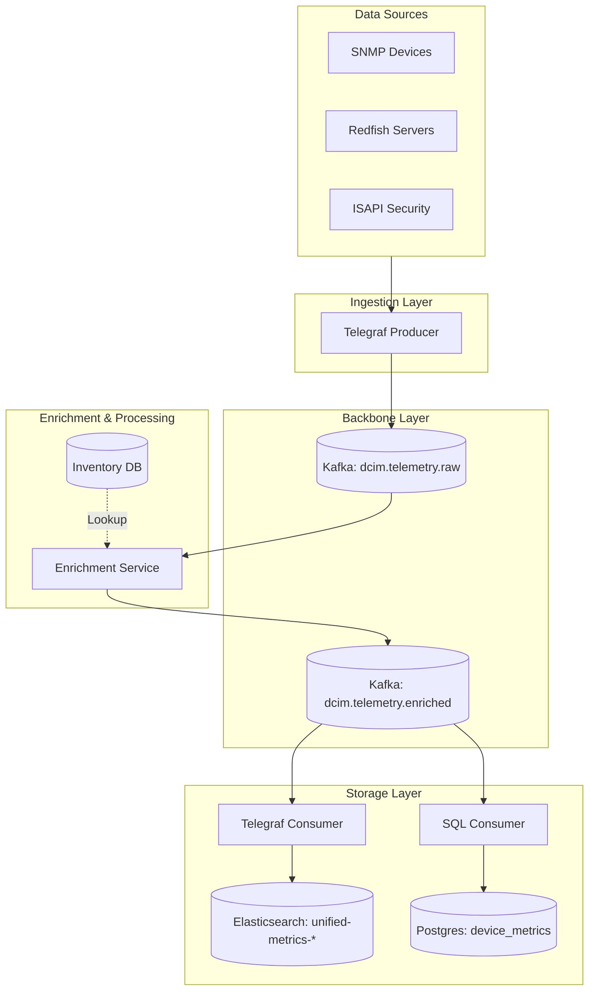

# High-Level Design (HLD): Unified DCIM Telemetry Pipeline

**Versi**: 1.0  
**Status**: ✅ Active (Live)
**Update Terakhir**: 2026-04-24  

## 1. Pendahuluan
Dokumen ini mendefinisikan desain tingkat tinggi untuk jalur pengumpulan, pemrosesan, dan penyimpanan data telemetri DCIM secara terpadu. Tujuannya adalah untuk menyatukan data inventaris (identitas) dan data performa (metrik) ke dalam satu aliran data yang kaya dan konsisten.

## 2. Visi Arsitektur (Mapping Design vs Actual)

Mengacu pada desain master DCIM, berikut adalah pemetaan teknis yang diimplementasikan pada `srv-data-collection`:

| Komponen Arsitektur | Implementasi Teknis | Peran Utama |
| :--- | :--- | :--- |
| **Ingestion Framework** | Telegraf + Python Pollers | Pengambilan data dari SNMP, Redfish, dan ISAPI. |
| **Message Broker** | Apache Kafka (KRaft) | Tulang punggung (backbone) transportasi data real-time. |
| **Processing Engine** | Python Stream Processor | Validasi skema dan normalisasi data ke "5 Pilar". |
| **Enrichment Layer** | Unified Enrichment Service | Menempelkan metadata (Site, Rack, Serial) secara otomatis. |
| **Data Targets** | Elasticsearch & PostgreSQL | Visualisasi (Kibana) dan Source of Truth (Inventory). |

## 3. Alur Data Terpadu (Unified Data Flow)

Kita mengadopsi pola **Stream Enrichment** untuk memastikan konsistensi tag:

## 4. Komponen Utama & Tanggung Jawab

### 4.1 Ingestion Layer (Telegraf)
- Bertanggung jawab sebagai "Single Door" pengumpulan data.
- Mengirim data dalam format **Influx Line Protocol** ke Kafka.
- Tag minimal di tahap ini: `hostname`, `ip`.

### 4.2 Enrichment Layer (Python Service)
- Membaca pesan dari `dcim.telemetry.raw`.
- Melakukan pencocokan identitas perangkat dengan Database Inventaris.
- **Output**: Menambahkan tag `site`, `rack_name`, `location`, `manufacturer`, `model`, dan `enrichment_status`.
- Menangani fallback: Jika perangkat tidak dikenal, tag diisi `"Unknown"` dengan status `"PARTIAL"`.

### 4.3 Storage Layer
- **Elasticsearch**: Menggunakan satu pola index `dcim-metrics-unified-*`. Menyimpan data metrik time-series lengkap dengan identitas aset.
- **PostgreSQL**: Menyimpan status terakhir perangkat (*snapshot*) untuk kebutuhan pelaporan aset dan sinkronisasi CMDB.

## 5. Standarisasi Skema Data (5 Pilar)

Setiap pesan dalam pipeline wajib memenuhi 5 pilar metrik:
1.  **Utilization**: Beban (CPU/Power/Disk).
2.  **Temperature**: Suhu operasional.
3.  **Power_Watts**: Konsumsi energi aktual.
4.  **Health_Summary**: Status kesehatan (OK/Warning/Critical).
5.  **Status_Detail**: Informasi tekstual tambahan.

## 6. Monitoring & Error Handling
- **Monitoring Service**: Menggunakan `systemd` untuk memastikan semua poller dan consumer berjalan otomatis.
- **Visibility**: 
    - Log teknis: `journalctl`.
    - Log data: Dashboard Kibana khusus untuk memantau status `PARTIAL` enrichment.

---
**Approval**:
- [ ] Systems Architect
- [ ] Infrastructure Lead
- [ ] Network Operation Center (NOC)
