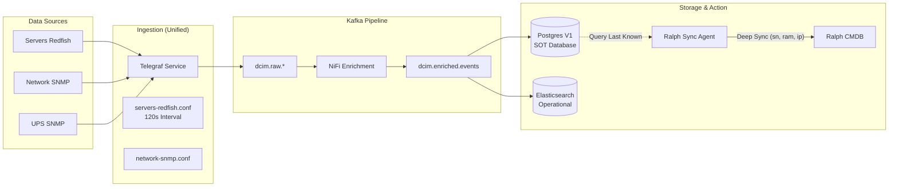

# Unified Telemetry & CMDB Sync Architecture (v3)

> [!IMPORTANT]
> **Status**: Produksi (Aktif)
> **Update Terakhir**: 2026-04-29
> **Fokus Utama**: Stabilitas BMC Lenovo, Konsistensi Data Ralph, dan Arsitektur Event-Driven.

## 1. Diagram Aliran Data (Current)

## 2. Poin Perubahan (v2 vs v3)

Berikut adalah evolusi dari arsitektur lama (`19-kafka-pipeline-architecture.md`) ke implementasi saat ini:

| Komponen | Implementasi Lama (v2) | Implementasi Saat Ini (v3) | Alasan Perubahan |
| :--- | :--- | :--- | :--- |
| **Sumber Polling Server** | Skrip Python & Telegraf menembak Redfish bersamaan. | **Centralized**: Hanya Telegraf yang menembak Redfish. | Mencegah *lockout* BMC Lenovo akibat beban request ganda. |
| **Interval Polling** | Agresif (20 detik). | **Aman (120 detik)**. | BMC Lenovo XCC memerlukan waktu recovery antar request API. |
| **Sumber Data Sync Agent** | Menembak perangkat langsung (SNMP/Redfish). | **Database-Driven**: Mengambil data dari Postgres V1. | Menjamin sinkronisasi Ralph tetap berjalan meski perangkat sedang offline/locked. |
| **Field Mapping Ralph** | Mapping manual ke kolom `remarks`. | **Deep Sync**: Mapping ke field native (`sn`, `memory`, `ethernets`). | Memungkinkan pencarian dan pelaporan aset yang lebih akurat di dalam Ralph. |
| **Kredensial** | Tersebar dan tidak konsisten (`F!tech0918`). | **Terpusat & Terkoreksi** (`F!tech@0918`). | Menghindari kegagalan login yang memicu sistem keamanan BMC. |
| **Identitas Aset** | Mengandalkan Hostname. | **Serial Number (sn)** sebagai Primary Key. | Hostname bisa berubah, SN adalah identitas permanen perangkat. |

## 3. Detail Teknis Implementasi Baru

### A. Mekanisme "Smart Fallback"
Skrip sinkronisasi kini memiliki logika bertingkat:
1.  **Primary**: Ambil metrik terbaru dari `dcim_events` (Postgres).
2.  **Secondary**: Jika DB kosong, gunakan fungsi `get_historical_data` untuk mencari SN/Hostname terakhir.
3.  **Tertiary**: Jika server baru, gunakan `SERVER_FALLBACK_MAP` dari data Excel.

### B. Deep Sync Native Fields
Sinkronisasi ke Ralph tidak lagi sekadar mengisi teks, melainkan melakukan *patching* pada:
*   **Asset Info**: Field `sn` dan `hostname`.
*   **Component Info**: Field `memory` (ukuran RAM dalam MB).
*   **Network Info**: Field `ethernets` (MAC Address dan IP Address).

---

## 4. Langkah Maintenance Kedepan
1.  **Jika ingin menambah server baru**: Cukup tambahkan `[[inputs.redfish]]` di `/etc/telegraf/telegraf.d/servers-redfish.conf`. Ralph akan ter-update otomatis dalam siklus berikutnya.
2.  **Monitoring Lockout**: Pantau log `/home/infra/dcim_metrics_project/logs/ralph_sync.log`. Jika muncul error 403, segera cek interval Telegraf.

> [!NOTE]
> Arsitektur ini telah divalidasi dan berhasil melakukan sinkronisasi pada seluruh aset HCI, Render, dan Network per tanggal 29 April 2026.
