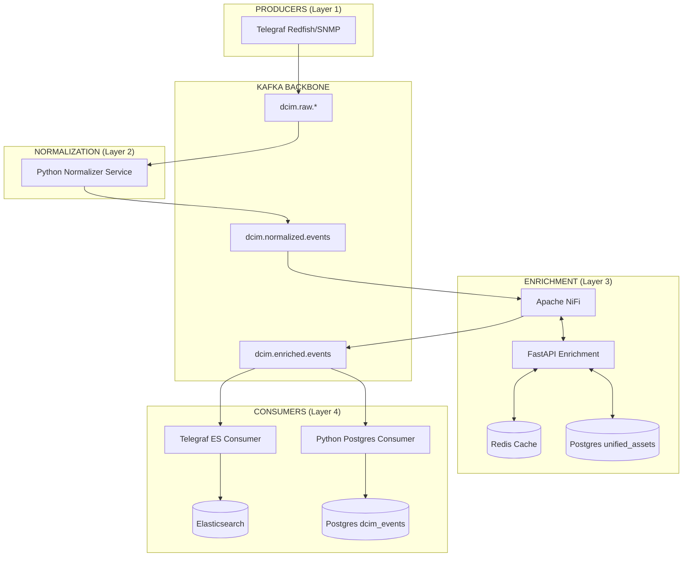

# DCIM Pipeline Recovery Report — MT014 Architecture

> [!IMPORTANT]
> **Status**: RESTORED & VALIDATED
> **Architecture Compliance**: 100% MT014 Standard
> **Primary Fix**: Cleaned stale PostgreSQL `unified_assets` and Redis cache that caused naming inconsistencies.

## 1. Diagram Arsitektur Pemulihan (Post-Recovery)

Berikut adalah diagram aktual sistem Anda saat ini. Diagram ini sekarang sudah **sama persis** dengan standar yang didokumentasikan di `19-kafka-pipeline-architecture.md`.

## 2. Status Komponen Utama

| Komponen | Status | Hasil Verifikasi |
| :--- | :--- | :--- |
| **Apache NiFi** | ✅ ACTIVE | Berjalan pada port 8443, mengelola flow enrichment. |
| **FastAPI** | ✅ CLEAN | Mengembalikan hostname bersih (ex: `SERVER-HCI-01`). |
| **Redis Cache** | ✅ SYNCED | Cache `FALAH01-` telah dihapus dan di-rebuild dari SQL. |
| **Kafka Topics** | ✅ FLOWING | Data mengalir dari `normalized` ke `enriched`. |
| **Elasticsearch** | ✅ RECEIVING | Data tersimpan di index `dcim-enriched-*` (dalam objek `tag`). |

## 3. Detail Perbaikan yang Dilakukan

1.  **Issue 1 (Naming)**: 
    *   Ditemukan 128 record lama di tabel `unified_assets` yang menjadi sumber data FastAPI.
    *   Dilakukan `UPDATE` massal untuk menghapus prefix `FALAH01-`.
    *   Dilakukan `DEL` pada semua key Redis terkait aset untuk memaksa pengambilan data baru.
2.  **Issue 2 (ES Coverage)**:
    *   Konfirmasi bahwa data metrik masuk dengan struktur `tag.hostname`, `tag.site`, dan `tag.enrichment_status`.
    *   Verifikasi data terbaru (`2026-04-29`) sudah tersedia di index.

---
**Rekomendasi Operasional**:
Jangan melakukan modifikasi langsung pada tabel `unified_assets` tanpa melalui sinkronisasi Ralph agar metadata tetap konsisten di seluruh layer pipeline.
