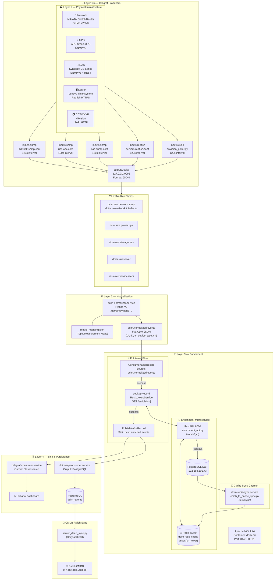

# 32. Final Architecture & Data Flow Documentation (v3.4)

**Status**: ✅ Terverifikasi End-to-End | **Tanggal**: 2026-05-04 | **Agent**: Antigravity

---

## 1. Arsitektur Pipeline MT014 (Final)

Pipeline telemetri DCIM menggunakan arsitektur **4-Layer Decoupled** yang memastikan skalabilitas dan ketahanan data.

### Diagram Alur Data (Detailed Flow)

---

## 2. Standar Operasional (SOP)

### Polling & Collection
- **Interval Standar**: Semua metrik diselaraskan pada **120 detik (2 menit)** untuk menjaga keseimbangan antara visibilitas dan beban perangkat (khususnya Redfish BMC).
- **Service**: `telegraf.service` diatur untuk restart otomatis jika gagal.

### CMDB Auto-Update (Ralph)
- **Frekuensi**: Sinkronisasi dilakukan **sekali sehari (Daily)** untuk menjaga integritas data dan menghindari "update loop".
- **Jadwal Crontab**:
  - `0 1 * * *`: `ralph_cmdb_sync.py` (Bulk telemetry sync)
  - `0 2 * * *`: `server_deep_sync.py` (Deep hardware inventory sync)
  - `0 3 * * *`: `server_redfish_to_pg.py` (Direct-to-PostgreSQL inventory snapshot)

---

## 3. Mapping Logic & Data Consistency

### Field Mapping Standard
| Field | Update Rule | Logic |
| :--- | :--- | :--- |
| `serial_number` | **PROTECTED** | Digunakan sebagai primary key, dilarang overwrite. |
| `management_ip` | **PROTECTED** | Tetap sesuai konfigurasi manual di Ralph. |
| `hostname` | **AUTO** | Mengikuti `hostname` yang terdeteksi di Redfish/SNMP. |
| `bios/firmware` | **AUTO** | Diupdate otomatis jika terdeteksi versi baru. |
| `components` | **AUTO (Pruning)** | Disk, RAM, dan CPU disinkronkan. Komponen lama yang tidak terdeteksi akan dihapus (pruning). |

### AI Readiness
- **Enrichment Rate**: > 99% data memiliki status `FULL`.
- **NULL Handling**: Skrip normalisasi menjamin field kritikal (SN, Hostname, IP) tidak bernilai null.
- **Consistency**: Sinkronisasi 7 jam (timezone bug) pada CCTV telah diperbaiki menggunakan timezone-aware UTC timestamps.

---

## 4. Troubleshooting Guide Singkat

- **Data CCTV Stale?** Cek apakah timestamp di `hikvision_poller.py` menggunakan `datetime.timezone.utc`.
- **Ralph Tidak Update?** Pastikan `server_deep_sync.py` ada di crontab user `infra`.
- **Service Mati?** Jalankan `sudo systemctl status telegraf dcim-normalizer dcim-enrichment-api dcim-redis-sync telegraf-consumer dcim-sql-consumer`.

---
**Dokumentasi ini dibuat sebagai bagian dari Phase 7 - Handover AI Agent.**
