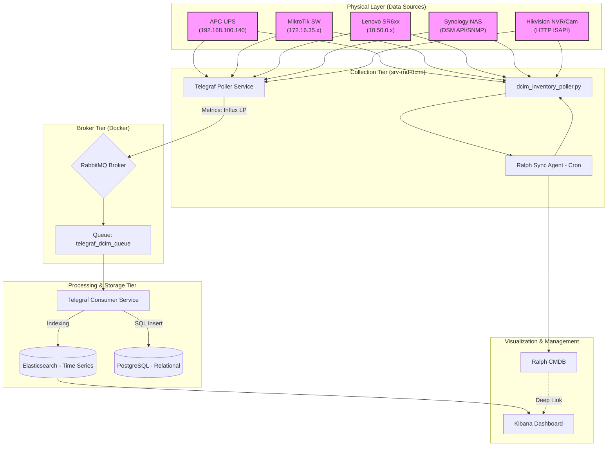

]633;E;} > /home/infra/dcim_metrics_project/docs/COMPLETE_MONITORING_DOCUMENTATION.md;d6d20ad3-25da-4451-9d71-cd95161b3600]633;C# DCIM INFRASTRUCTURE MONITORING — COMPLETE REFERENCE

## Table of Contents
1. [Data Flow Architecture](#data-flow-architecture)
2. [Brokered Pipeline Strategy](#brokered-pipeline-strategy)
3. [Raw Data from Devices](#raw-data-from-devices)
3. [Data Transformation to Elasticsearch](#data-transformation-to-elasticsearch)
5. [Unified Asset Inventory (Primary Key)](#unified-asset-inventory-primary-key)
6. [All Available Metrics — Complete Reference](#all-available-metrics--complete-reference)
7. [Telegraf Plugins — Technical Deep Dives](#telegraf-plugins--technical-deep-dives)
8. [Elasticsearch Output Flow](#elasticsearch-output-flow)
9. [Telemetry Standards (MT-013)](#telemetry-standards-mt-013)

---
# Data Flow Architecture

## Overview

This document describes how metric data is collected from physical infrastructure devices and stored in Elasticsearch for visualization in Kibana.

---

## Infrastructure Summary

| Layer | Components | Count |
|---|---|---|
| **Hardware Sources** | APC UPS, Mikrotik Switches, Lenovo Servers, Hikvision, NAS | 5 device groups |
| **Message Broker** | RabbitMQ (Docker) | 1 broker |
| **Data Processes** | Telegraf Poller (Producer), Telegraf Consumer | 2 services |
| **Storage** | Elasticsearch & PostgreSQL | 2 databases |
| **Visualization** | Kibana & Ralph CMDB | 2 front-ends |

---

## System Architecture Diagram

> Paste the block below on [https://mermaid.live](https://mermaid.live) to render it.



---

## Polling Mechanisms

### 1. APC UPS — SNMPv3 via Telegraf

| Property | Value |
|---|---|
| **Protocol** | SNMPv3 (authenticated + encrypted) |
| **Transport** | UDP port 161 |
| **Auth** | SHA / AES — user: `hndept` |
| **Interval** | Every 10 seconds |
| **Config file** | `/etc/telegraf/telegraf.d/ups-apc.conf` |
| **ES Index** | `telegraf-ups-YYYY.MM.DD` |

Telegraf sends a `GET` request for specific OIDs from the APC PowerNet MIB. The UPS network card verifies the SNMPv3 credentials before returning encrypted metric values.

---

### 2. Mikrotik Switches — SNMPv2c via Telegraf

| Property | Value |
|---|---|
| **Protocol** | SNMPv2c (community-based) |
| **Transport** | UDP port 161 |
| **Community** | `public` |
| **Interval** | Every 10 seconds |
| **Config file** | `/etc/telegraf/telegraf.conf` |
| **ES Index** | `telegraf-mikrotik-YYYY.MM.DD` |

Telegraf polls 5 devices simultaneously using OIDs from the standard MIB-II and MikroTik Private MIB for per-interface traffic counters and system metrics.

---

### 3. Lenovo Servers — Redfish via Telegraf

| Property | Value |
|---|---|
| **Protocol** | Redfish REST (DMTF Standard) |
| **Transport** | HTTPS port 443 |
| **Auth** | Basic Auth — user: `hndept` |
| **Interval** | Every 20 seconds |
| **Config file** | `/etc/telegraf/telegraf.d/servers-redfish.conf` |
| **ES Index** | `telegraf-server-YYYY.MM.DD` |

Telegraf uses its built-in `redfish` plugin to periodically query the BMCs. Due to specific hardware requirements, it explicitly uses `computer_system_id = "1"` to target the primary compute resource. Data includes thermal, power, and chassis health metrics.

---

### 4. Security System — ISAPI HTTP via Python Script

| Property | Value |
|---|---|
| **Protocol** | HTTP REST (Hikvision ISAPI) |
| **Transport** | TCP port 80 |
| **Auth** | HTTP Digest/Basic — user: `admin` |
| **Interval** | Every 60 seconds (via Telegraf) |
| **Script** | `/home/infra/dcim_metrics_project/scripts/hikvision_poller.py` |
| **Config file** | `/etc/telegraf/telegraf.d/hikvision.conf` |
| **ES Index** | `cctv-metrics-YYYY.MM.DD` |

A Python 3 script runs every minute via Telegraf's `inputs.exec` plugin. It authenticates to the NVR and 23 individual cameras. The script uses **Network ICMP Ping** to determine "Online" status, while ISAPI fetches hardware metrics (now including Model and Uptime) and manages authentication reporting via `isapi_status`.

---

# Unified Asset Inventory (Primary Key)

A centralized index that consolidates hardware identity from all 33 devices into a single searchable table using the **Serial Number** as the primary identifier.

| Property | Value |
|---|---|
| **Index Pattern** | `dcim-inventory-*` |
| **Primary Key** | `tag.serial_number` |
| **Collector Script** | `/usr/local/bin/dcim_inventory_poller.py` |
| **Config File** | `/etc/telegraf/telegraf.d/dcim-unified-inventory.conf` |
| **Devices Count** | 33 (Servers, UPS, MikroTik, NVR, CCTV) |

### 🧭 Data Mapping
*   **serial_number**
*   **hostname**
*   **model**
*   **manufacturer**
*   **firmware**
*   **ip**
*   **device_type**
*   **category**
*   **processor_count** (for server metrics)
*   **processor_logical_count** (for server metrics)
*   **timestamp**
---

## Elasticsearch Indices

| Index Pattern | Source | Retention |
|---|---|---|
| `telegraf-mikrotik-YYYY.MM.DD` | MikroTik SNMP Metrics | Daily rolling |
| `telegraf-ups-YYYY.MM.DD` | APC UPS SNMP Metrics | Daily rolling |
| `telegraf-server-YYYY.MM.DD` | Lenovo Server Redfish Metrics | Daily rolling |
| `cctv-metrics-YYYY.MM.DD` | Python poller (Security System) | Daily rolling |
| `server-ipmi-metrics-YYYY.MM.DD` | Historical Data (Archived) | Static / Archive |

## Technical Deep Dives
*   **Discovery Logic:** Detailed explanation of how servers are automatically polled: [12-telegraf-redfish-discovery.md](file:///home/infra/dcim_metrics_project/docs/12-telegraf-redfish-discovery.md)
*   **Transmission Logic:** Detailed breakdown of how Telegraf pushes data to Elasticsearch: [13-telegraf-elasticsearch-flow.md](file:///home/infra/dcim_metrics_project/docs/13-telegraf-elasticsearch-flow.md)
*   **NAS Metrics List:** Complete list of Synology NAS metrics: [17-synology-nas-metrics-list.md](file:///home/infra/dcim_metrics_project/docs/17-synology-nas-metrics-list.md)
*   **NAS Collection Method:** How DSM API is polled for NAS data: [18-nas-data-collection-method.md](file:///home/infra/dcim_metrics_project/docs/18-nas-data-collection-method.md)
*   **Telemetry Identification:** Complete source mapping (MT-012): [13-telemetry-sources-identification.md](file:///home/infra/dcim_metrics_project/docs/13-telemetry-sources-identification.md)
*   **Telemetry Schema:** Unified data standards (MT-013): [14-standardization-telemetry-schema.md](file:///home/infra/dcim_metrics_project/docs/14-standardization-telemetry-schema.md)

---
---

# Brokered Pipeline Strategy

Sistem monitoring ini menggunakan pendekatan **Message Broker** (RabbitMQ) untuk memisahkan proses pengambilan data (polling) dengan penulisan data (storage).

### 1. Poller Config (Producer)
*   **Layanan**: `telegraf.service`
*   **Output**: `amqp://127.0.0.1:5672` (Routing Key: `dcim_metrics`)
*   **Keuntungan**: Proses scraping perangkat tetap berjalan lancar meskipun database tujuan sedang lambat atau offline.

### 2. Consumer Config
*   **Layanan**: `telegraf-consumer.service`
*   **Tugas**: Mengambil data dari antrian `telegraf_dcim_queue` dan menyalurkannya ke dua output.
*   **Output 1**: Elasticsearch (Kibana) - Index: `telegraf-{{device_type}}-YYYY.MM.DD`
*   **Output 2**: PostgreSQL (`dcim_sot`) - Menggunakan tabel per-measurement (e.g. `kernel`, `cpu`, `ups_metrics`).

### 3. Ketahanan Data (High Availability)
Jika Elasticsearch mati, metrics akan mengumpul di antrian RabbitMQ. Begitu Elasticsearch kembali online, Consumer akan memproses antrian tersebut tanpa ada data yang terbuang.

---

# Raw Data from Devices

## Overview

This document shows the **exact raw payloads** that each device returns when queried by a collector. This is the data before any transformation or field-mapping is applied.

---

## 1. APC UPS — SNMPv3 Raw Response

**Queried by:** Telegraf `inputs.snmp`
**Endpoint:** `192.168.100.140:161`
**Protocol:** SNMPv3, Auth: SHA, Privacy: AES

When Telegraf polls a single OID (e.g. `battery_capacity`), the SNMPv3 decrypted response looks like:

```
SNMP Response PDU
  Version:      3
  Community:    (not used in v3, replaced by user context)
  User:         hndept
  Request-ID:   1234567
  Error-Status: noError (0)
  Variable Bindings:
    OID   = .1.3.6.1.4.1.318.1.1.1.2.2.1.0
    Type  = INTEGER
    Value = 100
```

Telegraf sends **one GET request per configured OID** per interval. A full poll cycle for our UPS config returns 8 individual integer/string values.

**Currently configured OIDs (OEM MIB `.935.*`) — live values from hardware:**

| OID Queried | Raw Type | Live Value from Walk |
|---|---|---|
| `.1.3.6.1.4.1.935.1.1.1.1.1.1.0` | STRING | `"30KH"` |
| `.1.3.6.1.4.1.935.1.1.1.4.1.1.0` | INTEGER | `2` (= OnLine) |
| `.1.3.6.1.4.1.935.1.1.1.2.2.1.0` | INTEGER | `100` (= 100%) |
| `.1.3.6.1.4.1.935.1.1.1.2.2.3.0` | INTEGER | varies (seconds) |
| `.1.3.6.1.4.1.935.1.1.1.2.2.2.0` | INTEGER | `22` (= 22°C) |
| `.1.3.6.1.4.1.935.1.1.1.3.2.1.0` | INTEGER | `~230` (= 230V) |
| `.1.3.6.1.4.1.935.1.1.1.4.2.1.0` | INTEGER | `231` (= 231V) |
| `.1.3.6.1.4.1.935.1.1.1.4.2.3.0` | INTEGER | varies (%) |

**Additional OIDs available via RFC 1628 UPS MIB (`.1.3.6.1.2.1.33.*`) — NOT yet in Telegraf:**

| OID | Raw Type | Live Value from SNMP Walk | Description |
|---|---|---|---|
| `.1.3.6.1.2.1.33.1.1.1.0` | STRING | `"9E2133T16585"` | Serial number |
| `.1.3.6.1.2.1.33.1.1.3.0` | STRING | `"V6.042/040"` | Firmware version |
| `.1.3.6.1.2.1.33.1.2.1.0` | INTEGER | `2` (Normal) | Battery status |
| `.1.3.6.1.2.1.33.1.2.5.0` | INTEGER | `2680` (268.0V ÷10) | Battery voltage |
| `.1.3.6.1.2.1.33.1.3.3.1.3.1` | INTEGER | `233` | Input voltage L1 |
| `.1.3.6.1.2.1.33.1.3.3.1.3.2` | INTEGER | `222` | Input voltage L2 |
| `.1.3.6.1.2.1.33.1.3.3.1.3.3` | INTEGER | `233` | Input voltage L3 |
| `.1.3.6.1.2.1.33.1.4.4.1.2.1` | INTEGER | `231` | Output voltage L1 |
| `.1.3.6.1.2.1.33.1.4.4.1.5.1` | INTEGER | `1` | Output load L1 % |
| `.1.3.6.1.2.1.33.1.4.4.1.5.2` | INTEGER | `11` | Output load L2 % |
| `.1.3.6.1.2.1.33.1.4.4.1.5.3` | INTEGER | `3` | Output load L3 % |

---

## 2. Lenovo Servers — Redfish JSON Response

**Queried by:** Telegraf `inputs.redfish`
**Endpoint:** `https://10.50.0.x/redfish/v1/`
**Protocol:** HTTPS Basic Auth

The Telegraf Redfish plugin fetches raw JSON from multiple BMC endpoints. A typical response from `/redfish/v1/Chassis/1/Thermal` looks like:

```json
{
    "@odata.type": "#Thermal.v1_4_0.Thermal",
    "Temperatures": [
        {
            "Name": "Ambient Temp",
            "ReadingCelsius": 24,
            "Status": { "State": "Enabled", "Health": "OK" }
        },
        {
            "Name": "CPU 1 Temp",
            "ReadingCelsius": 48,
            "Status": { "State": "Enabled", "Health": "OK" }
        }
    ],
    "Fans": [
        {
            "FanName": "Fan 1 Front Tach",
            "Reading": 7790,
            "ReadingUnits": "RPM",
            "Status": { "State": "Enabled", "Health": "OK" }
        }
    ]
}
```

---

## 3. Security System — Hikvision ISAPI (XML)

**Queried by:** Python script `hikvision_poller.py`
**Targets:** 
- NVR: `192.168.1.254`
- CCTV: `192.168.1.x` (23 cameras)
**Protocol:** HTTP, Digest Auth

The NVR and Cameras return all responses in **XML format** using the Hikvision namespace schema.

### 3.1 Device Info (/ISAPI/System/deviceInfo)

```xml
<?xml version="1.0" encoding="UTF-8"?>
<DeviceInfo version="2.0" xmlns="http://www.hikvision.com/ver20/XMLSchema">
    <deviceName>Hikvision NVR</deviceName>
    <deviceID>f0e5b1c0-3d2a-11ee-be56-0242ac120002</deviceID>
    <deviceDescription>Network Video Recorder</deviceDescription>
    <deviceLocation>Server Room</deviceLocation>
    <model>DS-7716NI-Q4</model>
    <serialNumber>DS-7716NI-Q420200101BBWR123456789WCVU</serialNumber>
    <macAddress>8c:e7:48:ab:cd:ef</macAddress>
    <firmwareVersion>V4.62.210</firmwareVersion>
    <firmwareReleasedDate>2022-11-15</firmwareReleasedDate>
    <encoderVersion>V7.3</encoderVersion>
</DeviceInfo>
```

System status endpoint (`/ISAPI/System/status`):

```xml
<?xml version="1.0" encoding="UTF-8"?>
<DeviceStatus version="2.0" xmlns="http://www.hikvision.com/ver20/XMLSchema">
    <currentDeviceTime>2026-04-10T12:00:00+07:00</currentDeviceTime>
    <deviceUpTime>864000</deviceUpTime>
    <CPUList>
        <CPU>
            <cpuDescription>Main processor</cpuDescription>
            <cpuUtilization>12</cpuUtilization>
        </CPU>
    </CPUList>
    <MemoryList>
        <Memory>
            <memoryDescription>DDR RAM</memoryDescription>
            <memoryUsage>45</memoryUsage>
            <memoryAvailable>8192</memoryAvailable>
        </Memory>
    </MemoryList>
</DeviceStatus>
```

### 3.4 Camera Channel Status (/ISAPI/Streaming/channels)

Individual cameras provide streaming metadata including resolution and bitrate:

```xml
<?xml version="1.0" encoding="UTF-8"?>
<StreamingChannelList version="2.0" xmlns="http://www.hikvision.com/ver20/XMLSchema">
    <StreamingChannel>
        <id>101</id>
        <channelName>Main Stream</channelName>
        <enabled>true</enabled>
        <Video>
            <videoCodecType>H.265</videoCodecType>
            <videoResolutionWidth>2560</videoResolutionWidth>
            <videoResolutionHeight>1440</videoResolutionHeight>
            <vbrUpperCap>4096</vbrUpperCap>
        </Video>
    </StreamingChannel>
</StreamingChannelList>
```

> **Note:** Hikvision exclusively uses XML. The Python poller parses this into a unified JSON schema before sending to the `cctv-metrics-*` index in Elasticsearch.

---

## 4. Mikrotik Switches — SNMPv2c Raw Response

**Queried by:** Telegraf `inputs.snmp`
**Endpoint:** `172.16.35.1-6:161`
**Protocol:** SNMPv2c, community: `public`

For interface traffic tables, Telegraf requests the entire `ifXTable` (OID `1.3.6.1.2.1.31.1.1`) and receives one row per interface:

```
SNMP Response PDU — GetNext (table walk)
  Variable Bindings:
    1.3.6.1.2.1.31.1.1.1.1.1  = STRING: "ether1"        (ifName)
    1.3.6.1.2.1.31.1.1.1.15.1 = Gauge32: 1000000000      (ifHighSpeed bps)
    1.3.6.1.2.1.31.1.1.1.6.1  = Counter64: 9823746123    (ifHCInOctets)
    1.3.6.1.2.1.31.1.1.1.10.1 = Counter64: 7264891034    (ifHCOutOctets)
    1.3.6.1.2.1.2.2.1.14.1    = Counter32: 0             (ifInErrors)
    1.3.6.1.2.1.2.2.1.20.1    = Counter32: 0             (ifOutErrors)
```

One response block is returned **per physical interface** per device (e.g. ether1…ether48 for a 48-port switch).

---
# Data Transformation to Elasticsearch

## Overview

Raw metric data from physical devices goes through a series of transformations before it is stored in Elasticsearch.
This document explains each transformation step and shows a before/after comparison for each category.

---

## Transformation Pipeline

```
  Device Raw Output
        │
        ▼
  [Step 1] Protocol Decode
  (SNMP binary → integers/strings, Redfish JSON → dict, Hikvision XML → dict)
        │
        ▼
  [Step 2] Field Mapping
  (OID → human-readable name, e.g. ".1.3.6.1.4.1.318.1.1.1.2.2.1.0" → "battery_capacity")
        │
        ▼
  [Step 3] Flattening
  (Nested arrays/objects → flat key-value pairs)
        │
        ▼
  [Step 4] Metadata Tagging
  (Add @timestamp, category: "security system", device_type, ip)
        │
        ▼
  [Step 5] Elasticsearch Indexing
  (HTTP POST to https://10.70.0.56:9200/<index>/_doc)
```

---

## Common Metadata Fields Added to every Document

Regardless of source category, these fields are injected into **every** Elasticsearch document:

| Field | Description | Example Value |
|---|---|---|
| `tag.serial_number` | Primary Identifier | `J901F8KE` |
| `tag.hostname` | Device Identity | `FIT-Core-SW` |
| `tag.model` | Hardware Model | `30KH` |
| `tag.firmware` | OS/BIOS Version | `7.16.2` |
| `tag.ip` | Management IP | `10.50.0.5` |
| `tag.device_type` | Category | `server` |
| `tag.category` | Group | `infrastructure` |
| `@timestamp` | collection time | `2026-04-17T09:30:00Z` |
---

## Category-by-Category Transformation

### 1. APC UPS (SNMP → Elasticsearch)

**Before** (raw SNMP integer from wire):
```
OID .1.3.6.1.4.1.935.1.1.1.2.2.1.0 = INTEGER: 100
```

**After** (stored in `telegraf-ups-2026.04.16` — real field values from hardware):
```json
{
    "@timestamp": "2026-04-10T07:30:00.000Z",
    "measurement_name": "ups_apc",
    "tag": {
        "agent_host": "192.168.100.140",
        "device_type": "ups",
        "location": "Server Room"
    },
    "ups_apc": {
        "model": "30KH",
        "status": 2,
        "battery_capacity": 100,
        "battery_temp": 22,
        "battery_runtime_remain": 32400,
        "input_voltage": 233,
        "output_voltage": 231,
        "output_load": 5
    }
}
```

---

### 2. Lenovo Servers (Redfish → Telegraf → Elasticsearch)

**Before** (Raw JSON response from `/redfish/v1/Chassis/1/Thermal`):
```json
{
    "Temperatures": [
        {
            "Name": "Inlet Temp",
            "ReadingCelsius": 24,
            "Status": { "State": "Enabled", "Health": "OK" }
        }
    ],
    "Fans": [
        {
            "FanName": "Fan 1",
            "Reading": 7800,
            "ReadingUnits": "RPM"
        }
    ]
}
```

**After** (actual document in `telegraf-server-2026.04.16`):
{
    "@timestamp": "2026-04-13T14:40:04+07:00",
    "measurement_name": "server_redfish",
    "server_redfish": {
        "reading_celsius": 23,
        "upper_threshold_critical": 47,
        "upper_threshold_fatal": 50
    },
    "tag": {
        "address": "10.50.0.5",
        "health": "OK",
        "host": "server-Render-01",
        "member_id": "0",
        "name": "AmbientTemp",
        "source": "XCC-7D9A-J901F8KE",
        "state": "Enabled"
    }
}
```

---

### 3. Security System (XML → JSON → Elasticsearch)

**Before** (raw XML string from `/ISAPI/System/deviceInfo`):
```xml
<DeviceInfo>
    <model>DS-7716NI-Q4</model>
    <firmwareVersion>V4.62.210</firmwareVersion>
    <deviceUpTime>864000</deviceUpTime>
</DeviceInfo>
```

**After** (stored in `cctv-metrics-2026.04.10`):
```json
{
    "@timestamp": "2026-04-10T07:30:01.219Z",
    "category": "security system",
    "device_type": "NVR",
    "ip": "192.168.1.254",
    "status": "Online",
    "device_info": {
        "model": "DS-7716NI-Q4",
        "firmwareVersion": "V4.62.210"
    },
    "system_status": {
        "cpuUtilization": "12",
        "memoryUsage": "45"
    }
}
```

| Transformation Applied | Detail |
|---|---|
| XML → JSON | Python `xml.etree.ElementTree` parses XML tags into dict keys |
| Grouping | `device_info` and `system_status` keys nest related fields |
| Unified Category | Inject `category: "security system"` for unified dashboard filtering |

---

### 4. Mikrotik Switches (SNMP Table → Elasticsearch)

**Before** (SNMP table walk — one row per interface):
```
1.3.6.1.2.1.31.1.1.1.1.1  = STRING: "ether1"
1.3.6.1.2.1.31.1.1.1.6.1  = Counter64: 9823746123
1.3.6.1.2.1.31.1.1.1.10.1 = Counter64: 7264891034
```

**After** (one document per interface in `telegraf-mikrotik-2026.04.16`):
```json
{
    "@timestamp": "2026-04-09T01:16:07Z",
    "category": "infrastructure",
    "device_type": "switch",
    "ip": "172.16.35.3",
    "net_interface": {
        "if_name": "ether1",
        "if_speed": 1000000000,
        "if_in_octets": 9823746123,
        "if_out_octets": 7264891034
    }
}
```

---
# All Available Metrics — Complete Reference

> This document lists **every metric field** that each device CAN expose.  
> Fields marked ✅ are currently being collected. Fields marked ⬜ are available but not yet configured.

---

## Quick Reference

| Category | Device | Total Available | Confirmed in ES |
|---|---|---|---|
| UPS | APC 30KH `192.168.100.140` | 33 OIDs (MIB-verified) | **33** ✅ in ES |
| Servers | Lenovo ThinkSystem (Redfish) | ~100 fields | **6+ sensor types** (per `tag.name` filter) |
| **NAS** | Synology (Hybrid REST/SNMP) | 40+ fields | **40+** ✅ in ES |
| **Security System** | Hikvision NVR `192.168.1.254` | 30+ fields | **12 fields** |
| **Security System** | Hikvision CCTV (23 Cameras) | 15+ fields per camera | **6 fields** |
| Network | Mikrotik Switches `172.16.35.x` | 30+ fields | **14+ fields** |

---

## 1. APC UPS — SNMP Metrics

**Model:** APC 30KH (3-phase industrial UPS)  
**Protocol:** SNMPv3, user: `hndept`, SHA + AES  
**ES Measurement:** `ups_apc` | **Filter:** `measurement_name : "ups_apc" AND tag.agent_host : "192.168.100.140"`

> ✅ = Confirmed in Elasticsearch | ⬜ = Device responds in SNMP walk — **not yet in Telegraf config**

### 1.1 System Identity (MIB-II `.1.3.6.1.2.1.1.*`)

| Status | ES Field | Full OID | Type | Live Value | Description |
|---|---|---|---|---|---|
| ✅ | `system_name` | `.1.3.6.1.2.1.1.5.0` | String | `"UPS Agent"` | Network card name |
| ✅ | `system_location` | `.1.3.6.1.2.1.1.6.0` | String | `"PT Falah..."` | Physical rack/room location |
| ✅ | `system_contact` | `.1.3.6.1.2.1.1.4.0` | String | `"Administrator"` | Person responsible for UPS |
| ✅ | `system_uptime` | `.1.3.6.1.2.1.1.3.0` | Ticks | `1621040053` | Time since network card reboot |
| ✅ | `system_description` | `.1.3.6.1.2.1.1.1.0` | String | `"UPS Agent"` | Hardware description |

### 1.2 Health & Power — 8 Fields (OEM MIB `.1.3.6.1.4.1.935.*`)

| Status | ES Field | Full OID | Unit | Live Value | Description |
|---|---|---|---|---|---|
| ✅ | `ups_apc.model` | `.1.3.6.1.4.1.935.1.1.1.1.1.1.0` | String | `"30KH"` | UPS model name |
| ✅ | `ups_apc.status` | `.1.3.6.1.4.1.935.1.1.1.4.1.1.0` | Enum | `2` | `2`=OnLine `3`=OnBattery `6`=OnBypass |
| ✅ | `ups_apc.battery_capacity` | `.1.3.6.1.4.1.935.1.1.1.2.2.1.0` | % | `100` | Battery charge level |
| ✅ | `ups_apc.battery_temp` | `.1.3.6.1.4.1.935.1.1.1.2.2.2.0` | °C | `22` | Battery temperature |
| ✅ | `ups_apc.battery_runtime_remain` | `.1.3.6.1.4.1.935.1.1.1.2.2.3.0` | Sec | varies | Remaining runtime |
| ✅ | `ups_apc.input_voltage` | `.1.3.6.1.4.1.935.1.1.1.3.2.1.0` | V | `~230` | Input voltage (L1) |
| ✅ | `ups_apc.output_voltage` | `.1.3.6.1.4.1.935.1.1.1.4.2.1.0` | V | `231` | Output voltage (L1) |
| ✅ | `ups_apc.output_load` | `.1.3.6.1.4.1.935.1.1.1.4.2.3.0` | % | varies | Output load % |

### Available to Add — RFC 1628 UPS MIB (`.1.3.6.1.2.1.33.*`) — Confirmed in SNMP Walk

| Status | Telegraf Field Name | Full OID | Live Value | Unit | Description |
|---|---|---|---|---|---|
| ✅ | `serial_number` | `.1.3.6.1.2.1.33.1.1.1.0` | `"9E2133T16585"` | — | Serial number |
| ✅ | `firmware_version` | `.1.3.6.1.2.1.33.1.1.3.0` | `"V6.042/040"` | — | Firmware version |
| ✅ | `agent_firmware` | `.1.3.6.1.2.1.33.1.1.4.0` | `"3.7.DA807.APC.15"` | — | Network agent firmware |
| ✅ | `battery_status` | `.1.3.6.1.2.1.33.1.2.1.0` | `2` (Normal) | Enum | `1`=Unknown `2`=Normal `3`=Low `4`=Depleted |
| ✅ | `battery_seconds_on_battery` | `.1.3.6.1.2.1.33.1.2.2.0` | `0` | Sec | Seconds on battery |
| ✅ | `battery_voltage` | `.1.3.6.1.2.1.33.1.2.5.0` | `2680` | 0.1V | Battery bank voltage (÷10=268.0V) |
| ✅ | `battery_current` | `.1.3.6.1.2.1.33.1.2.6.0` | `1` | A | Battery current |
| ⬜ | `input_voltage_L1` | `.1.3.6.1.2.1.33.1.3.3.1.3.1` | `233` | V | Input voltage Phase L1 |
| ⬜ | `input_voltage_L2` | `.1.3.6.1.2.1.33.1.3.3.1.3.2` | `222` | V | Input voltage Phase L2 |
| ⬜ | `input_voltage_L3` | `.1.3.6.1.2.1.33.1.3.3.1.3.3` | `233` | V | Input voltage Phase L3 |
| ⬜ | `input_frequency_L1` | `.1.3.6.1.2.1.33.1.3.3.1.2.1` | `500` | 0.1Hz | Input frequency L1 (÷10=50.0Hz) |
| ⬜ | `output_frequency` | `.1.3.6.1.2.1.33.1.4.2.0` | `500` | 0.1Hz | Output frequency (÷10=50.0Hz) |
| ⬜ | `output_voltage_L1` | `.1.3.6.1.2.1.33.1.4.4.1.2.1` | `231` | V | Output voltage Phase L1 |
| ⬜ | `output_voltage_L2` | `.1.3.6.1.2.1.33.1.4.4.1.2.2` | `231` | V | Output voltage Phase L2 |
| ⬜ | `output_voltage_L3` | `.1.3.6.1.2.1.33.1.4.4.1.2.3` | `231` | V | Output voltage Phase L3 |
| ⬜ | `output_load_L1` | `.1.3.6.1.2.1.33.1.4.4.1.5.1` | `1` | % | Output load Phase L1 |
| ⬜ | `output_load_L2` | `.1.3.6.1.2.1.33.1.4.4.1.5.2` | `11` | % | Output load Phase L2 |
| ⬜ | `output_load_L3` | `.1.3.6.1.2.1.33.1.4.4.1.5.3` | `3` | % | Output load Phase L3 |

> **Tags available:** `tag.agent_host` (= `192.168.100.140`), `tag.device_type` (`ups`), `tag.location` (`Server Room`)  
> **MIB Note:** The `.935.*` (OEM MIB) and `.33.*` (RFC 1628 UPS) MIBs are both supported by this device. Serial number, firmware, and per-phase data must be polled via `.33.*`.

---

## 2. Lenovo Servers — Confirmed Redfish Metrics

**Model:** Lenovo ThinkSystem (via XCC BMC, Redfish API)  
**Auth:** HTTPS Basic — user: `hndept`  
**ES Measurement:** `server_redfish` | **Filter:** `measurement_name : "server_redfish"`

> Sensors share field names — identify specific sensors with `tag.name` filter.

### 2.1 Inventory & Chassis Health

| Status | ES Field | Tag | Description |
|---|---|---|---|
| ✅ | `tag.host` | `host` | Server name (e.g. `server-HCI-01`) |
| ✅ | `tag.address` | `address` | BMC management IP |
| ✅ | `tag.health` | `health` | Component health (`OK` / `Warning`) |
| ✅ | `server_redfish.power_output_watts` | — | Real-time power draw (Watts) |

### 2.2 Thermal Sensors (filter by `tag.name`)

| Status | ES Field | `tag.name` value | Description |
|---|---|---|---|
| ✅ | `server_redfish.reading_celsius` | `"AmbientTemp"` | Chassis inlet air temperature |
| ✅ | `server_redfish.reading_celsius` | `"CPU1Temp"` | Processor socket 1 temperature |
| ✅ | `server_redfish.reading_celsius` | `"CPU2DTS"` | Processor socket 2 DTS |
| ✅ | `server_redfish.reading_celsius` | `"ExhaustTemp"` | Rear exhaust air temperature |
| ✅ | `server_redfish.reading_celsius` | `"DIMM*Temp"` | Individual DIMM slot temperatures |

### 2.3 Cooling Metrics (filter by `tag.name`)

| Status | ES Field | `tag.name` value | Description |
|---|---|---|---|
| ✅ | `server_redfish.reading_rpm` | `"Fan1FrontTach"` | Chassis Fan 1 — front tach speed |
| ✅ | `server_redfish.reading_rpm` | `"Fan1RearTach"` | Chassis Fan 1 — rear tach speed |
| ✅ | `tag.state` | — | Component state (`Enabled` / `Absent`) |

### 2.4 Voltage Sensors (filter by `tag.name`)

| Status | ES Field | `tag.name` value | Description |
|---|---|---|---|
| ✅ | `server_redfish.reading_volts` | `"SysBrd12V"` | System board 12V rail |
| ✅ | `server_redfish.reading_volts` | `"SysBrd5V"` | System board 5V rail |
| ✅ | `server_redfish.reading_volts` | `"SysBrd3.3V"` | System board 3.3V rail |
| ✅ | `server_redfish.line_input_voltage` | — | PSU input voltage |

### 2.5 Server Inventory & Asset Details (Filter: `measurement_name : "server_inventory"`)

Metrik ini dikumpulkan secara terpisah dari metrik sensor untuk memberikan visibilitas aset yang lebih bersih.

| Status | ES Field | Type | Description |
|---|---|---|---|
| ✅ | `server_inventory.Oem_Lenovo_ProductName` | String | Friendly product name |
| ✅ | `server_inventory.Model` | String | Machine Type / Model (MTM) |
| ✅ | `server_inventory.Manufacturer` | String | Manufacturer (e.g. Lenovo) |
| ✅ | `server_inventory.SerialNumber` | String | Factory serial number |
| ✅ | `server_inventory.HostName` | String | BMC/XCC Management Hostname |
| ✅ | `server_inventory.FirmwareVersion` | String | BMC/XCC Primary Firmware |
| ✅ | `server_inventory.PowerState` | String | System power state (`On` / `Off`) |
| ✅ | `server_inventory.Status_Health` | String | Aggregate health status (`OK` / `Critical`) |
| ✅ | `server_inventory.MemorySummary_TotalSystemMemoryGiB` | GiB | Total RAM installed |
| ✅ | `server_inventory.ProcessorSummary_Count` | Int | Number of physical CPUs |
| ✅ | `server_inventory.ProcessorSummary_LogicalProcessorCount` | Int | Number of logical CPUs / Threads |
| ✅ | `server_inventory.Oem_Lenovo_Total...` | Hours | Cumulative hardware uptime |

> **Tags available:** `tag.address` (BMC IP), `tag.host` (collector name), `tag.device_type` (`server`)

---

## 3. Security System — Hikvision Hub & Cameras

### 3.1 Hikvision NVR (Central Management Hub)
**Source:** `192.168.1.254`, user: `admin`  
> **Note:** The NVR acts as the aggregator. Metrics collected here reflect the health of the recorder and the connectivity of all 23 cameras.

### 3.1 Device Info (`/ISAPI/System/deviceInfo`)

| Status | XML Field | Type | Description |
|---|---|---|---|
| ✅ | `deviceName` | String | User-configured device name |
| ✅ | `deviceID` | String | Unique device UUID |
| ✅ | `model` | String | Hardware model (e.g. DS-7716NI-Q4) |
| ✅ | `serialNumber` | String | Factory serial number |
| ✅ | `macAddress` | String | Primary MAC address |
| ✅ | `firmwareVersion` | String | Current firmware |
| ✅ | `firmwareReleasedDate` | String | Firmware release date |
| ✅ | `encoderVersion` | String | Video encoding engine version |
| ✅ | `deviceLocation` | String | User-configured location label |

### 3.2 System Status (`/ISAPI/System/status`)

| Status | XML Field | Unit | Description |
|---|---|---|---|
| ✅ | `deviceUpTime` | seconds | Time since last reboot |
| ✅ | `currentDeviceTime` | ISO8601 | Current device clock |
| ✅ | `CPUList.CPU.cpuUtilization` | % | CPU usage per core |
| ✅ | `MemoryList.Memory.memoryUsage` | % | RAM usage |
| ✅ | `MemoryList.Memory.memoryAvailable` | MB | Available RAM |

### 3.3 Storage (`/ISAPI/ContentMgmt/Storage/hdd`)

| Status | XML Field | Unit | Description |
|---|---|---|---|
| ✅ | `hddList.hdd.id` | Integer | HDD disk number |
| ✅ | `hddList.hdd.hddName` | String | Disk label |
| ✅ | `hddList.hdd.hddStatus` | Enum | `ok` / `error` / `notExist` / `formatting` |
| ✅ | `hddList.hdd.hddCapacity` | MB | Total disk capacity |
| ✅ | `hddList.hdd.freeSpace` | MB | Available free space |

### 3.4 Network (`/ISAPI/System/Network/interfaces`)

| Status | XML Field | Type | Description |
|---|---|---|---|
| ✅ | `NetworkInterface.IPAddress.ipAddress` | String | NVR management IP |
| ✅ | `NetworkInterface.IPAddress.subnetMask` | String | Subnet mask |
| ✅ | `NetworkInterface.IPAddress.DefaultGateway` | String | Default gateway |
| ✅ | `NetworkInterface.MTU` | Integer | Network MTU |

### 3.5 Video Channels (`/ISAPI/System/Video/inputs/channels`)

| Status | XML Field | Type | Description |
|---|---|---|---|
| ✅ | `VideoInputChannel.id` | Integer | Channel number |
| ✅ | `VideoInputChannel.name` | String | Camera name |
| ✅ | `VideoInputChannel.videoInputEnabled` | Boolean | Channel enabled state |
| ✅ | `VideoInputChannel.resDesc` | String | Resolution string (e.g. `1080P`) |

### 3.6 Recording / Events (`/ISAPI/ContentMgmt/record/tracks`)

| Status | XML Field | Type | Description |
|---|---|---|---|
| ✅ | `trackList.Track.id` | Integer | Track/channel ID |
| ✅ | `trackList.Track.Channel` | Integer | Bound video channel |
| ✅ | `trackList.Track.Enable` | Boolean | Recording enabled |
| ✅ | `trackList.Track.LoopEnable` | Boolean | Overwrite when full |

### 3.2 Hikvision CCTV (Individual IP Cameras)
**Source:** IPs `192.168.1.2` through `192.168.1.33`

These metrics are queried directly from each camera bypassing the NVR hub.

#### 3.2.1 Camera Hardware Status
| Status | XML Field | Unit | Description |
|---|---|---|---|
| ✅ | `deviceName` | String | Camera custom name |
| ✅ | `model` | String | Camera hardware model |
| ✅ | `firmwareVersion` | String | Camera firmware build |
| ✅ | `deviceUpTime` | seconds | Uptime since camera reboot |
| ✅ | `cpuUtilization` | % | CPU load on camera SoC |

#### 3.2.2 Streaming & Quality
| Status | XML Field | Unit | Description |
|---|---|---|---|
| ✅ | `VideoInputChannel.resDesc` | String | Resolution (e.g. `2560x1440`) |
| ✅ | `StreamingChannel.bitrate` | kbps | Real-time video bitrate |
| ✅ | `lowLightStatus` | Boolean | Night vision activation state |

#### 3.2.3 Edge Storage
| Status | XML Field | Unit | Description |
|---|---|---|---|
| ✅ | `hddList.hdd.hddStatus` | Enum | SD Card health (if installed) |
| ✅ | `hddList.hdd.freeSpace` | MB | SD Card free space |

---

## 4. Mikrotik Switches — All Available SNMP OIDs

**Protocol:** SNMPv2c, community: `public`  
**MIBs:** MIB-II standard + MikroTik Private MIB (`.1.3.6.1.4.1.14988`)

### 4.1 System (MIB-II `.1.3.6.1.2.1.1`)

| Status | Field Name | OID | Type | Description |
|---|---|---|---|---|
| ✅ | `system_name` | `.1.2.1.1.5.0` | String | sysName — device hostname |
| ✅ | `system_uptime` | `.1.2.1.1.3.0` | Timeticks | sysUpTime — uptime since reboot |
| ✅ | `system_location` | `.1.2.1.1.6.0` | String | sysLocation — physical location |
| ✅ | `system_contact` | `.1.2.1.1.4.0` | String | sysContact — admin contact |
| ✅ | `system_description` | `.1.2.1.1.1.0` | String | Full OS/hardware description string |
| ✅ | `serial_number` | `.1.3.6.1.4.1.14988.1.1.7.3.0` | String | Factory serial number (HC707... etc.) |
| ✅ | `system_object_id` | `.1.2.1.1.2.0` | OID | Enterprise OID identifying hardware |

### 4.2 CPU / Memory (MikroTik MIB)

| Status | Field Name | OID | Unit | Description |
|---|---|---|---|---|
| ✅ | `cpu_load` | `.1.3.6.1.2.1.25.3.3.1.2.1` | % | CPU Core 1 load average |
| ✅ | `cpu_frequency` | `.1.3.6.1.4.1.14988.1.1.3.14.0` | MHz | CPU clock speed |
| ✅ | `cpu_count` | `.1.3.6.1.4.1.14988.1.1.3.8.0` | count | Number of CPU cores |
| ✅ | `memory_total_kb` | `.1.3.6.1.2.1.25.2.3.1.5.65536` | KB | Total installed RAM |
| ✅ | `memory_used_kb` | `.1.3.6.1.2.1.25.2.3.1.6.65536` | KB | Currently used RAM |
| ✅ | `memory_free_kb` | `.1.3.6.1.4.1.14988.1.1.3.11.0` | KB | Free memory available |
| ✅ | `disk_used_kb` | `.1.2.1.25.2.3.1.6.131072` | KB | Flash storage used |
| ✅ | `hdd_size_kb` | `.1.2.1.25.2.3.1.5.131072` | KB | Total flash/HDD size |

### 4.3 Interface Traffic (`ifXTable` —  MIB-II `.1.3.6.1.2.1.31.1.1`)

Per-interface, one row per physical port (e.g. ether1…ether48, sfp1, etc.):

| Status | Field Name | OID Suffix | Unit | Description |
|---|---|---|---|---|
| ✅ | `if_name` | `.1` | String | Interface name (ether1, sfp1…) |
| ✅ | `if_speed` | `.15` | bps | Advertised link speed (High-capacity) |
| ✅ | `if_in_octets` | `.6` | bytes | Total bytes received (Counter64) |
| ✅ | `if_out_octets` | `.10` | bytes | Total bytes transmitted (Counter64) |
| ✅ | `if_in_errors` | `ifInErrors .2.2.1.14` | count | Inbound error packets |
| ✅ | `if_out_errors` | `ifOutErrors .2.2.1.20` | count | Outbound error packets |
| ✅ | `if_in_discards` | `ifInDiscards .2.2.1.13` | count | Inbound discarded packets (queue drop) |
| ✅ | `if_out_discards`| `ifOutDiscards .2.2.1.19` | count | Outbound discarded packets |
| ✅ | `if_in_ucast_pkts` | `.2` | count | Inbound unicast packets |
| ✅ | `if_out_ucast_pkts` | `.6` | count | Outbound unicast packets |
| ✅ | `if_in_mcast_pkts` | `.3` | count | Inbound multicast packets |
| ✅ | `if_out_mcast_pkts` | `.7` | count | Outbound multicast packets |
| ✅ | `if_oper_status` | `ifOperStatus .2.2.1.8` | Enum | `1`=Up `2`=Down `3`=Testing |
| ✅ | `if_admin_status` | `ifAdminStatus .2.2.1.7` | Enum | `1`=Up `2`=Down (admin-configured) |
| ✅ | `if_last_change` | `ifLastChange .2.2.1.9` | Timeticks | Time of last state change |

### 4.4 MikroTik Wireless (if AP, MikroTik Private MIB)

| Status | Field Name | OID | Unit | Description |
|---|---|---|---|---|
| ✅ | `wifi_clients_count` | `.1.4.1.14988.1.1.1.4.0` | count | Number of associated wifi clients |
| ✅ | `wifi_frequency` | `.1.4.1.14988.1.1.1.6.0` | MHz | Current radio frequency |
| ✅ | `wifi_tx_power` | `.1.4.1.14988.1.1.23.3.0` | dBm | Transmit power |
| ✅ | `wifi_noise_floor` | `.1.4.1.14988.1.1.1.21.0` | dBm | RF noise floor |
| ✅ | `wifi_overall_tx_rate` | `.1.4.1.14988.1.1.1.9.0` | bps | Total WiFi TX throughput |
| ✅ | `wifi_overall_rx_rate` | `.1.4.1.14988.1.1.1.10.0` | bps | Total WiFi RX throughput |

---

## Legend

| Symbol | Meaning |
|---|---|
| ✅ | Currently configured and being collected |
| ⬜ | Available from the device, not yet configured |

---

# 9. Synology NAS — DSM API via Python Script

| Property | Value |
|---|---|
| **Protocol** | Synology DSM Web API (REST) |
| **Transport** | HTTPS port 5001 / 8989 |
| **Auth** | Session-based (hndept / syauqi) |
| **Interval** | Every 300 seconds (5 min) |
| **Script** | `/usr/local/bin/nas_inventory_poller.py` |
| **Config file** | `/etc/telegraf/telegraf.d/nas-inventory.conf` |
| **ES Index** | `telegraf-nas-YYYY.MM.DD` & `dcim-inventory-*` |

### 🛠️ Hybrid Strategy
- **REST API (Default):** Digunakan untuk 5 unit NAS (NAS-INFRA, SD01, CD01, CD02, FAT) menggunakan kredensial `hndept`.
- **SNMPv3 (Secure):** Digunakan untuk **NAS-FIT (10.50.0.105)** karena menggunakan 2FA (OTP) pada akses API. Kredensial: `hndept` (SHA/AES).

### 📊 Exhaustive Metrics List

#### 9.1 NAS Inventory (`measurement: nas_inventory`)
| Status | Field | Source | Description |
|---|---|---|---|
| ✅ | `model` | API/SNMP | Nama model hardware (mis: `RS2423RP+`) |
| ✅ | `firmware` | API/SNMP | Versi DSM OS |
| ✅ | `serial_number`| API/SNMP | Factory serial number |
| ✅ | `temp_celsius` | API/SNMP | Suhu sistem keseluruhan |
| ✅ | `uptime` | API/SNMP | Waktu aktif sejak reboot |
| ✅ | `status` | API | Status system-wide health |
| ✅ | `volumes_total_bytes` | API/SNMP | Agregat kapasitas total seluruh volume |
| ✅ | `volumes_used_bytes` | API/SNMP | Agregat penggunaan seluruh volume |
| ✅ | `cpu_cores` | API | Jumlah core processor (API Only) |
| ✅ | `ram_mb` | API | Total RAM (API Only) |

#### 9.2 Volume Metrics (`measurement: nas_volume`)
| Status | Field | Unit | Description |
|---|---|---|---|
| ✅ | `total_bytes` | Bytes | Kapasitas total volume |
| ✅ | `used_bytes` | Bytes | Kapasitas terpakai |
| ✅ | `free_bytes` | Bytes | Kapasitas kosong |
| ✅ | `status` | Enum | `normal`, `degraded`, `crashed` |

#### 9.3 Disk Metrics (`measurement: nas_disk`)
| Status | Field | Unit | Description |
|---|---|---|---|
| ✅ | `temp_celsius` | °C | Suhu individual thermal disk |
| ✅ | `status` | Enum | Kondisi disk health |
| ✅ | `disk_model` | String | Vendor model disk (mis: `HAT3300`) |

### 📊 Data Samples
Contoh data RAW yang dikumpulkan dari NAS-INFRA (DS220+) dapat dilihat di: [raw_nas_full_data.txt](file:///home/infra/dcim_metrics_project/docs/raw_nas_full_data.txt)
