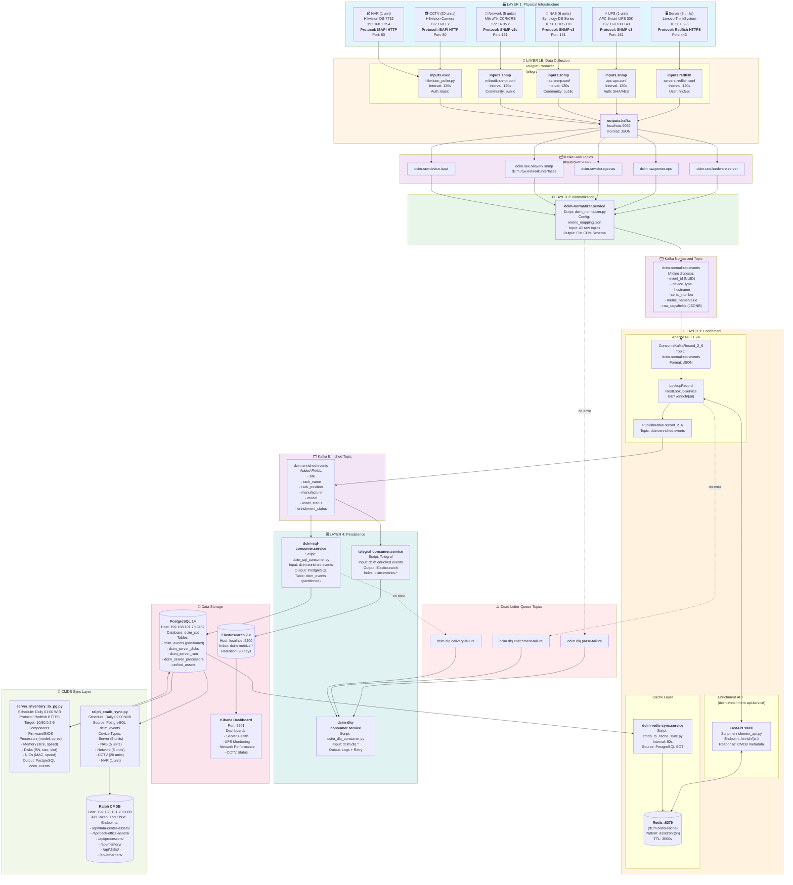

# 36. Complete End-to-End Pipeline Diagram (v3.4)

**Tanggal**: 12 Mei 2026  
**Status**: ✅ Verified & Operational  
**Scope**: Unified DCIM Telemetry & Inventory Pipeline

---

## Diagram Arsitektur Lengkap



---

## Tabel Ringkasan Komponen

### 1. Data Collection Layer

| Component | Type | Protocol | Port | Interval | Config File | Output |
|-----------|------|----------|------|----------|-------------|--------|
| Server Metrics | Telegraf input.redfish | Redfish HTTPS | 443 | 120s | servers-redfish.conf | dcim.raw.hardware.server |
| UPS Metrics | Telegraf input.snmp | SNMP v3 (SHA/AES) | 161 | 120s | ups-apc.conf | dcim.raw.power.ups |
| NAS Metrics | Telegraf input.snmp | SNMP v3 | 161 | 120s | nas-snmp.conf | dcim.raw.storage.nas |
| Network Metrics | Telegraf input.snmp | SNMP v2c | 161 | 120s | mikrotik-snmp.conf | dcim.raw.network.snmp |
| CCTV/NVR Metrics | Telegraf input.exec | ISAPI HTTP | 80 | 120s | hikvision_poller.py | dcim.raw.device.isapi |

### 2. Processing Services

| Service | Script | Input | Output | Function |
|---------|--------|-------|--------|----------|
| dcim-normalizer.service | dcim_normalizer.py | Kafka raw topics | dcim.normalized.events | Schema standardization |
| dcim-nifi (container) | NiFi Flow | dcim.normalized.events | dcim.enriched.events | CMDB enrichment |
| dcim-enrichment-api.service | enrichment_api.py | REST /enrich/{sn} | JSON metadata | Cache lookup |
| dcim-redis-sync.service | cmdb_to_cache_sync.py | PostgreSQL SOT | Redis cache | Cache refresh (60s) |
| telegraf-consumer.service | Telegraf | dcim.enriched.events | Elasticsearch | Time-series storage |
| dcim-sql-consumer.service | dcim_sql_consumer.py | dcim.enriched.events | PostgreSQL dcim_events | Historical storage |
| dcim-dlq-consumer.service | dcim_dlq_consumer.py | dcim.dlq.* | Logs + Retry | Error handling |

### 3. CMDB Sync Layer

| Script | Schedule | Protocol | Source | Target | Device Types |
|--------|----------|----------|--------|--------|--------------|
| server_inventory_to_pg.py | Daily 01:00 | Redfish HTTPS | 10.50.0.2-6 | PostgreSQL dcim_events | Server (5) |
| ralph_cmdb_sync.py | Daily 02:00 | HTTP REST | PostgreSQL | Ralph CMDB | All devices (38 total) |

### 4. Kafka Topics

| Topic | Producer | Consumer | Schema | Retention |
|-------|----------|----------|--------|-----------|
| dcim.raw.hardware.server | Telegraf | Normalizer | Redfish native | 7 days |
| dcim.raw.power.ups | Telegraf | Normalizer | SNMP OID values | 7 days |
| dcim.raw.storage.nas | Telegraf | Normalizer | SNMP OID values | 7 days |
| dcim.raw.network.snmp | Telegraf | Normalizer | SNMP OID values | 7 days |
| dcim.raw.device.isapi | Telegraf | Normalizer | ISAPI JSON | 7 days |
| dcim.normalized.events | Normalizer | NiFi | Flat CDM | 7 days |
| dcim.enriched.events | NiFi | SQL/ES Consumers | CDM + CMDB | 7 days |
| dcim.dlq.parse-failure | Normalizer | DLQ Consumer | Error payload | 30 days |
| dcim.dlq.enrichment-failure | NiFi | DLQ Consumer | Error payload | 30 days |
| dcim.dlq.delivery-failure | SQL Consumer | DLQ Consumer | Error payload | 30 days |

### 5. Storage Backends

| System | Host | Port | Database/Index | Purpose | Retention |
|--------|------|------|----------------|---------|-----------|
| PostgreSQL | 192.168.101.73 | 5432 | dcim_sot | Historical events, CMDB cache | Partitioned (daily) |
| Elasticsearch | localhost | 9200 | dcim-metrics-* | Time-series metrics | 90 days |
| Redis | localhost | 6379 | DB 0 | Enrichment cache | TTL 3600s |
| Ralph CMDB | 192.168.101.73 | 8088 | N/A | Asset inventory | Permanent |
| Kafka | localhost | 9092 | N/A | Message broker | 7-30 days |

---

## Data Flow Summary

### Metrics Pipeline (Real-time)
```
Device → Telegraf → Kafka Raw → Normalizer → Kafka Normalized → 
NiFi Enrichment → Kafka Enriched → Elasticsearch/PostgreSQL → Kibana
```

### Inventory Pipeline (Daily)
```
Server Redfish → server_inventory_to_pg.py → PostgreSQL dcim_events
Device (NAS/Network/CCTV) → Telegraf → Kafka → ... → PostgreSQL dcim_events
PostgreSQL dcim_events → ralph_cmdb_sync.py → Ralph CMDB
```

### Enrichment Flow
```
PostgreSQL SOT → Redis Sync (60s) → Redis Cache → 
Enrichment API ← NiFi Lookup → Enriched Events
```

---

## Protocol & Authentication Summary

| Device Type | Protocol | Port | Auth Method | Credentials |
|-------------|----------|------|-------------|-------------|
| Server BMC | Redfish HTTPS | 443 | Basic Auth | hndept / F!tech@0918 |
| UPS | SNMP v3 | 161 | authPriv (SHA/AES) | poller / F!tech0918 |
| NAS | SNMP v3 | 161 | authPriv (SHA/AES) | poller / F!tech0918 |
| Network | SNMP v2c | 161 | Community String | public |
| CCTV/NVR | ISAPI HTTP | 80 | Basic Auth | admin / qRvbi883=Zk[Q)@5 |
| Ralph API | HTTP REST | 8088 | Token Auth | 1cd05b8d36e258399a52c59f1a4016addb2346a3 |
| PostgreSQL | PostgreSQL | 5432 | Password | sot_admin / Inovasi@0918 |

---

## Performance Metrics

- **Total Devices**: 38 (5 servers, 1 UPS, 6 NAS, 5 network, 21 CCTV/NVR)
- **Polling Interval**: 120 seconds (2 minutes)
- **Events per Day**: ~27,360 (38 devices × 720 polls/day)
- **Kafka Throughput**: ~190 msg/min
- **Enrichment Rate**: >99% (Redis cache hit)
- **End-to-End Latency**: <5 seconds (device → Elasticsearch)
- **CMDB Sync**: Daily 02:00 WIB (automated)

---

**Dokumentasi ini mencerminkan arsitektur aktual yang terverifikasi pada 12 Mei 2026.**

---

## Catatan Perubahan Arsitektur (v3.4 → v3.4.1)

**Tanggal**: 12 Mei 2026  
**Perubahan**: Kembalikan server inventory ke unified pipeline (PostgreSQL sebagai Single Source of Truth)

### Masalah Sebelumnya (v3.4)
- Server inventory menggunakan **dual architecture**: `server_deep_sync.py` langsung ke Ralph CMDB (bypass PostgreSQL)
- Melanggar prinsip **Single Source of Truth** (PostgreSQL)
- Script `server_redfish_to_pg.py` broken (deprecated skill-based architecture)
- Server inventory fields di PostgreSQL tetap NULL

### Solusi (v3.4.1)
- **Script Baru**: `server_inventory_to_pg.py` (standalone, tanpa skill-based dependencies)
- **Unified Pipeline**: Server Redfish → server_inventory_to_pg.py → PostgreSQL → ralph_cmdb_sync.py → Ralph
- **Schedule**: 
  - 01:00 WIB: `server_inventory_to_pg.py` (collect inventory ke PostgreSQL)
  - 02:00 WIB: `ralph_cmdb_sync.py` (sync semua devices dari PostgreSQL ke Ralph)

### Keuntungan
- ✅ PostgreSQL kembali menjadi Single Source of Truth untuk semua devices
- ✅ Konsisten dengan arsitektur NAS/Network/CCTV/UPS
- ✅ `ralph_cmdb_sync.py` sekarang handle **semua 38 devices** (termasuk 5 servers)
- ✅ Audit trail lengkap di PostgreSQL `dcim_events`

### Script yang Deprecated
- ❌ `server_deep_sync.py` (direct sync ke Ralph, tidak digunakan lagi)
- ❌ `server_redfish_to_pg.py` (broken skill-based architecture)
