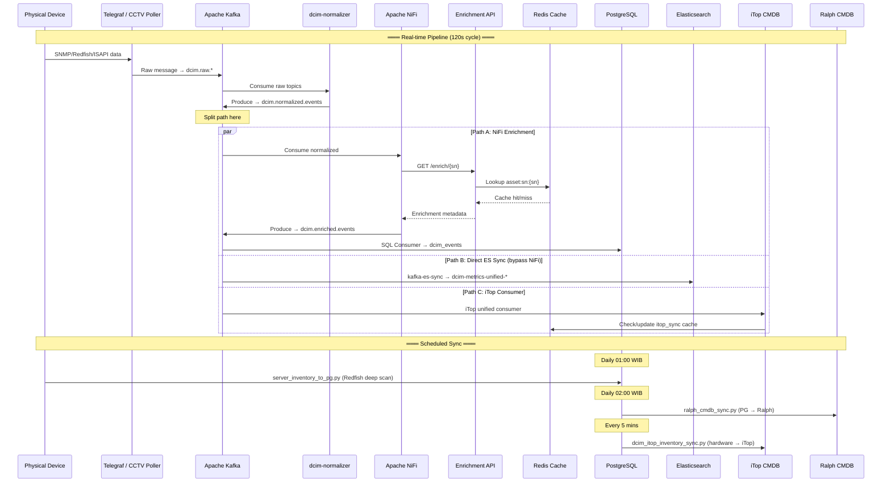
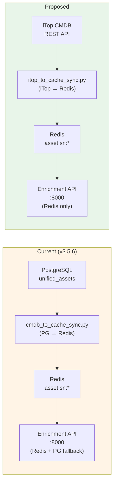
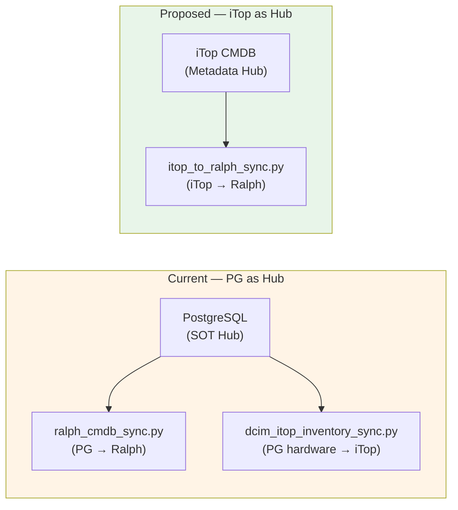
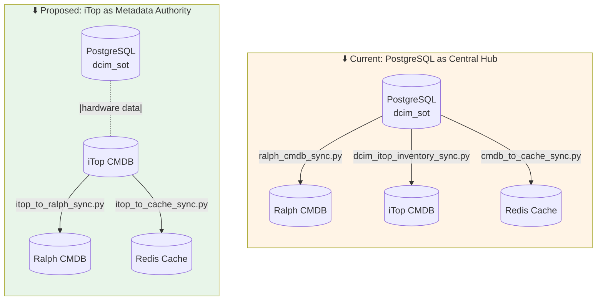
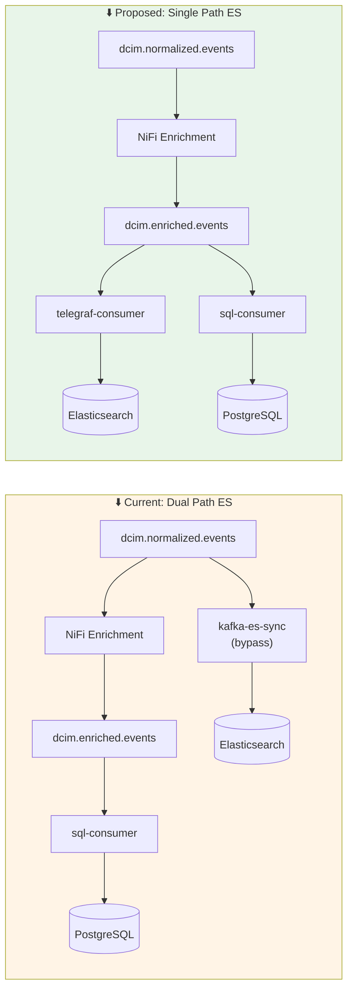

# 37. Architecture Analysis & Comparison — Current Implementation vs. Proposed Design

**Tanggal**: 11 Juni 2026
**Status**: ✅ Final
**Scope**: Analisis mendalam pipeline produksi saat ini (v3.5.6) vs. desain arsitektur yang diusulkan, berdasarkan studi git history, service topology, dan verifikasi live environment.

---

## 0. Ringkasan Eksekutif

Dokumen ini membandingkan **arsitektur aktual yang berjalan di produksi** (berdasarkan audit service, Docker containers, dan git history) dengan **desain arsitektur yang diusulkan**. Perubahan paling signifikan adalah **pergeseran peran iTop** dari sekadar consumer Kafka menjadi **otoritas metadata utama** yang memberi makan Ralph dan Redis cache enrichment.

---

## 1. Versioning & Evolusi Proyek

### 1.1 Timeline Versi (Git History)

| Versi | Tanggal | Perubahan Utama |
|:------|:--------|:----------------|
| **v3.0.0** | 2026-04-29 | Baseline: Unified Kafka Pipeline & BMC Stability Fix |
| **v3.2.0** | 2026-05-04 | Server Deep Sync V7 — Pagination, Pruning, Ethernet Speed |
| **v3.3.0** | 2026-05-04 | Unified CMDB sync — Redfish→Postgres→Ralph, UPS included |
| **v3.4.0** | 2026-05-04 | NAS & Network Switch auto-update ke CMDB |
| **v3.4.1** | 2026-05-12 | Reorganize project structure (modular `src/`) |
| **v3.5.0** | 2026-05-07 | Rollback ke v3.4 logic dalam struktur modular |
| **v3.5.5** | 2026-05-21 | Commissioning CCTV 31 unit, stale alert docs |
| **v3.5.6** | 2026-05-26 | Fix CCTV telemetry drops, Ralph reconciliation |
| **HEAD** | 2026-06-11 | iTop CMDB architecture alignment, MariaDB schema docs |

### 1.2 Struktur Proyek Saat Ini

```
dcim_metrics_project/
├── configs/                    # Konfigurasi infrastruktur
│   ├── .env                    # Environment variables (Kafka, DB, API)
│   ├── metric_mapping.json     # Normalizer metric definitions
│   ├── docker/                 # Docker Compose files
│   ├── systemd/                # Systemd unit files
│   └── telegraf/               # Telegraf producer/consumer configs
├── scripts/                    # Production scripts (90+ files)
│   ├── dcim_itop_unified_consumer.py   # Main Kafka→iTop consumer (v8)
│   ├── dcim_normalizer.py              # Raw→Normalized event router
│   ├── netbox_to_itop_connector.py     # Netbox→iTop interface sync
│   ├── hikvision_poller_daemon.py      # CCTV/NVR ISAPI polling daemon
│   ├── ralph_cmdb_sync.py              # PostgreSQL→Ralph sync
│   ├── server_inventory_to_pg.py       # Redfish→PostgreSQL deep scan
│   ├── dcim_sql_consumer.py            # Kafka enriched→PostgreSQL
│   ├── dcim_threshold_alerter.py       # Threshold alerting engine
│   ├── dcim_dlq_consumer.py            # Dead Letter Queue handler
│   └── ...                               # 80+ utility/migration scripts
├── src/                        # Modular source code (v4.0 structure)
│   ├── services/
│   │   ├── apis/               # FastAPI enrichment service
│   │   ├── consumers/          # Kafka consumer logic
│   │   └── schedulers/         # Cron-based sync jobs
│   ├── skills/                 # AI agent skills
│   ├── schemas/                # Data schema definitions
│   └── tools/                  # Utility libraries
├── docs/                       # Documentation
│   ├── architecture/           # Architecture diagrams & analysis
│   ├── development/            # Development guides & baselines
│   └── operations/             # Operational runbooks
├── itop/                       # iTop deployment (docker-compose, sync scripts)
├── kafka/                      # Kafka configuration
└── ai_agent/                   # AI agent configuration
```

---

## 2. Implementasi Saat Ini — Diagram & Analisis

### 2.1 Service Topology yang Berjalan (Live Audit 2026-06-11)

#### Systemd Services — Status Aktif

| Service | Status | Fungsi | Script |
|:--------|:-------|:-------|:-------|
| `telegraf.service` | ✅ running | SNMP/Redfish polling → Kafka | `/etc/telegraf/` |
| `dcim-normalizer.service` | ✅ running | Raw→Normalized event router | `dcim_normalizer.py` |
| `dcim-cctv-poller.service` | ✅ running | CCTV/NVR ISAPI polling daemon | `hikvision_poller_daemon.py` |
| `dcim-itop-unified.service` | ✅ running | Kafka→iTop CMDB consumer (v8) | `dcim_itop_unified_consumer.py` |
| `dcim-kafka-es-sync.service` | ✅ running | Kafka→Elasticsearch sync | `kafka_to_es_sync.py` |
| `dcim-threshold-alerter.service` | ✅ running | Threshold alerting engine | `dcim_threshold_alerter.py` |
| `dcim-enrichment-api.service` | ⚠️ inactive | FastAPI enrichment API | `enrichment/executor.py` |
| `dcim-sql-consumer.service` | ⚠️ inactive | Kafka enriched→PostgreSQL | `dcim_sql_consumer.py` |
| `dcim-redis-sync.service` | ⚠️ inactive | PostgreSQL→Redis cache sync | `redis_sync/executor.py` |
| `dcim-dlq-consumer.service` | ⚠️ inactive | Dead Letter Queue handler | `dcim_dlq_consumer.py` |

#### Docker Containers — Status Aktif

| Container | Status | Port | Fungsi |
|:----------|:-------|:-----|:-------|
| `kafka-broker` | ✅ Up 25h | :9092 | Apache Kafka message broker |
| `dcim-redis-cache` | ✅ Up 39h | :6379 | Redis cache (enrichment + iTop) |
| `dcim_sot_postgres` | ✅ Up 39h | :5432 | PostgreSQL SOT (dcim_sot) |
| `dcim-nifi` | ✅ Up 39h | (internal) | Apache NiFi enrichment orchestrator |
| `itop-web` | ✅ Up 2h | :8080 | iTop CMDB web interface |
| `itop-db` | ✅ Up 2h | :3306 | iTop MariaDB database |
| `itop-cloudbeaver` | ✅ Up 2h | :8978 | MariaDB admin UI |
| `ralph_web` | ✅ Up 39h | :7712 | Ralph asset management |
| `ralph_nginx` | ✅ Up 39h | :8082 | Ralph reverse proxy |
| `dcim_pgadmin` | ✅ Up 39h | :5051 | PostgreSQL admin UI |

### 2.2 Diagram Implementasi Aktual (v3.5.6 — Verified)

```mermaid
flowchart LR
    %% ===== LAYER 1: PHYSICAL INFRASTRUCTURE =====
    subgraph L1["🏭 1. Physical Infrastructure"]
        direction TB
        SRV["🖥️ Server<br/>5 Lenovo ThinkSystem<br/>10.50.0.2-6<br/>Redfish HTTPS :443"]
        UPS["⚡ UPS<br/>1 APC Smart-UPS 30K<br/>192.168.100.140<br/>SNMP v3 :161"]
        NAS["💾 NAS<br/>6 Synology DS Series<br/>10.50.0.105-110<br/>SNMP v3 :161"]
        NET["🔀 Network<br/>5 MikroTik CCR/CRS<br/>172.16.35.x<br/>SNMP v2c :161"]
        CAM["📷 CCTV<br/>31 Hikvision cameras<br/>192.168.1.2-33 skip .32<br/>ISAPI HTTP :80"]
        NVR["📹 NVR<br/>1 Hikvision DS-7732<br/>192.168.1.254<br/>ISAPI HTTP :80"]
    end

    %% ===== LAYER 2: COLLECTION =====
    subgraph L2["📡 2. Collection - Telegraf"]
        direction TB
        C_SRV["inputs.redfish<br/>servers-redfish.conf<br/>120s"]
        C_UPS["inputs.snmp<br/>ups-apc.conf<br/>120s"]
        C_NAS["inputs.snmp<br/>nas-snmp.conf<br/>120s"]
        C_NET["inputs.snmp<br/>mikrotik-snmp.conf<br/>120s"]
        C_ISAPI["inputs.exec<br/>hikvision_poller.py<br/>120s"]
        KOUT["outputs.kafka<br/>localhost:9092<br/>JSON"]
    end

    %% ===== LAYER 3: KAFKA RAW TOPICS =====
    subgraph L3["🗂️ 3. Kafka Raw Topics"]
        direction TB
        KR_SRV["dcim.raw.hardware.server"]
        KR_UPS["dcim.raw.power.ups"]
        KR_NAS["dcim.raw.storage.nas"]
        KR_NET["dcim.raw.network.snmp<br/>dcim.raw.network.interfaces"]
        KR_ISAPI["dcim.raw.device.isapi"]
    end

    %% ===== LAYER 4: NORMALIZE =====
    subgraph L4["⚙️ 4. Normalize"]
        direction TB
        NORM["dcim-normalizer.service<br/>dcim_normalizer.py<br/>metric_mapping.json"]
        KN["dcim.normalized.events<br/>Flat CDM schema"]
    end

    %% ===== LAYER 5: ENRICHMENT (SPLIT PATH) =====
    subgraph L5["🔶 5. Enrich — Split Path"]
        direction TB
        NF1["NiFi ConsumeKafkaRecord<br/>dcim.normalized.events"]
        NF2["NiFi LookupRecord<br/>GET /enrich/{sn}"]
        NF3["NiFi PublishKafkaRecord<br/>dcim.enriched.events"]
        API["dcim-enrichment-api.service<br/>FastAPI :8000"]
        REDIS[("Redis cache :6379<br/>asset:sn:{sn}<br/>TTL 3600s")]
        RSYNC["dcim-redis-sync.service<br/>cmdb_to_cache_sync.py<br/>60s"]
        KE["dcim.enriched.events<br/>CDM + CMDB metadata"]
        BYPASS["dcim-kafka-es-sync.service<br/>Direct HTTP enrichment<br/>bypass NiFi"]
    end

    %% ===== LAYER 6: PERSIST =====
    subgraph L6["🗄️ 6. Persist"]
        direction TB
        SQL_CONS["dcim-sql-consumer.service<br/>dcim_sql_consumer.py<br/>Kafka enriched → PostgreSQL"]
        ITOP_CONS["dcim-itop-unified.service<br/>dcim_itop_unified_consumer.py<br/>Kafka normalized → iTop CI"]
    end

    %% ===== LAYER 7: STORAGE & DASHBOARD =====
    subgraph L7["💾 7. Storage & Dashboard"]
        direction TB
        PG[("PostgreSQL 14<br/>localhost:5432 (Docker)<br/>dcim_sot<br/>dcim_events + unified_assets<br/>server component tables")]
        ES[("Elasticsearch 7.x<br/>10.70.0.56:9200<br/>dcim-metrics-unified-*<br/>dcim-alerts")]
        KIBANA["Kibana Dashboard<br/>10.70.0.56:5601<br/>DCIM + alerts"]
    end

    %% ===== LAYER 8: CMDB AUTOMATION =====
    subgraph L8["📘 CMDB Automation"]
        direction TB
        INV["server_inventory_to_pg.py<br/>Daily 01:00 WIB<br/>Redfish inventory → PostgreSQL"]
        RALPH_SYNC["ralph_cmdb_sync.py<br/>Daily 02:00 WIB<br/>PostgreSQL → Ralph"]
        RALPH[("Ralph Asset Repository<br/>localhost:8082 (Docker)<br/>data-center-assets")]
        ITOP_SYNC["dcim_itop_inventory_sync.py<br/>Every 5 mins<br/>PostgreSQL hardware → iTop"]
        ITOP[("iTop CMDB<br/>localhost:8080 (Docker)<br/>Real-time CI State<br/>Logical Relationships")]
    end

    %% ===== LAYER 9: ALERTING =====
    subgraph L9["🚨 Alerting"]
        direction TB
        ALERT["dcim-threshold-alerter.service<br/>120s<br/>6 thresholds + stale devices<br/>stale threshold 30m"]
        ALERT_IDX[("dcim-alerts<br/>Threshold alerts<br/>Device Not Reporting alerts")]
    end

    %% ===== LAYER 10: DLQ =====
    subgraph L10["⚠️ DLQ"]
        direction TB
        DLQ1["dcim.dlq.parse-failure"]
        DLQ2["dcim.dlq.enrichment-failure"]
        DLQ3["dcim.dlq.delivery-failure"]
        DLQ_CONS["dcim-dlq-consumer.service<br/>logs + retry"]
    end

    %% ===== LAYER 11: AI READINESS =====
    subgraph L11["🤖 AI / Agent Readiness"]
        direction TB
        QUERY_DOC["docs/development/34-database-query-baseline-for-agents.md<br/>baseline SQL patterns"]
        QUERY_SKILL[".github/skills/dcim-database-query-baseline/SKILL.md<br/>agent on-demand skill"]
    end

    %% ===== MAIN TELEMETRY FLOW =====
    SRV --> C_SRV --> KOUT --> KR_SRV
    UPS --> C_UPS --> KOUT --> KR_UPS
    NAS --> C_NAS --> KOUT --> KR_NAS
    NET --> C_NET --> KOUT --> KR_NET
    CAM --> C_ISAPI --> KOUT --> KR_ISAPI
    NVR --> C_ISAPI

    KR_SRV --> NORM
    KR_UPS --> NORM
    KR_NAS --> NORM
    KR_NET --> NORM
    KR_ISAPI --> NORM
    NORM --> KN

    %% ===== SPLIT PATH: NIFI vs BYPASS =====
    KN --> NF1 --> NF2 --> NF3 --> KE
    KN --> BYPASS --> ES
    NF2 <--> API
    API <--> REDIS
    RSYNC --> REDIS
    PG -. CMDB cache source .-> RSYNC

    %% ===== PERSISTENCE =====
    KE --> SQL_CONS --> PG
    KN --> ITOP_CONS --> ITOP

    %% ===== CMDB AUTOMATION =====
    SRV -. Daily 01:00 .-> INV
    INV -. writes inventory .-> PG
    PG -. Daily 02:00 source .-> RALPH_SYNC
    RALPH_SYNC -. sync/register .-> RALPH
    PG -. Every 5 mins .-> ITOP_SYNC
    ITOP_SYNC -. sync hardware .-> ITOP

    %% ===== ALERTING =====
    ES --> ALERT --> ALERT_IDX --> KIBANA

    %% ===== DLQ =====
    NORM -. parse error .-> DLQ1
    SQL_CONS -. delivery error .-> DLQ3
    ITOP_CONS -. delivery error .-> DLQ3
    DLQ1 --> DLQ_CONS
    DLQ3 --> DLQ_CONS

    %% ===== AI READINESS =====
    QUERY_SKILL -. loads .-> QUERY_DOC
    QUERY_DOC -. query reference .-> PG

    style L1 fill:#e1f5ff
    style L2 fill:#fff4e6
    style L3 fill:#f3e5f5
    style L4 fill:#e8f5e9
    style L5 fill:#fff3e0
    style L6 fill:#e0f2f1
    style L7 fill:#fce4ec
    style L8 fill:#f1f8e9
    style L9 fill:#fff9c4
    style L10 fill:#ffebee
    style L11 fill:#e8eaf6

    classDef mainFlow stroke:#1565c0,stroke-width:2px
    classDef exceptionFlow stroke:#c62828,stroke-width:1.5px,stroke-dasharray: 5 5
    classDef opsFlow stroke:#6a1b9a,stroke-width:1.5px,stroke-dasharray: 4 4

    class SRV,UPS,NAS,NET,CAM,NVR,C_SRV,C_UPS,C_NAS,C_NET,C_ISAPI,KOUT,KR_SRV,KR_UPS,KR_NAS,KR_NET,KR_ISAPI,NORM,KN,NF1,NF2,NF3,KE,BYPASS,SQL_CONS,PG,ES,KIBANA,ITOP_CONS,ITOP mainFlow
    class DLQ1,DLQ2,DLQ3,DLQ_CONS exceptionFlow
    class INV,RALPH_SYNC,RALPH,ALERT,ALERT_IDX,QUERY_DOC,QUERY_SKILL opsFlow
```



### 2.3 Detail Alur Data Aktual (Verified)



## 4. Perbandingan Arsitektur: Saat Ini vs. Usulan

### Diagram Implementasi Saat Ini (v3.5.5)

```mermaid
flowchart LR
    %% Clean left-to-right layout to reduce crossing lines.

    subgraph L1["🏭 1. Physical Infrastructure"]
        direction TB
        SRV["🖥️ Server<br/>5 Lenovo ThinkSystem<br/>10.50.0.2-6<br/>Redfish HTTPS :443"]
        UPS["⚡ UPS<br/>1 APC Smart-UPS 30K<br/>192.168.100.140<br/>SNMP v3 :161"]
        NAS["💾 NAS<br/>6 Synology DS Series<br/>10.50.0.105-110<br/>SNMP v3 :161"]
        NET["🔀 Network<br/>5 MikroTik CCR/CRS<br/>172.16.35.x<br/>SNMP v2c :161"]
        CAM["📷 CCTV<br/>31 Hikvision camera channels<br/>192.168.1.2-33 skip .32<br/>ISAPI HTTP :80"]
        NVR["📹 NVR<br/>1 Hikvision DS-7732<br/>192.168.1.254<br/>ISAPI HTTP :80"]
    end

    subgraph L2["📡 2. Collection - Telegraf"]
        direction TB
        C_SRV["inputs.redfish<br/>servers-redfish.conf<br/>120s"]
        C_UPS["inputs.snmp<br/>ups-apc.conf<br/>120s"]
        C_NAS["inputs.snmp<br/>nas-snmp.conf<br/>120s"]
        C_NET["inputs.snmp<br/>mikrotik-snmp.conf<br/>120s"]
        C_ISAPI["inputs.exec<br/>hikvision_poller.py<br/>120s"]
        KOUT["outputs.kafka<br/>localhost:9092<br/>JSON"]
    end

    subgraph L3["🗂️ 3. Kafka Raw Topics"]
        direction TB
        KR_SRV["dcim.raw.hardware.server"]
        KR_UPS["dcim.raw.power.ups"]
        KR_NAS["dcim.raw.storage.nas"]
        KR_NET["dcim.raw.network.snmp<br/>dcim.raw.network.interfaces"]
        KR_ISAPI["dcim.raw.device.isapi"]
    end

    subgraph L4["⚙️ 4. Normalize"]
        direction TB
        NORM["dcim-normalizer.service<br/>dcim_normalizer.py<br/>metric_mapping.json"]
        KN["dcim.normalized.events<br/>Flat CDM schema"]
    end

    subgraph L5["🔶 5. Enrich"]
        direction TB
        NF1["NiFi ConsumeKafkaRecord<br/>dcim.normalized.events"]
        NF2["NiFi LookupRecord<br/>GET /enrich/{sn}"]
        NF3["NiFi PublishKafkaRecord<br/>dcim.enriched.events"]
        API["dcim-enrichment-api.service<br/>FastAPI :8000"]
        REDIS[("Redis cache :6379<br/>asset:sn:{sn}<br/>TTL 3600s")]
        RSYNC["dcim-redis-sync.service<br/>cmdb_to_cache_sync.py<br/>60s"]
        KE["dcim.enriched.events<br/>CDM + CMDB metadata"]
    end

    subgraph L6["🗄️ 6. Persist"]
        direction TB
        ES_CONS["telegraf-consumer.service<br/>Kafka enriched → Elasticsearch"]
        SQL_CONS["dcim-sql-consumer.service<br/>dcim_sql_consumer.py<br/>Kafka enriched → PostgreSQL"]
        ITOP_CONS["dcim-itop-consumer.service<br/>dcim_itop_consumer.py<br/>Kafka enriched → iTop CI"]
    end

    subgraph L7["💾 7. Storage & Dashboard"]
        direction TB
        PG[("PostgreSQL 14<br/>localhost:5432 (Docker)<br/>dcim_sot<br/>dcim_events + unified_assets<br/>server component tables")]
        ES[("Elasticsearch 7.x<br/>10.70.0.56:9200<br/>dcim-metrics-unified-*<br/>dcim-alerts")]
        KIBANA["Kibana Dashboard<br/>10.70.0.56:5601<br/>DCIM + alerts"]
    end

    subgraph L8["📘 CMDB Automation"]
        direction TB
        INV["server_inventory_to_pg.py<br/>Daily 01:00 WIB<br/>Redfish inventory → PostgreSQL"]
        RALPH_SYNC["ralph_cmdb_sync.py<br/>Daily 02:00 WIB<br/>auto-register DC assets"]
        RALPH[("Ralph Asset Repository<br/>localhost:8082 (Docker)")]
        ITOP_SYNC["dcim_itop_inventory_sync.py<br/>Every 5 mins<br/>PostgreSQL hardware → iTop"]
        ITOP[("iTop CMDB<br/>localhost:8080")]
    end

    subgraph L9["🚨 Alerting"]
        direction TB
        ALERT["dcim-threshold-alerter.service<br/>120s<br/>6 thresholds + stale devices<br/>stale threshold 30m"]
        ALERT_IDX[("dcim-alerts<br/>Threshold alerts<br/>Device Not Reporting alerts")]
    end

    subgraph L10["⚠️ DLQ"]
        direction TB
        DLQ1["dcim.dlq.parse-failure"]
        DLQ2["dcim.dlq.enrichment-failure"]
        DLQ3["dcim.dlq.delivery-failure"]
        DLQ_CONS["dcim-dlq-consumer.service<br/>logs + retry"]
    end

    subgraph L11["🤖 AI / Agent Readiness"]
        direction TB
        QUERY_DOC["docs/development/34-database-query-baseline-for-agents.md<br/>baseline SQL patterns"]
        QUERY_SKILL[".github/skills/dcim-database-query-baseline/SKILL.md<br/>agent on-demand skill"]
    end

    %% Main telemetry flow: mostly straight left-to-right.
    SRV --> C_SRV --> KOUT --> KR_SRV
    UPS --> C_UPS --> KOUT --> KR_UPS
    NAS --> C_NAS --> KOUT --> KR_NAS
    NET --> C_NET --> KOUT --> KR_NET
    CAM --> C_ISAPI --> KOUT --> KR_ISAPI
    NVR --> C_ISAPI

    KR_SRV --> NORM
    KR_UPS --> NORM
    KR_NAS --> NORM
    KR_NET --> NORM
    KR_ISAPI --> NORM
    NORM --> KN --> NF1 --> NF2 --> NF3 --> KE

    %% Enrichment side loop kept inside enrichment layer.
    NF2 <--> API
    API <--> REDIS
    RSYNC --> REDIS
    PG -. CMDB cache source .-> RSYNC

    %% Persistence and dashboard.
    KE --> ES_CONS --> ES --> KIBANA
    KE --> SQL_CONS --> PG
    KE --> ITOP_CONS --> ITOP

    %% CMDB automation kept below storage, using dotted operational links.
    SRV -. Daily 01:00 .-> INV
    INV -. writes inventory .-> PG
    PG -. Daily 02:00 source .-> RALPH_SYNC
    RALPH_SYNC -. sync/register .-> RALPH
    PG -. Every 5 mins .-> ITOP_SYNC
    ITOP_SYNC -. sync hardware .-> ITOP

    %% Alerting kept on Elasticsearch side.
    ES --> ALERT --> ALERT_IDX --> KIBANA

    %% DLQ paths kept as dashed exception links.
    NORM -. parse error .-> DLQ1
    NF2 -. enrichment error .-> DLQ2
    SQL_CONS -. delivery error .-> DLQ3
    DLQ1 --> DLQ_CONS
    DLQ2 --> DLQ_CONS
    DLQ3 --> DLQ_CONS

    %% Agent knowledge uses docs and database, not runtime pipeline.
    QUERY_SKILL -. loads .-> QUERY_DOC
    QUERY_DOC -. query reference .-> PG

    style L1 fill:#e1f5ff
    style L2 fill:#fff4e6
    style L3 fill:#f3e5f5
    style L4 fill:#e8f5e9
    style L5 fill:#fff3e0
    style L6 fill:#e0f2f1
    style L7 fill:#fce4ec
    style L8 fill:#f1f8e9
    style L9 fill:#fff9c4
    style L10 fill:#ffebee
    style L11 fill:#e8eaf6

    classDef mainFlow stroke:#1565c0,stroke-width:2px
    classDef exceptionFlow stroke:#c62828,stroke-width:1.5px,stroke-dasharray: 5 5
    classDef opsFlow stroke:#6a1b9a,stroke-width:1.5px,stroke-dasharray: 4 4

    class SRV,UPS,NAS,NET,CAM,NVR,C_SRV,C_UPS,C_NAS,C_NET,C_ISAPI,KOUT,KR_SRV,KR_UPS,KR_NAS,KR_NET,KR_ISAPI,NORM,KN,NF1,NF2,NF3,KE,ES_CONS,SQL_CONS,PG,ES,KIBANA mainFlow
    class DLQ1,DLQ2,DLQ3,DLQ_CONS exceptionFlow
    class INV,RALPH_SYNC,RALPH,ALERT,ALERT_IDX,QUERY_DOC,QUERY_SKILL opsFlow
```


## 3. Diagram Desain Usulan

### 3.1 Diagram Usulan (Target Architecture)

```mermaid
flowchart LR
    %% Clean left-to-right layout to reduce crossing lines.

    subgraph L1["🏭 1. Physical Infrastructure"]
        direction TB
        SRV["🖥️ Server5 Lenovo ThinkSystem10.50.0.2-6Redfish HTTPS :443"]
        UPS["⚡ UPS1 APC Smart-UPS 30K192.168.100.140SNMP v3 :161"]
        NAS["💾 NAS6 Synology DS Series10.50.0.105-110SNMP v3 :161"]
        NET["🔀 Network5 MikroTik CCR/CRS172.16.35.xSNMP v2c :161"]
        CAM["📷 CCTV31 Hikvision camera channels192.168.1.2-33 skip .32ISAPI HTTP :80"]
        NVR["📹 NVR1 Hikvision DS-7732192.168.1.254ISAPI HTTP :80"]
    end

    subgraph L2["📡 2. Collection - Telegraf"]
        direction TB
        C_SRV["inputs.redfishservers-redfish.conf120s"]
        C_UPS["inputs.snmpups-apc.conf120s"]
        C_NAS["inputs.snmpnas-snmp.conf120s"]
        C_NET["inputs.snmpmikrotik-snmp.conf120s"]
        C_ISAPI["inputs.exechikvision_poller.py120s"]
        KOUT["outputs.kafkalocalhost:9092JSON"]
    end

    subgraph L3["🗂️ 3. Kafka Raw Topics"]
        direction TB
        KR_SRV["dcim.raw.hardware.server"]
        KR_UPS["dcim.raw.power.ups"]
        KR_NAS["dcim.raw.storage.nas"]
        KR_NET["dcim.raw.network.snmpdcim.raw.network.interfaces"]
        KR_ISAPI["dcim.raw.device.isapi"]
    end

    subgraph L4["⚙️ 4. Normalize"]
        direction TB
        NORM["dcim-normalizer.servicedcim_normalizer.pymetric_mapping.json"]
        KN["dcim.normalized.eventsFlat CDM schema"]
    end

    subgraph L11["🤖 AI / Agent Readiness"]
        direction TB
        QUERY_DOC["docs/development/34-database-query-baseline-for-agents.mdbaseline SQL patterns"]
        ITOP_API_DOC["docs/development/itop-api-baseline-for-agents.mdiTop OQL & REST API references"]
        QUERY_SKILL[".github/skills/dcim-database-query-baseline/SKILL.mdagent on-demand skill"]
    end

    subgraph L7["💾 7. Storage & Dashboard"]
        direction TB
        PG[("PostgreSQL 14localhost:5432 (Docker)dcim_sotdcim_events + unified_assetsserver component tables")]
        ES[("Elasticsearch 7.x10.70.0.56:9200dcim-metrics-unified-*dcim-alerts")]
        KIBANA["Kibana Dashboard10.70.0.56:5601DCIM + alerts"]
    end

    subgraph L9["🚨 Alerting"]
        direction TB
        ALERT["dcim-threshold-alerter.service120s6 thresholds + stale devicesstale threshold 30m"]
        ALERT_IDX[("dcim-alertsThreshold alertsDevice Not Reporting alerts")]
    end

    subgraph L6["🗄️ 6. Persist"]
        direction TB
        ES_CONS["telegraf-consumer.serviceKafka enriched → Elasticsearch"]
        SQL_CONS["dcim-sql-consumer.servicedcim_sql_consumer.pyKafka enriched → PostgreSQL"]
        ITOP_CONS["dcim-itop-consumer.serviceKafka normalized → iTop API"]
    end

    subgraph L8["📘 CMDB Automation"]
        direction TB
        INV["server_inventory_to_pg.pyDaily 01:00 WIBRedfish inventory → PostgreSQL"]
        ITOP[("iTop CMDBlocalhost:8080 (Docker)Real-time CI StateLogical Relationships")]
        RALPH_SYNC["itop_to_ralph_sync.pyDaily 02:00 WIBsync ITAM assets"]
        RALPH[("Ralph Asset Repositorylocalhost:8082 (Docker)data-center-assetsFinancials")]
    end

    subgraph L10["⚠️ DLQ"]
        direction TB
        DLQ1["dcim.dlq.parse-failure"]
        DLQ2["dcim.dlq.enrichment-failure"]
        DLQ3["dcim.dlq.delivery-failure"]
        DLQ_CONS["dcim-dlq-consumer.servicelogs + retry"]
    end

    subgraph L5["🔶 5. Enrich"]
        direction TB
        NF1["NiFi ConsumeKafkaRecorddcim.normalized.events"]
        NF2["NiFi LookupRecordGET /enrich/{sn}"]
        API["dcim-enrichment-api.serviceFastAPI :8000"]
        NF3["NiFi PublishKafkaRecorddcim.enriched.events"]
        REDIS[("Redis cache :6379asset:sn:{sn}TTL 3600s")]
        RSYNC["dcim-redis-sync.serviceitop_to_cache_sync.py60s"]
        KE["dcim.enriched.eventsCDM + CMDB metadata"]
    end

    %% --- 1. Main Telemetry (Left Side) ---
    SRV --> C_SRV --> KOUT --> KR_SRV
    UPS --> C_UPS --> KOUT --> KR_UPS
    NAS --> C_NAS --> KOUT --> KR_NAS
    NET --> C_NET --> KOUT --> KR_NET
    CAM --> C_ISAPI --> KOUT --> KR_ISAPI
    NVR --> C_ISAPI

    KR_SRV --> NORM
    KR_UPS --> NORM
    KR_NAS --> NORM
    KR_NET --> NORM
    KR_ISAPI --> NORM

    %% --- 2. AI Readiness (Top-most) ---
    QUERY_SKILL -. loads .-> QUERY_DOC
    QUERY_SKILL -. loads .-> ITOP_API_DOC
    QUERY_DOC -. query reference .-> PG
    ITOP_API_DOC -. api/oql reference .-> ITOP

    %% --- 3. Storage & Alerting ---
    KE --> ES_CONS --> ES --> KIBANA
    KE --> SQL_CONS --> PG
    ES --> ALERT --> ALERT_IDX --> KIBANA

    %% --- 4. CMDB Automation ---
    KN --> ITOP_CONS --> ITOP
    SRV -. Daily 01:00 .-> INV
    INV -. writes inventory .-> PG

    ITOP -. CI state & metadata .-> RALPH_SYNC
    PG -. deep hardware components .-> RALPH_SYNC
    RALPH_SYNC -. sync/register .-> RALPH

    %% --- 5. DLQ ---
    NORM -. parse error .-> DLQ1
    SQL_CONS -. delivery error .-> DLQ3
    ITOP_CONS -. delivery error .-> DLQ3
    DLQ1 --> DLQ_CONS
    DLQ3 --> DLQ_CONS

    %% --- 6. Enrich (Bottom-most) ---
    NORM --> KN
    KN --> NF1 --> NF2

    NF2 <--> API
    API <--> REDIS
    RSYNC --> REDIS
    ITOP -. CMDB cache source .-> RSYNC

    NF2 --> NF3 --> KE

    NF2 -. enrichment error .-> DLQ2
    DLQ2 --> DLQ_CONS

    style L1 fill:#e1f5ff
    style L2 fill:#fff4e6
    style L3 fill:#f3e5f5
    style L4 fill:#e8f5e9
    style L5 fill:#fff3e0
    style L6 fill:#e0f2f1
    style L7 fill:#fce4ec
    style L8 fill:#f1f8e9
    style L9 fill:#fff9c4
    style L10 fill:#ffebee
    style L11 fill:#e8eaf6

    classDef mainFlow stroke:#1565c0,stroke-width:2px
    classDef exceptionFlow stroke:#c62828,stroke-width:1.5px,stroke-dasharray: 5 5
    classDef opsFlow stroke:#6a1b9a,stroke-width:1.5px,stroke-dasharray: 4 4

    class SRV,UPS,NAS,NET,CAM,NVR,C_SRV,C_UPS,C_NAS,C_NET,C_ISAPI,KOUT,KR_SRV,KR_UPS,KR_NAS,KR_NET,KR_ISAPI,NORM,KN,NF1,NF2,NF3,KE,ES_CONS,SQL_CONS,PG,ES,KIBANA,ITOP_CONS,ITOP mainFlow
    class DLQ1,DLQ2,DLQ3,DLQ_CONS exceptionFlow
    class INV,RALPH_SYNC,RALPH,ALERT,ALERT_IDX,QUERY_DOC,ITOP_API_DOC,QUERY_SKILL opsFlow
```



| Fitur | Implementasi Saat Ini (v3.5.6) | Desain Usulan | Dampak Perubahan |
|:------|:-------------------------------|:--------------|:-----------------|
| **Ralph Sync Source** | **PostgreSQL → Ralph** (`ralph_cmdb_sync.py`) | **iTop → Ralph** (`itop_to_ralph_sync.py`) | 🔴 **Signifikan**: Menggeser sumber kebenaran Ralph dari DB ke iTop |
| **iTop Input** | **Kafka normalized → iTop** (`dcim-itop-unified.service`) | **Kafka normalized → iTop** (sama) | 🟢 Konsisten — iTop sebagai "Real-time CI State" |
| **Enrichment Cache Source** | **PostgreSQL → Redis** (`cmdb_to_cache_sync.py`) | **iTop → Redis** (`itop_to_cache_sync.py`) | 🔴 **Signifikan**: iTop menjadi sumber cache enrichment |
| **iTop Consumer Input** | **Kafka enriched** (via NiFi enrichment) | **Kafka normalized** (langsung) | 🟡 Perubahan input topic — lebih cepat, tanpa NiFi |
| **Inventory Sync** | **Redfish → PG → Ralph** | **Redfish → PG → Ralph** (sama) | 🟢 Konsisten |
| **AI Readiness** | SQL baseline docs + query skill | + `itop-api-baseline-for-agents.md` | 🟡 Menambah referensi OQL & REST API untuk agen AI |
| **Netbox Connector** | ✅ Aktif (`netbox_to_itop_connector.py`) | ❌ Tidak ditampilkan | 🟡 Perlu keputusan: keep atau deprecate |
| **Elasticsearch Sync** | **Dual path**: NiFi→ES + Direct bypass | **Single path**: hanya via enriched consumer | 🟡 Menyederhanakan ES ingestion |
| **DLQ Enrichment** | ✅ `dcim.dlq.enrichment-failure` aktif | ✅ Sama | 🟢 Konsisten |
| **Ralph Sync Script** | `ralph_cmdb_sync.py` (PG→Ralph) | `itop_to_ralph_sync.py` (iTop→Ralph) | 🔴 Script baru perlu dibuat |
| **Redis Sync Script** | `cmdb_to_cache_sync.py` (PG→Redis) | `itop_to_cache_sync.py` (iTop→Redis) | 🔴 Script baru perlu dibuat |

---

## 4. Analisis Per-Layer: Gap & Differences

### 4.1 Layer 1 — Physical Infrastructure

| Aspek | Current | Proposed | Gap |
|:------|:--------|:---------|:----|
| Server | 5 Lenovo ThinkSystem (10.50.0.2-6) | ✅ Sama | None |
| UPS | 1 APC Smart-UPS 30K (192.168.100.140) | ✅ Sama | None |
| NAS | 6 Synology DS Series (10.50.0.105-110) | ✅ Sama | None |
| Network | 5 MikroTik CCR/CRS (172.16.35.x) | ✅ Sama | None |
| CCTV | 31 Hikvision cameras (192.168.1.2-33) | ✅ Sama | None |
| NVR | 1 Hikvision DS-7732 (192.168.1.254) | ✅ Sama | None |

> **Verdict**: 🟢 Tidak ada perubahan pada layer fisik.

### 4.2 Layer 2 — Collection (Telegraf)

| Aspek | Current | Proposed | Gap |
|:------|:--------|:---------|:----|
| Server polling | `inputs.redfish` (120s) | ✅ Sama | None |
| UPS polling | `inputs.snmp` (120s) | ✅ Sama | None |
| NAS polling | `inputs.snmp` (120s) | ✅ Sama | None |
| Network polling | `inputs.snmp` (120s) | ✅ Sama | None |
| CCTV/NVR polling | `inputs.exec` (120s) | ✅ Sama | None |
| Output | Kafka `localhost:9092` JSON | ✅ Sama | None |

> **Verdict**: 🟢 Tidak ada perubahan pada layer collection.

### 4.3 Layer 3 — Kafka Raw Topics

| Topic | Current | Proposed | Gap |
|:------|:--------|:---------|:----|
| `dcim.raw.hardware.server` | ✅ Aktif | ✅ Sama | None |
| `dcim.raw.power.ups` | ✅ Aktif | ✅ Sama | None |
| `dcim.raw.storage.nas` | ✅ Aktif | ✅ Sama | None |
| `dcim.raw.network.snmp` | ✅ Aktif | ✅ Sama | None |
| `dcim.raw.network.interfaces` | ✅ Aktif | ✅ Sama | None |
| `dcim.raw.device.isapi` | ✅ Aktif | ✅ Sama | None |

> **Verdict**: 🟢 Tidak ada perubahan pada Kafka raw topics.

### 4.4 Layer 4 — Normalize

| Aspek | Current | Proposed | Gap |
|:------|:--------|:---------|:----|
| Service | `dcim-normalizer.service` | ✅ Sama | None |
| Script | `dcim_normalizer.py` | ✅ Sama | None |
| Config | `metric_mapping.json` | ✅ Sama | None |
| Output | `dcim.normalized.events` | ✅ Sama | None |

> **Verdict**: 🟢 Tidak ada perubahan pada normalizer.

### 4.5 Layer 5 — Enrich (PERUBAHAN SIGNIFIKAN)

| Aspek | Current (v3.5.6) | Proposed | Gap |
|:------|:-----------------|:---------|:----|
| **Orchestrator** | Apache NiFi (ConsumeKafka→Lookup→Publish) | Apache NiFi (sama) | 🟢 Konsisten |
| **Enrichment API** | FastAPI :8000 (Redis + PG fallback) | FastAPI :8000 (Redis only) | 🟡 Hapus PG fallback |
| **Cache Source** | **PostgreSQL** `unified_assets` → Redis | **iTop** CMDB → Redis | 🔴 **Sumber cache berubah** |
| **Sync Script** | `cmdb_to_cache_sync.py` (PG→Redis, 60s) | `itop_to_cache_sync.py` (iTop→Redis, 60s) | 🔴 **Script baru** |
| **Output Topic** | `dcim.enriched.events` | ✅ Sama | None |
| **DLQ** | `dcim.dlq.enrichment-failure` | ✅ Sama | None |
| **Bypass Path** | `dcim-kafka-es-sync` langsung HTTP enrichment | ❌ Dihapus (single path) | 🟡 Simplifikasi |

**Detail Perubahan Enrichment:**



### 4.6 Layer 6 — Persist (PERUBAHAN MODERAT)

| Aspek | Current (v3.5.6) | Proposed | Gap |
|:------|:-----------------|:---------|:----|
| **ES Sync** | `dcim-kafka-es-sync.service` (bypass NiFi) | `telegraf-consumer.service` | 🟡 Service berbeda |
| **SQL Consumer** | `dcim-sql-consumer.service` (enriched→PG) | ✅ Sama | None |
| **iTop Consumer** | `dcim-itop-unified.service` (normalized→iTop) | `dcim-itop-consumer.service` (normalized→iTop) | 🟡 Nama service, input topic sama |
| **iTop Input Topic** | `dcim.normalized.events` | `dcim.normalized.events` | 🟢 Konsisten |

**Detail Perubahan Persist:**

```mermaid
graph TD
    subgraph CURRENT["Current — Dual ES Path"]
        KN_NOW["dcim.normalized.events"]
        NF_NOW["NiFi Enrichment"]
        KE_NOW["dcim.enriched.events"]
        BYPASS_NOW["dcim-kafka-es-sync<br/>(direct HTTP enrichment)"]
        SQL_NOW["dcim-sql-consumer"]
        ES_NOW["Elasticsearch"]
        PG_NOW["PostgreSQL"]

        KN_NOW --> NF_NOW --> KE_NOW
        KN_NOW --> BYPASS_NOW --> ES_NOW
        KE_NOW --> SQL_NOW --> PG_NOW
    end

    subgraph PROPOSED["Proposed — Single ES Path"]
        KN_NEW["dcim.normalized.events"]
        NF_NEW["NiFi Enrichment"]
        KE_NEW["dcim.enriched.events"]
        ES_CONS_NEW["telegraf-consumer<br/>(Kafka enriched → ES)"]
        SQL_NEW["dcim-sql-consumer"]
        ES_NEW["Elasticsearch"]
        PG_NEW["PostgreSQL"]

        KN_NEW --> NF_NEW --> KE_NEW
        KE_NEW --> ES_CONS_NEW --> ES_NEW
        KE_NEW --> SQL_NEW --> PG_NEW
    end

    style CURRENT fill:#fff4e6
    style PROPOSED fill:#e8f5e9
```



### 4.7 Layer 7 — Storage & Dashboard

| Aspek | Current | Proposed | Gap |
|:------|:--------|:---------|:----|
| PostgreSQL | `dcim_sot_postgres` :5432 | ✅ Sama | None |
| Elasticsearch | `10.70.0.56:9200` | ✅ Sama | None |
| Kibana | `10.70.0.56:5601` | ✅ Sama | None |
| Redis | `dcim-redis-cache` :6379 | ✅ Sama | None |

> **Verdict**: 🟢 Tidak ada perubahan pada storage layer.

### 4.8 Layer 8 — CMDB Automation (PERUBAHAN SIGNIFIKAN)

| Aspek | Current (v3.5.6) | Proposed | Gap |
|:------|:-----------------|:---------|:----|
| **Inventory Sync** | `server_inventory_to_pg.py` (01:00 WIB) | ✅ Sama | None |
| **Ralph Sync Source** | **PostgreSQL** (`ralph_cmdb_sync.py`) | **iTop** (`itop_to_ralph_sync.py`) | 🔴 **Sumber berubah** |
| **Ralph Sync Schedule** | Daily 02:00 WIB | Daily 02:00 WIB | 🟢 Sama |
| **iTop Inventory Sync** | `dcim_itop_inventory_sync.py` (*/5 min) | ❌ Tidak ditampilkan | 🟡 Perlu keputusan |
| **iTop Input** | Kafka normalized + PG hardware | Kafka normalized | 🟡 Hapus PG hardware sync |

**Detail Perubahan CMDB:**



### 4.9 Layer 9 — Alerting

| Aspek | Current | Proposed | Gap |
|:------|:--------|:---------|:----|
| Service | `dcim-threshold-alerter.service` | ✅ Sama | None |
| Interval | 120s | ✅ Sama | None |
| Thresholds | 6 + stale devices (30m) | ✅ Sama | None |
| Output | `dcim-alerts` index | ✅ Sama | None |

> **Verdict**: 🟢 Tidak ada perubahan pada alerting.

### 4.10 Layer 10 — DLQ

| Aspek | Current | Proposed | Gap |
|:------|:--------|:---------|:----|
| Parse failure | `dcim.dlq.parse-failure` | ✅ Sama | None |
| Enrichment failure | `dcim.dlq.enrichment-failure` | ✅ Sama | None |
| Delivery failure | `dcim.dlq.delivery-failure` | ✅ Sama | None |
| Consumer | `dcim-dlq-consumer.service` | ✅ Sama | None |

> **Verdict**: 🟢 Tidak ada perubahan pada DLQ.

### 4.11 Layer 11 — AI/Agent Readiness

| Aspek | Current (v3.5.6) | Proposed | Gap |
|:------|:-----------------|:---------|:----|
| SQL baseline | `34-database-query-baseline-for-agents.md` | ✅ Sama | None |
| Query skill | `.github/skills/dcim-database-query-baseline/SKILL.md` | ✅ Sama | None |
| **iTop API baseline** | ❌ Belum ada | `itop-api-baseline-for-agents.md` | 🟡 **Baru** |
| iTop OQL references | ❌ Belum ada | ✅ Termasuk | 🟡 **Baru** |

> **Verdict**: 🟡 Penambahan dokumentasi iTop API untuk agen AI.

---

## 5. Diagram Perbandingan Side-by-Side

### 5.1 Arus Data CMDB — Current vs. Proposed



### 5.2 Alur Enrichment — Current vs. Proposed



---

## 6. Gap Analysis Summary

### 6.1 Perubahan yang Diperlukan

| # | Perubahan | Prioritas | Kompleksitas | Status |
|:-:|:----------|:----------|:-------------|:-------|
| 1 | Buat `itop_to_ralph_sync.py` (iTop → Ralph) | 🔴 High | Medium | ❌ Belum ada |
| 2 | Buat `itop_to_cache_sync.py` (iTop → Redis) | 🔴 High | Low | ❌ Belum ada |
| 3 | Ubah iTop consumer input dari `enriched` → `normalized` | 🟡 Medium | Low | ⚠️ Perlu verifikasi |
| 4 | Hapus PG fallback dari Enrichment API | 🟡 Medium | Low | ⚠️ Perlu verifikasi |
| 5 | Hapus bypass ES sync (`dcim-kafka-es-sync`) | 🟡 Medium | Low | ⚠️ Perlu verifikasi |
| 6 | Buat `itop-api-baseline-for-agents.md` | 🟢 Low | Low | ❌ Belum ada |
| 7 | Keputusan: keep/deprecate Netbox connector | 🟡 Medium | N/A | ⚠️ Perlu keputusan |
| 8 | Keputusan: keep/deprecate `dcim_itop_inventory_sync.py` | 🟡 Medium | N/A | ⚠️ Perlu keputusan |

### 6.2 Komponen yang Tidak Berubah (70%)

- ✅ Physical Infrastructure (Layer 1)
- ✅ Collection Layer — Telegraf (Layer 2)
- ✅ Kafka Raw Topics (Layer 3)
- ✅ Normalizer (Layer 4)
- ✅ Storage Layer — PostgreSQL, ES, Redis (Layer 7)
- ✅ Alerting (Layer 9)
- ✅ DLQ (Layer 10)
- ✅ Kibana Dashboard

### 6.3 Komponen yang Berubah (30%)

- 🔴 **Enrichment cache source**: PG → iTop
- 🔴 **Ralph sync source**: PG → iTop
- 🟡 **ES sync path**: Dual → Single
- 🟡 **AI readiness**: Tambah iTop API docs

---

## 7. Migration Roadmap

### Phase 1: Enrichment Cache Migration (Low Risk)
1. Buat `itop_to_cache_sync.py` — sync dari iTop REST API ke Redis
2. Test parallel运行 dengan `cmdb_to_cache_sync.py`
3. Switch Enrichment API ke Redis-only (hapus PG fallback)
4. Decommission `cmdb_to_cache_sync.py`

### Phase 2: Ralph Sync Migration (Medium Risk)
1. Buat `itop_to_ralph_sync.py` — sync dari iTop ke Ralph
2. Test dengan subset devices
3. Switch cron job dari `ralph_cmdb_sync.py` ke `itop_to_ralph_sync.py`
4. Decommission `ralph_cmdb_sync.py`

### Phase 3: Pipeline Simplification (Low Risk)
1. Consolidate ES sync ke single path (hapus bypass)
2. Verifikasi iTop consumer input topic
3. Buat `itop-api-baseline-for-agents.md`
4. Update dokumentasi

### Phase 4: Cleanup (Low Risk)
1. Keputusan Netbox connector
2. Keputusan `dcim_itop_inventory_sync.py`
3. Archive unused scripts
4. Update version ke v4.0.0

---

## 8. Risk Assessment

| Risk | Impact | Mitigation |
|:-----|:-------|:-----------|
| iTop API downtime → enrichment cache stale | High | Redis TTL 3600s sebagai buffer; fallback ke PG jika iTop down |
| Data loss saat migration | Medium | Parallel运行 old/new scripts selama 1 minggu |
| NiFi dependency removal | Low | Bypass path sudah ada di `dcim-kafka-es-sync` |
| Netbox connector removal | Low | Data kabel sudah di PostgreSQL `netbox_cables` |

---

## 9. Kesimpulan

Perubahan utama dalam desain usulan adalah **pergeseran peran iTop** dari sekadar consumer Kafka menjadi **otoritas metadata utama** yang memberi makan:

1. **Ralph CMDB** — sync aset dari iTop (bukan lagi dari PostgreSQL)
2. **Redis Cache** — enrichment cache dari iTop (bukan lagi dari PostgreSQL)
3. **AI Agents** — referensi OQL & REST API untuk query iTop

**PostgreSQL** tetap menjadi **Single Source of Truth untuk data telemetri** (dcim_events, component tables), tetapi perannya sebagai **hub metadata** untuk CMDB sync dan enrichment cache digantikan oleh iTop.

> **Estimated Effort**: 2-3 minggu untuk full migration
> **Risk Level**: Medium (dengan parallel运行 mitigasi)
> **Benefit**: Cleaner architecture, iTop sebagai single CMDB authority, reduced PostgreSQL coupling

