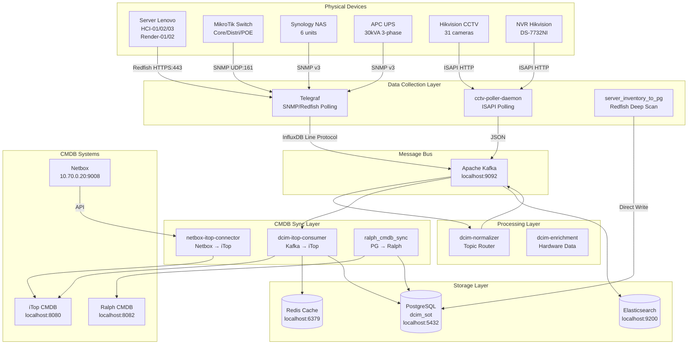
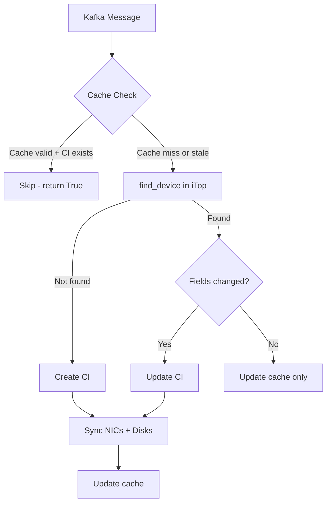
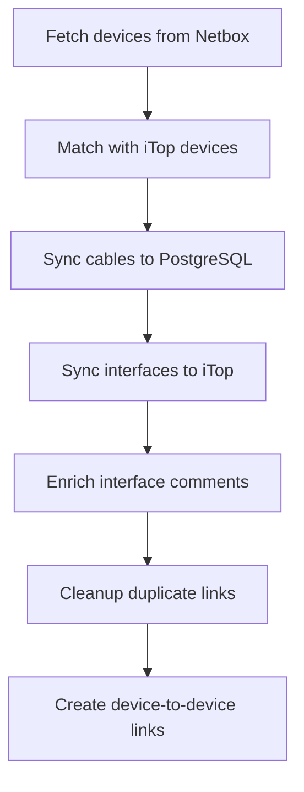
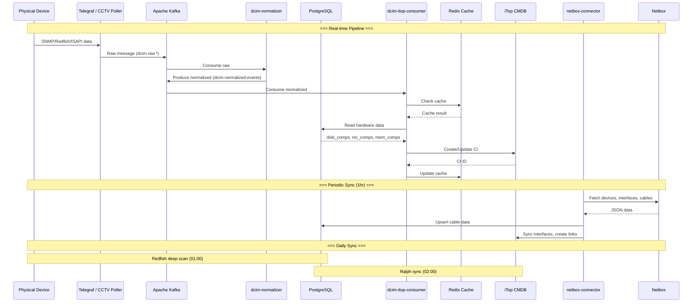
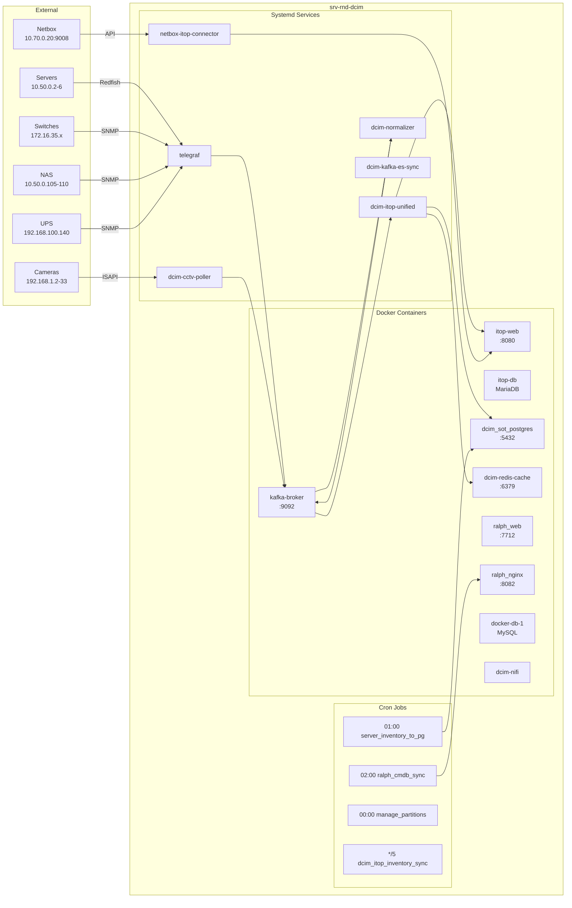

# DCIM Pipeline Architecture — Dokumentasi Lengkap

> **Last Updated:** 2026-06-11
> **Server:** srv-rnd-dcim (10.50.0.x)
> **Status:** Production

---

## 1. Ringkasan Eksekutif

Sistem DCIM (Data Center Infrastructure Management) ini mengumpulkan data inventaris dan metrik dari seluruh perangkat infrastruktur (server, switch, NAS, UPS, CCTV), menyimpannya di PostgreSQL, menormalisasikan via Kafka, dan mensinkronisasikannya ke dua CMDB: **iTop** dan **Ralph**.

### Perangkat yang Dipantau:
| Kategori | Jumlah | Contoh |
|----------|--------|--------|
| Server | 5 | HCI-01/02/03, Render-01/02 |
| Network Switch/Router | 6+ | MikroTik CCR, CRS |
| NAS | 6 | Synology RS2423RP |
| UPS | 1 | APC 30kVA 3-phase |
| CCTV Camera | 31 | Hikvision DS-2CD |
| NVR | 1 | Hikvision DS-7732NI |

---

## 2. Arsitektur High-Level



---

## 3. Layer Detail

### 3.1 Data Collection Layer

Layer ini bertanggung jawab mengumpulkan data dari perangkat fisik.

#### 3.1.1 Telegraf (`telegraf.service`)

**Fungsi:** Polling metrik periodik dari perangkat jaringan via SNMP dan Redfish.

**Konfigurasi:** `/etc/telegraf/telegraf.d/`

| Config File | Device Type | Protocol | Data |
|---|---|---|---|
| `servers-redfish.conf` | Server | Redfish (HTTPS) | CPU, RAM, Disk, NIC, Power, Thermal |
| `mikrotik-snmp.conf` | Switch/Router | SNMP v2c | Interface traffic, errors, CPU, memory |
| `nas-snmp.conf` | NAS | SNMP v3 | Interface traffic, storage volumes |
| `nas-inventory.conf` | NAS | SNMP v3 | Serial, model, firmware, disk health |
| `ups-apc.conf` | UPS | SNMP v3 | Battery, load, voltage, temperature |
| `cctv-hikvision.conf` | CCTV/NVR | Tail log file | Mengkonsumsi output cctv-poller-daemon |
| `dcim-unified-inventory.conf` | All | Exec script | Inventaris gabungan dari semua perangkat |
| `server-redfish-inventory.conf` | Server | Exec script | Inventaris detail server (disk, NIC, CPU) |

**Output:** Kafka topics (via Telegraf Kafka output plugin)

---

#### 3.1.2 CCTV Poller Daemon (`dcim-cctv-poller.service`)

**Fungsi:** Polling data dari CCTV camera dan NVR Hikvision via ISAPI protocol.

**Script:** `scripts/hikvision_poller_daemon.py`

**Cycle:** Setiap 120 detik

**Data yang dikumpulkan:**
- Serial number (dari ISAPI atau NVR channel mapping fallback)
- Model, firmware
- CPU/memory usage
- Storage status

**Output:** Kafka topic `dcim.raw.device.isapi` (langsung, bukan via Telegraf)

**Mapping kamera:**
```
192.168.1.2  - 192.168.1.33 (31 unit, skip .32)
NVR: 192.168.1.254
```

---

#### 3.1.3 Server Inventory to PG (`server_inventory_to_pg.py`)

**Fungsi:** Deep scan server via Redfish API dan menyimpan hasilnya langsung ke PostgreSQL.

**Jadwal:** Cron harian jam 01:00 WIB

**Data yang dikumpulkan:**
- Serial number, BIOS version, firmware
- Processors (model, cores, threads, speed)
- Memory (model, size MiB, speed MHz)
- Disks (model, serial, size GB, firmware, slot, RAID level)
- NICs (label, MAC, speed, IP, subnet, gateway)

**Output:** Tabel `dcim_events` di PostgreSQL (kolom JSONB: `srv_disk_components`, `srv_memory_components`, `srv_cpu_components`, `raw_tags->'nics'`)

---

### 3.2 Message Bus Layer

#### Apache Kafka (`kafka-broker`)

**Fungsi:** Message broker untuk decoupling antara data collection dan processing.

**Docker Compose:** `configs/docker/docker-compose.yml`

**Topics:**

| Topic | Producer | Consumer | Data |
|---|---|---|---|
| `dcim.raw.hardware.server` | Telegraf | Normalizer | Server Redfish raw |
| `dcim.raw.network.snmp` | Telegraf | Normalizer | Switch SNMP raw |
| `dcim.raw.network.interfaces` | Telegraf | Normalizer | Switch interface stats |
| `dcim.raw.storage.nas` | Telegraf | Normalizer | NAS SNMP raw |
| `dcim.raw.power.ups` | Telegraf | Normalizer | UPS SNMP raw |
| `dcim.raw.device.isapi` | cctv-poller | Normalizer | CCTV/NVR ISAPI raw |
| `dcim.normalized.events` | Normalizer | Consumer | Normalized events |
| `dcim.dlq.delivery-failure` | Consumer | Manual | Dead letter queue |
| `dcim.metrics.enriched.v2` | Enrichment | ES Sync | Enriched metrics |

---

### 3.3 Processing Layer

#### 3.3.1 Normalizer (`dcim-normalizer.service`)

**Fungsi:** Membaca raw messages dari Kafka, menentukan `device_type`, dan memproduksi normalized events.

**Script:** `scripts/dcim_normalizer.py`

**Logic:**
```
Topic prefix → device_type mapping:
  dcim.raw.hardware.server → server
  dcim.raw.network.*       → network_switch
  dcim.raw.storage.nas     → nas
  dcim.raw.power.ups       → ups
  dcim.raw.device.isapi    → cctv
```

**Output:** Kafka topic `dcim.normalized.events`

---

### 3.4 Storage Layer

#### 3.4.1 PostgreSQL (`dcim_sot_postgres`)

**Fungsi:** Primary data store untuk semua raw dan processed data.

**Database:** `dcim_sot`

**Tabel utama:**

| Tabel | Fungsi |
|---|---|
| `dcim_events` | Semua events (raw + normalized) dengan JSONB columns |
| `dcim_server_disks` | Detail disk per server |
| `dcim_server_nics` | Detail NIC per server |
| `dcim_server_processors` | Detail CPU per server |
| `dcim_server_ram` | Detail RAM per server |
| `netbox_cables` | Data kabel dari Netbox (synced by connector) |
| `unified_assets` | Cache metadata dari Ralph CMDB |

---

#### 3.4.2 Redis Cache (`dcim-redis-cache`)

**Fungsi:** Cache untuk consumer iTop — mencegah API call berulang untuk CI yang sama.

**Key pattern:** `itop_sync:{uid}` dimana uid = serial_number atau IP

**Cache fields:** ip, status, brand, name, hw_hash, loc_name, rack_name, obj_id

**TTL:** 120 detik

---

### 3.5 CMDB Sync Layer

#### 3.5.1 iTop Consumer (`dcim-itop-unified.service`)

**Fungsi:** Membaca normalized events dari Kafka dan membuat/memperbarui CI di iTop.

**Script:** `scripts/dcim_itop_unified_consumer.py`

**Flow:**


**Device type → iTop class mapping:**
```
server          → Server
network_switch  → NetworkDevice
nas             → NAS
cctv, camera    → Peripheral
nvr             → NetworkDevice
ups             → PowerSource
```

**Fitur kunci:**
- Distributed lock per hostname (Redis) — anti race-condition
- Cache stale detection — verify obj_id masih ada di iTop sebelum skip
- Hardware enrichment — RAM, CPU, disk, NIC dari pipeline
- Logical Volume sync — buat/link LV dari Redfish disk data
- Storage system alternate name lookup (SRV- ↔ SERVER-)

---

#### 3.5.2 Netbox Connector (`netbox-itop-connector.service`)

**Fungsi:** Mensinkronisasikan interface connections dan cable data dari Netbox ke iTop.

**Script:** `scripts/netbox_to_itop_connector.py`

**Jadwal:** Setiap 1 jam (daemon mode)

**Flow:**


**Fitur kunci:**
- Bonding/LACP support — position-based termination matching
- Case-insensitive device lookup
- Cable label → bonding description di comment
- Connection type: `uplink` (bukan `downlink`)
- Duplicate link cleanup sebelum create

---

#### 3.5.3 Ralph CMDB Sync (`ralph_cmdb_sync.py`)

**Fungsi:** Mensinkronisasikan data dari PostgreSQL ke Ralph CMDB.

**Script:** `scripts/ralph_cmdb_sync.py`

**Jadwal:** Cron harian jam 02:00 WIB

**Data yang di-sync:**
- Server: hostname, firmware, BIOS, components (disk/RAM/CPU/NIC), management IP
- UPS: hostname, firmware, model, battery info
- NAS/Network: hostname, firmware, management IP
- NVR/CCTV: registrasi dasar

---

### 3.6 External Systems

#### 3.6.1 Netbox (`10.70.0.20:9008`)

**Fungsi:** Source of truth untuk koneksi fisik (cables, interfaces, IP addresses).

**Data yang diambil:**
- Devices (name, serial, model)
- Interfaces (name, MAC, speed, IP)
- Cables (type, status, terminations)
- IP addresses

#### 3.6.2 iTop CMDB (`localhost:8080`)

**Fungsi:** Primary CMDB untuk semua CI dan relasinya.

**Docker Compose:** `itop/docker-compose.yml`

**Class yang digunakan:**
- `Server`, `NAS`, `NetworkDevice`, `Peripheral`, `PowerSource`
- `PhysicalInterface` (NIC, port)
- `StorageSystem`, `LogicalVolume`
- `lnkConnectableCIToNetworkDevice` (server → switch links)
- `lnkServerToVolume` (server → disk links)

#### 3.6.3 Ralph CMDB (`localhost:8082`)

**Fungsi:** Secondary CMDB untuk asset management dan rack visualization.

**Docker Compose:** `docker/` (Ralph stack)

---

## 4. Script Reference

| Script | Service | Fungsi |
|---|---|---|
| `dcim_itop_unified_consumer.py` | `dcim-itop-unified` | Kafka → iTop consumer utama |
| `dcim_normalizer.py` | `dcim-normalizer` | Raw → normalized event router |
| `netbox_to_itop_connector.py` | `netbox-itop-connector` | Netbox → iTop interface sync |
| `hikvision_poller_daemon.py` | `dcim-cctv-poller` | CCTV/NVR ISAPI polling daemon |
| `ralph_cmdb_sync.py` | cron 02:00 | PostgreSQL → Ralph sync |
| `server_inventory_to_pg.py` | cron 01:00 | Redfish → PostgreSQL deep scan |
| `itop_sync_utils.py` | (library) | Helper functions untuk hardware data |
| `sync_render_storage.py` | (manual) | Manual sync Render server LVs |
| `dcim_itop_inventory_sync.py` | cron */5 | Inventory sync ke iTop |
| `manage_partitions.py` | cron 00:00 | PostgreSQL partition management |

---

## 5. Data Flow Diagram



---

## 6. Infrastructure Diagram



---

## 7. Monitoring & Troubleshooting

### Check Pipeline Health
```bash
# All services status
for svc in dcim-itop-unified dcim-normalizer dcim-cctv-poller netbox-itop-connector telegraf; do
  echo "$svc: $(systemctl is-active $svc.service)"
done

# Docker containers
docker ps --format "table {{.Names}}\t{{.Status}}"

# Kafka consumer lag
python3 -c "
from confluent_kafka import Consumer, TopicPartition
c = Consumer({'bootstrap.servers': 'localhost:9092', 'group.id': 'dcim_itop_group_v8'})
tp = TopicPartition('dcim.normalized.events', 0)
committed = c.committed([tp], timeout=10)
lo, hi = c.get_watermark_offsets(tp, timeout=10)
print(f'Lag: {hi - committed[0].offset}')
c.close()
"
```

### Common Issues

| Symptom | Cause | Fix |
|---|---|---|
| CI tidak auto-recreate | Redis cache stale | Restart consumer atau flush cache |
| RAM kosong di iTop | `get_server_hardware()` pakai field salah | Sudah fixed: gunakan `size` (MiB) |
| LVs tidak linked | Storage name mismatch (SRV- vs SERVER-) | Sudah fixed: alternate name lookup |
| Kafka consumer lag besar | Broker down, backlog menumpuk | `kafka-consumer-groups.sh --reset-offsets --to-latest` |
| CCTV tidak masuk iTop | cctv-poller service mati | `sudo systemctl start dcim-cctv-poller` |
| Connection refused Kafka | Broker container exited | `cd kafka && docker compose up -d` |
| iTop 500 error | DB container exited | `cd itop && docker compose up -d db` |
| Ralph 500 error | DB container exited | `cd /opt/ralph-stack/ralph/docker && docker compose up -d db` |

---

## 8. File Structure

```
dcim_metrics_project/
├── configs/
│   ├── .env                          # Environment variables
│   ├── docker/docker-compose.yml     # Kafka + Kafka UI compose
│   └── metric_mapping.json           # Topic → device_type mapping
├── docs/
│   └── architecture/
│       └── DCIM_PIPELINE_ARCHITECTURE.md  # ← Dokumentasi ini
├── kafka/
│   └── docker-compose.yml            # Kafka compose (copied from configs)
├── itop/
│   ├── docker-compose.yml            # iTop compose
│   └── itop/conf/                    # iTop configuration
├── scripts/
│   ├── dcim_itop_unified_consumer.py # Kafka → iTop consumer (MAIN)
│   ├── dcim_normalizer.py            # Raw → normalized event router
│   ├── netbox_to_itop_connector.py   # Netbox → iTop interface sync
│   ├── hikvision_poller_daemon.py    # CCTV ISAPI polling daemon
│   ├── ralph_cmdb_sync.py            # PostgreSQL → Ralph sync
│   ├── server_inventory_to_pg.py     # Redfish → PostgreSQL deep scan
│   ├── itop_sync_utils.py            # Helper functions
│   ├── sync_render_storage.py        # Manual Render LV sync
│   └── dcim_itop_inventory_sync.py   # Inventory sync ke iTop
├── src/
│   ├── schemas/
│   │   ├── transformers/             # Data transformers
│   │   └── output/                   # Output formatters
│   └── skills/                       # Domain-specific skills
└── logs/                             # Service logs
```

---

## 9. Commit History (Recent Fixes)

| Commit | Date | Description |
|---|---|---|
| `195d971` | 2026-06-10 | Storage system alternate name lookup (SRV- ↔ SERVER-) |
| `d659286` | 2026-06-10 | RAM calculation: use `size` (MiB) not `capacity_bytes` |
| `cac5b7d` | 2026-06-10 | Cache stale detection for CI auto-recreation |
| `9ebc15a` | 2026-06-10 | Correct NAS name mapping per user correction |
| `3e3809e` | 2026-06-10 | Force-update bonding comments, Render LV manual sync |
| `adc466f` | 2026-06-10 | Uplink type, bonding desc, ILIKE hostname fix |
| `d07cc73` | 2026-06-09 | Fix interface links for NAS/Render, case-insensitive lookup |
