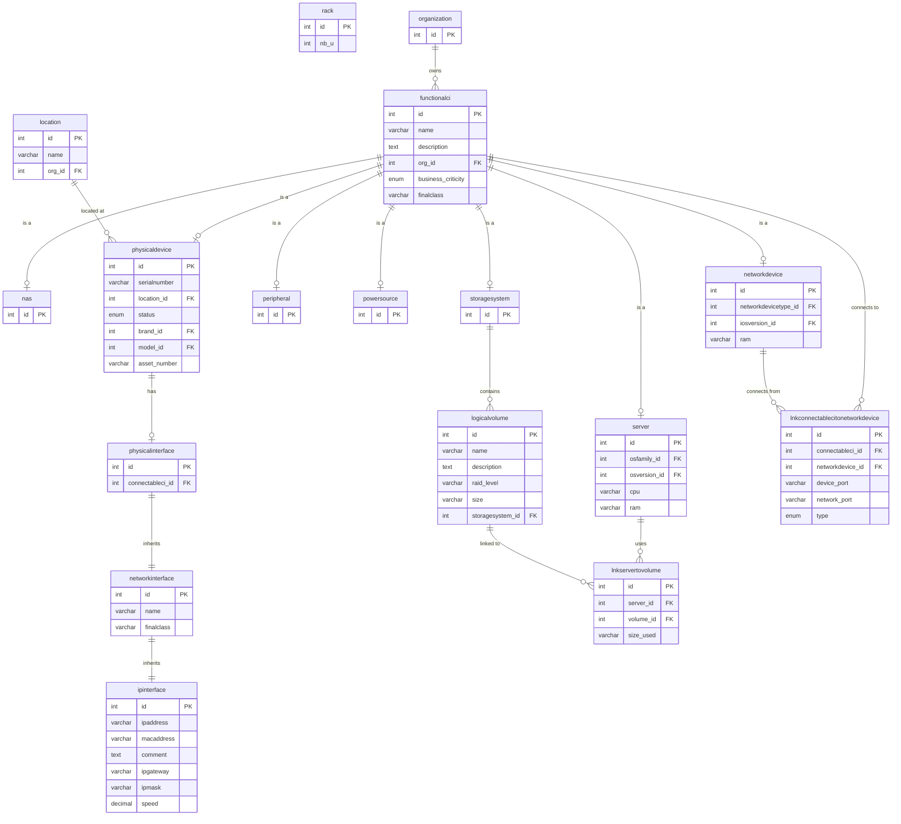

# iTop MariaDB Database Schema — Lengkap

> **Database:** `infra` (MariaDB 10.11)
> **Container:** `itop-db`
> **Last Updated:** 2026-06-11

---

## 1. ER Diagram



---

## 2. Tabel Detail

### 2.1 `functionalci` — Base Tabel Semua CI

| Kolom | Tipe | Keterangan |
|-------|------|------------|
| `id` | int PK | ID unik CI |
| `name` | varchar | Nama CI (e.g., "SERVER-HCI-01") |
| `description` | text | Deskripsi |
| `org_id` | int FK → organization | Organisasi pemilik |
| `business_criticity` | enum | critical/major/medium/low |
| `finalclass` | varchar | Tipe CI: Server, NAS, NetworkDevice, Peripheral, dll |
| `move2production` | date | Tanggal go-live |

**Subclass tables** (inheritance via `id`):
- `server` → CPU, RAM
- `nas` → (tambahan NAS)
- `networkdevice` → networkdevicetype, iosversion, RAM
- `peripheral` → (camera, printer, dll)
- `powersource` → (UPS)
- `storagesystem` → (local storage)
- `physicaldevice` → serial, location, brand, model

---

### 2.2 `physicaldevice` — Device Fisik

| Kolom | Tipe | Keterangan |
|-------|------|------------|
| `id` | int PK | FK → functionalci.id |
| `serialnumber` | varchar | Serial number perangkat |
| `location_id` | int FK → location | Lokasi rack |
| `status` | enum | stock/implementation/production/obsolete |
| `brand_id` | int FK | Merek |
| `model_id` | int FK | Model |
| `asset_number` | varchar | Nomor aset |

---

### 2.3 `physicalinterface` → `networkinterface` → `ipinterface`

**Inheritance chain:**
```
physicalinterface (id, connectableci_id)
  └── networkinterface (id, name, finalclass)
       └── ipinterface (id, ipaddress, macaddress, comment, ipgateway, ipmask, speed)
```

| Tabel | Kolom | Keterangan |
|-------|-------|------------|
| `physicalinterface` | `connectableci_id` | FK → functionalci (pemilik interface) |
| `networkinterface` | `name` | Nama interface (NIC1, LAN 1, dst) |
| `ipinterface` | `ipaddress` | IP address |
| `ipinterface` | `macaddress` | MAC address |
| `ipinterface` | `comment` | Comment (berisi info koneksi ke switch) |
| `ipinterface` | `ipgateway` | Gateway |
| `ipinterface` | `ipmask` | Subnet mask |
| `ipinterface` | `speed` | Speed (Mbps) |

---

### 2.4 `lnkconnectablecitonetworkdevice` — Server/NAS → Switch

| Kolom | Tipe | Keterangan |
|-------|------|------------|
| `id` | int PK | ID link |
| `connectableci_id` | int FK | ID Server atau NAS |
| `networkdevice_id` | int FK | ID Switch/Router |
| `device_port` | varchar | Port di server (NIC1, NIC2, LAN 1, dst) |
| `network_port` | varchar | Port di switch (ether1, ether2, dst) |
| `type` | enum | `uplink` atau `downlink` |

---

### 2.5 `lnkservertovolume` — Server → Logical Volume

| Kolom | Tipe | Keterangan |
|-------|------|------------|
| `id` | int PK | ID link |
| `server_id` | int FK | ID Server |
| `volume_id` | int FK | ID LogicalVolume |
| `size_used` | varchar | Ukuran yang digunakan (GB) |

---

### 2.6 `logicalvolume` — Logical Volume

| Kolom | Tipe | Keterangan |
|-------|------|------------|
| `id` | int PK | ID volume |
| `name` | varchar | Nama (Slot 00, Slot 01, dst) |
| `description` | text | Model, SN, dll |
| `raid_level` | varchar | Level RAID |
| `size` | varchar | Ukuran (GB) |
| `storagesystem_id` | int FK → storagesystem | ID storage system |

---

### 2.7 `storagesystem` — Storage System

| Kolom | Tipe | Keterangan |
|-------|------|------------|
| `id` | int PK | FK → functionalci.id |
| (tidak ada kolom tambahan) | | Semua di functionalci |

**Nama convention:** `Local Storage - {hostname}`

---

## 3. Query Contoh untuk CloudBeaver

### 3.1 Semua CI dengan Jumlah Relasi

```sql
SELECT fc.name, fc.finalclass,
  (SELECT COUNT(*) FROM physicalinterface pi WHERE pi.connectableci_id = fc.id) as interfaces,
  (SELECT COUNT(*) FROM lnkservertovolume lsv WHERE lsv.server_id = fc.id) as volumes
FROM functionalci fc
WHERE fc.finalclass IN ('Server', 'NAS', 'NetworkDevice')
ORDER BY fc.finalclass, fc.name;
```

### 3.2 Server → Switch Connections

```sql
SELECT ci.name as server, nd.name as switch, 
       l.device_port, l.network_port, l.type
FROM lnkconnectablecitonetworkdevice l
JOIN functionalci ci ON ci.id = l.connectableci_id
JOIN functionalci nd ON nd.id = l.networkdevice_id
ORDER BY ci.name, l.device_port;
```

### 3.3 Server → Logical Volumes

```sql
SELECT s.name as server, lv.name as volume, lv.size, 
       lv.description, ss.name as storage
FROM lnkservertovolume lsv
JOIN functionalci s ON s.id = lsv.server_id
JOIN logicalvolume lv ON lv.id = lsv.volume_id
JOIN functionalci ss ON ss.id = lv.storagesystem_id
ORDER BY s.name, lv.name;
```

### 3.4 Interfaces dengan Koneksi Info

```sql
SELECT ci.name as device, ci.finalclass, ni.name as iface, 
       ipi.ipaddress, ipi.macaddress, ipi.speed, ipi.comment
FROM physicalinterface pi
JOIN networkinterface ni ON ni.id = pi.id
JOIN ipinterface ipi ON ipi.id = pi.id
JOIN functionalci ci ON ci.id = pi.connectableci_id
WHERE ci.name IN ('SERVER-HCI-01', 'NAS-FIT', 'FIT-DIST-SW-SERVER1')
ORDER BY ci.name, ni.name;
```

### 3.5 Ringkasan Relasi

```sql
SELECT 'Server→Switch' as relasi, COUNT(*) as jumlah
FROM lnkconnectablecitonetworkdevice l
JOIN functionalci ci ON ci.id = l.connectableci_id
WHERE ci.finalclass = 'Server'
UNION ALL
SELECT 'NAS→Switch', COUNT(*)
FROM lnkconnectablecitonetworkdevice l
JOIN functionalci ci ON ci.id = l.connectableci_id
WHERE ci.finalclass = 'NAS'
UNION ALL
SELECT 'Server→Volume', COUNT(*)
FROM lnkservertovolume;
```

### 3.6 Detail Storage per Server

```sql
SELECT s.name as server, ss.name as storage, 
       COUNT(lv.id) as vol_count, 
       SUM(CAST(lv.size AS UNSIGNED)) as total_gb,
       lv.raid_level
FROM lnkservertovolume lsv
JOIN functionalci s ON s.id = lsv.server_id
JOIN logicalvolume lv ON lv.id = lsv.volume_id
JOIN functionalci ss ON ss.id = lv.storagesystem_id
GROUP BY s.name, ss.name, lv.raid_level
ORDER BY s.name;
```

---

## 4. Relasi Lengkap (Data Aktual)

### Server → Switch

| Server | Port | Switch | Switch Port | Tipe |
|--------|------|--------|-------------|------|
| SERVER-HCI-01 | NIC1 | FIT-DIST-SW-SERVER1 | ether13 | downlink |
| SERVER-HCI-01 | NIC2 | FIT-DIST-SW-SERVER2 | ether1 | downlink |
| SERVER-HCI-01 | NIC3 | FIT-DIST-SW-SERVER2 | ether2 | downlink |
| SERVER-HCI-01 | NIC4 | FIT-DIST-SW-SERVER2 | ether3 | downlink |
| SERVER-HCI-01 | XCC | FIT-DIST-SW-SERVER1 | ether33 | downlink |
| SERVER-HCI-02 | NIC1 | FIT-DIST-SW-SERVER1 | ether17 | uplink |
| SERVER-HCI-02 | NIC2 | FIT-DIST-SW-SERVER2 | ether4 | uplink |
| SERVER-HCI-02 | NIC3 | FIT-DIST-SW-SERVER2 | ether5 | uplink |
| SERVER-HCI-02 | NIC4 | FIT-DIST-SW-SERVER2 | ether6 | uplink |
| SERVER-HCI-02 | XCC | FIT-DIST-SW-SERVER1 | ether34 | uplink |
| SERVER-HCI-03 | NIC1 | FIT-DIST-SW-SERVER1 | ether21 | uplink |
| SERVER-HCI-03 | NIC2 | FIT-DIST-SW-SERVER2 | combo3 | uplink |
| SERVER-HCI-03 | NIC3 | FIT-DIST-SW-SERVER2 | ether7 | uplink |
| SERVER-HCI-03 | NIC4 | FIT-DIST-SW-SERVER2 | ether8 | uplink |
| SERVER-HCI-03 | XCC | FIT-DIST-SW-SERVER1 | ether35 | uplink |
| SERVER-RENDER-01 | NIC1-4, XCC | FIT-DIST-SW-SERVER1 | ether25-28,36 | uplink |
| SERVER-RENDER-02 | NIC1-4, XCC | FIT-DIST-SW-SERVER1 | ether29-32,37 | uplink |

### Server → Storage

| Server | Storage | LVs | Total |
|--------|---------|-----|-------|
| SERVER-HCI-01 | Local Storage - SRV-HCI-01 | 12 | 21,456 GB |
| SERVER-HCI-02 | Local Storage - SRV-HCI-02 | 12 | 21,456 GB |
| SERVER-HCI-03 | Local Storage - SRV-HCI-03 | 12 | 21,456 GB |
| SERVER-RENDER-01 | Local Storage - SRV-RENDER-01 | 4 | 3,576 GB |
| SERVER-RENDER-02 | Local Storage - SRV-RENDER-02 | 4 | 3,576 GB |
