# Arsitektur DCIM Pipeline v4.0
## Dokumentasi Teknis Resmi

> **Versi**: 4.0.0  
> **Tanggal**: 2026-06-12  
> **Status**: Production  
> **Penulis**: Tim Infrastruktur PT. Falah Inovasi Teknologi  

---

## Daftar Isi

1. [Diagram Arsitektur](#1-diagram-arsitektur)
2. [Ringkasan Layer Pipeline](#2-ringkasan-layer-pipeline)
3. [L1 — Physical Infrastructure](#3-l1--physical-infrastructure)
4. [L2 — Collection (Telegraf)](#4-l2--collection-telegraf)
5. [L3 — Kafka Raw Topics](#5-l3--kafka-raw-topics)
6. [L4 — Normalize](#6-l4--normalize)
7. [L5 — Enrich (NiFi)](#7-l5--enrich-nifi)
8. [L6 — Persist (Consumers)](#8-l6--persist-consumers)
9. [L7 — Storage & Dashboard](#9-l7--storage--dashboard)
10. [L8 — CMDB Automation](#10-l8--cmdb-automation)
11. [L9 — Alerting](#11-l9--alerting)
12. [L10 — Dead Letter Queue (DLQ)](#12-l10--dead-letter-queue-dlq)
13. [L11 — AI / Agent Readiness](#13-l11--ai--agent-readiness)
14. [AI Readiness: Status MT-015](#14-ai-readiness-status-mt-015)
15. [Jadwal Eksekusi (Cron & Systemd)](#15-jadwal-eksekusi-cron--systemd)

---

## 1. Diagram Arsitektur

Diagram berikut merepresentasikan keadaan sistem yang **aktual dan terverifikasi** per tanggal dokumentasi ini dibuat. Penambahan utama dari versi sebelumnya adalah skrip `dcim_itop_inventory_sync.py` yang melengkapi jalur sinkronisasi data fisik dari PostgreSQL ke iTop.

```mermaid
flowchart LR
    subgraph L1["🏭 1. Physical Infrastructure"]
        direction TB
        SRV["🖥️ Server<br>5 Lenovo ThinkSystem<br>10.50.0.2-6<br>Redfish HTTPS :443"]
        UPS["⚡ UPS<br>1 APC Smart-UPS 30K<br>192.168.100.140<br>SNMP v3 :161"]
        NAS["💾 NAS<br>6 Synology DS Series<br>10.50.0.105-110<br>SNMP v3 :161"]
        NET["🔀 Network<br>5 MikroTik CCR/CRS<br>172.16.35.x<br>SNMP v2c :161"]
        CAM["📷 CCTV<br>31 Hikvision channels<br>192.168.1.2-33 skip .32<br>ISAPI HTTP :80"]
        NVR["📹 NVR<br>1 Hikvision DS-7732<br>192.168.1.254<br>ISAPI HTTP :80"]
    end

    subgraph L2["📡 2. Collection - Telegraf"]
        direction TB
        C_SRV["inputs.redfish<br>servers-redfish.conf<br>120s"]
        C_UPS["inputs.snmp<br>ups-apc.conf<br>120s"]
        C_NAS["inputs.snmp<br>nas-snmp.conf<br>120s"]
        C_NET["inputs.snmp<br>mikrotik-snmp.conf<br>120s"]
        C_ISAPI["inputs.exec<br>hikvision_poller.py<br>120s"]
        KOUT["outputs.kafka<br>localhost:9092<br>JSON"]
    end

    subgraph L3["🗂️ 3. Kafka Raw Topics"]
        direction TB
        KR_SRV["dcim.raw.hardware.server"]
        KR_UPS["dcim.raw.power.ups"]
        KR_NAS["dcim.raw.storage.nas"]
        KR_NET["dcim.raw.network.snmp<br>dcim.raw.network.interfaces"]
        KR_ISAPI["dcim.raw.device.isapi"]
    end

    subgraph L4["⚙️ 4. Normalize"]
        direction TB
        NORM["dcim-normalizer.service<br>src/skills/telemetry/normalizer/executor.py<br>metric_mapping.json"]
        KN["dcim.normalized.events<br>Flat CDM schema"]
    end

    subgraph L11["🤖 AI / Agent Readiness"]
        direction TB
        ITOP_API_DOC["docs/development/itop-api-baseline-for-agents.md<br>iTop OQL & REST API references"]
        QUERY_DOC["docs/development/34-database-query-baseline-for-agents.md<br>baseline SQL patterns"]
        QUERY_SKILL[".github/skills/dcim-database-query-baseline/SKILL.md<br>agent on-demand skill"]
    end

    subgraph L7["💾 7. Storage & Dashboard"]
        direction TB
        PG[("PostgreSQL 14<br>localhost:5432 (Docker)<br>dcim_sot<br>dcim_events + unified_assets<br>server component tables")]
        ES[("Elasticsearch 7.x<br>10.70.0.56:9200<br>dcim-metrics-unified-*<br>dcim-alerts")]
        KIBANA["Kibana Dashboard<br>10.70.0.56:5601<br>DCIM + alerts"]
    end

    subgraph L9["🚨 Alerting"]
        direction TB
        ALERT["dcim-threshold-alerter.service<br>120s<br>6 thresholds + stale devices<br>stale threshold 30m"]
        ALERT_IDX[("dcim-alerts<br>Threshold alerts<br>Device Not Reporting alerts")]
    end

    subgraph L6["🗄️ 6. Persist"]
        direction TB
        ES_CONS["telegraf-consumer.service<br>Kafka enriched → Elasticsearch"]
        SQL_CONS["dcim-sql-consumer.service<br>src/skills/telemetry/event_logger/executor.py<br>Kafka enriched → PostgreSQL"]
        ITOP_CONS["dcim-itop-unified.service<br>dcim_itop_unified_consumer.py<br>Kafka normalized → iTop API"]
    end

    subgraph L8["📘 CMDB Automation"]
        direction TB
        INV["server_inventory_to_pg.py<br>Daily 01:00 WIB<br>Redfish inventory → PostgreSQL"]
        ITOP_PG_SYNC["dcim_itop_inventory_sync.py<br>Cron */5 min<br>PostgreSQL → iTop CMDB"]
        ITOP[("iTop CMDB<br>localhost:8080 (Docker)<br>Real-time CI State<br>Logical Relationships")]
        RALPH_SYNC["itop_to_ralph_sync.py<br>Systemd Timer 02:00 WIB<br>sync ITAM assets"]
        RALPH[("Ralph Asset Repository<br>localhost:8082 (Docker)<br>data-center-assets<br>Financials")]
    end

    subgraph L10["⚠️ DLQ"]
        direction TB
        DLQ1["dcim.dlq.parse-failure"]
        DLQ2["dcim.dlq.enrichment-failure"]
        DLQ3["dcim.dlq.delivery-failure"]
        DLQ_CONS["dcim-dlq-consumer.service<br>dcim_dlq_consumer.py<br>logs + retry"]
    end

    subgraph L5["🔶 5. Enrich"]
        direction TB
        NF1["NiFi ConsumeKafkaRecord<br>dcim.normalized.events"]
        NF2["NiFi LookupRecord<br>GET /enrich/{sn}"]
        API["dcim-enrichment-api.service<br>src/skills/inventory/enrichment/executor.py<br>FastAPI :8000"]
        NF3["NiFi PublishKafkaRecord<br>dcim.enriched.events"]
        REDIS[("Redis cache :6379<br>asset:sn:{sn}<br>TTL 3600s")]
        RSYNC["dcim-itop-redis-sync.service<br>itop_to_cache_sync.py<br>60s"]
        KE["dcim.enriched.events<br>CDM + CMDB metadata"]
    end

    SRV --> C_SRV --> KOUT --> KR_SRV
    UPS --> C_UPS --> KOUT --> KR_UPS
    NAS --> C_NAS --> KOUT --> KR_NAS
    NET --> C_NET --> KOUT --> KR_NET
    CAM --> C_ISAPI --> KOUT --> KR_ISAPI
    NVR --> C_ISAPI

    KR_SRV --> NORM
    KR_UPS --> NORM
    KR_NAS --> NORM
    KR_NET --> NORM
    KR_ISAPI --> NORM

    QUERY_SKILL -. loads .-> QUERY_DOC
    QUERY_SKILL -. loads .-> ITOP_API_DOC
    QUERY_DOC -. query reference .-> PG
    ITOP_API_DOC -. api/oql reference .-> ITOP

    KE --> ES_CONS --> ES --> KIBANA
    KE --> SQL_CONS --> PG
    ES --> ALERT --> ALERT_IDX --> KIBANA

    KN -- "Status & Telemetry Metadata" --> ITOP_CONS --> ITOP
    SRV -. "Redfish Deep Scan (01:00)" .-> INV
    INV -. "Writes JSONB & Relational Tables" .-> PG

    PG -. "Hardware Components (*/5 min)" .-> ITOP_PG_SYNC
    ITOP_PG_SYNC -. "Updates CPU, RAM, Disk, NICs" .-> ITOP

    ITOP -. "CI State & Network Info (02:00)" .-> RALPH_SYNC
    PG -. "Physical Hardware Stats (02:00)" .-> RALPH_SYNC
    RALPH_SYNC -. "Registers/Updates Asset" .-> RALPH

    NORM -. parse error .-> DLQ1
    SQL_CONS -. delivery error .-> DLQ3
    ITOP_CONS -. delivery error .-> DLQ3
    DLQ1 --> DLQ_CONS
    DLQ3 --> DLQ_CONS

    NORM --> KN
    KN --> NF1 --> NF2

    NF2 <--> API
    API <--> REDIS
    RSYNC --> REDIS
    ITOP -. "CMDB Cache Source" .-> RSYNC

    NF2 --> NF3 --> KE
    NF2 -. enrichment error .-> DLQ2
    DLQ2 --> DLQ_CONS

    style L1 fill:#e1f5ff
    style L2 fill:#fff4e6
    style L3 fill:#f3e5f5
    style L4 fill:#e8f5e9
    style L5 fill:#fff3e0
    style L6 fill:#e0f2f1
    style L7 fill:#fce4ec
    style L8 fill:#f1f8e9
    style L9 fill:#fff9c4
    style L10 fill:#ffebee
    style L11 fill:#e8eaf6

    classDef mainFlow stroke:#1565c0,stroke-width:2px
    classDef exceptionFlow stroke:#c62828,stroke-width:1.5px,stroke-dasharray: 5 5
    classDef opsFlow stroke:#6a1b9a,stroke-width:1.5px,stroke-dasharray: 4 4

    class SRV,UPS,NAS,NET,CAM,NVR,C_SRV,C_UPS,C_NAS,C_NET,C_ISAPI,KOUT,KR_SRV,KR_UPS,KR_NAS,KR_NET,KR_ISAPI,NORM,KN,NF1,NF2,NF3,KE,ES_CONS,SQL_CONS,PG,ES,KIBANA,ITOP_CONS,ITOP mainFlow
    class DLQ1,DLQ2,DLQ3,DLQ_CONS exceptionFlow
    class INV,ITOP_PG_SYNC,RALPH_SYNC,RALPH,ALERT,ALERT_IDX,QUERY_DOC,ITOP_API_DOC,QUERY_SKILL opsFlow
```



---

## 2. Ringkasan Layer Pipeline

| Layer | Nama | Fungsi Utama | Status |
|---|---|---|---|
| **L1** | Physical Infrastructure | Sumber data fisik (server, UPS, NAS, switch, CCTV) | ✅ Active |
| **L2** | Collection — Telegraf | Polling metrik dari semua perangkat ke Kafka | ✅ Active |
| **L3** | Kafka Raw Topics | Message broker antrean data mentah per tipe perangkat | ✅ Active |
| **L4** | Normalize | Menyamakan format dari berbagai vendor ke CDM | ✅ Active |
| **L5** | Enrich — NiFi | Menambahkan metadata CMDB ke setiap metrik | ✅ Active |
| **L6** | Persist — Consumers | Menulis data *enriched* ke storage akhir | ✅ Active |
| **L7** | Storage & Dashboard | PostgreSQL, Elasticsearch, Kibana | ✅ Active |
| **L8** | CMDB Automation | Sinkronisasi inventaris fisik ke iTop dan Ralph | ✅ Active |
| **L9** | Alerting | Evaluasi threshold dan device stale | ✅ Active |
| **L10** | Dead Letter Queue | Penanganan data gagal agar tidak hilang | ✅ Active |
| **L11** | AI / Agent Readiness | Dokumentasi dan *skill* untuk agen AI | ✅ Active |

---

## 3. L1 — Physical Infrastructure

Layer ini merupakan titik asal dari semua data yang mengalir dalam sistem. Tidak ada proses apapun yang terjadi di layer ini; semua perangkat hanya diakses (di-*poll*) oleh layer L2.

| Perangkat | Jumlah | IP | Protokol | Port |
|---|---|---|---|---|
| Server Lenovo ThinkSystem | 5 unit | `10.50.0.2` – `10.50.0.6` | Redfish HTTPS | `:443` |
| UPS APC Smart-UPS 30K | 1 unit | `192.168.100.140` | SNMP v3 | `:161` |
| NAS Synology DS Series | 6 unit | `10.50.0.105` – `10.50.0.110` | SNMP v3 | `:161` |
| Switch MikroTik CCR/CRS | 5 unit | `172.16.35.x` | SNMP v2c | `:161` |
| Kamera CCTV Hikvision | 31 saluran | `192.168.1.2` – `192.168.1.33` (skip `.32`) | ISAPI HTTP | `:80` |
| NVR Hikvision DS-7732 | 1 unit | `192.168.1.254` | ISAPI HTTP | `:80` |

---

## 4. L2 — Collection (Telegraf)

**Sistem**: `telegraf.service` (aktif sebagai systemd service)  
**Binary**: `/usr/bin/telegraf`  
**Konfigurasi induk**: `/etc/telegraf/telegraf-producer.conf` → `configs/telegraf/telegraf_producer.conf`

Semua *collector* menggunakan interval **120 detik** yang telah distandarkan. Semua output diarahkan ke Kafka di `localhost:9092` menggunakan `outputs.kafka`.

### 4.1 Server — Redfish

| Item | Detail |
|---|---|
| **File konfigurasi** | `configs/telegraf/servers-redfish.conf` |
| **Plugin** | `inputs.redfish` |
| **Protokol** | HTTPS (TLS, `insecure_skip_verify = true`) |
| **Autentikasi** | Username/Password per server |
| **Interval** | `120s` |
| **Output topic** | `dcim.raw.hardware.server` |

**Cara kerja**: Telegraf menggunakan plugin Redfish bawaan yang menghubungi BMC (Baseboard Management Controller) masing-masing server. Redfish API menyediakan data *health* CPU, memori, power supply, fan speed, dan temperatur secara terstruktur tanpa harus menginstal agen di OS server.

**Konfigurasi aktif**:
```toml
# configs/telegraf/servers-redfish.conf
[[inputs.redfish]]
  address = "https://10.50.0.2"
  username = "hndept"
  insecure_skip_verify = true
  interval = "120s"
  [inputs.redfish.tags]
    host = "server-HCI-01"
# ... (diulang untuk 10.50.0.3 - 10.50.0.6)
```

### 4.2 UPS — SNMP v3

| Item | Detail |
|---|---|
| **File konfigurasi** | `configs/telegraf/ups-apc.conf` |
| **Plugin** | `inputs.snmp` |
| **Protokol** | SNMP v3 dengan enkripsi SHA + AES |
| **Agent IP** | `192.168.100.140:161` |
| **Interval** | `120s` |
| **Output topic** | `dcim.raw.power.ups` |

**Cara kerja**: Telegraf men-*query* OID MIB APC PowerNet secara berkala via SNMP. Data yang diambil mencakup tegangan input/output, beban daya (load), status baterai, dan estimasi waktu cadangan (runtime).

### 4.3 NAS — SNMP v3

| Item | Detail |
|---|---|
| **File konfigurasi** | `configs/telegraf/nas-snmp.conf` |
| **Plugin** | `inputs.snmp` |
| **Protokol** | SNMP v3 |
| **Interval** | `120s` |
| **Output topic** | `dcim.raw.storage.nas` |

**Cara kerja**: NAS Synology mengekspos data melalui SNMP. Data yang dikumpulkan mencakup utilisasi disk, RAID health, throughput I/O, dan informasi sistem.

### 4.4 Network — SNMP v2c

| Item | Detail |
|---|---|
| **File konfigurasi** | `configs/telegraf/mikrotik-snmp.conf` |
| **Plugin** | `inputs.snmp` |
| **Protokol** | SNMP v2c |
| **Interval** | `120s` |
| **Output topic** | `dcim.raw.network.snmp`, `dcim.raw.network.interfaces` |

**Cara kerja**: Switch dan router MikroTik di-*poll* menggunakan komunitas SNMP. Data mencakup *interface statistics* (rx/tx bytes, error counts), utilisasi CPU/memori router, dan status link.

### 4.5 CCTV & NVR — ISAPI via Script

| Item | Detail |
|---|---|
| **File konfigurasi** | `configs/telegraf/cctv-hikvision.conf` |
| **Plugin** | `inputs.exec` |
| **Skrip dieksekusi** | `scripts/hikvision_poller.py` |
| **Timeout** | `110s` |
| **Interval** | `120s` |
| **Output topic** | `dcim.raw.device.isapi` |

**Cara kerja**: Alih-alih menggunakan plugin SNMP generik, Telegraf mengeksekusi skrip Python `hikvision_poller.py` setiap 120 detik. Skrip tersebut berkomunikasi dengan kamera Hikvision dan NVR menggunakan protokol **ISAPI** (HTTP/XML). Skrip mengeluarkan data dalam format **InfluxDB Line Protocol** ke stdout, yang kemudian dibaca oleh Telegraf dan dikirim ke Kafka.

**Konfigurasi aktif**:
```toml
# configs/telegraf/cctv-hikvision.conf
[[inputs.exec]]
  commands = ["/usr/bin/python3 /home/infra/dcim_metrics_project/scripts/hikvision_poller.py"]
  timeout = "110s"
  data_format = "influx"
  name_override = "cctv_metrics"

[[outputs.kafka]]
  brokers = ["localhost:9092"]
  topic = "dcim.raw.device.isapi"
  data_format = "json"
```

---

## 5. L3 — Kafka Raw Topics

**Sistem**: Apache Kafka di `localhost:9092`

Kafka berfungsi sebagai *message broker* yang memisahkan *producer* (Telegraf) dari *consumer* (Normalizer). Data yang belum diproses disimpan dalam topik-topik ini.

| Topik Kafka | Sumber Data |
|---|---|
| `dcim.raw.hardware.server` | Telegraf `inputs.redfish` |
| `dcim.raw.power.ups` | Telegraf `inputs.snmp` (UPS) |
| `dcim.raw.storage.nas` | Telegraf `inputs.snmp` (NAS) |
| `dcim.raw.network.snmp` | Telegraf `inputs.snmp` (MikroTik) |
| `dcim.raw.network.interfaces` | Telegraf `inputs.snmp` (MikroTik interfaces) |
| `dcim.raw.device.isapi` | Telegraf `inputs.exec` (hikvision_poller.py) |

---

## 6. L4 — Normalize

**Service**: `dcim-normalizer.service`  
**Skrip**: `src/skills/telemetry/normalizer/executor.py`  
**Konfigurasi mapping**: `src/skills/telemetry/normalizer/metric_mapping.json`  
**Input topic**: semua `dcim.raw.*`  
**Output topic**: `dcim.normalized.events`

**Fungsi**: Normalizer adalah jembatan antara data mentah vendor-spesifik dengan skema *Common Data Model (CDM)* yang seragam. Setiap pesan dari topik `dcim.raw.*` diproses satu per satu:
1. Field-field dari berbagai vendor dipetakan menggunakan `metric_mapping.json`
2. Unit pengukuran distandarkan (contoh: semua temperatur dalam Celsius)
3. Hostname dan identifier aset dinormalisasi
4. Field `device_type` ditentukan berdasarkan topik asal

**Penanganan Error (DLQ)**: Jika sebuah pesan tidak dapat diparsing (JSON korup, skema tidak dikenal), pesan asli dilemparkan ke topik `dcim.dlq.parse-failure` agar tidak hilang.

```ini
# /etc/systemd/system/dcim-normalizer.service
[Service]
ExecStart=/usr/bin/python3 -u /home/infra/dcim_metrics_project/src/skills/telemetry/normalizer/executor.py
Restart=always
RestartSec=5
```

---

## 7. L5 — Enrich (NiFi)

**Sistem**: Apache NiFi (berjalan di dalam Docker)  
**Enrichment API**: `dcim-enrichment-api.service`  
**Skrip API**: `src/skills/inventory/enrichment/executor.py` (FastAPI, port `:8000`)  
**Cache Sync**: `dcim-itop-redis-sync.service` → `scripts/itop_to_cache_sync.py`  
**Cache Store**: Redis di `localhost:6379` (key pattern: `asset:sn:{serial}`, TTL 3600s)  
**Input topic**: `dcim.normalized.events`  
**Output topic**: `dcim.enriched.events`

**Alur Enrichment di NiFi**:
1. **ConsumeKafkaRecord**: NiFi mengkonsumsi pesan dari `dcim.normalized.events`
2. **LookupRecord**: NiFi memanggil endpoint `GET /enrich/{serial_number}` ke Enrichment API
3. **Enrichment API** mencari di Redis Cache (TTL 1 jam). Jika *cache miss*, API mengambil data ke iTop langsung
4. **Metadata yang ditambahkan**: `site`, `rack_name`, `rack_position`, `manufacturer`, `model`, `asset_status`, `owner`
5. **PublishKafkaRecord**: Pesan yang sudah diperkaya diterbitkan ke `dcim.enriched.events`

**Cache Populasi (itop_to_cache_sync.py)**: Service `dcim-itop-redis-sync.service` berjalan terus-menerus dengan interval 60 detik. Setiap siklus, skrip `itop_to_cache_sync.py` menarik semua CI aktif dari iTop REST API dan memperbarui entri cache di Redis. Ini memastikan data enrichment selalu *fresh* dalam waktu maksimal 1 menit.

```ini
# /etc/systemd/system/dcim-itop-redis-sync.service
[Service]
ExecStart=/usr/bin/python3 scripts/itop_to_cache_sync.py
Restart=always
RestartSec=10
```

**Penanganan Error DLQ**: Jika enrichment API tidak dapat menjawab, NiFi akan melemparkan pesan asli ke topik `dcim.dlq.enrichment-failure`.

---

## 8. L6 — Persist (Consumers)

Tiga *consumer* independen mengkonsumsi data dari topik yang tepat dan menulis ke storage akhir:

### 8.1 `telegraf-consumer.service` → Elasticsearch

| Item | Detail |
|---|---|
| **Service** | `telegraf-consumer.service` |
| **Konfigurasi** | `configs/telegraf/telegraf_consumer.conf` → `/etc/telegraf/telegraf-consumer.conf` |
| **Input topic** | `dcim.enriched.events` |
| **Output** | Elasticsearch `10.70.0.56:9200` |
| **Index pattern** | `dcim-metrics-unified-*` |

**Cara kerja**: Telegraf dikonfigurasi sebagai *Kafka consumer* (bukan producer). Plugin `inputs.kafka_consumer` membaca dari `dcim.enriched.events` dan menulisnya ke Elasticsearch menggunakan `outputs.elasticsearch`. Karena data yang masuk ke ES sudah melalui proses *enrichment*, semua dokumen di Elasticsearch memiliki metadata CMDB yang lengkap.

### 8.2 `dcim-sql-consumer.service` → PostgreSQL

| Item | Detail |
|---|---|
| **Service** | `dcim-sql-consumer.service` |
| **Skrip** | `src/skills/telemetry/event_logger/executor.py` |
| **Input topic** | `dcim.enriched.events` |
| **Output** | PostgreSQL `localhost:5432` → tabel `dcim_events` |

**Cara kerja**: Skrip ini membaca pesan *enriched* dari Kafka dan menyimpannya sebagai baris di tabel `dcim_events` di PostgreSQL. Tabel ini adalah data lake utama untuk analytics, AI, dan audit historis.

### 8.3 `dcim-itop-unified.service` (formerly `dcim-itop-consumer.service`) → iTop

| Item | Detail |
|---|---|
| **Service** | `dcim-itop-unified.service` |
| **Skrip** | `scripts/dcim_itop_unified_consumer.py` |
| **Input topic** | `dcim.normalized.events` |
| **Output** | iTop REST API `localhost:8080` |

**Cara kerja**: Consumer ini mengkonsumsi pesan dari topik *normalized* (bukan *enriched*) karena tujuannya adalah memperbarui **status operasional** CI di iTop, bukan menyimpan histori metrik. Setiap pesan berisi identitas perangkat dan status terkini. Consumer ini memiliki kapabilitas:
- **Auto-Create CI**: Jika perangkat belum ada di iTop, CI baru dibuat otomatis lengkap dengan brand, model, serial number, dan IP
- **Auto-Enrich**: Jika CI sudah ada namun datanya belum lengkap, field brand/serial diisi otomatis
- **Status Update**: Kolom `status` CI diperbarui ke `production` atau `obsolete` berdasarkan sinyal dari Kafka
- **Anti-duplikasi**: Menggunakan Redis Distributed Lock untuk mencegah race condition saat pembuatan CI baru

---

## 9. L7 — Storage & Dashboard

### PostgreSQL 14 (Docker)

| Item | Detail |
|---|---|
| **Container** | `dcim_sot_postgres` |
| **Endpoint** | `localhost:5432` |
| **Database** | `dcim_sot` |
| **User** | `sot_admin` |

**Tabel utama**:

| Tabel | Fungsi |
|---|---|
| `dcim_events` | Data lake utama; semua event telemetri dan inventory snapshot tersimpan di sini (partisi per bulan) |
| `unified_assets` | Cache metadata aset dari CMDB (serial, hostname, lokasi, model) |
| `dcim_server_disks` | Komponen disk fisik per server (Clear & Replace setiap 01:00) |
| `dcim_server_nics` | Antarmuka jaringan fisik per server |
| `dcim_server_processors` | Spesifikasi CPU per server |
| `dcim_server_ram` | Modul RAM per server |

### Elasticsearch 7.x

| Item | Detail |
|---|---|
| **Endpoint** | `10.70.0.56:9200` |
| **Index utama** | `dcim-metrics-unified-*` (time-series per hari) |
| **Index alert** | `dcim-alerts` |

**Fungsi**: Menyimpan data time-series metrik untuk analisis visual di Kibana. Semua data yang masuk sudah ter-*enriched*, sehingga setiap dokumen dapat langsung difilter berdasarkan lokasi rack, nama aset, atau manufacturer.

### Kibana Dashboard

| Item | Detail |
|---|---|
| **Endpoint** | `10.70.0.56:5601` |
| **Dashboard** | DCIM Monitoring, Energy/PUE, Alert Overview |

---

## 10. L8 — CMDB Automation

Layer ini merupakan jantung dari otomatisasi CMDB v4.0. Empat skrip bekerja secara bertingkat untuk menjaga akurasi data dari sensor fisik hingga sistem finansial.

### 10.1 `server_inventory_to_pg.py` — Deep Hardware Scan

| Item | Detail |
|---|---|
| **Jadwal** | Cron harian `0 1 * * *` (01:00 WIB) |
| **Log** | `logs/server_inventory_to_pg_cron.log` |
| **Sumber** | Redfish API tiap server (10.50.0.2–6) |
| **Tujuan** | PostgreSQL `dcim_events` + 4 tabel komponen relasional |

**Cara kerja lengkap**:
1. Menghubungi Redfish API masing-masing server
2. Mengambil daftar lengkap komponen: prosesor, modul RAM, drive storage, dan antarmuka jaringan (NIC)
3. Membungkus data sebagai payload JSONB dan menyimpan ke `dcim_events` (`metric_name = 'inventory_snapshot'`)
4. Menggunakan metode **Clear and Replace** untuk tabel relasional:
   - `DELETE FROM dcim_server_disks WHERE server_ip = ?`
   - `INSERT INTO dcim_server_disks (...)` untuk setiap disk yang ditemukan
   - Proses yang sama untuk `dcim_server_ram`, `dcim_server_processors`, `dcim_server_nics`

### 10.2 `dcim_itop_inventory_sync.py` — Sinkronisasi PG → iTop

| Item | Detail |
|---|---|
| **Jadwal** | Cron setiap 5 menit `*/5 * * * *` |
| **Sumber** | PostgreSQL `dcim_events` (data inventory_snapshot terbaru per hostname) |
| **Tujuan** | iTop REST API (`localhost:8080`) |

**Cara kerja lengkap**:
1. Mengambil data inventory terbaru per server dari PostgreSQL menggunakan `DISTINCT ON (hostname) ORDER BY event_time DESC`
2. Untuk setiap server, mencari CI-nya di iTop berdasarkan hostname
3. **Memperbarui field utama Server di iTop**:
   - `cpu`: diformat otomatis menjadi string deskriptif (contoh: `"2x Intel Xeon Gold 6342 24C/48T @ 2.8GHz"`)
   - `ram`: total kapasitas dalam GB (contoh: `"512 GB"`)
   - `nb_u`: jumlah U di rack
   - `location_id` dan `rack_id`: dibuat otomatis jika belum ada
4. **Sinkronisasi NIC**: Melacak MAC address. Jika ada NIC baru → `core/create PhysicalInterface`. Jika IP/speed berubah → `core/update`
5. **Sinkronisasi Disk**: Membuat atau memperbarui `StorageSystem` → `LogicalVolume` → `lnkServerToVolume` di iTop

### 10.3 `itop_to_cache_sync.py` — iTop → Redis (Enrichment Cache)

| Item | Detail |
|---|---|
| **Service** | `dcim-itop-redis-sync.service` |
| **Interval** | Terus-menerus, loop dengan sleep 60 detik |
| **Sumber** | iTop REST API |
| **Tujuan** | Redis `localhost:6379` (DB 0) |

**Cara kerja**: Setiap 60 detik, skrip menarik semua CI aktif dari iTop (Server, NetworkDevice, StorageSystem, PowerSource) dan menyimpannya di Redis dengan key `asset:sn:{serial_number}` dan TTL 3600 detik. Cache ini digunakan oleh NiFi Enrichment API di L5.

### 10.4 `itop_to_ralph_sync.py` — Sinkronisasi iTop + PG → Ralph

| Item | Detail |
|---|---|
| **Service** | `dcim-itop-ralph-sync.service` |
| **Timer** | `dcim-itop-ralph-sync.timer` → setiap hari `02:00 WIB` |
| **Sumber** | iTop REST API (metadata logis) + PostgreSQL (hardware fisik) |
| **Tujuan** | Ralph REST API (`localhost:8082`) |

**Cara kerja — integrasi hybrid (iTop + PG → Ralph)**:

Skrip ini menggabungkan dua sumber data berbeda untuk menghasilkan entri aset yang komprehensif di Ralph:

| Data | Sumber | Alasan |
|---|---|---|
| Hostname, Status, Lokasi Rack | iTop | iTop adalah *authority* untuk metadata logis dan organisasional |
| CPU model, core count | iTop (dari sync `dcim_itop_inventory_sync.py`) | Field ini telah diisi oleh sync sebelumnya |
| Management IP | iTop | Dikelola sebagai CI property di iTop |
| Detail disk (SN, size, slot) | PostgreSQL `dcim_events` | Data fisik tingkat komponen hanya ada di PostgreSQL |
| Detail RAM (size, kecepatan) | PostgreSQL `dcim_events` | Idem |
| Detail NIC (MAC, speed) | PostgreSQL `dcim_events` | Idem |

**Proses pengiriman ke Ralph**:
1. Mengambil daftar server dari iTop via REST API
2. Untuk tiap server, mengambil payload hardware dari PostgreSQL (payload JSONB terbaru)
3. Mencari asset di Ralph berdasarkan hostname atau serial number
4. Jika ditemukan → `PATCH /api/data-center-assets/{id}/` untuk update
5. Jika tidak ditemukan → `POST /api/data-center-assets/` untuk registrasi baru
6. Sinkronisasi komponen: disk, memori, NIC, prosesor via endpoint `/disks/`, `/memory/`, `/ethernets/`, `/processors/`
7. Pruning: komponen yang tidak lagi terdeteksi secara fisik dihapus dari Ralph

---

## 11. L9 — Alerting

**Service**: `dcim-threshold-alerter.service`  
**Skrip**: `scripts/dcim_threshold_alerter.py`  
**Interval evaluasi**: setiap 120 detik  
**Sumber data**: Elasticsearch  
**Output**: Elasticsearch index `dcim-alerts`

**Threshold yang dipantau** (6 threshold aktif + deteksi stale):

| Threshold | Kondisi | Severity |
|---|---|---|
| CPU Temperature | > nilai batas | Critical/Warning |
| Power Draw | > nilai batas (Watt) | Warning |
| UPS Load | > 80% | Warning |
| Disk Utilization | > 85% | Warning |
| Network Packet Loss | > 5% | Warning |
| NAS Volume Used | > 90% | Critical |
| **Stale Device** | Tidak ada data masuk > 30 menit | Critical |

*Alert stale* secara aktif memonitor apakah setiap perangkat masih mengirimkan data. Jika tidak ada data masuk selama lebih dari 30 menit, sebuah alert `"Device Not Reporting"` dibuat di Elasticsearch dan ditampilkan di Kibana.

---

## 12. L10 — Dead Letter Queue (DLQ)

**Service**: `dcim-dlq-consumer.service`  
**Skrip**: `scripts/dcim_dlq_consumer.py`

DLQ adalah sistem jaring pengaman yang memastikan tidak ada data yang hilang begitu saja akibat error di pipeline. Tiga topik DLQ aktif:

| Topik DLQ | Diisi oleh | Jenis Error |
|---|---|---|
| `dcim.dlq.parse-failure` | `dcim-normalizer.service` | Pesan tidak dapat diparsing (JSON korup, skema tidak dikenal) |
| `dcim.dlq.enrichment-failure` | Apache NiFi | Enrichment API tidak dapat merespons atau data aset tidak ditemukan |
| `dcim.dlq.delivery-failure` | `dcim-sql-consumer.service`, `dcim-itop-unified.service` | Gagal menyimpan ke PostgreSQL atau iTop |

`dcim-dlq-consumer.service` berjalan terus-menerus, membaca dari ketiga topik DLQ, mencatat ke log file, dan melakukan *retry* terbatas.

---

## 13. L11 — AI / Agent Readiness

Layer ini berisi dokumentasi dan *skill* yang memungkinkan agen AI untuk berinteraksi dengan sistem DCIM secara otonom tanpa perlu penjelasan manual setiap saat.

| Komponen | Path | Fungsi |
|---|---|---|
| **SQL Baseline** | `docs/development/34-database-query-baseline-for-agents.md` | Referensi query SQL untuk semua data di PostgreSQL |
| **iTop API Baseline** | `docs/development/itop-api-baseline-for-agents.md` | Referensi OQL dan REST API iTop |
| **Agent Skill** | `.github/skills/dcim-database-query-baseline/SKILL.md` | Skill yang di-*load* agen saat membutuhkan akses data DCIM |
| **AI Data Guide** | `docs/development/ai-agent-data-access-guide.md` | Panduan komprehensif akses data untuk agen |
| **AI Training Schema** | `docs/development/ai-training-data-schema.md` | Skema data untuk training model ML |

---

## 14. AI Readiness: Status MT-015

> **Task**: MT-015 — Data Synchronization for AI Models  
> **PIC**: Imam Syauqi Achmad  
> **Status**: In Progress  
> **Tujuan**: Memastikan konsistensi data, keselarasan historis, dan kesiapan fitur untuk pelatihan dan inferensi AI/ML.

### 14.1 Penilaian Kesiapan per Use Case (IF-Use_Case_Analysis-FIT041)

#### Use Case 1: Real-time Operational Monitoring

| Persyaratan Use Case | Status Implementasi |
|---|---|
| Data telemetri real-time dari semua perangkat | ✅ **Terpenuhi** — Telegraf polling 120s ke semua L1 devices |
| Normalisasi ke format standar | ✅ **Terpenuhi** — `dcim-normalizer.service` menstandarkan ke CDM |
| Enrichment dengan metadata CMDB | ✅ **Terpenuhi** — NiFi + Enrichment API + Redis Cache |
| Data tersedia dalam < 5 detik setelah pengumpulan | ✅ **Terpenuhi** — Latensi Kafka pipeline < 5 detik dalam kondisi normal |
| Data terintegrasi tersedia untuk Analytics | ✅ **Terpenuhi** — `dcim.enriched.events` dikonsumsi oleh ES dan PG |

#### Use Case 2: CMDB Configuration Updates

| Persyaratan Use Case | Status Implementasi |
|---|---|
| CMDB diperbarui otomatis ketika ada perubahan aset | ✅ **Terpenuhi** — `dcim-itop-unified.service` mendengarkan Kafka real-time |
| Deep scan hardware (CPU, RAM, Disk, NIC) | ✅ **Terpenuhi** — `server_inventory_to_pg.py` daily 01:00 via Redfish |
| Sinkronisasi komponen ke CMDB | ✅ **Terpenuhi** — `dcim_itop_inventory_sync.py` setiap 5 menit |
| CMDB diperbarui dalam < 1 jam setelah perubahan | ✅ **Terpenuhi** — Kombinasi real-time Kafka consumer + cron 5 menit |

#### Use Case 3: Asset Lifecycle & Financial Reporting (via Ralph)

| Persyaratan Use Case | Status Implementasi |
|---|---|
| Registrasi aset baru otomatis | ✅ **Terpenuhi** — `dcim-itop-unified.service` auto-create CI |
| Sinkronisasi ke sistem finansial/aset | ✅ **Terpenuhi** — `itop_to_ralph_sync.py` daily 02:00 |
| Data keuangan per aset | ⚠️ **Parsial** — Ralph menerima aset, namun pengisian data keuangan (biaya akuisisi, tanggal beli) masih memerlukan input manual via `asset-financial-data-template.csv` |
| Export data untuk Sistem Keuangan | ⚠️ **Parsial** — Belum ada endpoint otomatis; ekspor masih manual |

### 14.2 Kesiapan Data untuk AI/ML Training

| Komponen Data | Status | Keterangan |
|---|---|---|
| **Time-series telemetri** | ✅ Ready | `dcim_events` berisi histori lengkap per 120 detik |
| **Label anomali** | ✅ Ready | `dcim-alerts` di Elasticsearch berisi label anomali terverifikasi |
| **Metadata aset (enriched)** | ✅ Ready | Setiap event telah ter-*enriched* dengan info lokasi, model, manufacturer |
| **Inventaris hardware** | ✅ Ready | Tabel relasional `dcim_server_*` diperbarui daily |
| **Baseline query untuk agen** | ✅ Ready | `34-database-query-baseline-for-agents.md` tersedia |
| **PUE / Energy baseline** | ✅ Ready | `docs/operations/energy-baseline.md` + `calculate_pue_baseline.py` |
| **Skema training data** | ✅ Ready | `docs/development/ai-training-data-schema.md` |
| **Export training data** | ✅ Ready | `scripts/export_training_data.py` tersedia |

### 14.3 Gap & Rekomendasi

| Gap | Dampak | Rekomendasi |
|---|---|---|
| Data keuangan aset (biaya, tanggal beli) masih manual | Model financial depreciation tidak dapat berjalan otomatis | Integrasi `import_financial_data_to_itop.py` dijadwalkan secara berkala |
| Telegraf collector IP masih statis (hardcoded) | Perangkat baru tidak otomatis terdeteksi | Pertimbangkan subnet-scanner cron job atau SNMP trap listener |
| `dcim-data-quality-check.service` berstatus `inactive` | DQ check untuk AI readiness tidak berjalan | Aktifkan `dcim-data-quality-check.timer` agar pengecekan kualitas data terjadwal |

---

## 15. Jadwal Eksekusi (Cron & Systemd)

### Cron Jobs (`crontab -l`)

| Waktu | Skrip | Fungsi |
|---|---|---|
| `0 0 * * *` (00:00 WIB) | `scripts/manage_partitions.py` | Manajemen partisi tabel PostgreSQL |
| `0 1 * * *` (01:00 WIB) | `scripts/server_inventory_to_pg.py` | Deep scan hardware Redfish → PostgreSQL |
| `0 * * * *` (setiap jam) | `scripts/maintain_redis_cache.sh` | Pemeliharaan Redis Cache |
| `*/5 * * * *` (setiap 5 menit) | `scripts/dcim_itop_inventory_sync.py` | Sinkronisasi komponen PG → iTop |

### Systemd Services (Daemon — Always Running)

| Service | Skrip | Fungsi |
|---|---|---|
| `telegraf.service` | `/usr/bin/telegraf` | Collector utama semua data metrik |
| `dcim-normalizer.service` | `src/skills/telemetry/normalizer/executor.py` | Normalisasi data Kafka raw → normalized |
| `dcim-enrichment-api.service` | `src/skills/inventory/enrichment/executor.py` | FastAPI enrichment service (:8000) |
| `dcim-itop-redis-sync.service` | `scripts/itop_to_cache_sync.py` | Sync iTop → Redis setiap 60 detik |
| `dcim-sql-consumer.service` | `src/skills/telemetry/event_logger/executor.py` | Kafka enriched → PostgreSQL |
| `dcim-itop-unified.service` | `scripts/dcim_itop_unified_consumer.py` | Kafka normalized → iTop (auto-create/update CI) |
| `telegraf-consumer.service` | `/usr/bin/telegraf -config telegraf-consumer.conf` | Kafka enriched → Elasticsearch |
| `dcim-threshold-alerter.service` | `scripts/dcim_threshold_alerter.py` | Evaluasi threshold & stale device alerts |
| `dcim-dlq-consumer.service` | `scripts/dcim_dlq_consumer.py` | Konsumsi & retry Dead Letter Queue |
| `netbox-itop-connector.service` | `scripts/netbox_to_itop_connector.py` | Sync interface & cable NetBox → iTop |

### Systemd Timers (Terjadwal)

| Timer | Service | Jadwal |
|---|---|---|
| `dcim-itop-ralph-sync.timer` | `dcim-itop-ralph-sync.service` | Setiap hari `02:00 WIB` |
| `dcim-data-quality-check.timer` | `dcim-data-quality-check.service` | ⚠️ Inactive — belum diaktifkan |

---

*Dokumen ini diperbarui secara otomatis berdasarkan verifikasi terhadap konfigurasi aktif di sistem.*  
*Referensi dokumentasi terkait: `docs/development/34-database-query-baseline-for-agents.md`, `docs/operations/migration-cutover-checklist.md`*
