# Arsitektur DCIM Pipeline v4.2
## Dokumentasi Teknis Resmi

> **Versi**: 4.2.0  
> **Tanggal**: 2026-06-17  
> **Status**: Production (dengan rancangan AI)  
> **Penulis**: Tim Infrastruktur PT. Falah Inovasi Teknologi  
> **Menggantikan**: `docs/architecture/v4.1-pipeline-architecture.md` (2026-06-15, tetap dipertahankan sebagai arsip referensi)

> **Changelog v4.0.0 → v4.1.0 (2026-06-15)** — diverifikasi langsung terhadap sistem aktual `srv-rnd-dcim` (10.70.0.56):
> - Menambah **L9.2 — Telegram Alerting** (`dcim-telegram-alerter`, standalone, interval 5 menit, sumber Elasticsearch). Sebelumnya tidak terdokumentasi.
> - Menambah **L12 — Observability & Logging** (JSON structured logging, Filebeat → `dcim-logs-app-*`, Kibana log dashboard).
> - Menambah **L13 — AI Training Data Archive** (arsip Elasticsearch → PostgreSQL untuk histori time-series jangka panjang). Lihat §15.
> - Koreksi: partisi `dcim_events` adalah **per HARI** (bukan per bulan).
> - Koreksi: `dcim-data-quality-check.timer` kini **AKTIF** (harian 06:00 WIB), bukan inactive.
> - Catatan konsistensi AI readiness: lihat **§13.1** — jalur sumber data AI aktual berbeda dengan diagram. Perlu keputusan tim.
>
> **Changelog v4.1.0 → v4.2.0 (2026-06-17)** — pembaruan AI-ready & Inventory:
> - Penyesuaian **L8 — CMDB Automation**: `server_inventory_collector.py` kini merupakan Kafka Producer ke topik `dcim.raw.hardware.server.inventory` yang kemudian ditangkap oleh `dcim-sql-consumer`.
> - Mengubah status **L13** menjadi aktif/implemented. Penambahan tabel `failure_events` untuk kebutuhan label AI.
> - Menambah **L14 — Antarmuka Data untuk AI (akses dari luar)**: host **menyiapkan** wadah & titik akses data (tabel `server_anomalies`, ekspor `v_train_*`, akses read-only PostgreSQL/Kafka). **Tidak ada agen/model AI yang di-deploy di host `srv-rnd-dcim`** — engine training & inference berjalan di infrastruktur tim AI dan hanya mengakses data dari luar (tidak ada proses AI dengan akses shell/direktori di host ini). Menggantikan rancangan "AI Real-Time Inference Consumer on-host" pada draf sebelumnya.
>
> Dokumen v4.0 & v4.1 **tidak diubah**; semua penambahan ada di dokumen v4.2 ini agar jejak versi tetap terpisah dan dapat diaudit.

---

## Daftar Isi

1. [Diagram Arsitektur](#1-diagram-arsitektur)
2. [Ringkasan Layer Pipeline](#2-ringkasan-layer-pipeline)
3. [L1 — Physical Infrastructure](#3-l1--physical-infrastructure)
4. [L2 — Collection (Telegraf)](#4-l2--collection-telegraf)
5. [L3 — Kafka Raw Topics](#5-l3--kafka-raw-topics)
6. [L4 — Normalize](#6-l4--normalize)
7. [L5 — Enrich (NiFi)](#7-l5--enrich-nifi)
8. [L6 — Persist (Consumers)](#8-l6--persist-consumers)
9. [L7 — Storage & Dashboard](#9-l7--storage--dashboard)
10. [L8 — CMDB Automation](#10-l8--cmdb-automation)
11. [L9 — Alerting (Threshold + Telegram)](#11-l9--alerting-threshold--telegram)
12. [L10 — Dead Letter Queue (DLQ)](#12-l10--dead-letter-queue-dlq)
13. [L11 — AI / Agent Readiness](#13-l11--ai--agent-readiness)
14. [L12 — Observability & Logging](#14-l12--observability--logging)
15. [L13 — AI Training Data Archive (Rancangan / Proposal)](#15-l13--ai-training-data-archive-rancangan--proposal)
16. [L14 — Antarmuka Data untuk AI (Akses dari Luar)](#16-l14--antarmuka-data-untuk-ai-akses-dari-luar)
17. [AI Readiness: Status MT-015](#17-ai-readiness-status-mt-015)
18. [Jadwal Eksekusi (Cron & Systemd)](#18-jadwal-eksekusi-cron--systemd)

---

## 1. Diagram Arsitektur

Diagram berikut merepresentasikan keadaan sistem yang **aktual dan terverifikasi** per tanggal dokumentasi ini dibuat. Penambahan utama dari versi sebelumnya adalah skrip `dcim_itop_inventory_sync.py` yang melengkapi jalur sinkronisasi data fisik dari PostgreSQL ke iTop.

```mermaid
flowchart LR
    subgraph L1["🏭 1. Physical Infrastructure"]
        direction TB
        SRV["🖥️ Server<br>5 Lenovo ThinkSystem<br>10.50.0.2-6<br>Redfish HTTPS :443"]
        UPS["⚡ UPS<br>1 APC Smart-UPS 30K<br>192.168.100.140<br>SNMP v3 :161"]
        NAS["💾 NAS<br>6 Synology DS Series<br>10.50.0.105-110<br>SNMP v3 :161"]
        NET["🔀 Network<br>5 MikroTik CCR/CRS<br>172.16.35.x<br>SNMP v2c :161"]
        CAM["📷 CCTV<br>31 Hikvision channels<br>192.168.1.2-33 skip .32<br>ISAPI HTTP :80"]
        NVR["📹 NVR<br>1 Hikvision DS-7732<br>192.168.1.254<br>ISAPI HTTP :80"]
    end

    subgraph L2["📡 2. Collection - Telegraf"]
        direction TB
        C_SRV["inputs.redfish<br>servers-redfish.conf<br>120s"]
        C_UPS["inputs.snmp<br>ups-apc.conf<br>120s"]
        C_NAS["inputs.snmp<br>nas-snmp.conf<br>120s"]
        C_NET["inputs.snmp<br>mikrotik-snmp.conf<br>120s"]
        C_ISAPI["inputs.exec<br>hikvision_poller.py<br>120s"]
        KOUT["outputs.kafka<br>localhost:9092<br>JSON"]
    end

    subgraph L3["🗂️ 3. Kafka Raw Topics"]
        direction TB
        KR_SRV["dcim.raw.hardware.server"]
        KR_INV["dcim.raw.hardware.server.inventory"]
        KR_UPS["dcim.raw.power.ups"]
        KR_NAS["dcim.raw.storage.nas"]
        KR_NET["dcim.raw.network.snmp<br>dcim.raw.network.interfaces"]
        KR_ISAPI["dcim.raw.device.isapi"]
    end

    subgraph L4["⚙️ 4. Normalize"]
        direction TB
        NORM["dcim-normalizer.service<br>src/skills/telemetry/normalizer/executor.py<br>metric_mapping.json"]
        KN["dcim.normalized.events<br>Flat CDM schema"]
    end

    subgraph L11["🤖 AI / Agent Readiness"]
        direction TB
        ITOP_API_DOC["docs/development/itop-api-baseline-for-agents.md<br>iTop OQL & REST API references"]
        QUERY_DOC["docs/development/34-database-query-baseline-for-agents.md<br>baseline SQL patterns"]
        QUERY_SKILL[".github/skills/dcim-database-query-baseline/SKILL.md<br>agent on-demand skill"]
    end

    subgraph L7["💾 7. Storage & Dashboard"]
        direction TB
        PG[("PostgreSQL 14<br>localhost:5432 (Docker)<br>dcim_sot<br>dcim_events + unified_assets<br>server component tables")]
        ES[("Elasticsearch 7.x<br>10.70.0.56:9200<br>dcim-metrics-unified-*<br>dcim-alerts")]
        KIBANA["Kibana Dashboard<br>10.70.0.56:5601<br>DCIM + alerts"]
    end

    subgraph L9["🚨 Alerting"]
        direction TB
        ALERT["dcim-threshold-alerter.service<br>120s<br>6 thresholds + stale devices<br>stale threshold 30m"]
        ALERT_IDX[("dcim-alerts<br>Threshold alerts<br>Device Not Reporting alerts")]
        TG_ALERT["dcim-telegram-alerter.service+timer<br>every 5 min<br>pipeline-alive, enrichment-fail,<br>cmdb-drift, dlq-spike"]
        TG["📲 Telegram Bot<br>chat notifications"]
    end

    subgraph L12["📜 Observability & Logging"]
        direction TB
        JLOG["JSON structured logging<br>src/observability/logging/dcim_logger.py<br>all active services"]
        FB["filebeat.service<br>/etc/filebeat/filebeat.yml<br>ships logs → ES"]
        LOGIDX[("dcim-logs-app-*<br>data stream (daily rollover)")]
        LOGDASH["Kibana Log Dashboard<br>create_log_dashboard.py"]
    end

    subgraph L13["🧠 13. AI Training Data Archive"]
        direction TB
        ARCH_JOB["es_to_pg_archive.py<br>backfill + cron harian<br>scroll, filter ts<=now"]
        ARCH_TBL[("dcim_metrics_archive<br>PostgreSQL, partisi BULANAN<br>retensi panjang, format long")]
        ARCH_VIEW["v_train_* (per device_type)<br>materialized view pivot long→wide"]
        LBL_TBL[("failure_events<br>PostgreSQL (Supervised Labels)")]
        AI_CONSUMER["Tim AI / export_training_data.py (PG)<br>+ JOIN iTop relasi perangkat"]
    end

    subgraph L14["🛰️ 14. Antarmuka Data untuk AI (akses dari luar)"]
        direction TB
        EXPORT["export_training_data.py<br>ekspor dataset dari v_train_*"]
        ANOM_TBL[("server_anomalies<br>PostgreSQL<br>wadah hasil skor anomali<br>(ditulis tim AI dari luar)")]
    end

    subgraph EXT["🌐 Infrastruktur Tim AI — DI LUAR host srv-rnd-dcim"]
        direction TB
        AI_EXT["Training & Inference Engine<br>Isolation Forest / dll<br>berjalan di host tim AI (akses remote)"]
    end

    subgraph L6["🗄️ 6. Persist"]
        direction TB
        ES_CONS["telegraf-consumer.service<br>Kafka enriched → Elasticsearch"]
        SQL_CONS["dcim-sql-consumer.service<br>src/skills/telemetry/event_logger/executor.py<br>Kafka enriched → PostgreSQL"]
        ITOP_CONS["dcim-itop-unified.service<br>dcim_itop_unified_consumer.py<br>Kafka normalized → iTop API"]
    end

    subgraph L8["📘 CMDB Automation"]
        direction TB
        INV["server_inventory_collector.py<br>Kafka Producer<br>Daily 01:00 WIB<br>Redfish → Kafka"]
        ITOP_PG_SYNC["dcim_itop_inventory_sync.py<br>Cron */5 min<br>PostgreSQL → iTop CMDB"]
        ITOP[("iTop CMDB<br>localhost:8080 (Docker)<br>Real-time CI State<br>Logical Relationships")]
        RALPH_SYNC["itop_to_ralph_sync.py<br>Systemd Timer 02:00 WIB<br>sync ITAM assets"]
        RALPH[("Ralph Asset Repository<br>localhost:8082 (Docker)<br>data-center-assets<br>Financials")]
    end

    subgraph L10["⚠️ DLQ"]
        direction TB
        DLQ1["dcim.dlq.parse-failure"]
        DLQ2["dcim.dlq.enrichment-failure"]
        DLQ3["dcim.dlq.delivery-failure"]
        DLQ_CONS["dcim-dlq-consumer.service<br>dcim_dlq_consumer.py<br>logs + retry"]
    end

    subgraph L5["🔶 5. Enrich"]
        direction TB
        NF1["NiFi ConsumeKafkaRecord<br>dcim.normalized.events"]
        NF2["NiFi LookupRecord<br>GET /enrich/{sn}"]
        API["dcim-enrichment-api.service<br>src/skills/inventory/enrichment/executor.py<br>FastAPI :8000"]
        NF3["NiFi PublishKafkaRecord<br>dcim.enriched.events"]
        REDIS[("Redis cache :6379<br>asset:sn:{sn}<br>TTL 3600s")]
        RSYNC["dcim-itop-redis-sync.service<br>itop_to_cache_sync.py<br>60s"]
        KE["dcim.enriched.events<br>CDM + CMDB metadata"]
    end

    SRV --> C_SRV --> KOUT --> KR_SRV
    UPS --> C_UPS --> KOUT --> KR_UPS
    NAS --> C_NAS --> KOUT --> KR_NAS
    NET --> C_NET --> KOUT --> KR_NET
    CAM --> C_ISAPI --> KOUT --> KR_ISAPI
    NVR --> C_ISAPI

    KR_SRV --> NORM
    KR_UPS --> NORM
    KR_NAS --> NORM
    KR_NET --> NORM
    KR_ISAPI --> NORM

    QUERY_SKILL -. loads .-> QUERY_DOC
    QUERY_SKILL -. loads .-> ITOP_API_DOC
    QUERY_DOC -. query reference .-> PG
    ITOP_API_DOC -. api/oql reference .-> ITOP

    KE --> ES_CONS --> ES --> KIBANA
    KE --> SQL_CONS --> PG
    ES --> ALERT --> ALERT_IDX --> KIBANA
    ES -. "count/aggregation checks" .-> TG_ALERT --> TG

    JLOG -. "writes JSON log files" .-> FB --> LOGIDX --> LOGDASH

    ES -. "archive (backfill+daily)" .-> ARCH_JOB --> ARCH_TBL --> ARCH_VIEW --> AI_CONSUMER
    ITOP -. "device relations (JOIN)" .-> AI_CONSUMER

    KN -- "Status & Telemetry Metadata" --> ITOP_CONS --> ITOP
    SRV -. "Redfish Deep Scan (01:00)" .-> INV
    INV -. "Produces JSON" .-> KR_INV
    KR_INV -. "SQL Consumer" .-> SQL_CONS

    PG -. "Hardware Components (*/5 min)" .-> ITOP_PG_SYNC
    ITOP_PG_SYNC -. "Updates CPU, RAM, Disk, NICs" .-> ITOP

    ITOP -. "CI State & Network Info (02:00)" .-> RALPH_SYNC
    PG -. "Physical Hardware Stats (02:00)" .-> RALPH_SYNC
    RALPH_SYNC -. "Registers/Updates Asset" .-> RALPH

    NORM -. parse error .-> DLQ1
    SQL_CONS -. delivery error .-> DLQ3
    ITOP_CONS -. delivery error .-> DLQ3
    DLQ1 --> DLQ_CONS
    DLQ3 --> DLQ_CONS

    NORM --> KN
    KN --> NF1 --> NF2

    NF2 <--> API
    API <--> REDIS
    RSYNC --> REDIS
    ITOP -. "CMDB Cache Source" .-> RSYNC

    NF2 --> NF3 --> KE
    NF2 -. enrichment error .-> DLQ2
    DLQ2 --> DLQ_CONS

    PG -. "sumber v_train_*" .-> EXPORT
    EXPORT -. "dataset ekspor" .-> AI_EXT
    PG -. "akses read-only dari luar<br>(v_train_*, arsip, failure_events)" .-> AI_EXT
    KE -. "opsional: subscribe stream dari luar" .-> AI_EXT
    AI_EXT -. "tulis hasil skor dari luar" .-> ANOM_TBL

    style L1 fill:#e1f5ff
    style L2 fill:#fff4e6
    style L3 fill:#f3e5f5
    style L4 fill:#e8f5e9
    style L5 fill:#fff3e0
    style L6 fill:#e0f2f1
    style L7 fill:#fce4ec
    style L8 fill:#f1f8e9
    style L9 fill:#fff9c4
    style L10 fill:#ffebee
    style L11 fill:#e8eaf6
    style L12 fill:#eceff1
    style L13 fill:#ede7f6
    style L14 fill:#eceff1,stroke:#37474f,stroke-dasharray: 6 4
    style EXT fill:#ede7f6,stroke:#5e35b1,stroke-width:2px,stroke-dasharray: 6 4

    classDef mainFlow stroke:#1565c0,stroke-width:2px
    classDef exceptionFlow stroke:#c62828,stroke-width:1.5px,stroke-dasharray: 5 5
    classDef opsFlow stroke:#6a1b9a,stroke-width:1.5px,stroke-dasharray: 4 4
    classDef proposalFlow stroke:#5e35b1,stroke-width:1.5px,stroke-dasharray: 2 2

    class SRV,UPS,NAS,NET,CAM,NVR,C_SRV,C_UPS,C_NAS,C_NET,C_ISAPI,KOUT,KR_SRV,KR_UPS,KR_NAS,KR_NET,KR_ISAPI,KR_INV,NORM,KN,NF1,NF2,NF3,KE,ES_CONS,SQL_CONS,PG,ES,KIBANA,ITOP_CONS,ITOP mainFlow
    class DLQ1,DLQ2,DLQ3,DLQ_CONS exceptionFlow
    class INV,ITOP_PG_SYNC,RALPH_SYNC,RALPH,ALERT,ALERT_IDX,TG_ALERT,TG,QUERY_DOC,ITOP_API_DOC,QUERY_SKILL,JLOG,FB,LOGIDX,LOGDASH opsFlow
    class ARCH_JOB,ARCH_TBL,ARCH_VIEW,LBL_TBL,AI_CONSUMER opsFlow
    class EXPORT,ANOM_TBL,AI_EXT proposalFlow
```



---

## 2. Ringkasan Layer Pipeline

| Layer | Nama | Fungsi Utama | Status |
|---|---|---|---|
| **L1** | Physical Infrastructure | Sumber data fisik (server, UPS, NAS, switch, CCTV) | ✅ Active |
| **L2** | Collection — Telegraf | Polling metrik dari semua perangkat ke Kafka | ✅ Active |
| **L3** | Kafka Raw Topics | Message broker antrean data mentah per tipe perangkat | ✅ Active |
| **L4** | Normalize | Menyamakan format dari berbagai vendor ke CDM | ✅ Active |
| **L5** | Enrich — NiFi | Menambahkan metadata CMDB ke setiap metrik | ✅ Active |
| **L6** | Persist — Consumers | Menulis data *enriched* ke storage akhir | ✅ Active |
| **L7** | Storage & Dashboard | PostgreSQL, Elasticsearch, Kibana | ✅ Active |
| **L8** | CMDB Automation | Sinkronisasi inventaris fisik ke iTop dan Ralph | ✅ Active |
| **L9** | Alerting (Threshold + Telegram) | Evaluasi threshold/device stale (→ ES `dcim-alerts`) + notifikasi Telegram pipeline health | ✅ Active |
| **L10** | Dead Letter Queue | Penanganan data gagal agar tidak hilang | ✅ Active |
| **L11** | AI / Agent Readiness | Dokumentasi dan *skill* untuk agen AI | ✅ Active |
| **L12** | Observability & Logging | JSON structured logging → Filebeat → Elasticsearch → Kibana log dashboard | ✅ Active |
| **L13** | AI Training Data Archive | Arsip Elasticsearch → PostgreSQL (histori time-series jangka panjang) untuk training | 📐 Proposal |
| **L14** | Antarmuka Data untuk AI | Wadah & titik akses (`server_anomalies`, ekspor `v_train_*`, read-only PG/Kafka) untuk tim AI **dari luar** — **tidak ada AI di-deploy di host** | 🔌 Interface |

---

## 3. L1 — Physical Infrastructure

Layer ini merupakan titik asal dari semua data yang mengalir dalam sistem. Tidak ada proses apapun yang terjadi di layer ini; semua perangkat hanya diakses (di-*poll*) oleh layer L2.

| Perangkat | Jumlah | IP | Protokol | Port |
|---|---|---|---|---|
| Server Lenovo ThinkSystem | 5 unit | `10.50.0.2` – `10.50.0.6` | Redfish HTTPS | `:443` |
| UPS APC Smart-UPS 30K | 1 unit | `192.168.100.140` | SNMP v3 | `:161` |
| NAS Synology DS Series | 6 unit | `10.50.0.105` – `10.50.0.110` | SNMP v3 | `:161` |
| Switch MikroTik CCR/CRS | 5 unit | `172.16.35.x` | SNMP v2c | `:161` |
| Kamera CCTV Hikvision | 31 saluran | `192.168.1.2` – `192.168.1.33` (skip `.32`) | ISAPI HTTP | `:80` |
| NVR Hikvision DS-7732 | 1 unit | `192.168.1.254` | ISAPI HTTP | `:80` |

---

## 4. L2 — Collection (Telegraf)

**Sistem**: `telegraf.service` (aktif sebagai systemd service)  
**Binary**: `/usr/bin/telegraf`  
**Konfigurasi induk**: `/etc/telegraf/telegraf-producer.conf` → `configs/telegraf/telegraf_producer.conf`

Semua *collector* menggunakan interval **120 detik** yang telah distandarkan. Semua output diarahkan ke Kafka di `localhost:9092` menggunakan `outputs.kafka`.

### 4.1 Server — Redfish

| Item | Detail |
|---|---|
| **File konfigurasi** | `configs/telegraf/servers-redfish.conf` |
| **Plugin** | `inputs.redfish` |
| **Protokol** | HTTPS (TLS, `insecure_skip_verify = true`) |
| **Autentikasi** | Username/Password per server |
| **Interval** | `120s` |
| **Output topic** | `dcim.raw.hardware.server` |

**Cara kerja**: Telegraf menggunakan plugin Redfish bawaan yang menghubungi BMC (Baseboard Management Controller) masing-masing server. Redfish API menyediakan data *health* CPU, memori, power supply, fan speed, dan temperatur secara terstruktur tanpa harus menginstal agen di OS server.

**Konfigurasi aktif**:
```toml
# configs/telegraf/servers-redfish.conf
[[inputs.redfish]]
  address = "https://10.50.0.2"
  username = "hndept"
  insecure_skip_verify = true
  interval = "120s"
  [inputs.redfish.tags]
    host = "server-HCI-01"
# ... (diulang untuk 10.50.0.3 - 10.50.0.6)
```

### 4.2 UPS — SNMP v3

| Item | Detail |
|---|---|
| **File konfigurasi** | `configs/telegraf/ups-apc.conf` |
| **Plugin** | `inputs.snmp` |
| **Protokol** | SNMP v3 dengan enkripsi SHA + AES |
| **Agent IP** | `192.168.100.140:161` |
| **Interval** | `120s` |
| **Output topic** | `dcim.raw.power.ups` |

**Cara kerja**: Telegraf men-*query* OID MIB APC PowerNet secara berkala via SNMP. Data yang diambil mencakup tegangan input/output, beban daya (load), status baterai, dan estimasi waktu cadangan (runtime).

### 4.3 NAS — SNMP v3

| Item | Detail |
|---|---|
| **File konfigurasi** | `configs/telegraf/nas-snmp.conf` |
| **Plugin** | `inputs.snmp` |
| **Protokol** | SNMP v3 |
| **Interval** | `120s` |
| **Output topic** | `dcim.raw.storage.nas` |

**Cara kerja**: NAS Synology mengekspos data melalui SNMP. Data yang dikumpulkan mencakup utilisasi disk, RAID health, throughput I/O, dan informasi sistem.

### 4.4 Network — SNMP v2c

| Item | Detail |
|---|---|
| **File konfigurasi** | `configs/telegraf/mikrotik-snmp.conf` |
| **Plugin** | `inputs.snmp` |
| **Protokol** | SNMP v2c |
| **Interval** | `120s` |
| **Output topic** | `dcim.raw.network.snmp`, `dcim.raw.network.interfaces` |

**Cara kerja**: Switch dan router MikroTik di-*poll* menggunakan komunitas SNMP. Data mencakup *interface statistics* (rx/tx bytes, error counts), utilisasi CPU/memori router, dan status link.

### 4.5 CCTV & NVR — ISAPI via Script

| Item | Detail |
|---|---|
| **File konfigurasi** | `configs/telegraf/cctv-hikvision.conf` |
| **Plugin** | `inputs.exec` |
| **Skrip dieksekusi** | `scripts/hikvision_poller.py` |
| **Timeout** | `110s` |
| **Interval** | `120s` |
| **Output topic** | `dcim.raw.device.isapi` |

**Cara kerja**: Alih-alih menggunakan plugin SNMP generik, Telegraf mengeksekusi skrip Python `hikvision_poller.py` setiap 120 detik. Skrip tersebut berkomunikasi dengan kamera Hikvision dan NVR menggunakan protokol **ISAPI** (HTTP/XML). Skrip mengeluarkan data dalam format **InfluxDB Line Protocol** ke stdout, yang kemudian dibaca oleh Telegraf dan dikirim ke Kafka.

**Konfigurasi aktif**:
```toml
# configs/telegraf/cctv-hikvision.conf
[[inputs.exec]]
  commands = ["/usr/bin/python3 /home/infra/dcim_metrics_project/scripts/hikvision_poller.py"]
  timeout = "110s"
  data_format = "influx"
  name_override = "cctv_metrics"

[[outputs.kafka]]
  brokers = ["localhost:9092"]
  topic = "dcim.raw.device.isapi"
  data_format = "json"
```

---

## 5. L3 — Kafka Raw Topics

**Sistem**: Apache Kafka di `localhost:9092`

Kafka berfungsi sebagai *message broker* yang memisahkan *producer* (Telegraf) dari *consumer* (Normalizer). Data yang belum diproses disimpan dalam topik-topik ini.

| Topik Kafka | Sumber Data |
|---|---|
| `dcim.raw.hardware.server` | Telegraf `inputs.redfish` |
| `dcim.raw.power.ups` | Telegraf `inputs.snmp` (UPS) |
| `dcim.raw.storage.nas` | Telegraf `inputs.snmp` (NAS) |
| `dcim.raw.network.snmp` | Telegraf `inputs.snmp` (MikroTik) |
| `dcim.raw.network.interfaces` | Telegraf `inputs.snmp` (MikroTik interfaces) |
| `dcim.raw.device.isapi` | Telegraf `inputs.exec` (hikvision_poller.py) |

---

## 6. L4 — Normalize

**Service**: `dcim-normalizer.service`  
**Skrip**: `src/skills/telemetry/normalizer/executor.py`  
**Konfigurasi mapping**: `src/skills/telemetry/normalizer/metric_mapping.json`  
**Input topic**: semua `dcim.raw.*`  
**Output topic**: `dcim.normalized.events`

**Fungsi**: Normalizer adalah jembatan antara data mentah vendor-spesifik dengan skema *Common Data Model (CDM)* yang seragam. Setiap pesan dari topik `dcim.raw.*` diproses satu per satu:
1. Field-field dari berbagai vendor dipetakan menggunakan `metric_mapping.json`
2. Unit pengukuran distandarkan (contoh: semua temperatur dalam Celsius)
3. Hostname dan identifier aset dinormalisasi
4. Field `device_type` ditentukan berdasarkan topik asal

**Penanganan Error (DLQ)**: Jika sebuah pesan tidak dapat diparsing (JSON korup, skema tidak dikenal), pesan asli dilemparkan ke topik `dcim.dlq.parse-failure` agar tidak hilang.

```ini
# /etc/systemd/system/dcim-normalizer.service
[Service]
ExecStart=/usr/bin/python3 -u /home/infra/dcim_metrics_project/src/skills/telemetry/normalizer/executor.py
Restart=always
RestartSec=5
```

---

## 7. L5 — Enrich (NiFi)

**Sistem**: Apache NiFi (berjalan di dalam Docker)  
**Enrichment API**: `dcim-enrichment-api.service`  
**Skrip API**: `src/skills/inventory/enrichment/executor.py` (FastAPI, port `:8000`)  
**Cache Sync**: `dcim-itop-redis-sync.service` → `scripts/itop_to_cache_sync.py`  
**Cache Store**: Redis di `localhost:6379` (key pattern: `asset:sn:{serial}`, TTL 3600s)  
**Input topic**: `dcim.normalized.events`  
**Output topic**: `dcim.enriched.events`

**Alur Enrichment di NiFi**:
1. **ConsumeKafkaRecord**: NiFi mengkonsumsi pesan dari `dcim.normalized.events`
2. **LookupRecord**: NiFi memanggil endpoint `GET /enrich/{serial_number}` ke Enrichment API
3. **Enrichment API** mencari di Redis Cache (TTL 1 jam). Jika *cache miss*, API mengambil data ke iTop langsung
4. **Metadata yang ditambahkan**: `site`, `rack_name`, `rack_position`, `manufacturer`, `model`, `asset_status`, `owner`
5. **PublishKafkaRecord**: Pesan yang sudah diperkaya diterbitkan ke `dcim.enriched.events`

**Cache Populasi (itop_to_cache_sync.py)**: Service `dcim-itop-redis-sync.service` berjalan terus-menerus dengan interval 60 detik. Setiap siklus, skrip `itop_to_cache_sync.py` menarik semua CI aktif dari iTop REST API dan memperbarui entri cache di Redis. Ini memastikan data enrichment selalu *fresh* dalam waktu maksimal 1 menit.

```ini
# /etc/systemd/system/dcim-itop-redis-sync.service
[Service]
ExecStart=/usr/bin/python3 scripts/itop_to_cache_sync.py
Restart=always
RestartSec=10
```

**Penanganan Error DLQ**: Jika enrichment API tidak dapat menjawab, NiFi akan melemparkan pesan asli ke topik `dcim.dlq.enrichment-failure`.

---

## 8. L6 — Persist (Consumers)

Tiga *consumer* independen mengkonsumsi data dari topik yang tepat dan menulis ke storage akhir:

### 8.1 `telegraf-consumer.service` → Elasticsearch

| Item | Detail |
|---|---|
| **Service** | `telegraf-consumer.service` |
| **Konfigurasi** | `configs/telegraf/telegraf_consumer.conf` → `/etc/telegraf/telegraf-consumer.conf` |
| **Input topic** | `dcim.enriched.events` |
| **Output** | Elasticsearch `10.70.0.56:9200` |
| **Index pattern** | `dcim-metrics-unified-*` |

**Cara kerja**: Telegraf dikonfigurasi sebagai *Kafka consumer* (bukan producer). Plugin `inputs.kafka_consumer` membaca dari `dcim.enriched.events` dan menulisnya ke Elasticsearch menggunakan `outputs.elasticsearch`. Karena data yang masuk ke ES sudah melalui proses *enrichment*, semua dokumen di Elasticsearch memiliki metadata CMDB yang lengkap.

### 8.2 `dcim-sql-consumer.service` → PostgreSQL

| Item | Detail |
|---|---|
| **Service** | `dcim-sql-consumer.service` |
| **Skrip** | `src/skills/telemetry/event_logger/executor.py` |
| **Input topic** | `dcim.enriched.events` |
| **Output** | PostgreSQL `localhost:5432` → tabel `dcim_events` |

**Cara kerja**: Skrip ini membaca pesan *enriched* dari Kafka dan menyimpannya sebagai baris di tabel `dcim_events` di PostgreSQL. Tabel ini adalah data lake utama untuk analytics, AI, dan audit historis.

### 8.3 `dcim-itop-unified.service` (formerly `dcim-itop-consumer.service`) → iTop

| Item | Detail |
|---|---|
| **Service** | `dcim-itop-unified.service` |
| **Skrip** | `scripts/dcim_itop_unified_consumer.py` |
| **Input topic** | `dcim.normalized.events` |
| **Output** | iTop REST API `localhost:8080` |

**Cara kerja**: Consumer ini mengkonsumsi pesan dari topik *normalized* (bukan *enriched*) karena tujuannya adalah memperbarui **status operasional** CI di iTop, bukan menyimpan histori metrik. Setiap pesan berisi identitas perangkat dan status terkini. Consumer ini memiliki kapabilitas:
- **Auto-Create CI**: Jika perangkat belum ada di iTop, CI baru dibuat otomatis lengkap dengan brand, model, serial number, dan IP
- **Auto-Enrich**: Jika CI sudah ada namun datanya belum lengkap, field brand/serial diisi otomatis
- **Status Update**: Kolom `status` CI diperbarui ke `production` atau `obsolete` berdasarkan sinyal dari Kafka
- **Anti-duplikasi**: Menggunakan Redis Distributed Lock untuk mencegah race condition saat pembuatan CI baru

---

## 9. L7 — Storage & Dashboard

### PostgreSQL 14 (Docker)

| Item | Detail |
|---|---|
| **Container** | `dcim_sot_postgres` |
| **Endpoint** | `localhost:5432` |
| **Database** | `dcim_sot` |
| **User** | `sot_admin` |

**Tabel utama**:

| Tabel | Fungsi |
|---|---|
| `dcim_events` | Data lake utama; semua event telemetri dan inventory snapshot tersimpan di sini (**partisi per HARI**, mis. `dcim_events_y2026_m06_d15`; dikelola `scripts/manage_partitions.py` cron 00:00 WIB) |
| `unified_assets` | Cache metadata aset dari CMDB (serial, hostname, lokasi, model) |
| `dcim_server_disks` | Komponen disk fisik per server (Clear & Replace setiap 01:00) |
| `dcim_server_nics` | Antarmuka jaringan fisik per server |
| `dcim_server_processors` | Spesifikasi CPU per server |
| `dcim_server_ram` | Modul RAM per server |

### Elasticsearch 7.x

| Item | Detail |
|---|---|
| **Endpoint** | `10.70.0.56:9200` |
| **Index utama** | `dcim-metrics-unified-*` (time-series per hari) |
| **Index alert** | `dcim-alerts` |

**Fungsi**: Menyimpan data time-series metrik untuk analisis visual di Kibana. Semua data yang masuk sudah ter-*enriched*, sehingga setiap dokumen dapat langsung difilter berdasarkan lokasi rack, nama aset, atau manufacturer.

### Kibana Dashboard

| Item | Detail |
|---|---|
| **Endpoint** | `10.70.0.56:5601` |
| **Dashboard** | DCIM Monitoring, Energy/PUE, Alert Overview |

---

## 10. L8 — CMDB Automation

Layer ini merupakan jantung dari otomatisasi CMDB v4.0. Empat skrip bekerja secara bertingkat untuk menjaga akurasi data dari sensor fisik hingga sistem finansial.

### 10.1 `server_inventory_to_pg.py` — Deep Hardware Scan

| Item | Detail |
|---|---|
| **Jadwal** | Cron harian `0 1 * * *` (01:00 WIB) |
| **Log** | `logs/server_inventory_to_pg_cron.log` |
| **Sumber** | Redfish API tiap server (10.50.0.2–6) |
| **Tujuan** | PostgreSQL `dcim_events` + 4 tabel komponen relasional |

**Cara kerja lengkap**:
1. Menghubungi Redfish API masing-masing server
2. Mengambil daftar lengkap komponen: prosesor, modul RAM, drive storage, dan antarmuka jaringan (NIC)
3. Membungkus data sebagai payload JSONB dan menyimpan ke `dcim_events` (`metric_name = 'inventory_snapshot'`)
4. Menggunakan metode **Clear and Replace** untuk tabel relasional:
   - `DELETE FROM dcim_server_disks WHERE server_ip = ?`
   - `INSERT INTO dcim_server_disks (...)` untuk setiap disk yang ditemukan
   - Proses yang sama untuk `dcim_server_ram`, `dcim_server_processors`, `dcim_server_nics`

### 10.2 `dcim_itop_inventory_sync.py` — Sinkronisasi PG → iTop

| Item | Detail |
|---|---|
| **Jadwal** | Cron setiap 5 menit `*/5 * * * *` |
| **Sumber** | PostgreSQL `dcim_events` (data inventory_snapshot terbaru per hostname) |
| **Tujuan** | iTop REST API (`localhost:8080`) |

**Cara kerja lengkap**:
1. Mengambil data inventory terbaru per server dari PostgreSQL menggunakan `DISTINCT ON (hostname) ORDER BY event_time DESC`
2. Untuk setiap server, mencari CI-nya di iTop berdasarkan hostname
3. **Memperbarui field utama Server di iTop**:
   - `cpu`: diformat otomatis menjadi string deskriptif (contoh: `"2x Intel Xeon Gold 6342 24C/48T @ 2.8GHz"`)
   - `ram`: total kapasitas dalam GB (contoh: `"512 GB"`)
   - `nb_u`: jumlah U di rack
   - `location_id` dan `rack_id`: dibuat otomatis jika belum ada
4. **Sinkronisasi NIC**: Melacak MAC address. Jika ada NIC baru → `core/create PhysicalInterface`. Jika IP/speed berubah → `core/update`
5. **Sinkronisasi Disk**: Membuat atau memperbarui `StorageSystem` → `LogicalVolume` → `lnkServerToVolume` di iTop

### 10.3 `itop_to_cache_sync.py` — iTop → Redis (Enrichment Cache)

| Item | Detail |
|---|---|
| **Service** | `dcim-itop-redis-sync.service` |
| **Interval** | Terus-menerus, loop dengan sleep 60 detik |
| **Sumber** | iTop REST API |
| **Tujuan** | Redis `localhost:6379` (DB 0) |

**Cara kerja**: Setiap 60 detik, skrip menarik semua CI aktif dari iTop (Server, NetworkDevice, StorageSystem, PowerSource) dan menyimpannya di Redis dengan key `asset:sn:{serial_number}` dan TTL 3600 detik. Cache ini digunakan oleh NiFi Enrichment API di L5.

### 10.4 `itop_to_ralph_sync.py` — Sinkronisasi iTop + PG → Ralph

| Item | Detail |
|---|---|
| **Service** | `dcim-itop-ralph-sync.service` |
| **Timer** | `dcim-itop-ralph-sync.timer` → setiap hari `02:00 WIB` |
| **Sumber** | iTop REST API (metadata logis) + PostgreSQL (hardware fisik) |
| **Tujuan** | Ralph REST API (`localhost:8082`) |

**Cara kerja — integrasi hybrid (iTop + PG → Ralph)**:

Skrip ini menggabungkan dua sumber data berbeda untuk menghasilkan entri aset yang komprehensif di Ralph:

| Data | Sumber | Alasan |
|---|---|---|
| Hostname, Status, Lokasi Rack | iTop | iTop adalah *authority* untuk metadata logis dan organisasional |
| CPU model, core count | iTop (dari sync `dcim_itop_inventory_sync.py`) | Field ini telah diisi oleh sync sebelumnya |
| Management IP | iTop | Dikelola sebagai CI property di iTop |
| Detail disk (SN, size, slot) | PostgreSQL `dcim_events` | Data fisik tingkat komponen hanya ada di PostgreSQL |
| Detail RAM (size, kecepatan) | PostgreSQL `dcim_events` | Idem |
| Detail NIC (MAC, speed) | PostgreSQL `dcim_events` | Idem |

**Proses pengiriman ke Ralph**:
1. Mengambil daftar server dari iTop via REST API
2. Untuk tiap server, mengambil payload hardware dari PostgreSQL (payload JSONB terbaru)
3. Mencari asset di Ralph berdasarkan hostname atau serial number
4. Jika ditemukan → `PATCH /api/data-center-assets/{id}/` untuk update
5. Jika tidak ditemukan → `POST /api/data-center-assets/` untuk registrasi baru
6. Sinkronisasi komponen: disk, memori, NIC, prosesor via endpoint `/disks/`, `/memory/`, `/ethernets/`, `/processors/`
7. Pruning: komponen yang tidak lagi terdeteksi secara fisik dihapus dari Ralph

---

## 11. L9 — Alerting (Threshold + Telegram)

Layer alerting v4.1 terdiri dari **dua jalur independen** yang keduanya membaca dari Elasticsearch namun melayani tujuan berbeda:

| Jalur | Service | Output | Fokus |
|---|---|---|---|
| L9.1 Threshold/Stale | `dcim-threshold-alerter.service` | ES index `dcim-alerts` (untuk Kibana) | Anomali nilai metrik per perangkat |
| L9.2 Telegram | `dcim-telegram-alerter.service` + `.timer` | Notifikasi Telegram | Kesehatan pipeline end-to-end |

### 11.1 L9.1 — Threshold & Stale Alerter

**Service**: `dcim-threshold-alerter.service`  
**Skrip**: `scripts/dcim_threshold_alerter.py`  
**Interval evaluasi**: setiap 120 detik  
**Sumber data**: Elasticsearch  
**Output**: Elasticsearch index `dcim-alerts`

**Threshold yang dipantau** (6 threshold aktif + deteksi stale):

| Threshold | Kondisi | Severity |
|---|---|---|
| CPU Temperature | > nilai batas | Critical/Warning |
| Power Draw | > nilai batas (Watt) | Warning |
| UPS Load | > 80% | Warning |
| Disk Utilization | > 85% | Warning |
| Network Packet Loss | > 5% | Warning |
| NAS Volume Used | > 90% | Critical |
| **Stale Device** | Tidak ada data masuk > 30 menit | Critical |

*Alert stale* secara aktif memonitor apakah setiap perangkat masih mengirimkan data. Jika tidak ada data masuk selama lebih dari 30 menit, sebuah alert `"Device Not Reporting"` dibuat di Elasticsearch dan ditampilkan di Kibana.

### 11.2 L9.2 — Telegram Alerter (standalone)

**Service**: `dcim-telegram-alerter.service` (dipicu oleh `dcim-telegram-alerter.timer`)  
**Skrip**: `scripts/dcim_telegram_alerter.py`  
**Interval evaluasi**: setiap **5 menit** (`OnUnitActiveSec=5min`)  
**Sumber data**: Elasticsearch (`_count`/aggregation pada `dcim-metrics-unified-*`) + PostgreSQL (cek DLQ)  
**Output**: Notifikasi ke Telegram Bot (kredensial via env `TELEGRAM_BOT_TOKEN` / `TELEGRAM_CHAT_ID`)

Berbeda dari L9.1 yang menilai metrik per-perangkat, alerter ini memantau **kesehatan pipeline secara keseluruhan** dan memiliki mekanisme *cooldown* (default 60 menit per jenis alert) untuk mencegah spam. Empat pemeriksaan aktif:

| Cek | Kondisi | Sumber |
|---|---|---|
| **Pipeline alive** | Tidak ada dokumen baru di ES selama 2 jam | `ES _count @timestamp >= now-2h` |
| **Enrichment failure** | Lonjakan event dengan status enrichment gagal (1 jam) | ES query |
| **CMDB drift** | Perangkat telemetri tidak cocok dengan CMDB (1 jam) | ES query |
| **DLQ spike** | Lonjakan record di Dead Letter Queue | PostgreSQL `dlq_records` |

> **Catatan historis**: Alerter ini lahir dari insiden *false positive* "Device Not Reporting" dan spam Telegram akibat data *future-timestamp* (tahun 2226) dari sensor NAS-FIT. Filter rentang waktu dan cooldown ditambahkan untuk mencegah pengulangan. Lihat `docs/operations/migration-cutover-checklist.md`.

---

## 12. L10 — Dead Letter Queue (DLQ)

**Service**: `dcim-dlq-consumer.service`  
**Skrip**: `scripts/dcim_dlq_consumer.py`

DLQ adalah sistem jaring pengaman yang memastikan tidak ada data yang hilang begitu saja akibat error di pipeline. Tiga topik DLQ aktif:

| Topik DLQ | Diisi oleh | Jenis Error |
|---|---|---|
| `dcim.dlq.parse-failure` | `dcim-normalizer.service` | Pesan tidak dapat diparsing (JSON korup, skema tidak dikenal) |
| `dcim.dlq.enrichment-failure` | Apache NiFi | Enrichment API tidak dapat merespons atau data aset tidak ditemukan |
| `dcim.dlq.delivery-failure` | `dcim-sql-consumer.service`, `dcim-itop-unified.service` | Gagal menyimpan ke PostgreSQL atau iTop |

`dcim-dlq-consumer.service` berjalan terus-menerus, membaca dari ketiga topik DLQ, mencatat ke log file, dan melakukan *retry* terbatas.

---

## 13. L11 — AI / Agent Readiness

Layer ini berisi dokumentasi dan *skill* yang memungkinkan agen AI untuk berinteraksi dengan sistem DCIM secara otonom tanpa perlu penjelasan manual setiap saat.

| Komponen | Path | Fungsi |
|---|---|---|
| **SQL Baseline** | `docs/development/34-database-query-baseline-for-agents.md` | Referensi query SQL untuk semua data di PostgreSQL |
| **iTop API Baseline** | `docs/development/itop-api-baseline-for-agents.md` | Referensi OQL dan REST API iTop |
| **Agent Skill** | `.github/skills/dcim-database-query-baseline/SKILL.md` | Skill yang di-*load* agen saat membutuhkan akses data DCIM |
| **AI Data Guide** | `docs/development/ai-agent-data-access-guide.md` | Panduan komprehensif akses data untuk agen |
| **AI Training Schema** | `docs/development/ai-training-data-schema.md` | Skema data untuk training model ML |

### 13.1 Konsistensi Sumber Data AI & Keputusan Arsitektur (2026-06-15)

> **Keputusan final tim**: **PostgreSQL adalah golden source untuk AI training time-series**, dan **iTop sebagai sumber relasi antar-perangkat** (CMDB). Elasticsearch tetap untuk Kibana/alerting realtime, **bukan** sumber training jangka panjang.

**Temuan saat verifikasi** — beberapa artefak AI masih menargetkan Elasticsearch, tidak selaras dengan keputusan di atas:

| Komponen AI | Sumber data aktual | Selaras keputusan? | Tindak lanjut |
|---|---|---|---|
| `34-database-query-baseline-for-agents.md` + `SKILL.md` (jalur agent/query) | **PostgreSQL `dcim_events`** | ✅ Ya | — |
| `scripts/export_training_data.py` (export training) | Elasticsearch (scroll API) | ❌ Belum | Alihkan ke PostgreSQL (`dcim_events` + arsip L13) |
| `docs/ai-training-data-schema.md` | Field path Elasticsearch (`dcim_metrics.raw_fields_*`) | ❌ Belum | Perbarui ke kolom/skema PostgreSQL |
| `docs/ai-agent-data-access-guide.md` | Menyebut PostgreSQL = "event/log internal" | ❌ Belum | Koreksi peran PostgreSQL = golden source training |

**Hambatan yang ditemukan & solusinya**:

| Hambatan (data aktual) | Dampak ke training | Solusi yang diadopsi |
|---|---|---|
| Retensi `dcim_events` hanya **7 hari** (`RETENTION_DAYS=7`, auto-drop) | Model tak melihat pola mingguan/bulanan | **L13 — AI Training Data Archive**: arsipkan histori Elasticsearch (sejak 29 Apr, ~42,9 jt dok) ke PostgreSQL. Lihat §15. |
| Data berbentuk **long/EAV** (~34 baris/siklus per server, `metric_value` kosong, nilai tersebar di kolom sensor) | Bukan tabel time-series siap-train | View pivot per device_type di lapisan arsip (struktur tidak diubah). |
| Fitur **CPU/RAM utilization server tidak terkoleksi** (Redfish sensor standar tak ekspos) | Fitur server kurang lengkap | Tambah pengambilan via **Redfish** (lihat §15.4) — tanpa mengubah struktur tabel. |

> **Catatan cakupan fitur**: `cpuUtilization`/`memoryUsage` **sudah terkoleksi** untuk **CCTV, NVR**, dan setara (`cpu_load`, `memory_used_kb`) untuk **Network**. Yang kurang hanya **Server**. Training jangka pendek tetap berjalan dengan fitur yang sudah ada per kategori.

---

## 14. L12 — Observability & Logging

Layer ini ditambahkan pada v4.1 (commit seri ST-016). Tujuannya: menjadikan log seluruh service dapat dicari dan divisualisasikan terpusat di Kibana.

| Komponen | Detail |
|---|---|
| **Structured logging** | Semua service aktif memakai `src/observability/logging/dcim_logger.py` → output **JSON** (bukan plain text) ke `logs/*.log` |
| **Shipper** | `filebeat.service` (`/etc/filebeat/filebeat.yml`) membaca file log dan mengirim ke Elasticsearch |
| **Index** | Data stream `dcim-logs-app-*` (rollover harian; volume ~1–1,4 GB/hari) |
| **Dashboard** | Dibuat oleh `scripts/create_log_dashboard.py` di Kibana |
| **Taksonomi & retensi** | `docs/operations/log-taxonomy-and-retention-policy.md` |

**Cara kerja**: Setiap service menulis log terstruktur JSON (level, timestamp, service name, message, context). Filebeat menyusuri log tersebut dan mengirimkannya ke ES sebagai data stream terpisah dari metrik (`dcim-metrics-unified-*`), sehingga troubleshooting pipeline tidak mencampuri index telemetri.

---

## 15. L13 — AI Training Data Archive (Rancangan / Proposal)

> **Status**: 📐 **Proposal desain** (belum diimplementasikan). Bagian ini mendokumentasikan rancangan yang disetujui sebelum penulisan kode.

### 15.1 Latar Belakang & Tujuan

Tabel operasional `dcim_events` sengaja dijaga **ramping** dengan retensi **7 hari** (auto-drop oleh `manage_partitions.py`) agar query realtime dan alerting tetap cepat. Namun training time-series (deteksi anomali, forecasting, baseline musiman) membutuhkan histori **berminggu-bulan**.

Saat ini histori panjang justru hanya ada di **Elasticsearch** (`dcim-metrics-unified-*`, ~42,9 juta dokumen, sejak **2026-04-29**). Karena keputusan tim menetapkan **PostgreSQL sebagai golden source AI** (§13.1), histori ini perlu **diarsipkan dari Elasticsearch ke PostgreSQL** pada tabel terpisah, tanpa mengubah `dcim_events`.

**Prinsip desain**:
- ❌ **Tidak mengubah** `dcim_events`, retensi 7 hari, maupun pipeline live (L1–L8).
- ✅ Tabel arsip **baru dan terpisah**, retensi panjang.
- ✅ Mirror bentuk **long** dari ES (idempotent, mudah backfill), pivot ke **wide** dilakukan di lapisan VIEW.
- ✅ Filter ketat `@timestamp <= now()` untuk menolak anomali future-timestamp (mis. index sampah `dcim-metrics-unified-2227.*` dari sensor NAS-FIT).

### 15.2 Alur Data

```
Elasticsearch  dcim-metrics-unified-*   (histori panjang, format long)
        │
        │  scripts/es_to_pg_archive.py
        │  - Backfill sekali (29 Apr → kini)  +  cron harian inkremental
        │  - Scroll API, batch, filter @timestamp <= now()
        ▼
PostgreSQL  dcim_metrics_archive   (tabel BARU, partisi BULANAN, retensi panjang)
        │
        │  Materialized View pivot per device_type
        ▼
  v_train_server / v_train_ups / v_train_nas / v_train_network / v_train_cctv / v_train_nvr
        │
        ├─ JOIN unified_assets / iTop  → relasi & metadata antar-perangkat
        ▼
  Tim AI / export_training_data.py (versi PostgreSQL)
```

### 15.3 Rancangan Skema (DDL — proposal)

Tabel arsip berbentuk **long**, meniru struktur dokumen ES agar ingestion sederhana & idempotent:

```sql
-- Tabel arsip jangka panjang (TERPISAH dari dcim_events; tidak mengubah apa pun yang ada)
CREATE TABLE dcim_metrics_archive (
    event_time     timestamptz NOT NULL,   -- dari @timestamp ES
    device_type    text        NOT NULL,   -- tag.device_type
    hostname       text,                    -- tag.hostname
    ip             inet,                    -- tag.ip
    serial_number  text,                    -- tag.serial_number
    model          text,                    -- tag.model
    metric_name    text,                    -- tag.metric_name
    field_key      text,                    -- nama field, mis. 'cpuUtilization','reading_celsius'
    field_value    double precision,        -- nilai numerik (NULL bila non-numerik)
    field_value_txt text,                   -- fallback untuk nilai string
    enrichment_status text,
    es_doc_id      text,                    -- _id dokumen ES → kunci idempotensi (anti-duplikat)
    raw_source     jsonb,                   -- salinan _source utuh untuk audit
    PRIMARY KEY (event_time, es_doc_id)
) PARTITION BY RANGE (event_time);
-- Partisi BULANAN (beda dari dcim_events yang harian) → jumlah partisi sedikit utk rentang panjang.
-- mis. dcim_metrics_archive_y2026_m04, _m05, _m06, ...
```

Contoh **VIEW pivot** (wide, siap-train) — server:

```sql
CREATE MATERIALIZED VIEW v_train_server AS
SELECT
    date_trunc('minute', event_time) AS ts,
    serial_number, hostname, model,
    MAX(field_value) FILTER (WHERE field_key = 'reading_celsius')      AS temp_celsius,
    MAX(field_value) FILTER (WHERE field_key = 'power_output_watts')   AS power_watts,
    MAX(field_value) FILTER (WHERE field_key = 'reading_rpm')          AS fan_rpm,
    MAX(field_value) FILTER (WHERE field_key = 'cpuUtilization')       AS cpu_util_pct  -- terisi setelah §15.4
FROM dcim_metrics_archive
WHERE device_type = 'server'
GROUP BY ts, serial_number, hostname, model;
```

**Normalisasi nama fitur lintas device** (agar seragam untuk training): petakan ke kolom kanonik di view —
`cpuUtilization` (cctv/nvr) dan `cpu_load` (network) → `cpu_util_pct`; `memoryUsage`/`memory_used_kb` → `mem_util_pct`.

### 15.4 Melengkapi CPU Utilization Server via Redfish (tanpa ubah struktur)

CPU/RAM utilization server **belum terkoleksi** karena Telegraf `inputs.redfish` saat ini hanya menarik sensor health/thermal/power standar. Solusi yang **tidak mengubah struktur tabel**:

| Pendekatan | Detail | Dampak struktur |
|---|---|---|
| **A. Redfish OEM/Telemetry (disarankan)** | Lenovo XCC mengekspos utilisasi via `redfish/v1/Systems/.../Oem/...` atau `TelemetryService`. Tambahkan path OID/endpoint pada koleksi Redfish yang sudah ada; field baru `cpuUtilization`/`memoryUsage` masuk sebagai `field_key` baru | **Nol** — tabel long menerima field baru otomatis (tidak perlu kolom baru) |
| **B. IPMI DCMI** | Manfaatkan `scripts/ipmi_poller.py` yang sudah ada untuk menarik utilisasi via IPMI; publish ke topik raw dengan field selaras | Nol pada arsip; perlu unit koleksi tambahan |

Karena tabel arsip berbentuk **long (`field_key`/`field_value`)**, penambahan fitur baru seperti `cpuUtilization` **tidak memerlukan perubahan skema** — cukup koleksi di hulu, lalu tambahkan satu baris `FILTER` di view pivot. Inilah keuntungan utama memilih struktur long: selaras dengan permintaan "jangan ubah struktur kecuali harus".

### 15.5 Komponen yang Perlu Dibangun (ringkasan, untuk fase implementasi)

| Komponen | Jenis | Fungsi |
|---|---|---|
| `dcim_metrics_archive` + partisi bulanan | DDL PostgreSQL | Tabel arsip long retensi panjang |
| `scripts/es_to_pg_archive.py` | Script | Scroll ES → upsert PG (idempotent via `es_doc_id`); mode `--backfill` & `--incremental` |
| `v_train_*` (6 device_type) | Materialized View | Pivot long→wide + normalisasi nama fitur |
| Cron / systemd timer | Scheduler | Arsip harian inkremental + refresh materialized view |
| Redfish CPU/RAM util collector | Telegraf/Script | Lengkapi fitur utilization server (§15.4) |
| `export_training_data.py` (revisi) | Script | Alihkan sumber dari ES → PostgreSQL (`v_train_*`) |

> **Estimasi volume**: backfill ~42,9 juta dokumen (~1,5 bulan). Dengan partisi bulanan, ini terkelola. Pantau disk container `dcim_sot_postgres` saat backfill pertama.

---

## 16. L14 — Antarmuka Data untuk AI (Akses dari Luar)

> **Status**: 🔌 **Interface / Boundary** — bukan layanan AI yang berjalan di host.
> **Prinsip inti**: host `srv-rnd-dcim` berperan sebagai **penyedia data (data provider)**, **BUKAN** tempat menjalankan AI. Seluruh proses **training maupun inference** model dilakukan oleh **tim AI di infrastruktur mereka sendiri**, yang mengakses data **dari luar** melalui antarmuka read-only. **Tidak ada agen, model (`.pkl`), maupun service inference AI yang di-deploy di host ini**, dan tidak ada proses AI yang memiliki akses shell/direktori ke host ini.

### 16.1 Apa yang DISIAPKAN di host ini (tugas tim Data Ingestion)

| Komponen | Jenis | Fungsi |
|---|---|---|
| `v_train_*` (per device_type) | Materialized View | Fitur siap-latih (pivot long→wide) — dibaca tim AI |
| `dcim_metrics_archive` | Tabel PostgreSQL | Histori time-series jangka panjang (sumber latihan) |
| `failure_events` | Tabel PostgreSQL | Label kegagalan (supervised) — diisi manual/insiden |
| `server_anomalies` | Tabel PostgreSQL | **Wadah hasil** skor anomali — ditulis tim AI dari luar |
| `export_training_data.py` | Script | Ekspor dataset dari `v_train_*` (CSV/Parquet) bila tim AI butuh file |
| Akses read-only PostgreSQL | Kredensial/DB role | Tim AI query langsung `v_train_*` / arsip dari luar |
| (Opsional) langganan Kafka `dcim.enriched.events` | Topik Kafka | Bila tim AI ingin stream real-time, mereka subscribe **dari host mereka** |

### 16.2 Apa yang TIDAK ada / TIDAK di-deploy di host ini

- ❌ **Tidak ada** `anomaly_inference.py` sebagai systemd service di host ini.
- ❌ **Tidak ada** file model `.pkl` yang di-load/dijalankan di host ini.
- ❌ **Tidak ada** agen AI dengan akses shell, filesystem, atau direktori proyek di host ini.
- ❌ **Tidak ada** beban CPU/GPU inference yang dijalankan di host produksi pipeline.

> Ini **mengoreksi** draf sebelumnya yang menggambarkan "AI Real-Time Inference Consumer" berjalan sebagai systemd service di host ini. Rancangan itu **dibatalkan**: yang kita sediakan adalah **titik akses data + wadah hasil**, bukan engine AI.

### 16.3 Bagaimana tim AI mengakses (dari luar)

```
                 host srv-rnd-dcim (penyedia data)              Infrastruktur Tim AI (luar)
   ┌────────────────────────────────────────────────┐        ┌──────────────────────────────┐
   │  PostgreSQL: v_train_* / arsip / failure_events │◄──read─┤  Training & Inference Engine  │
   │  export_training_data.py  (dataset ekspor)      │──file─►│  (Isolation Forest / dll)     │
   │  Kafka: dcim.enriched.events  (opsional stream) │◄──sub──┤  berjalan di host mereka      │
   │  server_anomalies  (wadah hasil)                │◄─write─┤  menulis skor balik           │
   └────────────────────────────────────────────────┘        └──────────────────────────────┘
```

1. **Baca data latihan**: tim AI konek read-only ke PostgreSQL (`v_train_*`, `dcim_metrics_archive`, `failure_events`) **dari luar**, atau ambil file hasil `export_training_data.py`.
2. **Training & inference**: dijalankan **sepenuhnya di infrastruktur tim AI** (bukan di host ini).
3. **Tulis hasil**: skor/flag anomali ditulis kembali ke tabel `server_anomalies` melalui koneksi DB dari luar, dengan hak tulis **dibatasi hanya ke tabel itu** (least privilege).

### 16.4 Alasan keputusan ini

| Alasan | Penjelasan |
|---|---|
| **Keamanan & isolasi** | Tidak ada proses pihak ketiga (agen AI) dengan akses shell/direktori di host produksi. Akses dibatasi ke koneksi DB/Kafka dengan privilege minimal. |
| **Pemisahan tanggung jawab** | Tim Data Ingestion = menyiapkan data. Tim AI = membangun & menjalankan model. Batas jelas, tidak tumpang tindih. |
| **Beban host** | Host ini sudah padat (Kafka, ES, PostgreSQL, NiFi, Redis, ~11 consumer). Inference/training (apalagi model berat/GPU) tidak boleh membebani host pipeline produksi. |
| **Scope kerja kita** | Lingkup tim = *data ingestion & integration* — bukan deployment/operasi model AI. |

---

## 17. AI Readiness: Status MT-015

> **Task**: MT-015 — Data Synchronization for AI Models  
> **PIC**: Imam Syauqi Achmad  
> **Status**: In Progress  
> **Tujuan**: Memastikan konsistensi data, keselarasan historis, dan kesiapan fitur untuk pelatihan dan inferensi AI/ML.

### 16.1 Penilaian Kesiapan per Use Case (IF-Use_Case_Analysis-FIT041)

#### Use Case 1: Real-time Operational Monitoring

| Persyaratan Use Case | Status Implementasi |
|---|---|
| Data telemetri real-time dari semua perangkat | ✅ **Terpenuhi** — Telegraf polling 120s ke semua L1 devices |
| Normalisasi ke format standar | ✅ **Terpenuhi** — `dcim-normalizer.service` menstandarkan ke CDM |
| Enrichment dengan metadata CMDB | ✅ **Terpenuhi** — NiFi + Enrichment API + Redis Cache |
| Data tersedia dalam < 5 detik setelah pengumpulan | ✅ **Terpenuhi** — Latensi Kafka pipeline < 5 detik dalam kondisi normal |
| Data terintegrasi tersedia untuk Analytics | ✅ **Terpenuhi** — `dcim.enriched.events` dikonsumsi oleh ES dan PG |

#### Use Case 2: CMDB Configuration Updates

| Persyaratan Use Case | Status Implementasi |
|---|---|
| CMDB diperbarui otomatis ketika ada perubahan aset | ✅ **Terpenuhi** — `dcim-itop-unified.service` mendengarkan Kafka real-time |
| Deep scan hardware (CPU, RAM, Disk, NIC) | ✅ **Terpenuhi** — `server_inventory_to_pg.py` daily 01:00 via Redfish |
| Sinkronisasi komponen ke CMDB | ✅ **Terpenuhi** — `dcim_itop_inventory_sync.py` setiap 5 menit |
| CMDB diperbarui dalam < 1 jam setelah perubahan | ✅ **Terpenuhi** — Kombinasi real-time Kafka consumer + cron 5 menit |

#### Use Case 3: Asset Lifecycle & Financial Reporting (via Ralph)

| Persyaratan Use Case | Status Implementasi |
|---|---|
| Registrasi aset baru otomatis | ✅ **Terpenuhi** — `dcim-itop-unified.service` auto-create CI |
| Sinkronisasi ke sistem finansial/aset | ✅ **Terpenuhi** — `itop_to_ralph_sync.py` daily 02:00 |
| Data keuangan per aset | ⚠️ **Parsial** — Ralph menerima aset, namun pengisian data keuangan (biaya akuisisi, tanggal beli) masih memerlukan input manual via `asset-financial-data-template.csv` |
| Export data untuk Sistem Keuangan | ⚠️ **Parsial** — Belum ada endpoint otomatis; ekspor masih manual |

### 16.2 Kesiapan Data untuk AI/ML Training

| Komponen Data | Status | Keterangan |
|---|---|---|
| **Time-series telemetri** | ✅ Ready | `dcim_events` berisi histori lengkap per 120 detik |
| **Label anomali** | ✅ Ready | `dcim-alerts` di Elasticsearch berisi label anomali terverifikasi |
| **Metadata aset (enriched)** | ✅ Ready | Setiap event telah ter-*enriched* dengan info lokasi, model, manufacturer |
| **Inventaris hardware** | ✅ Ready | Tabel relasional `dcim_server_*` diperbarui daily |
| **Baseline query untuk agen** | ✅ Ready | `34-database-query-baseline-for-agents.md` tersedia |
| **PUE / Energy baseline** | ✅ Ready | `docs/operations/energy-baseline.md` + `calculate_pue_baseline.py` |
| **Skema training data** | ✅ Ready | `docs/development/ai-training-data-schema.md` |
| **Export training data** | ✅ Ready | `scripts/export_training_data.py` tersedia |

### 16.3 Gap & Rekomendasi

| Gap | Dampak | Rekomendasi |
|---|---|---|
| Data keuangan aset (biaya, tanggal beli) masih manual | Model financial depreciation tidak dapat berjalan otomatis | Integrasi `import_financial_data_to_itop.py` dijadwalkan secara berkala |
| Telegraf collector IP masih statis (hardcoded) | Perangkat baru tidak otomatis terdeteksi | Pertimbangkan subnet-scanner cron job atau SNMP trap listener |
| ~~`dcim-data-quality-check.service` berstatus `inactive`~~ | ✅ **Resolved (2026-06-15)** | `dcim-data-quality-check.timer` kini **aktif** — berjalan harian 06:00 WIB |
| Inkonsistensi sumber data AI (ES vs PostgreSQL) | Jalur training tidak sesuai diagram/golden source | Lihat **§13.1** — perlu keputusan tim untuk menyelaraskan `export_training_data.py` & schema ke PostgreSQL |

---

## 18. Jadwal Eksekusi (Cron & Systemd)

### Cron Jobs (`crontab -l`)

| Waktu | Skrip | Fungsi |
|---|---|---|
| `0 0 * * *` (00:00 WIB) | `scripts/manage_partitions.py` | Manajemen partisi tabel PostgreSQL |
| `0 1 * * *` (01:00 WIB) | `scripts/server_inventory_to_pg.py` | Deep scan hardware Redfish → PostgreSQL |
| `0 * * * *` (setiap jam) | `scripts/maintain_redis_cache.sh` | Pemeliharaan Redis Cache |
| `*/5 * * * *` (setiap 5 menit) | `scripts/dcim_itop_inventory_sync.py` | Sinkronisasi komponen PG → iTop |

### Systemd Services (Daemon — Always Running)

| Service | Skrip | Fungsi |
|---|---|---|
| `telegraf.service` | `/usr/bin/telegraf` | Collector utama semua data metrik |
| `dcim-normalizer.service` | `src/skills/telemetry/normalizer/executor.py` | Normalisasi data Kafka raw → normalized |
| `dcim-enrichment-api.service` | `src/skills/inventory/enrichment/executor.py` | FastAPI enrichment service (:8000) |
| `dcim-itop-redis-sync.service` | `scripts/itop_to_cache_sync.py` | Sync iTop → Redis setiap 60 detik |
| `dcim-sql-consumer.service` | `src/skills/telemetry/event_logger/executor.py` | Kafka enriched → PostgreSQL |
| `dcim-itop-unified.service` | `scripts/dcim_itop_unified_consumer.py` | Kafka normalized → iTop (auto-create/update CI) |
| `telegraf-consumer.service` | `/usr/bin/telegraf -config telegraf-consumer.conf` | Kafka enriched → Elasticsearch |
| `dcim-threshold-alerter.service` | `scripts/dcim_threshold_alerter.py` | Evaluasi threshold & stale device alerts |
| `dcim-dlq-consumer.service` | `scripts/dcim_dlq_consumer.py` | Konsumsi & retry Dead Letter Queue |
| `netbox-itop-connector.service` | `scripts/netbox_to_itop_connector.py` | Sync interface & cable NetBox → iTop |
| `filebeat.service` | `/usr/share/filebeat/bin/filebeat` | Ship JSON log service → ES `dcim-logs-app-*` (L12) |

### Systemd Timers (Terjadwal)

| Timer | Service | Jadwal |
|---|---|---|
| `dcim-telegram-alerter.timer` | `dcim-telegram-alerter.service` | Setiap **5 menit** (`OnUnitActiveSec=5min`) — notifikasi pipeline health (L9.2) |
| `dcim-itop-ralph-sync.timer` | `dcim-itop-ralph-sync.service` | Setiap hari `02:00 WIB` |
| `dcim-data-quality-check.timer` | `dcim-data-quality-check.service` | ✅ **Aktif** — harian `06:00 WIB` |

---

*Dokumen ini diperbarui (v4.1.0, 2026-06-15) berdasarkan verifikasi langsung terhadap konfigurasi aktif di sistem `srv-rnd-dcim` (10.70.0.56): systemd units, crontab, container Docker, Kafka topics, skema PostgreSQL `dcim_events`, dan index Elasticsearch.*  
*Referensi dokumentasi terkait: `docs/development/34-database-query-baseline-for-agents.md`, `docs/development/ai-agent-data-access-guide.md`, `docs/operations/log-taxonomy-and-retention-policy.md`, `docs/operations/migration-cutover-checklist.md`*
