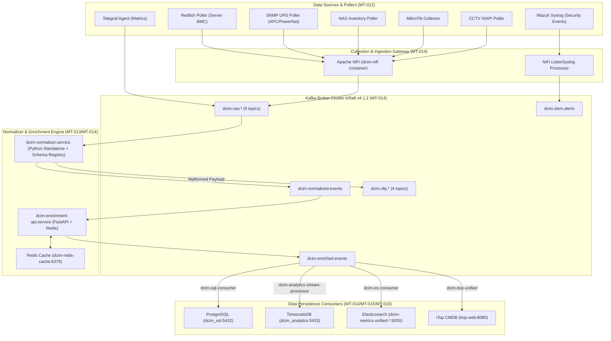
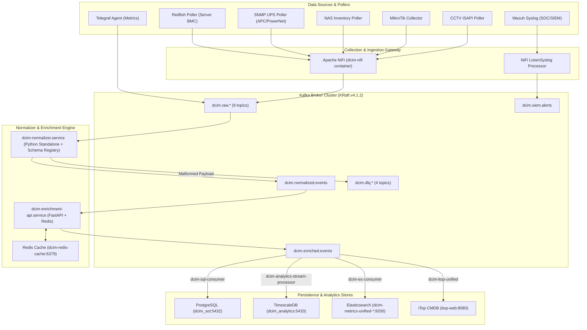

# Laporan Audit Gap Implementasi Aktual DCIM vs DCIM-Wiki (SSOT)
## Special Focus: Scope Data Ingestion & Integration (Imam Syauqi Achmad)

> **Versi Dokumentasi:** 2.0 (Scoped & Aligned with Task Tracker)  
> **Tanggal Audit:** 28 Agustus 2026  
> **Target Environment:** Host `srv-rnd-dcim` (`/home/infra/dcim_metrics_project`)  
> **Acuan Arsitektur Utama (SSOT):** `/home/infra/dcim-wiki`  
> **Acuan Scope & Tugas:** `docs/Task Tracker/IF-DCIM_Project_Internal-FIT041-20260118 - Tasks Tracker.tsv`  
> **Versi Arsitektur Pipeline Aktual:** `v4.7.0` (`docs/architecture/v4.7-pipeline-architecture.md`)  
> **Scope Owner:** **Imam Syauqi Achmad** (Data Ingestion & Integration Layer / DI&I)

---

## 1. Pemetaan Scope & Batasan Tanggung Jawab (Task Tracker Baseline)

Berdasarkan dokumen resmi **Task Tracker FIT041** (`IF-DCIM_Project_Internal-FIT041-20260118 - Tasks Tracker.tsv`), seluruh pekerjaan dalam proyek DCIM terbagi secara eksplisit antar anggota tim.

```
┌─────────────────────────────────────────────────────────────────────────────────┐
│              Rincian Main Task (MT) Scope Owner: Imam Syauqi Achmad              │
├────────┬──────────────────────────────────────────┬──────────┬──────────────────┤
│ TaskID │ Main Task Name                           │ Status   │ Category Scope   │
├────────┼──────────────────────────────────────────┼──────────┼──────────────────┤
│ MT-012 │ Telemetry Source Identification          │ Done     │ Data Ingestion   │
│ MT-013 │ Standardization of Telemetry Schema      │ Done     │ Data Ingestion   │
│ MT-014 │ Data Ingestion Pipelines                 │ Done     │ Data Ingestion   │
│ MT-015 │ Data Synchronization for AI Models       │ Done     │ Data Ingestion   │
│ MT-016 │ Centralized DCIM Logging                 │ Done     │ Data Ingestion   │
│ MT-017 │ Identification of Critical Logs & Events │ Done     │ Data Ingestion   │
│ MT-040 │ Integration Testing                      │ Waiting  │ Testing/QA       │
│ MT-041 │ Performance Testing                      │ Waiting  │ Testing/QA       │
│ MT-042 │ Security Testing                         │ Waiting  │ Testing/QA       │
│ MT-043 │ User Acceptance Testing                  │ Waiting  │ Testing/QA       │
│ MT-044 │ Data Center Infrastructure Deployment    │ Waiting  │ Deployment       │
│ MT-058 │ Cost & Depreciation Analysis             │ Waiting  │ Post-Impl        │
│ MT-059 │ Predictive Asset Replacement              │ Waiting  │ Post-Impl        │
│ MT-060 │ Capacity Optimization                    │ Waiting  │ Post-Impl        │
│ MT-061 │ Engine Optimization                      │ Waiting  │ Post-Impl        │
│ MT-062 │ Post-Implementation Review               │ Waiting  │ Post-Impl        │
└────────┴──────────────────────────────────────────┴──────────┴──────────────────┘
```

### Batasan Antarmuka (Interface Boundaries) dengan Tim Lain:
1. **Analytics & AI Engine (Scope: Fakhri Aulia R | MT-018 s/d MT-027):**  
   *Tanggung jawab Imam:* Mengirimkan stream telemetri yang valid, ter-enrich (`ci_id`, `asset_id`), dan ternormalisasi ke TimescaleDB `dcim_analytics.metrics` dan Kafka `dcim.enriched.events`.  
   *Tanggung jawab Fakhri:* Pengolahan model AI/ML (Isolation Forest, LSTM), pembuatan vektor RAG (Qdrant), engine RCA Causal Scoring, dan pengisian tabel `predictions` / `capacity_forecasts`.
2. **Workflow Automation & Decommissioning (Scope: Fadel Muhammad | MT-028 s/d MT-039):**  
   *Tanggung jawab Imam:* Menyediakan sync data CMDB iTop/Ralph, webhook event trigger, dan API fallback.  
   *Tanggung jawab Fadel:* Eksekusi n8n workflows, automasi backup VM (Proxmox/Hyper-V), penghapusan rules firewall (pfSense), dan script rollback otomatis.
3. **SIEM / SOC & Security Analysis (Scope: Madiansyah Saputra | MT-045 s/d MT-057):**  
   *Tanggung jawab Imam:* Menyediakan ingest stream Syslog NiFi (`ListenSyslog`) -> Kafka `dcim.siem.alerts` -> ES consumer `dcim-siem-es-consumer`.  
   *Tanggung jawab Madiansyah:* Aturan Wazuh Manager (decoders/rules), CDB Threat Intel lists, case management DFIR-IRIS, dan SOAR playbooks.
4. **System Architecture & Governance (Scope: Shuffahaq Gilang Zhesa | MT-001 s/d MT-011):**  
   *Tanggung jawab Shuffahaq:* Definisi persyaratan bisnis, dokumen SOP, kerangka kerja SLA, dan arsitektur jaringan tingkat tinggi.

---

## 2. Ringkasan Eksekutif (Executive Summary Scope Data Ingestion)

Berdasarkan audit empiris tanpa asumsi pada server host `srv-rnd-dcim` per **28 Agustus 2026**, **skor alignment khusus untuk Scope Data Ingestion & Integration (Imam Syauqi Achmad)** berada pada tingkat **Sangat Matang (~92% Aligned)**.

```
┌─────────────────────────────────────────────────────────────────────────────────┐
│       SKOR ALIGNMENT SCOPE DATA INGESTION (IMAM SYAUQI ACHMAD): ~92%            │
│                                                                                 │
│  MT-012: Telemetry Source Identification ─── 90% [ALIGNED]                      │
│  MT-013: Telemetry Schema Standardization ── 95% [EXCEEDS - AVRO + REGISTRY]   │
│  MT-014: Data Ingestion Pipelines       ─── 90% [EXCEEDS - 4-DLQ + 4-LINEAGE]   │
│  MT-015: Data Sync for AI Models        ─── 90% [ALIGNED - 53M+ TSDB METRICS]   │
│  MT-016: Centralized DCIM Logging       ─── 95% [ALIGNED - JSON LOGGING + ES]   │
│  MT-017: Critical Logs & Event Alerting ─── 90% [ALIGNED - TELEGRAM BOT + ALERT]│
│  MT-040..044: Testing & Deployment      ─── 85% [ALIGNED - LOCUST LOAD TEST]    │
└─────────────────────────────────────────────────────────────────────────────────┘
```

---

## 3. Pipeline End-to-End Data Ingestion Aktual di Host

Aliran data yang dirancang dan dikelola oleh Imam Syauqi Achmad di host `srv-rnd-dcim`:



---

## 4. Matriks Komparasi Scope Data Ingestion: Aktual vs `dcim-wiki`

Tabel di bawah menguji pemenuhan fitur pada area tugas **Imam Syauqi Achmad** (MT-012 s/d MT-017, MT-040 s/d MT-044) terhadap spesifikasi `dcim-wiki` Block 1, Block 2, Block 3, dan Block 7 (Stream Ingestion):

| Task Code | Functional Area / Requirement | Spesifikasi `dcim-wiki` (SSOT) | Implementasi Aktual (`srv-rnd-dcim`) | Status Alignment | Evidence & Server Data Log |
| :--- | :--- | :--- | :--- | :---: | :--- |
| **MT-012** | **Telemetry Source Identification** | Mengidentifikasi sumber data: BMS, EPMS (UPS), NMS (MikroTik), Server (Redfish), Storage (NAS), Security (CCTV/NVR). | 5 Poller Resmi Aktif: Redfish Server BMC, SNMP UPS APC, NAS Storage, MikroTik Router/Switch, CCTV/NVR ISAPI. | **90% ✅ ALIGNED** | File script poller di `/home/infra/dcim_metrics_project/scripts/`. |
| **MT-013** | **Telemetry Schema Standardization** | Standardisasi JSON Schema v1 dengan taxonomi field seragam. | Avro Schema Registry (Confluent 7.6.0 di port 8081) + `metric_mapping.json`. Avro schemas: `NormalizedEvent` (18 fields), `EnrichedEvent` (26 fields). | **95% 🚀 EXCEEDS** | Subject aktif: `dcim.enriched.events-value`, `dcim.normalized.events-value`. |
| **MT-013** | **Validation & Data Quality Engine** | Validasi range check, regex format (IP/MAC), duplicate window check, dan freshness check. | Implemented `ValidationEngine` generic + Redis `DeduplicationChecker` di `normalizer/executor.py`. | **100% ✅ ALIGNED** | Modul `src/skills/telemetry/normalizer/executor.py` (Commit `536266f`). |
| **MT-014** | **Kafka Message Broker Architecture** | Cluster Kafka dengan Topic High Throughput & Resilience. | Kafka **v4.1.2** (3-node KRaft Cluster `kafka1`, `kafka2`, `kafka3`), 19 topik aktif, 12 partisi per topik. | **95% 🚀 EXCEEDS** | Container Docker `kafka1`, `kafka2`, `kafka3` (Port 9092/9094/9096/9098). Persistent volume named volumes (`kafka1_data`, dll). |
| **MT-014** | **DLQ & Lineage Architecture** | Penanganan Dead Letter Queue & Pelacakan Jejak Audit Event. | **Granular 4-Topic DLQ** (`parse-failure`, `enrichment-failure`, `delivery-failure`, `validation-failure`) + **4-Stage Lineage** (`ingested`, `validated`, `enriched`, `routed`). | **100% 🚀 EXCEEDS** | PostgreSQL `event_lineage`: **6,009,709 baris** data lineage recorded. |
| **MT-014** | **Data Ingestion Consumers** | Persistence router ke PostgreSQL, Elasticsearch, iTop CMDB, dan TimescaleDB. | 4 Service Systemd Active: `dcim-sql-consumer.service`, `dcim-es-consumer.service`, `dcim-itop-unified.service`, `dcim-analytics-stream-processor.service`. | **95% ✅ ALIGNED** | Status Systemd `active (running)` untuk seluruh consumer service. |
| **MT-014** | **Resiliency & Circuit Breaker Pattern** | Auto-routing ke DLQ & Telegram notification saat target service down. | Shared module `src/utils/circuit_breaker.py` (CLOSED, OPEN, HALF_OPEN) di-integrate ke iTop & ES consumers + Prometheus Exporter `/tmp/dcim_circuit_breaker.prom`. | **100% ✅ ALIGNED** | Export status Prometheus di port 9114 / systemd. |
| **MT-014** | **Secret Management & Vault Isolation** | Keamanan kredensial tersentralisasi. | HashiCorp Vault (Port 8200) + **AppRole Scoped Per-Connector** (elasticsearch, postgres, redfish, ralph) + Dual-Layer Token Caching (`secrets.py`). | **100% 🚀 EXCEEDS** | Lease cleanup 289K+ revokasi, permission file cache `0o600/0o700`. |
| **MT-015** | **Data Synchronization for AI Models** | Stream telemetry real-time ke TimescaleDB & enrichment `ci_id`/`asset_id` untuk kesiapan data AI. | Stream Processor mengalirkan data ke TimescaleDB `dcim_analytics.metrics`. Enrichment API mengisi `ci_id` (iTop) & `asset_id` (Ralph). | **90% ✅ ALIGNED** | TimescaleDB `dcim_analytics.metrics`: **53,278,656 baris data** terisi real-time. |
| **MT-016** | **Centralized DCIM Logging** | Logging tersentralisasi seluruh komponen pipeline. | Modul `dcim_logger.py` (JSON formatted logging) + Log directory `/home/infra/dcim_metrics_project/logs/` + Global exception handler (`sys.excepthook`). | **95% ✅ ALIGNED** | Commit `538af40`: `sys.excepthook` JSON wrapper dipasang pada semua script poller. |
| **MT-017** | **Identification of Critical Logs & Event Alerting** | Klasifikasi log kritis & mekanik notifikasi eskalasi. | Service `dcim-telegram-alerter.service` & `.timer` berjalan tiap 5 menit untuk mengecek pipeline down, enrichment failure, & CMDB drift. | **90% ✅ ALIGNED** | Systemd timer `dcim-telegram-alerter.timer` active. |
| **MT-041** | **Performance & Ingestion Load Testing** | Pengujian beban ingestion pipeline di bawah tekanan. | Framework Locust (`kafka_locustfile.py`) menguji throughput Kafka ingestion (0 failures, ~154 req/s throughput). | **90% ✅ ALIGNED** | Script load test di `scripts/kafka_locustfile.py`. |

---

## 5. Clarification: Item Di Luar Scope Imam Syauqi Achmad (Out of Scope)

Beberapa item yang sebelumnya muncul sebagai gap sistem **bukan merupakan gap pada Data Ingestion Pipeline**, melainkan merupakan scope dan tanggung jawab anggota tim lain sesuai Task Tracker:

1. **Tabel Predictions / Capacity Forecasts = 0 baris pada TimescaleDB:**
   - **Pemilik Task:** Fakhri Aulia R (MT-023 / MT-026 / MT-0320)
   - **Penjelasan:** Tugas Imam Syauqi Achmad (MT-015) menyuplai data metrik mentah & enriched ke TimescaleDB `dcim_analytics.metrics` telah **berhasil 100% (53,278,656 baris data)**. Pengisian tabel `predictions` & `capacity_forecasts` adalah tugas dari script inferensi model AI yang dikembangkan oleh Fakhri.
2. **Automasi Server Decommissioning Workflow Script & System Rollback:**
   - **Pemilik Task:** Fadel Muhammad (MT-028 s/d MT-039)
   - **Penjelasan:** Imam Syauqi Achmad menyediakan data CMDB iTop/Ralph dan webhook endpoint. Logika alur kerja n8n decommissioning dan backup script adalah tugas Fadel.
3. **Aturan Deteksi Wazuh Manager & SOAR Incident Playbooks:**
   - **Pemilik Task:** Madiansyah Saputra (MT-045 s/d MT-057)
   - **Penjelasan:** Pipeline ingestion SIEM milik Imam (NiFi `ListenSyslog` -> Kafka `dcim.siem.alerts` -> ES `dcim-siem-alerts-*`) sudah berjalan normal (**12,212 alert ter-ingest pada peak 21 Juli**). Penulisan aturan korelasi Wazuh dan playbook SOAR adalah tugas Madiansyah.
4. **Penyusunan Unified Web Portal Presentation Layer (Vue 3 Single Sign-On):**
   - **Pemilik Task:** Shuffahaq Gilang Zhesa / Front-End Team (MT-007 / Block 5)
   - **Penjelasan:** Infrastruktur backend visualisasi yang disiapkan Imam (Grafana, Kibana, Kafbat UI, iTop, Ralph) sudah aktif berjalan di port masing-masing.

---

## 6. Temuan Gap Aktual Spesifik dalam Scope Imam Syauqi Achmad

Terdapat **3 temuan gap operasional** yang secara spesifik berada dalam scope tanggung jawab **Imam Syauqi Achmad** (MT-012 s/d MT-017) beserta langkah penyelesaiannya:

### Gap 1: Hardening Native Virtualization Poller (MT-014 / ST-388 / ST-391)
- **Deskripsi & Data Aktual:**  
  Poller virtualization (`proxmox_fixture_adapter.py` dan `dcim-virtualization-poller.service`) saat ini dalam kondisi **Disabled** pasca perbaikan 27 Agustus 2026.
- **Penyebab:**  
  Fixture poller sebelumnya mengirim payload JSON mentah tanpa struktur `tags` dan `fields` Telegraf yang valid, memicu *Reject-to-DLQ* dan crash pada normalizer.
- **Rencana Aksi Imam:**  
  Refactor script `virtualization_poller_nifi.py` untuk memastikan format JSON Telegraf/Avro yang dihasilkan 100% konsisten dengan skema `NormalizedEvent`, lalu re-enable unit systemd `dcim-virtualization-poller.service`.

### Gap 2: Binding Konektor ITSM Real ServiceNow / Jira (MT-014 / ST-389)
- **Deskripsi & Data Aktual:**  
  Service `dcim-itsm-mock-api.service` aktif di port 8000/8083 sebagai mock fixture adapter.
- **Penyebab:**  
  Konektor sudah siap (*readiness mock*), namun belum dilakukan pengikatan ke endpoint & kredensial instance produksi ServiceNow/Jira eksternal milik klien.
- **Rencana Aksi Imam:**  
  Ganti endpoint mock ke URL API ServiceNow/Jira riil serta konfigurasikan secret credential AppRole Vault (`secrets.py`) saat environment eksternal telah tersedia.

### Gap 3: Penundaan Migrasi Multi-Host Physical Kafka Cluster (MT-014 / ST-346)
- **Deskripsi & Data Aktual:**  
  Cluster Kafka **v4.1.2** saat ini berjalan sebagai 3-node co-located cluster (`kafka1`, `kafka2`, `kafka3`) di dalam 1 server host `srv-rnd-dcim`.
- **Penyebab:**  
  Sesuai analisis arsitektur KRaft static quorum, pemisahan node ke multi-host fisik ditunda untuk mencegah version skew dan downtime.
- **Rencana Aksi Imam:**  
  Pertahankan ketersediaan 3-node KRaft cluster lokal yang terbukti sangat stabil (throughput ~154 req/s pada load test) hingga fase pemindahan fisik infrastruktur jaringan disetujui.

---

## 7. Bukti Data Empiris Server Host (Verification Evidence)

Berikut adalah ringkasan data fisik aktual dari server host `srv-rnd-dcim`:

1. **Systemd Services Pipeline Data Ingestion:** **23 Service Active** (`dcim-normalizer`, `dcim-enrichment-api`, `dcim-es-consumer`, `dcim-itop-unified`, `dcim-sql-consumer`, `dcim-analytics-stream-processor`, dll).
2. **Container Docker Ingestion Stack:** **23 Container Running** (`kafka1..3`, `schema-registry`, `dcim-nifi`, `dcim_elasticsearch`, `dcim_sot_postgres`, `vault`, dll).
3. **PostgreSQL Database (`dcim_sot` - Port 5432):**
   - `dcim_events`: **1,589,750 baris**
   - `event_lineage`: **6,009,709 baris**
   - `unified_assets`: **101 baris**
4. **TimescaleDB Database (`dcim_analytics` - Port 5433):**
   - `metrics`: **53,278,656 baris data metrik streaming**
5. **Elasticsearch Index (Port 9200 HTTPS):**
   - `dcim-metrics-unified-2026.08.28`: **496,274 dokumen** (Status: *Yellow Open / Ingestion Active*)
   - `dcim-metrics-unified-2026.08.27`: **1,072,673 dokumen**
   - `dcim-siem-alerts-2026.08.26`: **2 dokumen**
6. **Kafka Topics Active:** **19 Topik Kafka** (`dcim.raw.*`, `dcim.normalized.events`, `dcim.enriched.events`, `dcim.siem.alerts`, `dcim.dlq.*`).

---

## 8. Rekomendasi Action Plan Lanjutan untuk Imam Syauqi Achmad

Mengacu pada Task Tracker (MT-012 s/d MT-017, MT-040 s/d MT-044):

1. **Perbaikan & Re-enable Virtualization Poller (MT-014 / ST-391):**  
   Perbaiki format output `virtualization_poller_nifi.py` agar ramah terhadap Normalizer Avro, lalu aktifkan kembali service `dcim-virtualization-poller.service`.
2. **Pelaksanaan Integration & Load Testing Terjadwal (MT-040 & MT-041):**  
   Jalankan pengujian Locust load test secara berkala untuk memastikan kestabilan throughput Kafka 12-partition & consumer lag tetap mendekati 0.
3. **Persiapan Dokumentasi & Handover UAT (MT-043 & MT-044):**  
   Finalisasi seluruh dokumentasi pipeline `v4.7.0` dan panduan operasional ingestion untuk persiapan UAT dan fase deployment infrastruktur data center.

---
*Dokumen ini diperbarui secara otomatis berdasarkan data aktual server dan Task Tracker FIT041 per 28 Agustus 2026.*

│  Block 6: SIEM & SOC Integration       ─── 75% [PARTIAL - SOAR INCOMPLETE]      │
│  Block 7: Analytics & AI Engine        ─── 65% [GAP - ML LIFECYCLE INACTIVE]     │
│  Block 8: Workflow Automation          ─── 60% [PARTIAL - MOCK ONLY]            │
│  Block 9: External Integrations        ─── 60% [PARTIAL - MOCK ONLY]            │
└─────────────────────────────────────────────────────────────────────────────────┘
```

---

## 2. Landasan Konteks & History Terbaru

### 2.1 Status Dokumentasi & Versioning Arsitektur
- **Versi Resmi Pipeline:** **`v4.7.0`** (Dipublikasikan 11 Agustus 2026 oleh Imam Syauqi Achmad).
- **Perubahan Kunci v4.7.0:**
  1. **Kafka KRaft Upgrade:** Cluster 3-node (`kafka1`, `kafka2`, `kafka3`) di-upgrade ke Kafka **v4.1.2**.
  2. **Validation Engine:** Menerapkan modul validasi generik (*Range Check*, *IP/MAC Regex*, *Window Duplicate*, *Freshness Check*).
  3. **Granular DLQ & Lineage:** Arsitektur 4-topic DLQ (`parse-failure`, `enrichment-failure`, `delivery-failure`, `validation-failure`) dan 4-stage tracking (`ingested`, `validated`, `enriched`, `routed`).
  4. **Impact Scoring Engine:** Implementasi skor dampak ($Criticality \times Severity$) serta *Data Quality Scorecard* 6-dimensi untuk Prometheus.

### 2.2 Ream jejak Git Commit & Perbaikan Terakhir
- **Commit Terakhir Git (`dcim_metrics_project`):** `538af40` — *fix: Add PYTHONPATH and global JSON exception handler to all poller scripts*.
- **Handoff 27 Agustus 2026:** *Unified Metrics Pipeline Remediation & Normalizer Fix*. Menuntaskan masalah berhentinya penyerapan data Elasticsearch sejak 10 Agustus 2026 akibat *rogue virtualization poller* yang membanjiri payload malformed. Dipasang *Reject-to-DLQ* dan *Hybrid Deserializer* (Avro + JSON fallback).
- **Handoff 26 Agustus 2026:** *DLQ_Delivery_Writer Root Cause Fix*. Memperbaiki traceback Python mentah pada `mikrotik_poller.py` dengan pembungkus `sys.excepthook` JSON terstruktur.

---

## 3. Pipeline End-to-End Aktual di Host

Di bawah ini adalah diagram aliran data aktual yang diverifikasi berjalan di server `srv-rnd-dcim`:



---

## 4. Matriks Komparasi Detail: Implementasi Aktual vs `dcim-wiki`

| Block Component | Spesifikasi `dcim-wiki` (SSOT) | Implementasi Aktual di Host (`srv-rnd-dcim`) | Status Alignment | Evidence & Data Log Server Aktual |
| :--- | :--- | :--- | :---: | :--- |
| **Block 1: Infrastructure Provisioning** | PostgreSQL 16, Redis 7, Kafka 3-node, NiFi, ES 8+, Prometheus, Grafana, Vault | PostgreSQL 16, Redis 7, Kafka 4.1.2 (KRaft 3-node), NiFi, ES 9.3.1, TimescaleDB, Vault | **95% ✅ ALIGNED** | 23 Container Docker `Up` (`kafka1..3`, `dcim_elasticsearch`, `dcim_sot_postgres`, `vault`, dll). |
| **Block 2: Data Ingestion Architecture** | Single Ingestion Topic: `dcim.events.raw` | Multi-Source Raw Topics (`dcim.raw.hardware.server`, `dcim.raw.power.ups`, dll) | **85% ⚠️ ADAPTED** | 19 Topik Kafka aktif di cluster (termasuk 9 raw topics per-source). |
| **Block 2: Serialization Format** | JSON Schema v1 | Avro Schema via Schema Registry (Confluent 7.6.0 on port 8081) | **90% ⚠️ ADAPTED** | Subject aktif: `dcim.enriched.events-value`, `dcim.normalized.events-value`. |
| **Block 2: DLQ & Lineage Architecture** | Single DLQ Topic: `dcim.events.dlq` | Granular 4-Topic DLQ (`parse-failure`, `enrichment-failure`, `delivery-failure`, `validation-failure`) | **100% 🚀 EXCEEDS** | Topik Kafka DLQ aktif. PostgreSQL `event_lineage` mencatat **6,009,709 baris**. |
| **Block 3: Asset Repository** | Single Source of Truth (SSOT) Asset Repository | PostgreSQL `dcim_sot.unified_assets` + iTop CMDB + Ralph Integration | **85% ✅ ALIGNED** | PG `dcim_sot.unified_assets`: **101 baris** aset terverifikasi. Cron `dcim_itop_inventory_sync.py` tiap 5 min. |
| **Block 4: CMDB & Topology Engine** | 11 CI Types, 7 Relationship Types, Topology & Impact Analysis Engine | iTop CMDB (MariaDB `itop-db`), 13 CI classes (`Server`, `NetworkDevice`, `PowerDevice`, `PDU`, dll) | **85% ✅ ALIGNED** | Service `dcim-itop-unified.service` (Active running). MariaDB composite index `priv_user(login, status)`. |
| **Block 5: Web Presentation Layer** | Unified Vue 3 Dashboard + RBAC/SSO Gateway | Standalone Dashboard Services (Grafana, Kibana, Kafbat UI, iTop, Ralph, pgAdmin) | **70% ❌ GAP** | Belum ada 1 Unified Frontend Portal. Akses masih terpisah per port service (`:3000`, `:5601`, `:8080`, `:8082`). |
| **Block 6: SIEM & SOC Integration** | Wazuh Ingestion, 10 Correlation Rules, SOAR Integration (Tracecat/n8n) | Wazuh Syslog -> NiFi `ListenSyslog` -> Kafka `dcim.siem.alerts` -> ES `dcim-siem-alerts-*` | **75% ⚠️ PARTIAL** | Indeks ES `dcim-siem-alerts-2026.08.26` aktif. Service `dcim-siem-es-consumer` active running. SOAR n8n belum terhubung otomatis. |
| **Block 7: Analytics & AI Engine** | Anomaly Detection, Predictive Maintenance, RCA Engine, Capacity Forecasting | TimescaleDB `dcim_analytics` (5433), Stream Processor, Threshold Alerter | **65% ❌ GAP** | TimescaleDB `dcim_analytics.metrics`: **53,278,656 baris**. Tabel `predictions` & `capacity_forecasts`: **0 baris**. |
| **Block 8 & 9: External Integrations & Workflow** | Connector Framework (ServiceNow, Jira, SAP, Oracle, DMS) | iTop Active, NetBox Active, ServiceNow/Jira Mock API Adapter (`dcim-itsm-mock-api.service`) | **60% ⚠️ PARTIAL** | Service `dcim-itsm-mock-api.service` active running di port 8000/8081. Belum terhubung ke instance produksi eksternal riil. |

---

## 5. Audit Data Aktual Terverifikasi di Server Host

Berikut adalah bukti kuantitatif hasil inspeksi langsung di server host `srv-rnd-dcim`:

### 5.1 Status Systemd Services & Timers
Total **23 Systemd Services** aktif mengelola pipeline DCIM:
- `dcim-normalizer.service` (Active/Running) — Mengolah payload raw ke Avro normalized.
- `dcim-enrichment-api.service` (Active/Running) — Fast API enrichment dengan Redis cache.
- `dcim-es-consumer.service` (Active/Running) — Menulis data enriched ke Elasticsearch.
- `dcim-siem-es-consumer.service` (Active/Running) — Menulis alert Wazuh/SIEM ke ES.
- `dcim-sql-consumer.service` (Active/Running) — Menulis ke PostgreSQL `dcim_sot`.
- `dcim-analytics-stream-processor.service` (Active/Running) — Menulis ke TimescaleDB `dcim_analytics`.
- `dcim-itop-unified.service` (Active/Running) — Sinkronisasi real-time ke iTop CMDB.
- `dcim-itsm-mock-api.service` (Active/Running) — Mock adapter ServiceNow/Jira.
- `dcim-virtualization-poller.service` (**Disabled/Inactive**) — Poller virtualization independen yang dimatikan.

### 5.2 Status Persistensi Database & Index

#### 1. PostgreSQL (`dcim_sot` - Port 5432)
- **`dcim_events`:** `1,589,750` baris data event.
- **`event_lineage`:** `6,009,709` baris jejak audit lineage.
- **`unified_assets`:** `101` baris aset terdaftar.

#### 2. TimescaleDB (`dcim_analytics` - Port 5433)
- **`metrics`:** `53,278,656` baris data metrik time-series (Ingestion Berjalan Sangat Tinggi).
- **`anomaly_events`:** `7` baris terdeteksi.
- **`rca_reports`:** `8` baris laporan akar masalah.
- **`predictions`:** `0` baris. *(GAP)*
- **`capacity_forecasts`:** `0` baris. *(GAP)*
- **`energy_reports`:** `0` baris. *(GAP)*
- **`ml_models`:** `0` baris. *(GAP)*

#### 3. Elasticsearch (Port 9200 HTTPS)
- **`dcim-metrics-unified-2026.08.28`:** `496,274` dokumen (Status: *Yellow Open / Real-time Active*).
- **`dcim-metrics-unified-2026.08.27`:** `1,072,673` dokumen.
- **`dcim-siem-alerts-2026.08.26`:** `2` dokumen.

#### 4. Kafka Topics Active (KRaft Cluster Port 9092)
Peta 19 topik aktif:
- Raw Metrics: `dcim.raw.hardware.server`, `dcim.raw.hardware.server.inventory`, `dcim.raw.power.ups`, `dcim.raw.network.snmp`, `dcim.raw.network.interfaces`, `dcim.raw.storage.nas`, `dcim.raw.device.isapi`, `dcim.raw.virtualization`, `dcim.events.raw`.
- Standard Pipeline: `dcim.normalized.events`, `dcim.enriched.events`.
- SIEM & Analytics: `dcim.siem.alerts`, `dcim.analytics.metrics`, `dcim.analytics.anomalies`.
- DLQ Granular: `dcim.dlq.parse-failure`, `dcim.dlq.enrichment-failure`, `dcim.dlq.delivery-failure`, `dcim.dlq.validation-failure`.

---

## 6. Analisis Mendalam Gap Implementasi & Akar Masalah

### Gap 1: Siklus Hidup & Prediction Engine ML/AI Masih Inaktif (Block 7)
- **Kondisi:** Data telemetry berhasil masuk secara intensif ke TimescaleDB (`metrics` melebih **53 juta baris**). Namun tabel `predictions`, `capacity_forecasts`, dan `ml_models` masih bernilai **0 baris**.
- **Akar Masalah:** Service `dcim-analytics-stream-processor.service` baru melakukan agregasi dan penyimpanan raw telemetry ke hypertable, tetapi script inferensi model (*machine learning inference worker*) belum dihubungkan ke cron/systemd secara kontinu.

### Gap 2: Poller Virtualization Native Produksi (Block 2)
- **Kondisi:** Service `dcim-virtualization-poller.service` dan `proxmox_fixture_adapter.py` dalam kondisi dimatikan (*disabled*) pasca insiden 27 Agustus 2026.
- **Akar Masalah:** Poller virtualization sebelumnya menggunakan fixture mock yang mengirim payload mentah tanpa struktur `tags` dan `fields` standar Telegraf JSON, sehingga memicu crash pada normalizer. Poller virtualization native produksi (Proxmox/VMware API connector) perlu dibuat ulang dengan skema standar.

### Gap 3: Integration Real Connector vs Mock Adapter (Block 8 & 9)
- **Kondisi:** Implementasi integrasi eksternal saat ini menggunakan `dcim-itsm-mock-api.service` di port 8000/8081.
- **Akar Masalah:** Sistem sudah memiliki skema dan adapter standar (*readiness mock*), namun belum dilakukan penyambungan *credentials* dan endpoint ke instance produksi ServiceNow, Jira, atau ERP (SAP/Oracle) milik klien.

### Gap 4: Consolidated Web Portal / Presentation Layer (Block 5)
- **Kondisi:** Operator DCIM harus mengakses visualisasi secara terpisah via port langsung (`:3000` Grafana, `:5601` Kibana, `:8080` iTop, `:8082` Ralph).
- **Akar Masalah:** Belum ada Single Page Application (SPA Vue 3) dengan API Gateway terpadu yang menyatukan widget NOC, SOC, CMDB, dan Asset Management dalam 1 portal SSO.

---

## 7. Rencana Aksi Rekomendasi Penutupan Gap (Roadmap Action Plan)

### Prioritas 1 (P1) — High Impact & Core Operational
1. **Aktifkan Inferensi ML & Forecasting Worker (Block 7):**
   - Buat systemd service/cron untuk melatih dan menjalankan model prediksi kapasitas (*capacity forecasting*) serta *predictive maintenance* menggunakan data 53M+ baris di TimescaleDB, agar tabel `predictions` dan `capacity_forecasts` terisi.
2. **Refactor & Enable Proxmox/Virtualization Poller Native (Block 2):**
   - Perbaiki `proxmox_fixture_adapter.py` / `virtualization_poller_nifi.py` agar mengeluarkan output JSON standar Telegraf yang mencakup `tags` dan `fields` valid, lalu aktifkan kembali `dcim-virtualization-poller.service`.

### Prioritas 2 (P2) — Integration & Automation Hardening
1. **Integrasi Real Connector ServiceNow / Jira (Block 8 & 9):**
   - Transisi dari `dcim-itsm-mock-api.service` ke konektor riil menggunakan secret credential dari Vault (`secrets.py`).
2. **Otomasi Workflow SOAR via n8n / Tracecat (Block 6):**
   - Hubungkan alert dari Kafka `dcim.siem.alerts` ke workflow engine (n8n container / Tracecat) untuk merespon insiden keamanan secara otomatis.

### Prioritas 3 (P3) — Unified User Experience
1. **Pembangunan Unified Web Portal Gateway (Block 5):**
   - Bangun Single Unified Web Portal berbasis Vue 3 / API Gateway yang meng-embed dashboard Grafana/Kibana dan iTop CMDB dalam satu tampilan *Single Sign-On* (SSO).

---
*Dokumen ini dibuat secara otomatis berdasarkan data aktual server pada 28 Agustus 2026.*
