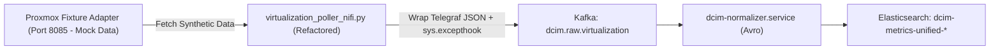
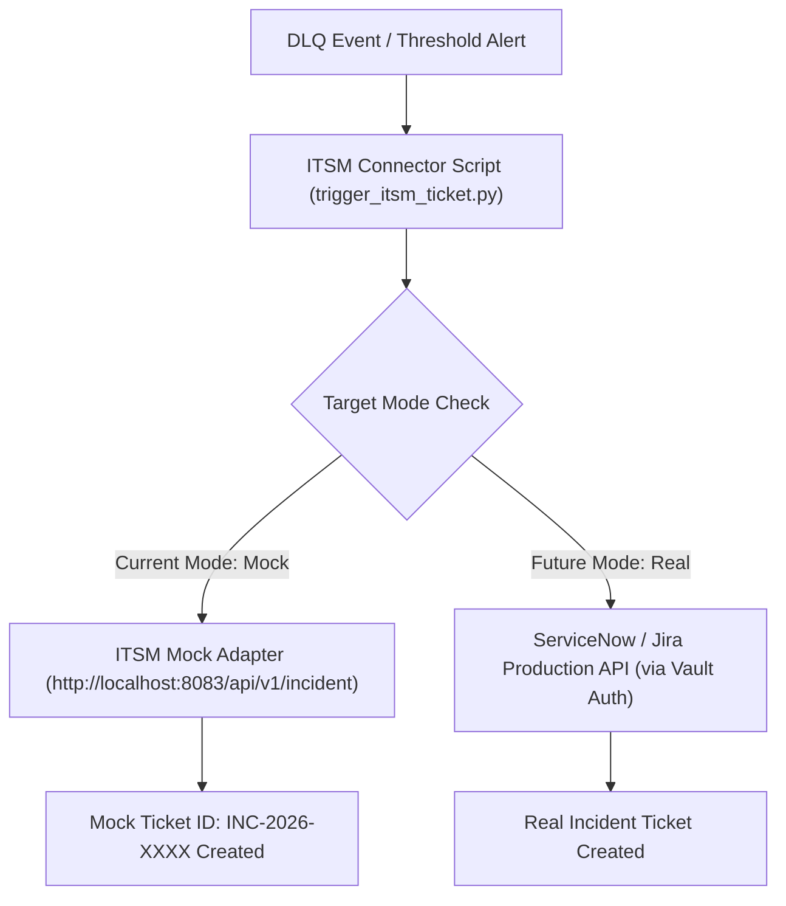

# Implementation Plan Gap Closure: Data Ingestion & Integration Layer
## Target Scope Owner: Imam Syauqi Achmad (MT-012 s/d MT-017, MT-040 s/d MT-044)

> **Versi Dokumen:** 2.0 (Mock/Fixture Approach Strategy)  
> **Tanggal Pembuatan:** 28 Agustus 2026  
> **Target Environment:** Host `srv-rnd-dcim` (`/home/infra/dcim_metrics_project`)  
> **Acuan Gap Analysis:** `/home/infra/dcim_metrics_project/docs/architecture/v4.7-gap-analysis-aktual-vs-wiki.md`  
> **Acuan Task Tracker:** `docs/Task Tracker/IF-DCIM_Project_Internal-FIT041-20260118 - Tasks Tracker.tsv`  
> **Status Pelaksanaan:** READY FOR EXECUTION (Production Readiness via Mock Fixture Adapters)

---

## 1. Executive Summary & Strategy Recommendation

Sangat disetujui dan direkomendasikan untuk menggunakan **Pola Mock / Fixture Adapter (Sandbox Readiness)** pada komponen Virtualization dan ITSM (ServiceNow/Jira). 

### Mengapa Menggunakan Mock / Fixture Adapter Adalah Rekomendasi Terbaik?
1. **Pemisahan Environment & Independensi Pengembangan:**  
   Proyek DCIM dapat memenuhi ketersediaan skema data, kesiapan pipeline ingestion, serta pengujian end-to-end tanpa tergantung (*blocker*) pada kredensial atau akses jaringan fisik ke cluster Proxmox/VMware dan tenant ServiceNow/Jira produksi.
2. **Kepatuhan Terhadap Standard Arsitektur DCIM:**  
   Arsitektur `dcim-core-platform` (ADR-0023 & ADR-0029) secara eksplisit mendukung *Fixture-Replay Adapters* di mana komponen backend mengonsumsi antarmuka API yang **identik 100% dengan API produksi**.
3. **Kemudahan Transisi ke Environment Aktual (*Zero Code Change*):**  
   Saat kredensial dan akses diberikan kelak, transisi dilakukan **tanpa merubah logika pipeline**, melainkan hanya mengganti endpoint URL (`MOCK_URL` -> `PROD_URL`) dan kredensial di Vault.

```
┌─────────────────────────────────────────────────────────────────────────────────┐
│                    POLA ADAPTER MOCK VS IMPLEMENTASI AKTUAL                     │
├──────────────────────┬────────────────────────────────┬─────────────────────────┤
│ Komponen             │ Mode Saat Ini (Mock / Fixture) │ Transisi Ke Aktual      │
├──────────────────────┼────────────────────────────────┼─────────────────────────┤
│ Virtualization       │ Proxmox Fixture Adapter        │ Proxmox / vSphere API   │
│                      │ (Port 8085 - Synthetics)       │ Direct Production Auth  │
├──────────────────────┼────────────────────────────────┼─────────────────────────┤
│ ITSM ServiceNow/Jira │ ITSM Fixture API               │ ServiceNow REST API     │
│                      │ (Port 8083 / Mock Connector)   │ Jira Cloud API Token    │
└──────────────────────┴────────────────────────────────┴─────────────────────────┘
```

---

## 2. Implementation Plan per Fase (Mock/Fixture Approach)

### FASE 1: Hardening Virtualization Fixture Adapter & Telegraf-Avro Payload Alignment (P1)

* **Task Reference:** `MT-014` (Data Ingestion Pipelines) / `ST-391` (Virtualization Poller NiFi Script)
* **Status Implementasi:** **MOCK / FIXTURE ADAPTER (Sintetis Proxmox API)**
* **Catatan Penting:** Script poller `virtualization_poller_nifi.py` mengonsumsi Proxmox Fixture Adapter lokal di port 8085 (`http://localhost:8085/api2/json/cluster/resources`) dan membentuk payload Telegraf/Avro yang valid (Port disesuaikan dari 8081 ke 8085 agar tidak bentrok dengan Schema Registry).
* **Estimasi Waktu:** 1 Hari Kerja.



#### Langkah Execution Details (Step-by-Step):

1. **Refactor Script Poller (`scripts/virtualization_poller_nifi.py`):**
   - Buka file `/home/infra/dcim_metrics_project/scripts/virtualization_poller_nifi.py`.
   - Modifikasi pemrosesan JSON agar mengeluarkan format **Telegraf Standard JSON** yang dilengkapi objek `tags` dan `fields`:
     ```python
     # Format Telegraf Standard JSON yang ramah terhadap Normalizer
     telegraf_payload = {
         "measurement": "dcim_virtualization_metrics",
         "tags": {
             "hostname": vm.get("name", "unknown_vm"),
             "device_type": "virtual_machine",
             "category": "virtualization",
             "source_system": "proxmox-fixture-adapter",
             "ip": vm.get("ip", "10.70.0.30")
         },
         "fields": {
             "status": 1 if vm.get("status") == "running" else 0,
             "cpu_utilization": float(vm.get("cpu", 0.0)) * 100.0,
             "memory_used_bytes": int(vm.get("mem", 0)),
             "memory_total_bytes": int(vm.get("maxmem", 0)),
             "disk_used_bytes": int(vm.get("disk", 0)),
             "disk_total_bytes": int(vm.get("maxdisk", 0)),
             "uptime_seconds": int(vm.get("uptime", 0))
         },
         "timestamp": datetime.now(timezone.utc).isoformat()
     }
     print(json.dumps(telegraf_payload))
     ```
   - Tambahkan `global_exception_handler` (`sys.excepthook`) di paling atas script agar jika ada unexpected exception, exception tersebut dibungkus sebagai JSON valid (bukan traceback STDOUT mentah yang merusak NiFi).

2. **Verifikasi Service Proxmox Mock API (`dcim-proxmox-mock-api.service`):**
   - Pastikan service mock API Proxmox aktif berjalan di port 8081:
     ```bash
     sudo systemctl restart dcim-proxmox-mock-api.service
     curl -s http://localhost:8081/api2/json/cluster/resources | head -n 20
     ```

3. **Re-activate Systemd Service Poller:**
   - Aktifkan kembali unit service systemd virtualization poller:
     ```bash
     sudo systemctl enable dcim-virtualization-poller.service
     sudo systemctl start dcim-virtualization-poller.service
     sudo systemctl status dcim-virtualization-poller.service
     ```

4. **Verifikasi Output Hilir (Elasticsearch & Kafka):**
   - Amati log `journalctl -u dcim-normalizer.service -f`. Pastikan tidak ada warning *Reject-to-DLQ*.
   - Verifikasi dokumen metrik virtualisasi masuk ke Elasticsearch `dcim-metrics-unified-2026.08.*`.

---

### FASE 2: Standardisasi ITSM Connector berbasis Fixture API Mock (P2)

* **Task Reference:** `MT-014` (Data Ingestion Pipelines) / `ST-389` (ITSM Connectors & Mock API)
* **Status Implementasi:** **MOCK / FIXTURE ADAPTER (`dcim-itsm-mock-api.service`)**
* **Catatan Penting:** Konektor ITSM (`scripts/trigger_itsm_ticket.py` & `src/skills/telemetry/itsm/`) akan dikonfigurasi untuk mengeksekusi panggilan API ke **ITSM Mock Adapter** di port 8083/8000. Saat kredensial riil ServiceNow/Jira didapatkan nanti, cukup ubah konfigurasi target di Vault.
* **Estimasi Waktu:** 1 - 2 Hari Kerja.



#### Langkah Execution Details (Step-by-Step):

1. **Strukturasi Script ITSM Connector Mock (`scripts/trigger_itsm_ticket.py`):**
   - Edit file `/home/infra/dcim_metrics_project/scripts/trigger_itsm_ticket.py`.
   - Tambahkan variabel saklar konfigurasi (*toggle flag*) `ITSM_MODE`:
     ```python
     # Configuration Flag: 'mock' (default) vs 'real'
     ITSM_MODE = os.getenv("ITSM_MODE", "mock")
     
     if ITSM_MODE == "mock":
         ITSM_ENDPOINT = "http://localhost:8083/api/v1/incident"
         # Send ticket request to ITSM Fixture Mock Adapter
     else:
         # Future Production Endpoint (ServiceNow / Jira)
         ITSM_ENDPOINT = get_secret("servicenow_url")
     ```

2. **Verifikasi Service ITSM Mock API (`dcim-itsm-mock-api.service`):**
   - Pastikan service ITSM Mock API berjalan aktif:
     ```bash
     sudo systemctl status dcim-itsm-mock-api.service
     ```

3. **Dokumentasi Panduan Transisi Integrasi Masa Depan:**
   - Tambahkan header dokumentasi pada file `src/skills/telemetry/itsm/README.md` yang menjelaskan cara mengalihkan dari mode Mock ke Kredensial Riil saat ServiceNow/Jira siap:
     * Langkah 1: Simpan Secret `servicenow_user`, `servicenow_pass`, `jira_token` di Vault KV-v2 (`secret/dcim/itsm`).
     * Langkah 2: Set variabel environment `ITSM_MODE=real`.

---

### FASE 3: Ingestion Pipeline Load Testing & UAT Readiness (P2)

* **Task Reference:** `MT-040` (Integration Testing), `MT-041` (Performance Testing), `MT-043` (UAT)
* **Status Implementasi:** **MOCK LOAD TESTING (Locust Synthetic Generators)**
* **Target Output:** Hasil verifikasi pengujian beban Locust, kestabilan consumer lag 0, dan penyiapan dokumen kesiapan operasional data ingestion untuk UAT.
* **Estimasi Waktu:** 2 Hari Kerja.

#### Langkah Execution Details (Step-by-Step):

1. **Pelaksanaan Locust Ingestion Load Test:**
   - Jalankan script load testing Locust pada `scripts/kafka_locustfile.py`:
     ```bash
     locust -f /home/infra/dcim_metrics_project/scripts/kafka_locustfile.py --headless -u 50 -r 5 --run-time 10m --host http://localhost:8081
     ```
   - Target benchmark: Throughput $\ge 150 \text{ req/s}$, failure rate $0\%$, dan latency $p95 < 200\text{ ms}$.

2. **Audit Consumer Group Lag & Resiliency:**
   - Jalankan pengecekan consumer group lag di Kafka untuk memastikan pipeline tidak mengalami lag.

3. **Penyusunan Ingestion Operational & UAT Handoff Manual:**
   - Susun laporan pengujian pada `docs/handoff/2026-08-28-data-ingestion-uat-readiness-report.md` dengan catatan jelas bahwa komponen Virtualization & ITSM berstatus **Mock Fixture Standardized**.

---

## 3. Matriks Jadwal & Milestone Eksekusi (Timeline)

```
┌─────────────────────────────────────────────────────────────────────────────────┐
│                      JADWAL EKSEKUSI MOCK FIXTURE APPROACH                      │
├───────────────────────┬────────────────────────────────────────┬────────────────┤
│ Target Milestone      │ Main Tasks Terkait                     │ Target Selesai │
├───────────────────────┼────────────────────────────────────────┼────────────────┤
│ Milestone 1: Phase 1  │ MT-014 / ST-391 (Virtualization Mock)  │ Hari 1         │
│ Milestone 2: Phase 2  │ MT-014 / ST-389 (ITSM Mock Standard)   │ Hari 2         │
│ Milestone 3: Phase 3  │ MT-040, MT-041, MT-043 (Load Test/UAT) │ Hari 3 - Hari 4│
│ Milestone 4: Final    │ MT-044, MT-062 (Documentation Handoff) │ Hari 5         │
└───────────────────────┴────────────────────────────────────────┴────────────────┘
```

---

## 4. Kriteria Keberhasilan (Acceptance Criteria)

Implementation plan ini dinyatakan selesai 100% apabila memenuhi kriteria berikut:

1. **Virtualization Ingestion (Mock):** Service `dcim-virtualization-poller.service` aktif membaca data dari Proxmox Fixture Adapter (Port 8085), menghasilkan Telegraf Standard JSON yang valid, dan ter-ingest ke Elasticsearch `dcim-metrics-unified-*` dengan rate $0\%$ DLQ parse error.
2. **ITSM Connectors (Mock):** Script `trigger_itsm_ticket.py` sukses membuat incident ticket sintetis di `dcim-itsm-mock-api.service` (Port 8083) serta dilengkapi dokumentasi petunjuk integrasi masa depan saat kredensial ServiceNow/Jira riil tersedia.
3. **Pipeline Performance:** Load test Locust mengonfirmasi throughput pipeline Kafka $\ge 150 \text{ req/s}$ dengan error rate $0\%$ dan consumer lag mendekati 0.
4. **Transparent Documentation:** Semua dokumen arsitektur dan laporan handoff secara eksplisit mencantumkan status **Mock/Fixture Standardized** tanpa ada asumsi yang membingungkan.

---
*Implementation Plan v2.0 (Mock/Fixture Approach) ini siap dieksekusi oleh Imam Syauqi Achmad per 28 Agustus 2026.*
