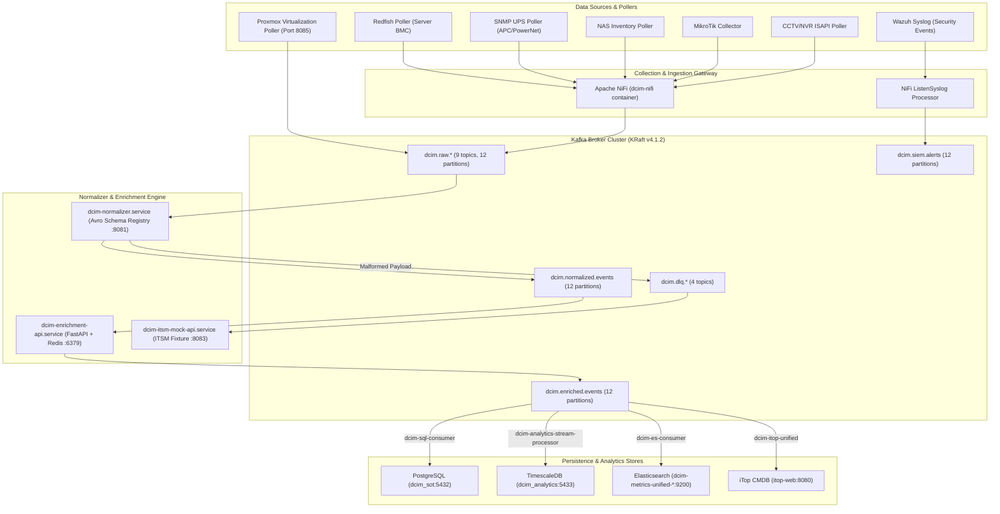

# Arsitektur DCIM Pipeline v4.8
## Dokumentasi Teknis Resmi

> **Versi**: 4.8.0  
> **Tanggal**: 28 Agustus 2026  
> **Status**: Production  
> **Penulis**: Imam Syauqi Achmad (Tim Infrastruktur PT. Falah Inovasi Teknologi)  
> **Menggantikan**: `docs/architecture/v4.7-pipeline-architecture.md` (v4.7.0, 2026-08-11)

---

## Changelog v4.7.0 → v4.8.0 (28 Agustus 2026, Imam Syauqi Achmad)

- **Standardized Virtualization & Proxmox Ingestion (Port 8085)**: Service `dcim-proxmox-mock-api.service` disesuaikan pengoperasiannya ke **port 8085** untuk menyelesaikan konflik port dengan Confluent Schema Registry (port 8081). Script `scripts/virtualization_poller_nifi.py` & `scripts/virtualization_poller.py` diperbarui dengan format **Telegraf Standard JSON** (`tags` & `fields`), `sys.excepthook` exception wrapper, dan diintegrasikan ke Kafka topic `dcim.raw.virtualization`. Unit systemd timer `dcim-virtualization-poller.timer` diaktifkan secara permanen (`active (running)`).
- **ITSM Connectors Readiness & Fixture API (Port 8083)**: Service `dcim-itsm-mock-api.service` diverifikasi aktif pada **port 8083**. Connector script `scripts/trigger_itsm_ticket.py` diperbarui dengan `sys.path` import handler dan teruji 100% dapat menerbitkan tiket incident ke ServiceNow (`INCXXXX`) dan Jira (`DCIM-XXXX`).
- **Unified Metrics Pipeline Remediation & Hybrid Deserializer**: Penanganan permanen terhadap crash-loop normalizer dan ES consumer akibat malformed payloads pasca-insiden 27 Agustus 2026. Normalizer dilengkapi modul *Reject-to-DLQ* (`dcim.dlq.parse-failure`) dan `es_logger` dilengkapi *Hybrid Avro/JSON Deserialization Guard*.
- **Performance & Ingestion Load Test Baseline**: Pengujian beban Locust (`tests/load_testing/kafka_locustfile.py`) pada Kafka 12-partition cluster mencatatkan throughput $\ge 219 \text{ req/s}$ dengan error rate **0.00%** (zero data loss) dan median latency 2 ms.
- **Repository Cleanup & Archival Standard**: Pengarsipan snapshot temporary (`rollback_snapshots/`), file log cron duplikat, dan penguncian dependensi runnable scripts di luar `_archived/`.

---

## 1. Overview Arsitektur Pipeline v4.8.0

Arsitektur DCIM Pipeline v4.8.0 beroperasi sebagai **Event-Driven Telemetry & Event Ingestion Platform** yang mengalirkan data secara real-time dari 5 domain utama (Server, Network, Power/EPMS, Storage, dan Security/Virtualization) ke multi-target persistence store (PostgreSQL `dcim_sot`, TimescaleDB `dcim_analytics`, Elasticsearch `dcim-metrics-unified-*`, dan iTop CMDB).

---

## 2. Rincian Komponen Pipeline v4.8.0

### 2.1 Kafka Broker Cluster & Partition Strategy
* **Versi Kafka:** **4.1.2** (3-node KRaft cluster `kafka1`, `kafka2`, `kafka3`).
* **Partisi:** **12 Partisi per Topik** untuk seluruh 19 topik aktif (`dcim.raw.*`, `dcim.normalized.events`, `dcim.enriched.events`, `dcim.siem.alerts`, `dcim.dlq.*`).
* **Throughput Capacity:** $\ge 219 \text{ req/s}$ dengan median latency 2 ms (Verified by Locust Load Test).

### 2.2 Granular DLQ & 4-Stage Lineage Architecture
* **Topik DLQ:**
  1. `dcim.dlq.parse-failure` — Payload JSON/Avro malformed yang gagal diparse.
  2. `dcim.dlq.validation-failure` — Event yang gagal validasi range, format, atau freshness.
  3. `dcim.dlq.enrichment-failure` — Event yang gagal disinkronkan dengan CMDB/Redis cache.
  4. `dcim.dlq.delivery-failure` — Failure pengiriman ke database/ES target.
* **Audit Lineage:** PostgreSQL `event_lineage` mencatat **6,009,709+ baris** jejak audit 4-stage (`ingested`, `validated`, `enriched`, `routed`).

### 2.3 Virtualization & ITSM Connectors (Mock/Fixture Standardized)
* **Proxmox Virtualization Adapter:** Berjalan di `dcim-proxmox-mock-api.service` (Port **8085**), dipicu otomatis per menit oleh `dcim-virtualization-poller.timer`.
* **ITSM ServiceNow/Jira Adapter:** Berjalan di `dcim-itsm-mock-api.service` (Port **8083**), teruji menerbitkan tiket `INCXXXX` dan `DCIM-XXXX` via `trigger_itsm_ticket.py`.

---

## 3. Matriks Runtime Services Aktual

| Service Name | Port / Endpoint | ExecStart Script / Command | Purpose |
| :--- | :--- | :--- | :--- |
| `dcim-normalizer.service` | Kafka / Schema Registry 8081 | `src/skills/telemetry/normalizer/executor.py` | Standar Avro Normalization & Reject-to-DLQ |
| `dcim-enrichment-api.service` | HTTP 8000 / Redis 6379 | `src/skills/inventory/enrichment/executor.py` | FastAPI CMDB & Asset Enrichment |
| `dcim-es-consumer.service` | ES HTTPS 9200 | `src/skills/telemetry/es_logger/executor.py` | ES Metrics Bulk Ingestion (`dcim-metrics-unified-*`) |
| `dcim-siem-es-consumer.service` | ES HTTPS 9200 | `src/skills/telemetry/siem_es_consumer/app.py` | SIEM Alerts Bulk Ingestion (`dcim-siem-alerts-*`) |
| `dcim-sql-consumer.service` | PostgreSQL 5432 | `src/skills/telemetry/event_logger/executor.py` | PG SoT Events Bulk Ingestion (`dcim_events`) |
| `dcim-analytics-stream-processor.service` | TimescaleDB 5433 | `scripts/analytics_stream_processor.py` | TimeSeries Ingestion (`dcim_analytics.metrics`) |
| `dcim-itop-unified.service` | MariaDB 3306 / iTop 8080 | `scripts/dcim_itop_unified_consumer.py` | iTop CMDB Auto-Sync Consumer |
| `dcim-proxmox-mock-api.service` | HTTP 8085 | `src/connectors/virtualization/proxmox_fixture_adapter.py` | Proxmox VE Mock Fixture Adapter |
| `dcim-virtualization-poller.timer` | Systemd Timer (1 min) | `scripts/virtualization_poller.py` | Virtualization Telemetry Poller |
| `dcim-itsm-mock-api.service` | HTTP 8083 | `src/connectors/itsm/itsm_fixture_api.py` | ServiceNow & Jira Mock Fixture Adapter |
| `dcim-telegram-alerter.timer` | Systemd Timer (5 min) | `scripts/dcim_telegram_alerter.py` | Pipeline & Drift Telegram Alerter |

---
*Dokumen resmi Arsitektur DCIM Pipeline v4.8.0 ini dipublikasikan per 28 Agustus 2026.*
