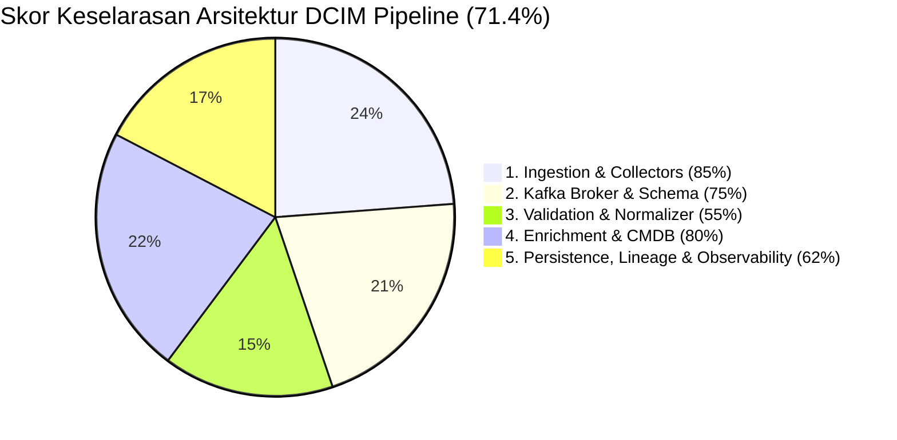

# Session Summary & Handoff — Porting DCIM Data Collection ke `dcim-core-platform` & Audit Keselarasan Empiris

## 2026-08-10 | srv-data-collection (10.70.0.56)

> **Konteks**: Porting arsitektur pipeline data collection dari repo implementasi privat (`DCIM_SRV_DATA_COLLECTION`) ke repo publik target (`dcim-core-platform` milik `shuffahaqgzz`) berdasarkan instruksi prompt `prompt-push-dcim-data-collection-to-core-platform.md`.  
> **Status Sesi**:  
> - ✅ **Tahap 0 Selesai**: Re-synchronize dan push 6 commit ke `DCIM_SRV_DATA_COLLECTION` (`origin/main`).  
> - ✅ **Tahap 1 Selesai**: Audit empiris keselarasan arsitektur 100% tanpa asumsi selesai (**Skor Alignment: 71.4%**).  
> - ⏸️ **Push ke Target Repo Ditunda**: Mengikuti arahan eksplisit user untuk menunda push ke `dcim-core-platform` sampai hasil audit diperiksa dan disetujui.

---

## 1. Peta Repository & Rule Governance (Zero-Drift Boundary)

Agent baru WAJIB mematuhi hierarki kepemilikan dan batas keamanan data berikut:

| Repository | Local Path | Remote Origin | Governance & Peran |
| :--- | :--- | :--- | :--- |
| **`DCIM_SRV_DATA_COLLECTION`** | `/home/infra/dcim_metrics_project` | `git@github.com:Chefinox/DCIM_SRV_DATA_COLLECTION.git` | **Privat (Imam Syauqi Achmad)**. Kode produksi aktual + data operasional nyata (IP `10.50.0.x`, `10.70.0.56`, Vault secrets, credential). |
| **`dcim-wiki`** | `/home/infra/dcim-wiki` | `git@github.com:shuffahaqgzz/dcim-wiki.git` | **Referensi Arsitektur Publik**. Acuan standar arsitektur pipeline data collection host ini (`comparisons/impl-repo-data-ingestion-alignment.md` & `reference-designs/block2-data-ingestion-integration.md`). |
| **`dcim-core-platform`** | `/home/infra/dcim-core-platform` | `git@github.com:shuffahaqgzz/dcim-core-platform.git` | **Target Repo Publik (Milik `shuffahaqgzz`)**. Diatur ketat oleh `AGENTS.md`, `DATA-HANDLING.md`, `CONTRIBUTING.md`, dan ADR-0023. Hanya menerima *synthetic fixture-replay adapters* tanpa koneksi network/write operations. |

### Aturan Keselamatan & Atribusi:
- **Owner Target Repo:** `shuffahaqgzz` (bukan Imam Syauqi Achmad).
- **Atribusi Penulis/Pengambil Keputusan:** Wajib menggunakan nama lengkap **"Imam Syauqi Achmad"** di seluruh dokumen/commit/ADR/PR.
- **Batas Data Publik vs Privat (MUTLAK):** Dilarang menyalin credential, password, token, IP/hostname nyata, serial number, asset tag, atau raw log operasional ke `dcim-core-platform`. Semua fixture target repo HARUS 100% sintetis (reserved IP/domain).
- **Read-Only Adapters Only:** Core platform hanya menerima replay fixture sintetis (tanpa koneksi network, SNMP SET, ISAPI write, atau power reset).

---

## 2. Ringkasan Commit Tahap 0 (`DCIM_SRV_DATA_COLLECTION`)

Seluruh commit lokal yang pending di `/home/infra/dcim_metrics_project` telah diverifikasi, di-stage, dan di-push ke `origin/main` (`bc9bd07..7d5254a`):

1. `7d5254a` — `chore(infra): fix ES exporter ssl flag, upgrade iTop to 3.2.3, add kafka-ui config mount and restart policy`
2. `981ea23` — `feat(pollers): add server-dummy endpoint to redfish poller and inventory collector`
3. `cb55555` — `refactor(es-logger): centralize Vault secret lookup via get_secret, add retry on 401, use multi-broker bootstrap`
4. `00e77d8` — `feat(kafka): upgrade cluster to Kafka 4.1.2, add persistent volumes for data dirs`
5. `c87bc74` — `fix(siem-es-consumer): commit offset eksplisit per-partisi, bukan seluruh assignment`
6. `205c6a6` — `docs(v4.6.2): update arsitektur Kafka 4.1.2, insiden data loss, remediasi lag iTop`

---

## 3. Hasil Audit Empiris Keselarasan Arsitektur (Total Score: 71.4%)

Pemeriksaan empiris dilakukan terhadap runtime aktual di host (`10.70.0.56`):



### Breakdown Komponensial:

| Bagian Pipeline | Spesifikasi Target (`dcim-wiki`) | Implementasi Aktual Host (`dcim_metrics_project`) | Skor | Gap Utama & Prioritas |
| :--- | :--- | :--- | :---: | :--- |
| **1. Ingestion & Collectors** | NiFi Ingestion Gateway + Generic Connectors | NiFi Docker + 5 Poller Python (`redfish_poller`, `mikrotik_poller`, `hikvision_poller_daemon`, `nas_poller`, `snmp_ups_poller`) | **85%** | **P2** — Belum ada Virtualization/Cloud collector (vCenter/AWS) |
| **2. Kafka Architecture** | Single Cluster JSON / Avro Topics | 3-Node KRaft SSL Cluster (Kafka 4.1.2, RF=3, min.ISR=2) + Schema Registry (Avro `NormalizedEvent` & `EnrichedEvent`) | **75%** | **P2** — Naming raw per-source (`dcim.raw.*`) vs single raw topic spec |
| **3. Validation Processor** | 8-Rule Validation Engine (Range, Format, Dedup, Freshness) | `dcim-normalizer.service` (basic null check & `metric_mapping.json`) | **55%** | **P1 (CRITICAL)** — Abstraksi Validation Processor engine di target repo |
| **4. Enrichment & CMDB** | Direct NiFi / REST API Lookup | `dcim-enrichment-api.service` (FastAPI + Redis) + Async iTop CMDB Sync (`scripts/itop_to_cache_sync.py`), 8 metadata fields | **80%** | **P2** — Belum ada kalkulasi dinamis Impact Scoring engine |
| **5. Lineage, DLQ & Monitoring**| 1 DLQ Topic, Lineage Stream, Prometheus Metrics | 3 DLQ Topics (`dcim.dlq.*`), `event_lineage` table (Postgres `dcim_sot`), Daily/Monthly Partitions, 6 Exporters | **62%** | **P2** — Belum ada 6-dimension Data Quality scorecard ke Prometheus |

---

## 4. Status Layanan & Infrastruktur Aktual di Host (`10.70.0.56`)

- **Docker Containers Active:**
  - `dcim_sot_postgres` (Port 5432) — DB Name `dcim_sot`, user `sot_admin`
  - `dcim_elasticsearch` (Port 9200) — HTTPS ES 8.9 / 9.x
  - `dcim_kibana` (Port 5601)
  - `docker-redis-1` (Port 32768/6379)
  - `itop-web` (Port 8080) & `itop-db` (Port 3306)
  - `dcim-kafka-ui` (Port 9000), `dcim_grafana` (Port 3000), `dcim_prometheus` (Port 9090)
  - Exporters: `dcim_elasticsearch_exporter` (9114), `dcim_postgres_exporter` (9187), `dcim_kafka_exporter` (9308), `dcim_redis_exporter` (9121), `dcim_node_exporter` (9100)
- **Systemd Services Active:**
  - `dcim-normalizer.service` (PID 909)
  - `dcim-enrichment-api.service` (PID 906)
  - `dcim-es-consumer.service` (PID 907)
  - `dcim-siem-es-consumer.service` (PID 912)
  - `dcim-dlq-consumer.service` (PID 905)
  - `dcim-analytics-bridge.service` (PID 910)
  - `dcim-itop-redis-sync.service`
  - `dcim-threshold-alerter.service` (PID 914)

---

## 5. Rencana Kerja Selanjutnya untuk Agent Baru (Tahap 2 & 3)

Setelah user menyetujui laporan audit empiris ini:

1. **Buat Branch Baru di Target Repo (`dcim-core-platform`):**
   ```bash
   cd /home/infra/dcim-core-platform
   git checkout main
   git pull origin main
   git checkout -b feat/data-ingestion-validation-processor
   ```
2. **Implementasikan Validation Processor Engine (Fokus Gap P1 Utama):**
   - Buat modul validasi generik (range validation, format regex, Redis deduplication window, freshness check) di bawah `connectors/` atau `services/`.
   - Gunakan data sintetis murni di `fixtures/synthetic/`.
3. **Jalankan Gate Verifikasi Lokal:**
   ```bash
   make phase0-check
   python scripts/check_public_repo_safety.py
   ```
4. **Commit & Buka Pull Request:**
   - Gunakan Conventional Commit (mis. `feat(data-ingestion): implement generic validation processor rules`).
   - Sertakan **Data-Handling Declaration** pada deskripsi PR.
   - Atribusi nama: **Imam Syauqi Achmad**.
   - Minta review dari owner repo (`shuffahaqgzz`). **JANGAN MERGE SENDIRI**.
