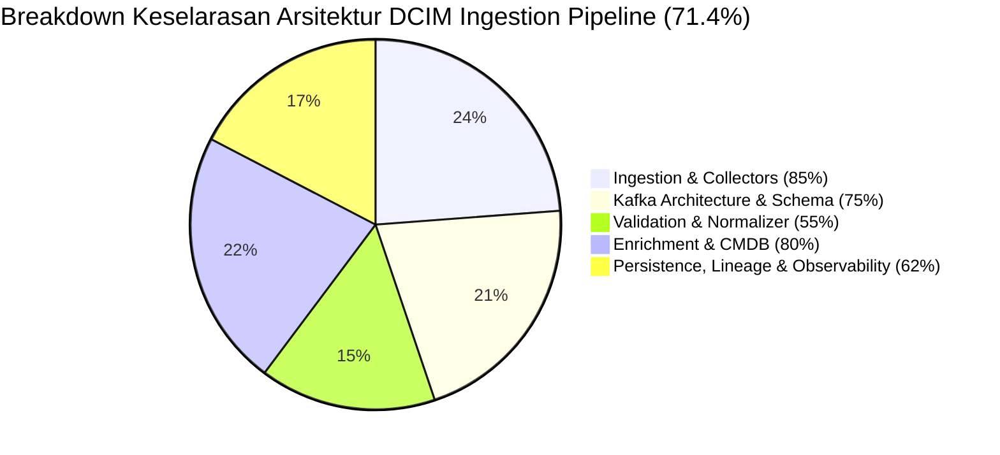

# Handoff & Architecture Context Guide for DCIM Data Collection Project

> **Tujuan Dokumen:** Memberikan konteks 100% lengkap, transparan, dan tanpa asumsi kepada AI Agent baru yang akan mengambil alih pekerjaan ini, mencakup arsitektur 3 repo, aturan governance ketat, status audit empiris terkini, dan langkah kerja berikutnya agar **TIDAK TERJADI DRIFT**.

---

## 1. Peta Tiga Repository & Hubungannya

Agent baru WAJIB memahami peran dan batasan dari 3 repository berikut:

| Nama Repo | Local Path | Repository Remote URL | Pemilik / Governance | Peran & Deskripsi |
| :--- | :--- | :--- | :--- | :--- |
| **`DCIM_SRV_DATA_COLLECTION`** | `/home/infra/dcim_metrics_project` | `https://github.com/Chefinox/DCIM_SRV_DATA_COLLECTION.git` | Private / Work Repo (**Imam Syauqi Achmad**) | **Implementasi produksi aktual**. Memuat pipeline data collection nyata: NiFi, Kafka 3-node KRaft, poller Python (Redfish, SNMP, Hikvision, NAS), normalizer, enrichment API (FastAPI + Redis), consumers (Postgres `dcim_sot`, ES, iTop), DLQ 3-topik, lineage tracking, Vault secret, dan kredensial/data operasional nyata. |
| **`dcim-wiki`** | `/home/infra/dcim-wiki` | `https://github.com/shuffahaqgzz/dcim-wiki.git` | Reference Architecture Repo | **Dokumentasi acuan arsitektur aktual**. Menjadi tolok ukur acuan pengembangan arsitektur di host ini. Dokumen paling krusial: `comparisons/impl-repo-data-ingestion-alignment.md` (skor alignment & analisis gap P1/P2/P3) dan `reference-designs/block2-data-ingestion-integration.md` (spesifikasi target Data Ingestion & Integration Gateway). |
| **`dcim-core-platform`** | `/home/infra/dcim-core-platform` | `https://github.com/shuffahaqgzz/dcim-core-platform.git` | Public Repo (**Milik `shuffahaqgzz`**, Safety-First) | **Target repo porting arsitektur (publik)**. Diatur secara sangat ketat oleh `AGENTS.md`, `DATA-HANDLING.md`, `CONTRIBUTING.md`, dan ADRs (khususnya ADR-0023). Repo ini hanya menerima pola generik & *synthetic fixture-replay adapters* tanpa kemampuan network/write atau data operasional nyata. |

---

## 2. Aturan Wajib Governance & Public Safety Boundary (JANGAN DRIFT!)

1. **Pemilik Repo Target vs Atribusi Nama:**
   - Pemilik repo `dcim-core-platform` adalah **`shuffahaqgzz`** (BUKAN Imam Syauqi Achmad).
   - Seluruh dokumen resmi, ADR, commit message, PR description, dan komentar kode di repo target yang mencantumkan nama penulis/pengambil keputusan WAJIB menggunakan nama lengkap **"Imam Syauqi Achmad"** (bukan nickname/panggilan seperti "isyauqi"). Username GitHub `shuffahaqgzz` tetap digunakan untuk field owner/identitas akun.
2. **Batas Data Publik vs Privat (MUTLAK!):**
   - JANGAN PERNAH menyalin, mengetik ulang, atau menyisipkan: credentials, token, password, key, SNMP community strings, IP/hostname/FQDN nyata (seperti `10.50.0.x`, `10.70.0.56`), serial number, asset tag, nama rack/site/camera, topologi jaringan, payload/log/capture/dump mentah dari `DCIM_SRV_DATA_COLLECTION` ke `dcim-core-platform`.
   - Semua fixture pada `dcim-core-platform` HARUS 100% **sintetis** (menggunakan reserved IP/domain dan invented identifiers).
3. **Aturan Read-Only & No Network/Write di Core Platform:**
   - Sesuai ADR-0023, `dcim-core-platform` hanya mengizinkan *synthetic fixture-replay adapter* (tanpa koneksi network, SNMP SET, Redfish write, ISAPI write, power reset, atau firmware flash).
4. **Alur Kerja Git Target Repo:**
   - **DILARANG PUSH LANGSUNG KE `main`** di `dcim-core-platform`.
   - Gunakan konvensi branch: `feat/<scope>`, `fix/<scope>`, `docs/<scope>`, `chore/<scope>`, atau `adr/<decision>`.
   - Wajib mengeksekusi gate verifikasi sebelum PR:
     ```bash
     make phase0-check
     python scripts/check_public_repo_safety.py
     ```

---

## 3. Pekerjaan yang Telah Ditingkatkan & Selesai (Sesi Ini)

### Tahap 0 — Sinkronisasi Repo Implementasi (SELESAI)
- Seluruh commit lokal di `/home/infra/dcim_metrics_project` telah dirapikan dan di-push ke `origin/main` (`Chefinox/DCIM_SRV_DATA_COLLECTION.git`):
  - `7d5254a` — `chore(infra): fix ES exporter ssl flag, upgrade iTop to 3.2.3, add kafka-ui config mount and restart policy`
  - `981ea23` — `feat(pollers): add server-dummy endpoint to redfish poller and inventory collector`
  - `cb55555` — `refactor(es-logger): centralize Vault secret lookup via get_secret, add retry on 401, use multi-broker bootstrap`
  - `00e77d8` — `feat(kafka): upgrade cluster to Kafka 4.1.2, add persistent volumes for data dirs`
  - `c87bc74` — `fix(siem-es-consumer): commit offset eksplisit per-partisi, bukan seluruh assignment`
  - `205c6a6` — `docs(v4.6.2): update arsitektur Kafka 4.1.2, insiden data loss, remediasi lag iTop`
- Working copy privat dalam kondisi bersih & ter-sync penuh dengan `origin/main`.

### Tahap 1 — Audit Empiris Keselarasan Arsitektur (SELESAI)
- Mengikuti instruksi eksplisit user untuk **TIDAK MELAKUKAN PUSH** ke `dcim-core-platform` terlebih dahulu.
- Telah dilakukan pengecekan empiris 100% terhadap runtime host `10.70.0.56` (running Docker containers, systemd services, active Kafka topics, PostgreSQL `dcim_sot` tables, ES indices, dan Redis cache).
- Hasil Audit Keselarasan terhadap `dcim-wiki` Block 2: **71.4% Overall Alignment**.

---

## 4. Rincian Skor Audit Empiris Pipeline Terkini (71.4%)



1. **Ingestion Gateway & Collectors (Skor: 85.0%)**:
   - *Empiris:* NiFi container + 5 Active Python Pollers (`redfish_poller.py`, `mikrotik_poller.py`, `hikvision_poller_daemon.py`, `nas_poller.py`, `snmp_ups_poller.py`).
   - *Gap:* Belum ada Virtualization/Cloud Collector (vCenter/AWS/GCP).
2. **Kafka Broker Architecture & Schema Registry (Skor: 75.0%)**:
   - *Empiris:* 3-Node KRaft Cluster (Kafka 4.1.2, SSL/TLS, RF=3, min.ISR=2), Confluent Schema Registry (`:8081` - Avro `NormalizedEvent` & `EnrichedEvent`).
   - *Gap:* Per-source-type raw topics (`dcim.raw.*`) vs single topic di spec.
3. **Validation & Normalization Processor (Skor: 55.0% - P1 Critical Gap)**:
   - *Empiris:* `dcim-normalizer.service` aktif dengan `metric_mapping.json`.
   - *Gap:* Masih sebatas null-check dasar. Belum ada Validation Processor engine formal untuk range validation, format regex, Redis deduplication window, dan freshness check.
4. **Enrichment Processor & CMDB Lookup (Skor: 80.0%)**:
   - *Empiris:* `dcim-enrichment-api.service` (FastAPI + Redis) + async iTop CMDB sync (`scripts/itop_to_cache_sync.py`), menyisipkan 8 metadata fields (`site_id`, `rack_id`, dll.).
   - *Gap:* Belum ada dynamic Impact Scoring calculation.
5. **Persistence, Lineage, DLQ & Observability (Skor: 62.0%)**:
   - *Empiris:* Consumers (Postgres `dcim_sot`, Elasticsearch, SIEM ES, DLQ, Analytics), 3 DLQ topics (`dcim.dlq.*`), `event_lineage` table, daily & monthly SQL partitioning, Exporters lengkap (Postgres, ES, Redis, Kafka, Node).
   - *Gap:* Belum ada 6-dimension Data Quality scorecard metrics ke Prometheus dan Object Storage (MinIO/S3) archival.

---

## 5. File Referensi & Artifact Penting untuk Agent Baru

Agent baru WAJIB membaca file-file ini di workspace sebelum melakukan tindakan apa pun:

1. **Prompt Instruksi Awal:**
   - [prompt-push-dcim-data-collection-to-core-platform.md](file:///home/infra/dcim_metrics_project/docs/standar_dcim/prompt-push-dcim-data-collection-to-core-platform.md)
2. **Laporan Audit Empiris Lengkap (Artifact Sesi Ini):**
   - [audit_alignment_report.md](file:///home/infra/.gemini/antigravity-ide/brain/c35cd341-87f8-4d88-936b-d2d70238718c/audit_alignment_report.md)
   - [implementation_plan.md](file:///home/infra/.gemini/antigravity-ide/brain/c35cd341-87f8-4d88-936b-d2d70238718c/implementation_plan.md)
3. **Dokumen Acuan Arsitektur & Alignment Wiki:**
   - [impl-repo-data-ingestion-alignment.md](file:///home/infra/dcim-wiki/comparisons/impl-repo-data-ingestion-alignment.md)
   - [block2-data-ingestion-integration.md](file:///home/infra/dcim-wiki/reference-designs/block2-data-ingestion-integration.md)
4. **Dokumen Governance Target Repo (`dcim-core-platform`):**
   - [AGENTS.md](file:///home/infra/dcim-core-platform/AGENTS.md)
   - [DATA-HANDLING.md](file:///home/infra/dcim-core-platform/DATA-HANDLING.md)
   - [CONTRIBUTING.md](file:///home/infra/dcim-core-platform/CONTRIBUTING.md)
   - [ADR-0023 Connector Controls](file:///home/infra/dcim-core-platform/docs/adr/0023-connector-polling-source-impact-controls.md)

---

## 6. Langkah Kerja Selanjutnya untuk Agent Baru (Tahap 2 & 3)

Setelah user memberikan konfirmasi/approval atas Laporan Audit:

1. **Buat Branch Baru di Target Repo (`dcim-core-platform`):**
   ```bash
   cd /home/infra/dcim-core-platform
   git checkout main
   git pull origin main
   git checkout -b feat/data-ingestion-validation-processor
   ```
2. **Implementasikan Validation Processor (Fokus Gap P1 Utama):**
   - Buat modul validasi generik (range, format, duplicate window, freshness) di bawah `connectors/` atau `services/`.
   - Gunakan data sintetis murni di `fixtures/synthetic/`.
3. **Jalankan Gate Verifikasi Lokal:**
   ```bash
   make phase0-check
   python scripts/check_public_repo_safety.py
   ```
   *Pastikan 100% LULUS tanpa error public-safety scan!*
4. **Commit & Buka Pull Request:**
   - Gunakan Conventional Commit (mis. `feat(data-ingestion): implement generic validation processor rules`).
   - Sertakan **Data-Handling Declaration** eksplisit pada PR description bahwa seluruh isi PR adalah pola generik & sintetis.
   - Atribusi keputusan/penulis: **Imam Syauqi Achmad**.
   - Minta review dari owner repo (`shuffahaqgzz`). **JANGAN MERGE SENDIRI**.
