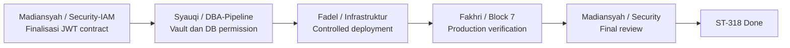

# ST-318 Cross-Team Action Plan

## 1. Tujuan

Dokumen ini membagi pekerjaan lintas tim untuk menutup blocker production pada ST-318 — RBAC, JWT, dan API Audit Trail Block 7.

Implementasi development Block 7 sudah tersedia dan targeted test menghasilkan `9 passed`. ST-318 tetap `In Progress` sampai autentikasi production aktif, audit trail production tervalidasi, dan security review selesai.

## 2. Kondisi saat ini

| Area | Status | Catatan |
|---|---|---|
| JWT validation | Selesai di development | Signature, expiry, subject, issuer, dan audience didukung |
| RBAC | Selesai di development | Role `analytics.read`, `analytics.write`, `analytics.admin` |
| API audit middleware | Selesai di development | Mencatat metadata akses tanpa request body |
| Automated security test | PASS | `9 passed` termasuk regression test RCA |
| IAM/JWT production contract | Blocked | Belum ada kontrak final issuer, audience, key, dan claims |
| Vault/runtime configuration | Blocked | Belum dipasang pada deployment Block 7 |
| Audit persistence production | Blocked | Belum ada evidence row dari request production |
| Production secret review | Blocked | Belum diverifikasi pada API log dan `audit_log` |

## 3. Alur penyelesaian



---

# 4. Action Request — Madiansyah / Security-IAM

## Subject

**Action Required — Finalisasi IAM/JWT Contract dan Security Review ST-318**

## Latar belakang

Block 7 sudah memiliki JWT verifier dan RBAC dengan role:

- `analytics.read`
- `analytics.write`
- `analytics.admin`

Untuk mengaktifkannya di production, Block 7 membutuhkan kontrak identity dan token yang resmi.

## Pekerjaan yang diminta

1. Tetapkan identity provider untuk Block 7.
2. Tetapkan JWT issuer dan audience.
3. Tetapkan signing algorithm.
4. Tetapkan metode distribusi verification key atau JWKS endpoint.
5. Tetapkan token lifetime dan key rotation policy.
6. Tetapkan claims untuk user dan service account.
7. Mapping identity ke `analytics.read`, `analytics.write`, dan `analytics.admin`.
8. Tentukan service-account role untuk integrasi seperti workflow automation.
9. Setelah production test selesai, review evidence `401`, `403`, audit trail, dan redaction secret.

## Informasi yang perlu dikembalikan

| Item | Nilai |
|---|---|
| Identity provider | `Authentik (OIDC)` |
| JWT issuer | `http://10.70.0.61:9000/application/o/block7-analytics/` |
| JWT audience | `analytics` |
| Signing algorithm | `RS256` |
| JWKS URL atau key distribution | `http://10.70.0.61:9000/application/o/block7-analytics/jwks/` |
| Token lifetime | Access 15m; Refresh 8h; ID token 15m |
| Key rotation policy | 90 hari |
| User claim format | `sub`, `preferred_username`, `email` |
| Role claim format | Claim `roles` (`analytics.read`, `analytics.write`, `analytics.admin`) |
| Service-account claim format | Authentik Service Account + Client Credentials Grant (`roles`) |

> Verification key atau secret aktual tidak boleh ditulis dalam dokumen ini, chat, tracker, atau repository. Berikan hanya reference/path secret manager.

## Acceptance criteria

- Token production atau staging dapat diterbitkan.
- Claims dan tiga role Block 7 tersedia.
- Token read, write, dan admin dapat dipakai untuk security test.
- Security review akhir memberikan hasil PASS atau daftar perbaikan spesifik.

## Evidence yang diminta

- Dokumen/token contract tanpa material secret.
- Contoh decoded claims yang sudah direduksi.
- Role mapping.
- Hasil final security review.

---

# 5. Action Request — Syauqi / DBA dan Pipeline

## Subject

**Action Required — Vault Integration dan Audit Database Permission ST-318**

## Latar belakang

Block 7 perlu membaca JWT verifier configuration dari secret manager dan menulis audit event ke `public.audit_log` pada TimescaleDB.

## Pekerjaan yang diminta

1. Buat atau tetapkan Vault path untuk JWT verifier configuration.
2. Buat policy least privilege agar runtime Block 7 hanya membaca secret yang diperlukan.
3. Berikan reference/path dan auth method kepada tim Infrastruktur tanpa menampilkan secret.
4. Pastikan `public.audit_log` tersedia sesuai migration.
5. Pastikan DB runtime user Block 7 memiliki permission `INSERT` pada `public.audit_log`.
6. Sediakan akses `SELECT` terbatas atau bantu Fakhri memverifikasi row audit.
7. Validasi index audit timestamp, user, dan resource tersedia.

## Informasi yang perlu dikembalikan

| Item | Nilai |
|---|---|
| Vault Engine & Version | Vault KV Version 2 (`kv-v2`), mount `secret/` |
| Vault path/reference | `secret/dcim/jwt_verifier` (API: `http://10.70.0.56:8200/v1/secret/data/dcim/jwt_verifier`) |
| Vault auth method | AppRole (`role_id` & `secret_id` di host `/home/infra/dcim_metrics_project/vault/config/`) |
| Runtime policy name | `block7-runtime-policy` |
| Environment-variable mapping | `VAULT_ADDR=http://10.70.0.56:8200` |
| Database/schema | `dcim_analytics.public` |
| Audit table | `audit_log` |
| Runtime DB role & scope | `ai_team` (Default: `arwd` / SELECT, INSERT, UPDATE, DELETE) atau `analytics_write` (Least privilege: `ar` / SELECT, INSERT) |
| Verification DB role | `analytics_read` (`r` / SELECT only) |
| Verification method | `python3 /home/infra/dcim_metrics_project/scripts/verify_st318_vault_db.py` |

## Query verifikasi yang diusulkan

```sql
SELECT
    timestamp,
    user_id,
    action,
    resource_type,
    resource_id,
    details,
    ip_address
FROM public.audit_log
ORDER BY timestamp DESC
LIMIT 20;
```

## Acceptance criteria

- Runtime mengambil secret tanpa hardcode.
- DB runtime user dapat menulis audit event.
- Verification user atau DBA dapat membaca evidence audit secara terbatas.
- Row audit memuat timestamp, actor, action, resource, result, dan IP.

## Evidence yang diminta

- Vault path/reference tanpa secret.
- Policy name dan scope permission.
- Hasil permission check `audit_log`.
- Hasil query audit yang sudah mereduksi data sensitif.

---

# 6. Action Request — Fadel / Infrastruktur

## Subject

**Action Required — Aktivasi JWT Authentication pada Runtime Block 7**

## Prasyarat

- JWT contract dari Security-IAM tersedia.
- Vault path dan runtime policy dari Syauqi tersedia.

## Pekerjaan yang diminta

1. Inject konfigurasi JWT dari Vault/secret manager ke runtime Block 7.
2. Aktifkan `AUTH_ENABLED=*** pada deployment target.
3. Isi konfigurasi berikut menggunakan kontrak resmi:

```text
AUTH_ENABLED=*** JWT_ALGORITHM=<sesuai kontrak IAM>
JWT_ISSUER=<sesuai kontrak IAM>
JWT_AUDIENCE=<sesuai kontrak IAM>
JWT_SECRET/JWKS=<reference dari secret manager>
```

4. Jangan menyimpan secret pada Git, compose plaintext, shell history, deployment log, atau tracker.
5. Jalankan controlled rollout/restart.
6. Jalankan health check setelah rollout.
7. Pastikan integration service account memperoleh role minimum yang diperlukan.
8. Siapkan dan dokumentasikan rollback procedure.
9. Beri Fakhri deployment window untuk production verification.

## Informasi yang perlu dikembalikan

| Item | Nilai |
|---|---|
| Deployment target | |
| Deployment time | |
| Runtime/API version | |
| Authentication enabled | |
| Health-check result | |
| Service accounts configured | |
| Rollback command/procedure | |

## Acceptance criteria

- API sehat setelah authentication aktif.
- Endpoint analytics tanpa token menghasilkan `401`.
- Secret tidak tampil dalam deployment output atau runtime configuration dump.
- Service integration tetap berjalan dengan role minimum.
- Rollback tersedia dan dapat dijalankan bila authentication memutus integrasi.

## Evidence yang diminta

- Deployment record tanpa secret.
- Health-check response.
- Bukti unauthenticated request menghasilkan `401`.
- Daftar service account dan role tanpa token/kredensial.
- Rollback procedure.

---

# 7. Action Plan — Fakhri / Block 7

## Tanggung jawab

1. Berikan endpoint-permission matrix kepada tim Security-IAM.
2. Pastikan endpoint read memakai minimal `analytics.read`.
3. Pastikan analytics trigger memakai minimal `analytics.write`.
4. Pastikan model administration memakai `analytics.admin`.
5. Setelah deployment siap, jalankan production security test.
6. Verifikasi audit row bersama Syauqi.
7. Review API response, application log, dan audit details untuk kebocoran secret.
8. Serahkan evidence kepada Madiansyah untuk final security review.
9. Perbarui `ST-318_EXECUTION_REPORT.md` dan tracker setelah semua gate PASS.

## Production test matrix

| Test | Expected |
|---|---:|
| Request tanpa token | `401` |
| Token invalid | `401` |
| Token expired | `401` |
| Read token ke read endpoint | `200` |
| Read token ke write endpoint | `403` |
| Write token ke write endpoint | `200` |
| Write token ke admin endpoint | `403` |
| Admin token ke admin endpoint | `200` |
| LLM query dengan read token | Sesuai endpoint contract |
| Analytics trigger dengan write token | Sesuai endpoint contract |
| Model administration dengan admin token | Sesuai endpoint contract |

## Audit validation checklist

- [ ] Actor sesuai token subject.
- [ ] Action sesuai HTTP method.
- [ ] Target sesuai endpoint.
- [ ] Timestamp tercatat.
- [ ] Result menunjukkan success atau denied.
- [ ] Source IP tercatat.
- [ ] Bearer token tidak tersimpan.
- [ ] JWT secret tidak tersimpan.
- [ ] Password tidak tersimpan.
- [ ] Full prompt/query sensitif tidak tersimpan.

## Acceptance criteria

- Semua positive dan negative production tests lulus.
- Audit row ditemukan untuk operasi yang diuji.
- Tidak ada secret pada response, application log, atau `audit_log`.
- Security review Madiansyah PASS.
- Execution report memiliki evidence final.

---

# 8. RACI Matrix

| Aktivitas | Fakhri | Madiansyah | Syauqi | Fadel |
|---|---|---|---|---|
| JWT/IAM contract | C | A/R | C | I |
| Role mapping Block 7 | A/R | A/R | I | I |
| Vault secret storage | C | C | A/R | I |
| Audit DB permission | C | I | A/R | I |
| Runtime deployment | C | I | C | A/R |
| API security testing | A/R | C | C | C |
| Audit-row verification | A/R | I | R | I |
| Secret-leak review | R | A/R | C | C |
| Final tracker closure | A/R | C | C | C |

Keterangan: **A** Accountable, **R** Responsible, **C** Consulted, **I** Informed.

## 9. Dependency dan handoff

| Urutan | Dari | Ke | Handoff |
|---:|---|---|---|
| 1 | Madiansyah | Syauqi, Fadel, Fakhri | JWT contract dan role mapping |
| 2 | Syauqi | Fadel | Vault reference dan runtime policy |
| 3 | Syauqi | Fakhri | Audit DB verification method |
| 4 | Fadel | Fakhri | Runtime authentication aktif dan deployment window |
| 5 | Fakhri | Madiansyah | Production test dan redaction evidence |
| 6 | Madiansyah | Fakhri | Final security review |
| 7 | Fakhri | Task Tracker | Execution report final dan status `Done` |

## 10. Definition of Done ST-318

ST-318 hanya dapat diubah menjadi `Done` jika seluruh kondisi berikut terpenuhi:

- [ ] JWT/IAM production contract disetujui.
- [ ] Tiga role Block 7 tersedia dan teruji.
- [ ] Secret/configuration dikelola melalui secret manager.
- [ ] Authentication aktif pada runtime target.
- [ ] Positive dan negative production tests lulus.
- [ ] Audit event tersimpan pada TimescaleDB.
- [ ] Audit event memuat field wajib.
- [ ] Tidak ada secret atau full prompt sensitif pada response/log/audit.
- [ ] Final security review PASS.
- [ ] `ST-318_EXECUTION_REPORT.md` diperbarui dengan evidence production.

## 11. Catatan ownership

Fakhri adalah assignee resmi ST-318. Syauqi adalah assignee MT-042 dan owner existing Vault/TimescaleDB work. Fadel menangani deployment infrastructure. Madiansyah ditempatkan sebagai Security-IAM owner berdasarkan pekerjaan RBAC existing (`ST-286`, `ST-312`, `ST-313`). Jika struktur ownership resmi berbeda, RACI harus dikonfirmasi dan diperbarui sebelum eksekusi.
