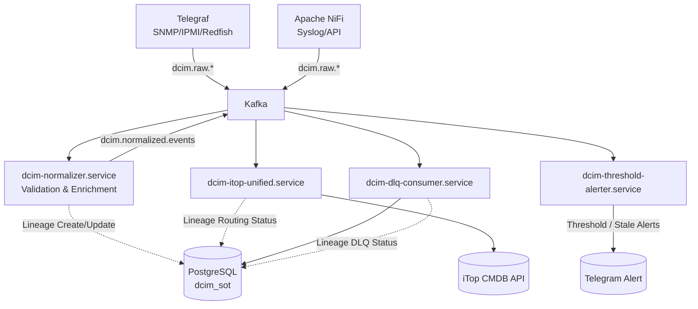

# DCIM Pipeline Architecture v4.3

## 1. Overview
Dokumen ini mendeskripsikan arsitektur aktual pipeline DCIM versi 4.3, yang telah diselaraskan dengan *Reference Design* dari `DCIM-Wiki` (Block 1, Block 2, Block 6, dan Block 7). 

Perubahan utama di v4.3 dibandingkan dengan versi sebelumnya:
- **Penghapusan Flink Threshold Alerter**: Implementasi Flink alerter eksperimental telah dibatalkan karena adanya *architectural mismatch*. Sesuai DCIM-Wiki Block 7, Flink dikhususkan untuk *Analytics AI* (Anomaly Detection dan Time Series DB Ingestion), bukan untuk menggantikan *simple threshold alerting*. Alerting saat ini dikembalikan ke layanan native (`dcim-threshold-alerter.service`).
- **Data Lineage Tracking Terintegrasi**: Perekaman siklus hidup event (`dcim_lineage`) kini telah terintegrasi di seluruh consumer utama (Normalizer, iTop Consumer, DLQ Consumer). Skema tabel telah diperbarui menjadi skema tunggal `event_lineage` mengikuti spesifikasi Block 2.
- **Efisiensi Database & Keamanan**: Modul lineage (`src/utils/lineage.py`) telah diperbarui menggunakan `ThreadedConnectionPool` dan seluruh kredensial statis (hardcoded) telah dicabut.

## 2. Architecture Diagram (Logical)

## 3. Data Lineage Lifecycle (v4.3)
Sesuai dengan panduan `block2-data-ingestion-integration.md`, mekanisme Data Lineage (Audit Trail) menggunakan tabel tunggal `event_lineage` dengan Primary Key UUID (`event_id`). 

Setiap event mentah akan melewati siklus pencatatan berikut:
1. **Ingested & Validated**: `dcim-normalizer.service` membaca data dari `dcim.raw.*`, membangkitkan `event_id` baru, mencatat baris pertama di `event_lineage`, lalu memperbarui status menjadi `success` jika normalisasi berhasil.
2. **Routed/Stored**: Consumer akhir seperti `dcim_itop_unified_consumer` merekam status `success` jika sinkronisasi CMDB berhasil, atau `error` (beserta pesan error) jika koneksi ke iTop gagal/timeout.
3. **Dead Letter Queue (DLQ)**: `dcim-dlq-consumer.service` menangkap event yang sama sekali gagal diproses (baik oleh normalizer maupun iTop), menyimpannya ke `dlq_records`, lalu mengupdate status akhir lineage menjadi `dlq`.

## 4. Keselarasan dengan Reference Design (DCIM-Wiki)
- **Block 1 (Infrastructure) & Block 2 (Data Ingestion)**: Pipeline menggunakan Kafka sebagai tulang punggung (message bus) utama. Pola pertahanan sistem menggunakan mekanisme DLQ dan Lineage Tracker telah sepenuhnya terpenuhi.
- **Block 4 (CMDB) & Block 6 (SIEM)**: Threshold alerter bertugas memproduksi alert berbasis *statis* dan durasi diam (*stale detection*). Integrasi dua arah dengan iTop CMDB via Kafka Consumer berjalan stabil.
- **Block 7 (Analytics & AI Engine)**: Flink (yang sempat menyimpang pada v4.2) telah dihilangkan dari jalur alerting kritis. Flink disiapkan eksklusif untuk memproses data dari `dcim.analytics.metrics` ke `TimescaleDB` dan menjalankan model Machine Learning (Z-Score, Isolation Forest) di masa mendatang.
